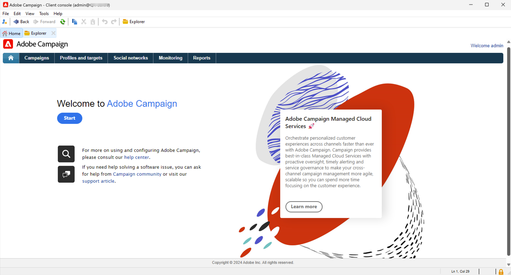

# 관리자 및 개발자용 시작하기 {#acs-gs-admin}

이 페이지에서는 Campaign v8의 주요 관리 및 데이터 관리 기능에 대한 개요를 제공합니다. Campaign Standard에서 Campaign v8로 전환하는 관리자 및 기술 마케터를 위한 것입니다.

주요 변경 사항은 Adobe Campaign 애플리케이션 서버와 통신하는 기본 애플리케이션인 클라이언트 콘솔의 도입입니다.

Campaign 클라이언트 콘솔은 모든 기능과 설정을 중앙 집중화합니다. Campaign 웹 사용자 인터페이스와 동기화되어 두 환경 간의 일관성을 보장합니다.

{zoomable="yes"}

[Adobe Campaign v8의 클라이언트 콘솔 사용자 인터페이스에 대해 자세히 알아보세요](https://experienceleague.adobe.com/ko/docs/campaign/campaign-v8/new/campaign-ui#ui-access){target="_blank"} .

## Campaign v8 아키텍처 {#acs-gs-admi-archi}

Campaign 아키텍처는 Campaign v8(콘솔) 설명서에 자세히 설명되어 있습니다. [이 페이지](https://experienceleague.adobe.com/ko/docs/campaign/campaign-v8/config/architecture/general-architecture){target="_blank"}에서 기본 사항에 대해 알아봅니다.

시작할 수 있는 유용한 링크:

* Adobe Campaign 구성 요소 및 전역 아키텍처는 [이 페이지](https://experienceleague.adobe.com/ko/docs/campaign/campaign-v8/new/ac-components){target="_blank"}에 설명되어 있습니다.

* 인스턴스 구성을 시작하기 전에 Campaign 아키텍처를 이해하려면 [Campaign 아키텍처 시작](https://experienceleague.adobe.com/ko/docs/campaign/campaign-v8/config/architecture/architecture){target="_blank"}을 참조하세요.

<!--Two deployment models are available: **Campaign FDA deployment** (P1-P3) and **Campaign Enterprise (FFDA)** deployment (P4). As a customer transitioning from Campaign Standard, your deployment model is **Campaign FDA**.-->

* 트랜잭션 메시지(메시지 센터)는 트리거된 메시지를 관리하기 위해 설계된 Campaign v8 모듈입니다. [이 섹션](https://experienceleague.adobe.com/ko/docs/campaign/campaign-v8/config/architecture/architecture#transac-msg-archi){target="_blank"}에 자세히 설명되어 있는 특정 아키텍처 모델을 사용합니다.

## Campaign 클라이언트 콘솔 {#acs-gs-console}

### 클라이언트 콘솔 설치 {#acs-gs-admin-console}

관리 및 구성 작업은 클라이언트 콘솔에서 수행됩니다. 첫 번째 단계는 환경을 설정하는 것입니다.

Campaign 클라이언트 콘솔은 SOAP 및 HTTP와 같은 표준 인터넷 프로토콜을 통해 Adobe Campaign 애플리케이션 서버와 통신하는 기본 애플리케이션입니다. Campaign 클라이언트 콘솔은 모든 기능과 설정을 중앙 집중화하며 로컬 캐시에 의존하기 때문에 최소한의 대역폭만 필요합니다. 손쉬운 배포를 위해 설계된 Campaign 클라이언트 콘솔은 인터넷 브라우저에서 배포하고 자동으로 업데이트할 수 있으며 HTTP(S) 트래픽만 생성하므로 특정 네트워크 구성이 필요하지 않습니다.

다음 비디오에서는 Adobe Campaign 클라이언트 콘솔을 다운로드 및 설치하고 인스턴스에 대한 연결을 관리하는 방법을 설명합니다.

>[!VIDEO](https://video.tv.adobe.com/v/335375?quality=12&learn=on){transcript=true}

자세한 내용은 [클라이언트 콘솔을 사용하여 Campaign에 연결](https://experienceleague.adobe.com/ko/docs/campaign/campaign-v8/new/connect){target="_blank"}을 참조하십시오.

지원되는 환경에 클라이언트 콘솔을 설치해야 합니다. 자세한 내용은 [Campaign v8(콘솔) 호환성 매트릭스](https://experienceleague.adobe.com/ko/docs/campaign/campaign-v8/releases/compatibility-matrix#ClientConsoleoperatingsystems){target="_blank"}를 참조하세요.

### 클라이언트 콘솔 인터페이스 검색  {#acs-gs-ui}

이 튜토리얼 비디오를 통해 Adobe Campaign v8 사용자 인터페이스와 기본 기능을 탐색하는 방법에 대해 알아보십시오.

>[!VIDEO](https://video.tv.adobe.com/v/334496?quality=12&learn=on){transcript=true}

자세한 내용은 [클라이언트 콘솔 작업](https://experienceleague.adobe.com/ko/docs/campaign/campaign-v8/new/campaign-ui){target="_blank"}을 참조하십시오.

## 환경 관리 {#acs-gs-admin-env}

클라이언트 콘솔이 설치되면 이 설명서의 단계에 따라 응용 프로그램 서버에 대한 연결을 만듭니다. [응용 프로그램 서버 설명서에 연결](https://experienceleague.adobe.com/ko/docs/campaign/campaign-v8/new/connect#create-your-connection){target="_blank"}.

보안 관행은 내부 소프트웨어 개발 및 운영 프로세스 및 도구에 깊이 배어있으며, 여러 분야의 다양한 팀이 협력하여 사건을 신속하게 예방, 감지 및 대응합니다. 자세한 내용은 [Campaign 보안 모범 사례](https://experienceleague.adobe.com/ko/docs/campaign/campaign-v8/privacy/security){target="_blank"}를 참조하세요.

### 액세스 권한 및 권한 {#acs-gs-admin-rights}

Adobe Campaign을 사용하면 사용자에게 할당된 권한을 정의하고 관리할 수 있습니다. 이러한 권한은 명명된 권한 및 폴더에 대한 권한을 연산자 그룹 권한으로 결합하여 정의됩니다.

Campaign Standard 사용자가 Campaign v8로 전환해도 권한과 액세스 권한은 그대로 유지됩니다. Adobe에서 보안 그룹을 Campaign v8 연산자 그룹으로 이동했으며 조직 단위별 권한이 폴더 권한으로 전환되었습니다. 캠페인 사용자   Adobe ID을 사용하여 Campaign v8에 연결한 다음 Campaign Standard에서와 동일한 로그인 및 암호를 사용할 수 있습니다.

Campaign [폴더](https://experienceleague.adobe.com/ko/docs/campaign/campaign-v8/config/configuration/folders-and-views){target="_blank"}는 클라이언트 콘솔의 탐색기 트리에 있는 노드입니다. 유형에 따라 특정 유형의 데이터가 포함됩니다. 프로그램은 Campaign v8의 폴더에 의해 구체화됩니다. 폴더를 만들고 폴더에 대한 권한을 관리하여 액세스를 제한할 수 있습니다. [자세히 알아보기](https://experienceleague.adobe.com/ko/docs/campaign/campaign-v8/admin/permissions/folder-permissions){target="_blank"}.

자세한 내용은 [사용자 권한 설명서](https://experienceleague.adobe.com/ko/docs/campaign/campaign-v8/admin/permissions/gs-permissions){target="_blank"}를 참조하세요.

### Campaign 컨트롤 패널 {#acs-gs-admin-cp}

Campaign Standard의 경우 Campaign 컨트롤 패널을 사용하여 환경을 관리할 수 있습니다. v8의 경우 Campaign 컨트롤 패널에서 추가 기능을 제공합니다.

Campaign 컨트롤 패널을 통해 각 인스턴스의 사용법을 추적하고 설정을 관리하여 Adobe Campaign의 제품 관리자로서 작업 효율을 높일 수 있습니다. 컨트롤 패널의 직관적인 인터페이스를 활용하면 주요 자산의 사용을 손쉽게 모니터링할 수 있을 뿐만 아니라 허용 목록에 IP 주소 추가, SFTP 스토리지 모니터링, 키 관리 등의 관리 작업도 수행할 수 있습니다.

자세한 내용은 [제어판 튜토리얼](https://experienceleague.adobe.com/ko/docs/control-panel-learn/tutorials/control-panel-overview){target="_blank"} 및 [제어판 설명서](https://experienceleague.adobe.com/docs/control-panel/using/control-panel-home.html?lang=ko){target="_blank"}를 참조하세요.

* **IP 주소 추가** - Campaign Campaign 컨트롤 패널을 사용하면 허용 목록에 IP 주소 범위를 추가하여 인스턴스에 대한 새 연결을 설정할 수 있습니다. [IP 허용 목록 문서](https://experienceleague.adobe.com/ko/docs/control-panel/using/instances-settings/ip-allow-listing-instance-access){target="_blank"}에서 자세히 알아보기

* **하위 도메인 구성** - Adobe Campaign에서 사용할 도메인의 하위 섹션(기술적 명칭은 &quot;DNS 영역&quot;)을 구성할 수 있습니다.
자세한 내용은 [하위 도메인 위임 문서](https://experienceleague.adobe.com/ko/docs/control-panel/using/subdomains-and-certificates/subdomains-branding){target="_blank"}를 참조하세요.

* **SFTP 서버 관리** - Campaign 컨트롤 패널에서 액세스 권한이 있는 Campaign 인스턴스에 연결된 모든 SFTP 서버와 상호 작용할 수 있습니다. 자세한 내용은 [SFTP 관리 설명서](https://experienceleague.adobe.com/ko/docs/control-panel/using/sftp-management/about-sftp-management){target="_blank"}를 참조하세요

### 감사 추적 {#acs-gs-admin-audit-trail}

Campaign Standard에서 이미 사용 가능했듯이 Campaign v8에서 감사 추적을 사용하여 인스턴스 내에서 수행된 전체 변경 기록에 액세스할 수 있습니다.

Adobe Campaign 웹 사용자 인터페이스에서 감사 추적 기능은 사용자가 인스턴스 내의 중요한 엔티티에 대한 모든 수정 사항(일반적으로 인스턴스의 원활한 작동에 큰 영향을 주는 항목)을 완전히 볼 수 있도록 합니다. 자세한 내용은 [감사 추적 설명서](../../v8/reporting/audit-trail.md)를 참조하세요

### 데이터 패키지 {#acs-gs-admin-audit-packages}

Campaign Standard에서 달성할 수 있는 것과 마찬가지로 관리자는 구조화된 XML 파일을 통해 다양한 Adobe Campaign 인스턴스 간에 리소스를 교환하기 위한 패키지를 정의할 수 있습니다. 이는 구성 매개 변수가 될 수도 있고 데이터가 될 수도 있습니다.

데이터 패키지를 사용하여 플랫폼 사용자 지정 설정 및 데이터를 내보내고 가져올 수 있습니다. 패키지에는 필터링되거나 필터링되지 않은 다양한 유형의 구성 및 구성 요소가 포함될 수 있습니다. [이 설명서](https://experienceleague.adobe.com/ko/docs/campaign/campaign-v8/developer/packages){target="_blank"}에서 Campaign v8의 데이터 패키지를 사용하여 작업하는 방법을 알아봅니다.

<!--
MISSING LINKS: 

- System options
- Data Encryption/Decryption-->

### 사용자 인터페이스 개인화 {#acs-gs-admin-ui}

클라이언트 콘솔에서 사용자 인터페이스를 사용자 정의할 수 있는 몇 가지 옵션은 다음과 같습니다.

* **목록 및 데이터 표시** - 목록, 단위 또는 데이터 표시와 같은 사용자 인터페이스 설정을 관리하는 지침은 다음 문서에서 확인할 수 있습니다. [사용자 인터페이스 설정 설명서](https://experienceleague.adobe.com/ko/docs/campaign/campaign-v8/config/configuration/ui-settings){target="_blank"}

* **폴더 관리** - 폴더는 구성 요소와 데이터를 구성할 수 있는 Adobe Campaign의 개체입니다. 권한을 관리하는 데에도 사용됩니다. [폴더 작업](../../v8/get-started/work-with-folders.md)하는 방법을 알아보세요.

* **사용자 지정 필드** - 사용자 지정 필드는 Adobe Campaign 콘솔을 통해 기본 제공 스키마에 추가된 추가 특성입니다. 이러한 사용자 정의 필드는 프로필 또는 테스트 프로필의 세부 사항 등 다양한 화면에 표시됩니다. 자세한 내용은 [사용자 지정 필드 구성 설명서](../../v8/administration/custom-fields.md)를 참조하세요.

## 브랜딩 구성 {#acs-gs-admin-branding}

모든 회사에는 시각적 요소와 기술적 세부 사항을 정의하는 브랜드 가이드라인이 있습니다. Adobe Campaign Standard의 경우 Adobe Campaign v8을 사용하면 이러한 지침을 중앙에서 관리할 수 있으므로 이메일의 로고부터 캠페인에 사용된 URL 및 도메인에 이르기까지 수행하는 모든 작업에서 고객에게 일관된 브랜드 이미지를 제공할 수 있습니다. 기술 관리자는 Adobe Campaign 내에서 여러 브랜드를 만들고 관리할 수 있습니다.

[브랜딩 설명서](https://experienceleague.adobe.com/ko/docs/experience-cloud/campaign/branding/branding-gs){target="_blank"}에서 자세히 알아보기

## 데이터 모델 생성 이해 {#acs-gs-admin-data-model-creation}

Campaign Standard과 마찬가지로 Adobe Campaign v8에도 사전 정의된 데이터 모델이 포함되어 있습니다. Adobe Campaign은 함께 연결된 테이블이 포함된 클라우드 데이터베이스를 사용합니다. 자세한 내용은 [데이터 모델 설명서](https://experienceleague.adobe.com/ko/docs/campaign/campaign-v8/developer/datamodel){target="_blank"}를 참조하세요.

스키마는 데이터베이스 테이블과 연관된 XML 문서입니다. 데이터 구조를 정의하고 테이블의 SQL 정의를 설명합니다. [스키마 만들기 설명서](https://experienceleague.adobe.com/ko/docs/campaign/campaign-v8/developer/shemas-forms/schemas){target="_blank"} 보기

이 비디오에서는 Campaign v8에서 스키마를 만드는 방법과 기존 스키마를 확장하는 방법을 알아봅니다.

>[!VIDEO](https://video.tv.adobe.com/v/337939?quality=12&learn=on){transcript=true}

Campaign Standard에서 사용할 수 있는 기능과 유사하게 사용자 지정 리소스를 만들 수 있습니다. Campaign v8에서 사용자 지정 리소스는 사용자 지정 또는 확장된 **스키마**&#x200B;입니다.

* [이 페이지](https://experienceleague.adobe.com/ko/docs/campaign/campaign-v8/developer/shemas-forms/schemas){target="_blank"}에서 스키마를 사용하여 작업하는 방법을 알아보세요.

* [이 페이지](https://experienceleague.adobe.com/ko/docs/campaign/campaign-v8/developer/shemas-forms/extend-schema){target="_blank"}에서 기존 스키마를 확장하는 방법을 알아보세요.

* [이 페이지](https://experienceleague.adobe.com/ko/docs/campaign/campaign-v8/developer/shemas-forms/create-schema){target="_blank"}에서 새 스키마를 만드는 방법을 알아보세요.

* 스키마를 만들거나 확장할 때 관련 입력 양식을 만들거나 수정하여 최종 사용자가 해당 변경 사항을 볼 수 있도록 해야 합니다. 입력 양식을 사용하면 Adobe Campaign 클라이언트 콘솔에서 데이터 스키마와 연결된 인스턴스를 편집할 수 있습니다. 양식은 이름과 네임스페이스로 식별됩니다. [입력 양식 만들기 설명서](https://experienceleague.adobe.com/ko/docs/campaign/campaign-v8/developer/shemas-forms/forms){target="_blank"}를 참조하세요.

## 워크플로우 및 데이터 관리 {#acs-gs-admin-data-management}

Adobe Campaign Standard과 마찬가지로 Adobe Campaign v8에는 애플리케이션 서버의 여러 모듈에 걸쳐 전체 프로세스 및 작업을 오케스트레이션할 수 있는 워크플로우 모듈이 포함되어 있습니다. 이 포괄적인 그래픽 환경을 사용하면 세분화, 캠페인 실행, 파일 처리, 인력 참여 등의 프로세스를 디자인할 수 있습니다. 워크플로우 엔진은 이러한 프로세스를 실행하고 추적합니다. [이 설명서](https://experienceleague.adobe.com/ko/docs/campaign/campaign-v8/data/workflows){target="_blank"}에서 Campaign v8의 워크플로우로 시작하는 방법을 알아봅니다.

아래의 기타 유용한 리소스에 대한 링크를 참조하십시오.

* 이 비디오에서는 타겟팅 차원과 작업 테이블의 정의와, Adobe Campaign에서 다양한 데이터 소스 전반에 걸친 데이터를 관리하는 방법을 알아봅니다.

  >[!VIDEO](https://video.tv.adobe.com/v/339992?quality=12&learn=on){transcript=true}

* Campaign을 사용하면 Cloud 데이터베이스에 연락처를 추가할 수 있습니다. 파일을 로드하거나, 여러 연락처 업데이트를 예약 및 자동화하고, 웹에서 데이터를 수집하거나, 수신자 표에 직접 프로필 정보를 입력할 수 있습니다.  자세한 내용은 [데이터 가져오기(콘솔) 설명서](https://experienceleague.adobe.com/ko/docs/campaign/campaign-v8/data/import){target="_blank"}를 참조하세요.

* 다양한 보고서를 PDF 또는 CSV 형식으로 쉽게 내보내 공유, 조작 또는 인쇄할 수 있습니다. 자세한 내용은 [데이터 내보내기 설명서](../../v8/reporting/export-reports.md)를 참조하세요.

## REST API {#acs-gs-admin-apis}

Campaign REST API는 사용자가 사용하는 기술 패널과 Adobe Campaign을 연결하여 Adobe Campaign을 위한 통합을 만들고 고유한 에코시스템을 구축할 수 있도록 해줍니다.

Campaign Standard 사용자가 Campaign v8로 전환하면 REST API를 사용할 수 있습니다.

[Rest API 설명서](https://experienceleague.adobe.com/ko/docs/experience-cloud/campaign/apis/get-started-apis){target="_blank"}에서 자세히 알아보세요.

Campaign Standard에서 Campaign v8로 전환하는 경우 일부 권장 사항 및 제한 사항이 REST API에 적용됩니다. [이 페이지](https://experienceleague.adobe.com/ko/docs/experience-cloud/campaign/apis/limitations){target="_blank"}에 나열됩니다. 아래 가용성 노트에 나열된 대로 Campaign v8로 전환할 때도 특정 제한 사항이 적용됩니다.

>[!AVAILABILITY]
>
>* 기존 Campaign Standard 인스턴스와 마이그레이션된 Campaign v8 인스턴스 간에 PKEY 값이 변경됩니다. PKEY가 외부 데이터베이스에 저장되는 경우 PKEY와 함께 pkey/hrefs 링크를 제공하는 Adobe Campaign v8 기본 API와 이전 API 호출의 pkey /hrefs를 사용하여 하위 시퀀스 API 호출을 동적으로 구성하는 방식으로 구현을 변경해야 합니다&#x200B;.
>
>* Campaign v8에서 프로필에 연결된 차량과 동일한 본문에 대해 `cusVehicle`에 대해 firstName 속성이 유효하지 않다는 오류&#x200B;이 발생하지만, 링크가 없는 특성만 있는 요청 본문은 제대로 작동합니다. `{ "vehicleNumber": "20009", "vehicleName": "Model E", "vehicleOwner":{   "firstName":"tester 11", "lastName":"Smith 11" } }&#x200B;`
>
>* 시간대는 데이터 마이그레이션의 일부로 확장된 스키마에 추가되므로 사용자에게 `profileAndServicesExt/profile` REST API 호출이 아닌 `profileAndServices/profile` REST API 호출의 일부로 표시됩니다&#x200B;.
>
>* `ccpaOptOut`은(는) 데이터 마이그레이션의 일부로 확장된 스키마에 추가되므로 사용자에게 `profileAndServicesExt/profile` REST API 호출의 일부로만 표시되고 `profileAndServices/profile` REST API 호출은 표시되지 않습니다.
>

<!--
## Working with templates - TO REMOVE?

Workflow templates contain pre-configured settings and activities which can be reused for creating new workflows.
[Workflow template documentation](../../v8/workflows/create-workflow.md)

You can design your landing page content, and save it for future reuse. See the [landing page template documentation](../../v8/landing-pages/lp-templates.md).

Each event can trigger a personalized message. For this to happen, you need to create a message template to match each event type. Templates contain the necessary information for personalizing the transactional message. See the [Transactional messaging template documentation](https://experienceleague.adobe.com/ko/docs/campaign/campaign-v8/send/real-time/transactional-template)

Using a workflow template is a best practice if you need to regularly import files with the same structure. See the [Import template documentation](https://experienceleague.adobe.com/ko/docs/campaign/automation/workflows/use-cases/data-management/recurring-import-workflow){target="_blank"}
-->

## 개인 정보 보호 및 동의

Campaign Standard에서 Campaign v8로 이동할 때 개인 정보 보호 규정이 데이터 운영에 미치는 영향을 검토하는 것이 중요합니다. 비즈니스와 운영하는 관할권에 따라 고객은 자신에 대해 보유하고 있는 데이터에 액세스하거나 해당 데이터의 삭제를 요청할 수 있는 법적 권한이 있을 수 있습니다.

Campaign v8에서 모든 개인 정보 보호 요청은 **Adobe Privacy Service** 통합을 통해 관리되어야 합니다. 자세한 내용은 [Campaign v8(콘솔) 설명서](https://experienceleague.adobe.com/ko/docs/campaign/campaign-v8/privacy/privacy)를 참조하세요.

Campaign Standard 환경은 전환 후 일정 기간 동안 활성 상태를 유지합니다. 이 시간 동안 개인 정보 보호 요청은 두 시스템 모두에 도착할 수 있습니다. 규정 준수를 보장하고 간격을 방지하려면 Adobe 전환 관리자와 조정하여 두 환경의 요청을 적절하게 처리합니다.

## 구독 서비스 {#acs-gs-admin-sub}

Campaign Standard에서와 마찬가지로 관리자는 구독 서비스를 만들고 마케터는 구독자에게 메시지를 보낼 수 있습니다. 주요 개념 및 구현 단계는 Campaign Standard과 일치합니다. 아래에서 유용한 링크와 비디오를 찾을 수 있습니다.

구독 및 대상 구독자를 설정 및 관리하는 방법을 알아봅니다.

>[!VIDEO](https://video.tv.adobe.com/v/334305?quality=12&learn=on){transcript=true}

* 구독 서비스 [웹 사용자 인터페이스 설명서](../../v8/audience/manage-subscribers.md)를 참조하세요.

* [이 섹션](https://experienceleague.adobe.com/ko/docs/campaign/campaign-v8/audience/subscriptions){target="_blank"}에서 클라이언트 콘솔의 구독 서비스를 설정하는 설명서를 참조하십시오.

## 메시지 및 게재{#acs-gs-msg}

### 게재 채널 구성 {#acs-gs-admin-channels}

Campaign Standard의 Adobe Campaign v8을 사용하면 이메일, SMS, 푸시 알림 및 DM 등 크로스 채널 캠페인을 전송하고, 다양한 전용 보고서를 사용하여 캠페인의 효과를 측정할 수 있습니다. 이러한 메시지는 게재를 통해 디자인되고 전송되며 각 수신자에 대해 개인화할 수 있습니다. 핵심 기능에는 타기팅, 정의 및 메시지 개인화, 커뮤니케이션 실행 및 관련 운영 보고서가 포함됩니다. 주요 기능 액세스 포인트는 게재 도우미입니다. 이 액세스 포인트는 Adobe Campaign에서 다루는 다양한 기능으로 이어집니다.

관리자는 채널 구성을 정의해야 합니다. 자세한 내용은 아래 링크를 참조하십시오.

* **전자 메일** - 전자 메일 설정은 모두 [이 페이지](https://experienceleague.adobe.com/ko/docs/campaign/campaign-v8/send/emails/email-parameters){target="_blank"}에 자세히 설명되어 있습니다.
* **SMS** - SMS 채널을 구성하는 방법은 [이 설명서](https://experienceleague.adobe.com/ko/docs/campaign/campaign-v8/send/sms/sms){target="_blank"}를 참조하세요.
* **푸시 알림** - 푸시 알림 채널을 구성하는 단계는 [이 섹션](https://experienceleague.adobe.com/ko/docs/campaign/campaign-v8/send/push/push-data-collection){target="_blank"}에 자세히 설명되어 있습니다.
* **트랜잭션 메시지** - Campaign v8에서 [트랜잭션 메시지](https://experienceleague.adobe.com/ko/docs/campaign/campaign-v8/send/real-time/transactional){target="_blank"}을(를) 구성하는 단계는 이 섹션의 [에 자세히 설명되어 있습니다](https://experienceleague.adobe.com/ko/docs/campaign/campaign-v8/config/configuration/transactional-msg-settings)

### 외부 계정 {#acs-gs-ext-accounts}

관리자는 Campaign 외부 계정을 구성하고 유지 관리할 책임이 있습니다. Campaign Standard에서와 같이 외부 계정은 기술 워크플로우 또는 캠페인 워크플로우와 같은 기술 프로세스에서 사용됩니다.

Campaign v8로 전환하는 프로세스는 기존 Campaign Standard 외부 계정을 관리합니다.

자세한 내용은 [외부 계정 설명서](../../v8/administration/external-account.md)를 참조하세요.

<!--
**Email**

MISSING LINKS :
- general email channel parameters 
- email routing accounts 
- email processing rules 
- email properties
-->

<!--
MISSING LINKS: 
- Setting external account 
- Adding vender details etc. -->

<!--
**Mobile app**
MISSING LINKS: 
- Configuring a mobile application using AEP SDKs 
- Sync Mobile app AEPSDK  
- Setting up your application in Adobe Campaign 
- Channel-specific application configuration
-->

### 다이내믹 콘텐츠 {#acs-gs-dyn-content}

캠페인을 사용하여 동적 콘텐츠를 만들고 개인화된 메시지를 보냅니다. 개인화 기능을 결합하여 메시지를 개선하고 맞춤형 사용자 경험을 만들 수 있습니다.

관리자는 Campaign v8을 사용하여 이 비디오에서 동적 콘텐츠 블록과 이를 사용하여 이메일 게재 콘텐츠를 개인화하는 방법을 정의할 수 있습니다.

>[!VIDEO](https://video.tv.adobe.com/v/342088?quality=12&learn=on){transcript=true}

유용한 링크:

* [개인화 시작](https://experienceleague.adobe.com/ko/docs/campaign/campaign-v8/send/personalize/personalize){target="_blank"}
* [개인화 블록 사용](https://experienceleague.adobe.com/ko/docs/campaign/campaign-v8/send/personalize/personalization-blocks){target="_blank"}
* [조건부 콘텐츠 만들기](https://experienceleague.adobe.com/ko/docs/campaign/campaign-v8/send/personalize/conditions){target="_blank"}
* [Personalization 데이터 소스](https://experienceleague.adobe.com/ko/docs/campaign/campaign-v8/send/personalize/personalization-data){target="_blank"}

### 게재 템플릿 {#acs-gs-templates}

Campaign Standard과 마찬가지로 Campaign v8에서도 게재 템플릿 사용은 요구 사항입니다.

디자인 프로세스를 가속화하고 개선하기 위해 게재 템플릿을 만들어 캠페인 전반에서 사용자 지정 콘텐츠 및 설정을 쉽게 재사용할 수 있습니다. 이 기능을 사용하면 크리에이티브 룩과 느낌을 표준화하여 캠페인 실행 및 론칭을 보다 신속하게 수행할 수 있습니다. [Campaign 웹 사용자 인터페이스](../../v8/msg/delivery-template.md)에서 게재 템플릿을 만드는 방법을 알아봅니다. [이 섹션](https://experienceleague.adobe.com/ko/docs/campaign/campaign-v8/send/create-templates){target="_blank"}에서 클라이언트 콘솔에 게재 템플릿을 만드는 방법을 참고하십시오.

### 유형화 규칙 {#acs-gs-admin-rules}

관리자는 게재에 대한 유형화 규칙을 만들고 유지 관리할 책임이 있습니다. Adobe Campaign Standard에서와 마찬가지로, Campaign v8에서 유형화 규칙은 메시지를 보내기 전에 메시지를 확인하고 필터링할 수 있는 비즈니스 규칙입니다.

Campaign Standard 환경에서 Campaign v8로 전환하는 경우 유형화 규칙이 Campaign v8로 이동됩니다.

Campaign v8에서 유형화 규칙은 특정 캠페인 최적화와 함께 제공됩니다. 이 모듈에서는 게재 전송을 제어, 필터링 및 모니터링할 수 있습니다. 캠페인 간의 충돌을 방지하기 위해 Adobe Campaign은 특정 제한 조건을 적용하여 다양한 조합을 테스트할 수 있습니다. 이를 통해 전송된 메시지는 고객의 요구 사항과 기대 사항 및 회사 커뮤니케이션 정책을 충족할 수 있습니다. 자세한 내용은 [유형화 규칙 설명서](https://experienceleague.adobe.com/ko/docs/campaign/automation/campaign-optimization/campaign-typologies){target="_blank"}를 참조하세요.

### 격리 관리 {#acs-gs-admin-quarantine}

격리된 모든 주소 및 격리 규칙이 Campaign Standard 환경에서 Campaign v8로 마이그레이션되었습니다. 방역 관리를 위해 구체적인 조치가 필요한 것은 아니다.

관리자는 [이 페이지](../../v8/audience/quarantine.md)부터 Campaign v8의 격리 관리에 익숙해집니다. [이 섹션](https://experienceleague.adobe.com/ko/docs/campaign/campaign-v8/send/failures/quarantines#access-quarantined-addresses){target="_blank"}에서 격리 관리에 대한 자세한 내용은 클라이언트 콘솔 세부 설명서를 참조하십시오.

## Adobe Campaign 통합 관리 {#acs-gs-integrations}

Campaign 인스턴스를 Adobe Experience Cloud 솔루션과 연결하여 기능을 결합할 수 있습니다. Adobe Campaign에는 외부 애플리케이션과 통신하고, 데이터베이스 엔진에 연결하고, 데이터를 공유 및 동기화할 수 있는 몇 가지 커넥터가 포함되어 있습니다. [이 설명서](https://experienceleague.adobe.com/ko/docs/campaign/campaign-v8/connect/integration){target="_blank"}에서 솔루션을 결합하는 방법을 알아보세요.

Campaign v8로 마이그레이션하는 Campaign Standard 사용자는 다음과 같습니다.

* Campaign Standard과의 이러한 통합을 사용하는 경우 Adobe에서 **Adobe Analytics** 및 **Audience Manager** 구성 및 데이터를 마이그레이션했습니다.
* Campaign Standard 환경이 **Adobe Experience Manager**&#x200B;과(와) 통합된 경우 Adobe에서는 Campaign 웹 사용자 인터페이스에서 전자 메일을 디자인할 때 이 기능을 사용하고 Adobe Experience Manager 환경 내에서 직접 전자 메일 게재 콘텐츠 및 양식을 간소화할 수 있도록 **Adobe Experience Manager as a Cloud Service**(으)로 이동하는 것이 좋습니다. 자세한 내용은 [이 페이지](../../v8/integrations/aem-content.md)를 참조하세요.
Campaign을 Adobe Experience Manager 6.5와 통합할 수도 있습니다. 이 통합을 구성하려면 [이 설명서](https://experienceleague.adobe.com/ko/docs/campaign/campaign-v8/connect/ac-aem){target="_blank"}를 참조하세요.
* Campaign Standard 환경이 **트리거**&#x200B;와(과) 통합된 경우 [이 페이지](https://experienceleague.adobe.com/ko/docs/campaign/campaign-v8/connect/ac-triggers){target="_blank"}에 설명된 대로 Campaign v8에서 이 통합을 설정하고 구성해야 합니다.
* Campaign Standard 환경이 **Adobe Target**&#x200B;과(와) 통합된 경우 [이 페이지](https://experienceleague.adobe.com/ko/docs/campaign/campaign-v8/connect/ac-at){target="_blank"}에 설명된 대로 Campaign v8에서 이 통합을 설정하고 구성해야 합니다.
