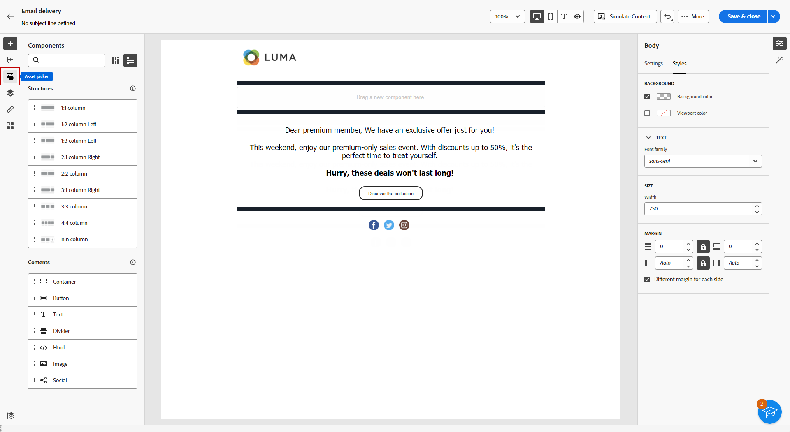
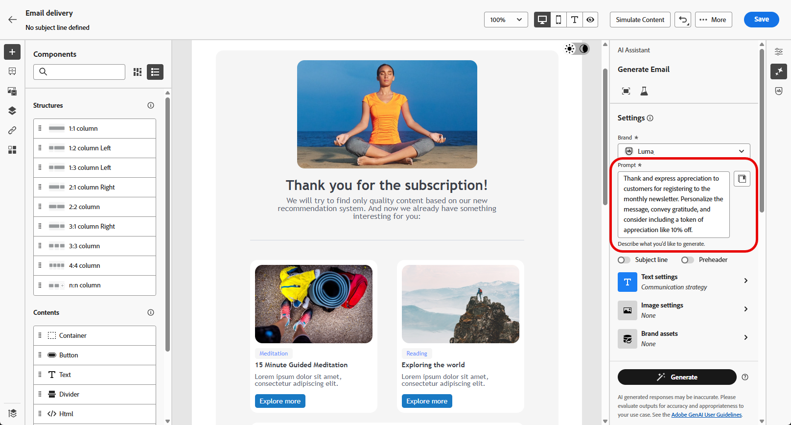

# Campaign Standard에서 v8로의 전환 {#ac-acs}

Adobe Campaign v8에 오신 것을 환영합니다!

Campaign Standard에서 Campaign v8로 전환하는 사용자는 이 참조 안내서를 참조하십시오. 새 Campaign 환경을 숙지하고 역할을 시작하는 데 필요한 단계를 안내하는 데 도움이 됩니다.

1. [Adobe Campaign v8의 새로운 기능](#new)을 배웁니다.

1. 이제 [역할에 따른 Adobe Campaign Standard과 Adobe Campaign v8 간의 경험 차이점](#experiences)을 이해합니다.

## 새로운 기능 {#new}

이 페이지에서 Adobe Campaign 웹 사용자 인터페이스의 최신 개선 사항을 살펴보십시오. 주요 기능 및 릴리스 업데이트 기능의 전체 목록을 보려면 [이 섹션](../../v8/rn/whats-new.md)을 확인하십시오.

### Campaign v8 개선 사항 {#ac-enhancements}

Adobe Campaign v8의 주요 개선 사항은 아래에 나와 있습니다.

* **웹 사용자 인터페이스**

  Adobe Campaign v8은 클라이언트 콘솔과 웹 사용자 인터페이스를 모두 제공하며 다양한 사용자 환경 설정과 요구 사항을 충족합니다. 클라이언트 콘솔은 강력한 데스크탑 애플리케이션 환경을 제공하는 반면 웹 사용자 인터페이스는 직관적이고 액세스할 수 있도록 디자인되어 Adobe Campaign Standard에 익숙한 마케터에게 이상적인 선택입니다.

  웹 사용자 인터페이스는 일부 용어가 다를 수 있지만 Adobe Campaign Standard과 많은 유사성을 공유합니다.

  [여기에서 Adobe Campaign 웹 사용자 인터페이스에 대해 자세히 알아보세요](../../v8/campaign-web-home.md).

  {zoomable="yes"}

  모든 새로운 기능 및 향상된 기능은 [릴리스 정보](../../v8/rn/release-notes.md)에 나열되어 있습니다. Adobe Campaign Web 사용자 인터페이스 릴리스는 기능 배포에 대한 보다 확장 가능한 단계별 접근 방식을 고려하는 연속 게재 모델에서 작동합니다. 따라서 이들 릴리스 정보는 월별로 여러 차례 업데이트됩니다. 이들 릴리스 정보를 정기적으로 확인하십시오.

* **성능**

  Adobe Campaign v8은 고급 클라우드 규모 데이터베이스 기술을 활용하므로 성능과 효율성이 크게 향상됩니다. 이렇게 재설계된 아키텍처는 다음과 같은 몇 가지 주요 이점을 제공합니다.

   * *규모*: 이제 시스템에서 처리 기능이 크게 향상되어 일괄 처리 처리량이 시간당 최대 **2천만 작업**&#x200B;에 이릅니다. 이 새로운 아키텍처를 사용하면 예측 가능한 성능으로 더 높은 수준의 프로필을 관리할 수 있습니다.
   * *속도*: 세분화, 게재 준비 또는 트랜잭션 메시지를 위한 처리량(현재 시간당 **1백만 개**)과 같은 모든 마케팅 활동에 대해 시스템이 개선되었습니다.

  완전히 관리되는 클라우드 서비스는 사용자에게 다음과 같은 기능을 제공합니다.

   * 실시간 데이터 탐색: 빠른 통찰력과 보다 정보에 입각한 의사 결정을 위해 데이터를 즉시 액세스하고 분석합니다.

   * 신속한 대상 구축: 보다 효율적인 캠페인 세분화를 위해 타깃팅된 대상을 몇 분 내에 손쉽게 만들 수 있습니다.

  전반적으로 Adobe Campaign v8의 강력한 아키텍처는 속도와 효율성을 높여 광범위하고 복잡한 마케팅 캠페인을 관리할 수 있는 강력한 기반을 제공합니다.

### Adobe Campaign v8의 새로운 기능 {#ac-new-features}

Campaign Standard 사용자가 Adobe Campaign v8로 전환하면 다음과 같은 기능을 사용할 수 있습니다.

* **리치 푸시**

  Adobe Campaign v8에서는 풍부한 푸시 알림을 전송할 수 있는 기능을 제공하므로 사용자의 주의를 집중시키고 조치를 취하도록 유도할 수 있습니다. 이러한 알림은 텍스트, 이미지, 버튼, 카운트다운 타이머, 사운드 등과 같은 다양한 요소를 포함할 수 있다.

  {zoomable="yes"}

  이러한 풍부한 알림을 쉽게 생성할 수 있도록 Adobe Campaign v8에서는 회전 메뉴 또는 타이머와 같은 복잡한 알림의 콘텐츠를 디자인하고 사용자 지정할 수 있는 다양한 템플릿을 제공합니다.

  고객의 시스템에 따라 알림을 사용자 지정할 수 있습니다.

   * [Android](../../v8/push/rich-push.md) 템플릿용

   * [iOs](../../v8/push/rich-push.md) 템플릿

  푸시 알림은 모바일 앱 사용자의 참여를 유도하기 위한 중요한 도구로서, 앱을 적극적으로 사용하지 않을 때에도 사용자에게 연락할 수 있도록 해줍니다.

* **Adobe Experience Manager as a Cloud Service**

  Adobe Campaign v8은 Adobe Experience Manager as a Cloud Service과 원활하게 통합되어 고객에게 개인화되고 콘텐츠가 풍부한 경험을 제공할 수 있습니다. 이 기본 통합은 컨텐츠 관리를 간소화하고 Adobe Experience Manager의 강력한 기능을 활용하여 마케팅 활동을 최적화합니다.

  이 통합에서 사용할 수 있는 주요 기능은 다음과 같습니다.

   * *에셋 관리*: Adobe Campaign v8 내에서 이메일 디자이너는 에셋에 액세스하고 관리할 수 있는 선택기를 제공합니다. 이 기능은 Adobe Experience Manager의 요소를 게재에 간소화하여 콘텐츠를 보다 효율적으로 관리할 수 있도록 합니다. [자산 관리에 대해 자세히 알아보기](../../v8/integrations/aem-assets.md)

     {zoomable="yes"}

   * *이메일 템플릿 가져오기*: Adobe Campaign v8을 사용하면 Adobe Experience Manager에서 직접 Campaign으로 이메일 템플릿을 찾아보고 가져올 수 있습니다. [전자 메일 템플릿 가져오기에 대해 자세히 알아보기](../../v8/integrations/aem-content.md)

     {zoomable="yes"}

  Adobe Experience Manager as a Cloud Service은 클라우드 기반의 민첩성을 제공하여 변화하는 비즈니스 요구에 신속하게 대응하고 적응할 수 있도록 해줍니다. 이 통합을 통해 콘텐츠 관리 기능이 향상될 뿐만 아니라 모든 접점에서 고객에게 보다 개인화되고 흥미로운 경험을 전달할 수 있습니다.

* **AI 어시스턴트**

  Campaign AI Assistant를 사용하면 시간을 절약하고 효율성을 개선하며 더 나은 결과를 도출하는 동시에 직관적이고 단순하며 번거롭지 않은 이메일, SMS 및 푸시와 같은 채널 전반에서 마케팅 캠페인을 만들고 실행할 수 있습니다.

  {zoomable="yes"}

  AI Assistant는 채널 전반에서 전문적이고 브랜드 일관적인 콘텐츠를 만드는 방식을 혁신합니다. 고급 GenAI 모델과 브랜드 가이드라인에 대한 깊은 이해를 바탕으로 AI Assistant는 브랜드 윤곽이 잡힌 스타일, 레이아웃, 색조 등에 최적화된 콘텐츠로 마케팅 목표를 기반으로 개인화되고, 매력적이며, 효과적인 콘텐츠를 자동 생성합니다.

  AI Assistant를 통해 마케팅 캠페인을 직관적이고, 단순하며, 번거롭지 않게 작성 및 실행할 수 있으며 시간을 절약하고, 효율성을 개선하고, 더 나은 결과를 얻을 수 있습니다.

  {zoomable="yes"}

  변형 이메일 템플릿을 제공하고 이미지를 생성 및 재생성합니다. [이 섹션](../../v8/content/generative-full-content.md)에서 AI Assistant에 대해 자세히 알아보세요. Adobe Campaign v8에는 [이메일](../../v8/content/generative-full-content.md), [SMS](../../v8/content/generative-text.md) 및 [푸시](../../v8/content/generative-full-content.md)에 사용할 수 있는 AI 도우미가 있습니다.

* **업그레이드된 SMS 인프라 - SMS v2.0**

  SMS의 사용 편의성과 단순성은 수십억 개의 단말기에 대한 견고성과 독보적인 호환성에 더해 매우 가치 있는 커뮤니케이션 채널입니다.

  Adobe Campaign v8에는 SMS 전송을 개선하는 새로운 인프라가 포함되어 있습니다. [새 SMS 설정에 대해 자세히 알아보기](https://experienceleague.adobe.com/en/docs/campaign/campaign-v8/send/sms/sms){target="_blank"}.

* **업그레이드된 푸시 인프라**

  Adobe Campaign v8에서는 최신 첨단 기술을 기반으로 구축된 강력한 프레임워크에서 제공하는 최신 푸시 알림 서비스를 도입했습니다. 이 서비스는 새로운 차원의 확장성을 제공하도록 설계되었으므로, 원활한 효율성으로 더 많은 대상자에게 알림이 전달될 수 있습니다. 향상된 인프라와 최적화된 프로세스를 통해 더 높은 규모와 신뢰성을 기대할 수 있으며, 이전과 달리 모바일 앱 사용자를 참여시키고 연결할 수 있는 역량을 확보할 수 있습니다.

  [업그레이드된 푸시 인프라에 대해 자세히 알아보세요](https://experienceleague.adobe.com/en/docs/campaign/campaign-v8/send/push/push-data-collection){target="_blank"}.

## Managed Services {#ac-managed-services}

Adobe Campaign v8은 관리 클라우드 서비스로 제공되며, 사전 예방적인 감독, 적시 경고, 서비스 거버넌스를 제공합니다. Adobe 관리 클라우드 서비스는 마케터에게 민첩하고 안전하며 확장 가능하고 TCO가 낮은 크로스 채널 캠페인 관리 솔루션을 제공합니다. 이 새로운 기능은 서비스를 사전 예방적 감독 및 적시 경고 기능과 결합합니다.

## v8에 추가된 Campaign Standard 기능 {#ac-v8-added}

Campaign v8로 원활하게 전환할 수 있도록 주요 Campaign Standard 기능이 Campaign v8에 추가되었습니다. 자세한 내용은 [이 설명서](https://experienceleague.adobe.com/docs/experience-cloud/campaign/campaign-standard-migration-home.html){target="_blank"}를 참조하세요.

* **동적 보고**: 동적 보고는 마케팅 활동의 영향을 측정하기 위해 완전히 사용자 정의 가능한 실시간 보고서를 제공합니다. 이 기능은 프로필 데이터에 대한 액세스를 추가하여 열기 및 클릭과 같은 기능적 이메일 캠페인 데이터 외에도 성별, 도시, 연령과 같은 프로필 차원별로 인구통계학적 분석을 지원합니다. [자세히 알아보기](https://experienceleague.adobe.com/docs/experience-cloud/campaign/reporting/get-started-reporting.html){target="_blank"}

* **중앙 집중식 브랜딩**: 모든 회사에는 브랜드 시각적 및 기술적 지침이 있습니다. Adobe Campaign을 사용하면 로고에서부터 이메일 발신자, URL 또는 도메인과 같은 기술적 측면까지 일관된 브랜드를 고객에게 제시하기 위해 일련의 사양을 정의할 수 있습니다. [자세히 알아보기](https://experienceleague.adobe.com/docs/experience-cloud/campaign/branding/branding-gs.html)

* **REST API** - Campaign Standard 마이그레이션 사용자인 경우 REST API를 사용하여 Adobe Campaign을 통합하고 사용하는 기술 패널과 Adobe Campaign을 인터페이스하여 자체 에코시스템을 구축할 수 있습니다. [자세히 알아보기](https://experienceleague.adobe.com/docs/experience-cloud/campaign/apis/get-started-apis.html){target="_blank"}

* **랜딩 페이지** - Campaign Standard와의 기능 패리티를 보장하기 위해 Campaign v8 랜딩 페이지에 일부 개선 사항이 적용되었습니다. [릴리스 정보](../../v8/rn/release-notes.md#new-24-4) 및 랜딩 페이지 [설명서](../../v8/landing-pages/get-started-lp.md)에서 자세한 내용을 살펴보십시오.

* **시각적 조각** - 시각적 조각은 하나 이상의 이메일 게재나 콘텐츠 템플릿에서 참조할 수 있는 재사용 가능한 시각적 구성 요소입니다. 조각을 수정하면 이를 사용하는 모든 콘텐츠가 업데이트됩니다. 이 기능을 통해 여러 사용자 정의 콘텐츠 블록을 사전 빌드할 수 있으며, 마케팅 사용자는 이들 콘텐츠 블록을 사용하여 향상된 디자인 프로세스로 메시지 콘텐츠를 신속하게 조합할 수 있습니다. [자세히 알아보기](../../v8//content/use-visual-fragments.md)

## Campaign Standard과 Campaign v8 간의 주요 차이점 {#experiences}

대부분의 개념은 Adobe Campaign v8과 Adobe Campaign Standard 간에 유사합니다. 그러나 아래에 설명된 것과 같은 몇 가지 차이점이 있습니다.

다음은 Campaign Standard과 Campaign v8 간의 몇 가지 용어 차이점입니다.

* 사용자 정의 리소스는 **스키마**&#x200B;입니다.
* 메시지는 **게재**&#x200B;라고 합니다.
* 제품 사용자는 **운영자**&#x200B;입니다.
* 역할은 **명명된 권한**&#x200B;으로 구성됩니다.
* 보안 그룹은 **운영자 그룹**&#x200B;입니다.
* 조직 유닛은 **폴더 권한**&#x200B;을 통해 관리됩니다.

또한 기존 Campaign 사용자는 일부 개념의 이름이 최신 용어 표준에 맞게 변경되었습니다. 이 변경 내용은 Campaign Web 사용자 인터페이스에만 적용되며 클라이언트 콘솔에는 반영되지 않습니다. 이는 아래에 요약되어 있습니다.

* 수신자가 **프로필**&#x200B;로 변경되었습니다. [자세히 알아보기](../../v8/audience/gs-audiences-recipients.md)
* 시드 주소가 **테스트 프로필**&#x200B;로 변경되었습니다. [자세히 알아보기](../../v8/preview-test/test-deliveries.md)
* 게재 분석은 이제 **게재 준비**&#x200B;입니다. 메시지 준비를 실행해야 하는 경우 **준비** 버튼을 클릭하십시오. [자세히 알아보기](../../v8/monitor/prepare-send.md)
* 이제 **콘텐츠 시뮬레이션** 버튼을 통해 이메일 미리보기 기능을 사용할 수 있습니다. [자세히 알아보기](../../v8/preview-test/preview-test.md)
* 목록은 이제 **대상자**&#x200B;입니다. [자세히 알아보기](../../v8/audience/gs-audiences-recipients.md)

## 새로운 사용자 경험

역할의 관련 참조 안내서에 액세스하여 Adobe Campaign v8의 새로운 사용자 경험을 탐색할 수 있습니다.

<table>
<tr>
  <td>
    
    

  </td>
  <td>
  
    

  </td>
  </tr>
  <tr>
    <td>
    <a href="marketers.md">
    <strong>마케터</strong>
    </a>
    </td>
    <td>
      <a href="admin-developers.md">
      <strong>관리자 또는 개발자</strong>
      </a>
    </td>
  </tr>
    <td>
    <em>캠페인 관리자, 미디어 마케팅 전문가</em>
    </td>
    <td>
      <em> 시스템 관리자, 기술 마케팅 전문가</em>
    </td>
  <tr>
    <td>
    <b>주요 작업/책임은 다음과 같습니다.</b>
    </td>
      <td>
    <b>주요 작업/책임은 다음과 같습니다.</b>
    </td>
  </tr>
  <tr>
    <td>
      <li>마케팅 캠페인 만들기
      <li>워크플로 디자인
      <li>캠페인 테스트 및 실행
      <li>멀티채널 캠페인 배포
      <li>캠페인 최적화
      <li>자동화된 캠페인 최적화
    </td>
    <td>
        <li>액세스 관리
        <li>시스템 구성
        <li>시스템 사용자 정의
    </td>
</tr>
</table>

<!--
## Deprecated items

Adobe constantly evaluates product capabilities to identify older features that should be replaced with more modern alternatives to improve overall customer value, always under careful consideration of backward compatibility.

Please refer to [this documentation for information on deprecated items](https://experienceleague.adobe.com/en/docs/campaign-standard/using/release-notes/deprecated-features).-->
