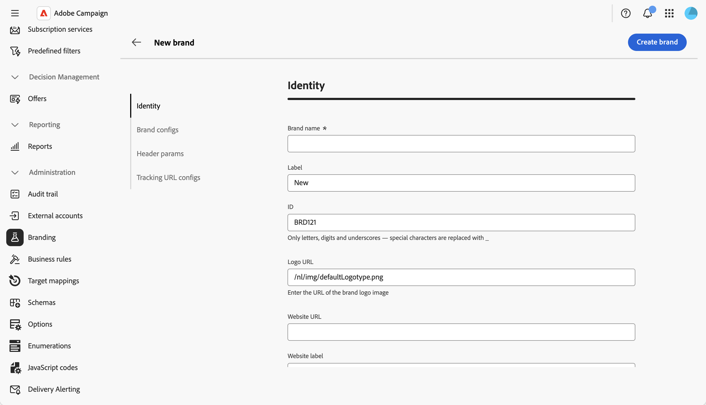

# 브랜드 구성 {#branding-configure}

기술 관리자는 웹 UI에서 직접 여러 브랜드를 만들고 관리할 수 있습니다. 이를 통해 로고 및 이메일 추적 설정을 포함하여 브랜드 정체성을 구성하는 모든 요소를 정의할 수 있습니다.

>[!NOTE]
>
>이 기능을 사용하려면 인스턴스에 브랜딩 패키지가 필요합니다. **브랜딩** 메뉴가 표시되지 않으면 Adobe 담당자에게 문의하십시오.

## 브랜드 만들기 또는 편집 {#create-edit-brand}

>[!CONTEXTUALHELP]
>id="acw_branding_create"
>title="브랜드 만들기"
>abstract="새 브랜드 아이덴티티를 정의하려면 **브랜드 만들기**&#x200B;를 클릭하십시오. 구성 탭에서 브랜드 세부 정보를 입력한 후 **브랜드 만들기**&#x200B;를 클릭하여 저장합니다. 해당 브랜드는 게재 템플릿 및 독립 실행형 게재에 연결할 수 있게 됩니다."

새 브랜드를 만들려면 다음 단계를 수행하십시오.

1. 왼쪽 메뉴에서 **[!UICONTROL 관리 > 브랜딩]** 또는 **[!UICONTROL 탐색기]**&#x200B;에서 **[!UICONTROL 관리 > 플랫폼 > 브랜딩]**(으)로 이동합니다.

1. 목록 위에 있는 **[!UICONTROL 브랜드 만들기]** 단추를 클릭합니다.

   

1. 다른 섹션에 있는 브랜드 세부 사항을 입력합니다. 각 필드는 아래의 [브랜드 특성](#brand-attributes) 섹션에 설명되어 있습니다.

   

1. 저장하려면 **[!UICONTROL 브랜드 만들기]**&#x200B;를 클릭하세요. 이제 브랜드를 게재 템플릿 및 독립 실행형 게재에 연결할 수 있습니다. [브랜드를 할당하는 방법을 알아보세요](branding-assign.md).

기존 브랜드를 편집하려면 목록에서 기존 브랜드를 선택하고 필드를 업데이트한 다음 변경 사항을 저장하십시오.

## 브랜드 속성 {#brand-attributes}

**[!UICONTROL Brand]**&#x200B;이(가) **[!UICONTROL ID]**, **[!UICONTROL Brand 구성]**, **[!UICONTROL 전자 메일 헤더 매개 변수]**, **[!UICONTROL URL 추적 매개 변수]**&#x200B;의 네 섹션에 걸쳐 구성되어 있습니다.

### ID {#identity}

**[!UICONTROL ID]** 섹션에서 브랜드를 정의하고 개인화할 수 있습니다.

브랜드를 만들 때 ID 탭을 표시하는 

이 섹션에는 다음 필드가 포함되어 있습니다.

* **[!UICONTROL 브랜드 이름]**: 브랜드 이름. 이 필드는 반드시 입력해야 합니다.
* **[!UICONTROL 레이블]**: 인터페이스에 표시되는 레이블입니다.
* **[!UICONTROL ID]**: 내부 식별자가 자동으로 생성되었습니다. 바꿀 수 있습니다. 문자, 숫자 및 밑줄만 허용됩니다. 특수 문자는 밑줄로 대체됩니다.
* **[!UICONTROL 로고 URL]**: 브랜드 로고 이미지의 URL.
* **[!UICONTROL 웹 사이트 URL]** 및 **[!UICONTROL 웹 사이트 레이블]**: 브랜드와 연결된 웹 사이트 URL 및 레이블입니다.

### 브랜드 구성 {#brand-configs}

**[!UICONTROL 브랜드 구성]** 섹션에서 추적 및 랜딩 페이지 액세스에 사용되는 하위 도메인 및 URL 프로토콜을 정의합니다.

이 섹션에는 다음 필드가 포함되어 있습니다.

* **[!UICONTROL Brand 하위 도메인]**: Adobe에서 위임하도록 요청한 이 브랜드와 관련된 하위 도메인 URL.
* **[!UICONTROL 추적 URL 프로토콜]**, **[!UICONTROL 미러 페이지 URL 프로토콜]** 및 **[!UICONTROL 응용 프로그램 URL 프로토콜]**: 각 URL 유형에 사용되는 프로토콜(예: **보안(https)**).

>[!NOTE]
>
>추적, 미러 및 애플리케이션 서버에 대한 구성은 라우팅과 연관된 별도의 외부 계정에 저장됩니다. 이러한 설정은 프로비저닝 중에 적용되므로 수정해서는 안 됩니다. URL을 표시하려면 외부 계정에서 **[!UICONTROL 브랜딩 접두사]** 탭에 액세스하십시오.

### 이메일 헤더 매개변수 {#header-param}

**[!UICONTROL 이메일 헤더 매개 변수]**&#x200B;을(를) 사용하면 수신자가 캠페인의 헤더 섹션에서 볼 내용을 개인화할 수 있습니다.

이 섹션에는 다음 필드가 포함되어 있습니다.

* **[!UICONTROL 보낸 사람(메일 주소)]**: 브랜드 메일 주소입니다.
* **[!UICONTROL 보낸 사람(이름)]**: 브랜드 이름.
* **[!UICONTROL 회신 주소(이메일 주소)]**: 고객이 회신할 수 있는 이메일 주소입니다.
* **[!UICONTROL 회신 주소(이름)]**: 회신에 대한 표시 이름입니다.
* **[!UICONTROL 오류(전자 메일 주소)]**: 오류가 발생한 경우 사용할 전자 메일 주소입니다.

<!--
>[!IMPORTANT]
>
>After having updated the header parameters of the emails, if the name and email address of the sender have not changed in the email created from the template, check the template's advanced settings.
-->

### URL 추적 매개변수 {#tracking-param}

**[!UICONTROL URL 추적 매개 변수]** 섹션에서 Adobe Analytics 및 Google Analytics과 같은 웹 분석 도구와의 통합을 위해 추가 매개 변수를 정의하여 URL 추적을 향상시킬 수 있습니다.

이 섹션에는 다음 필드가 포함되어 있습니다.

* **[!UICONTROL 추가 URL 매개 변수]**: 적용 가능성 조건과 함께 매개 변수를 키-값 쌍으로 추가합니다. 각 매개 변수 이름은 고유해야 하며 비어 있지 않아야 하고, 각 매개 변수 값은 비어 있지 않아야 합니다. 적용 가능성 조건은 비어 있을 수 있지만 이러한 값 중 JST 태그를 포함할 수 있는 값은 없습니다.

* **[!UICONTROL 도메인 이름 허용 목록]**: 추적 매개 변수가 추가될 URL과 일치하도록 도메인 이름 또는 정규 표현식을 추가합니다.

**예:** 해당 도메인에 대해 추가 매개 변수 `age=21` 및 `deliveryName=DM101`이(가) 구성되면 `https://www.luma.com`과(와) 같은 추적된 URL은 `https://www.luma.com/?age=21&deliveryName=DM101`이(가) 됩니다.

## 트랜잭션 메시지를 위한 브랜딩 구성 {#branding-transactional-config}

>[!IMPORTANT]
>
>이 섹션은 트랜잭션 메시지(메시지 센터)에만 적용됩니다.
>
>트랜잭션 기능은 Campaign 웹 UI에서 사용할 수 있지만 아래 단계는 Campaign v8 클라이언트 콘솔(컨트롤 인스턴스)에서 수행해야 합니다.

브랜딩과 함께 트랜잭션 메시지(메시지 센터)를 사용하는 경우 추가 구성이 필요합니다.

### 실시간 인스턴스에 대한 추적 공식

브랜딩이 실시간(RT) 제어 인스턴스에서 활성화되면 특정 추적 옵션이 추적 공식을 관리하는 데 사용됩니다. 이러한 수식은 각 RT 실행 인스턴스에서 개별적으로 구성되지 않고 RT 제어 인스턴스에서 중앙에서 구성됩니다.

다음 옵션은 RT 게재에서 사용하는 추적 공식을 정의합니다.

* **`NmsTracking_RT_ClickFormula`**: RT 인스턴스에서 클릭 추적에 사용되는 수식을 지정합니다.

* **`NmsTracking_RT_OpenFormula`**: RT 인스턴스에서 열린 추적에 사용되는 수식을 지정합니다.

구현에서 트랜잭션 메시지에 대한 사용자 지정 추적 수식이 필요한 경우 아래 옵션을 사용하십시오.

* **`Branding_RT_ListXtkOptions_toPublish`**: 사용자 지정 수식의 XTK 옵션 이름을 여기에 나열합니다(쉼표로 구분). 이렇게 하면 RT 게재가 사용자 지정 추적 공식을 적용할 수 있습니다.
