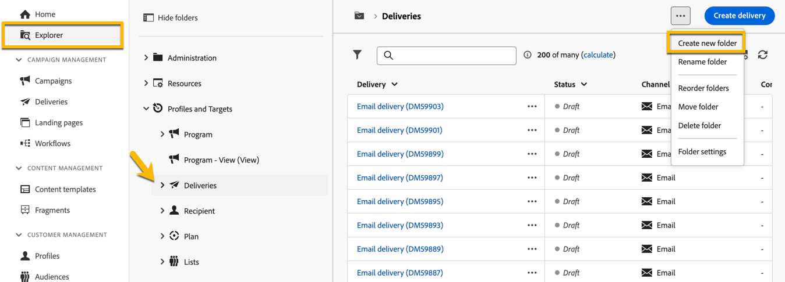

# 폴더 만들기 및 관리

Adobe Campaign에서 새 폴더를 만들어 탐색 트리를 관리할 수 있습니다. **[!UICONTROL 탐색기]**&#x200B;에서 새 폴더를 만들 폴더로 이동합니다.

**[!UICONTROL ..]** 단추 아래에 **[!UICONTROL 새 폴더 만들기]**&#x200B;가 있습니다.

{zoomable="yes"}

새 폴더를 만들면 기본적으로 폴더 유형은 상위 폴더와 같은 유형이 됩니다.
이 예제에서는 **[!UICONTROL 게재]** 폴더에 폴더를 만든다고 가정합니다.

{zoomable="yes"}

폴더 유형 아이콘을 클릭하여 폴더 유형을 변경할 수 있으며 표시되는 목록에서 선택할 수 있습니다.

{zoomable="yes"}

**[!UICONTROL 확인]** 단추를 클릭하여 폴더 유형을 설정합니다.

특정 유형이 없는 폴더를 만들려면 **[!UICONTROL 일반 폴더]** 유형을 선택합니다.

Adobe Campaign 콘솔에는 [여기](https://experienceleague.adobe.com/ko/docs/campaign/campaign-v8/config/configuration/folders-and-views)에서 설명한 폴더를 만들고 관리하는 프로세스가 있으며 폴더에 대한 권한을 설정할 수 있습니다. [자세히 알아보기](https://experienceleague.adobe.com/ko/docs/campaign/campaign-v8/admin/permissions/folder-permissions)
