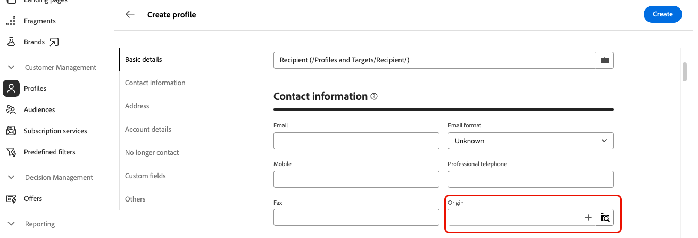

# 열거 관리 {#enumerations}

>[!CONTEXTUALHELP]
>id="acw_enumerations_list"
>title="열거형"
>abstract="열거는 필드를 채우기 위해 시스템이 제안하는 값의 목록입니다. 열거를 사용하여 이러한 필드의 값을 표준화하고, 쿼리 내에서 데이터 입력이나 사용을 돕습니다."

>[!CONTEXTUALHELP]
>id="acw_enumerations_properties"
>title="속성"
>abstract="열거의 이름, 내부 이름, 유형 등의 속성을 정의합니다. **[!UICONTROL 폐쇄형]** 열거에는 **[!UICONTROL 열거]** 메뉴에서만 수정할 수 있는 고정된 값 목록이 있습니다. **[!UICONTROL 개방형]** 열거를 사용하면 사용자가 이 열거를 기반으로 필드에 직접 새 값을 추가할 수 있습니다. **[!UICONTROL 시스템]** 열거는 시스템 필드와 연결됩니다. **[!UICONTROL 이모티콘]** 열거는 이모티콘 목록을 업데이트하는 데 사용됩니다."

>[!CONTEXTUALHELP]
>id="acw_enumerations_values"
>title="열거 값 목록"
>abstract="열거에 값을 추가하려면 **[!UICONTROL 값 추가]** 버튼을 클릭한 다음 필요에 따라 구성합니다."

## 열거형이란 무엇입니까? {#about}

열거는 필드를 채우기 위해 시스템이 제안하는 값의 목록입니다. 열거형을 사용하여 이러한 필드의 값을 표준화하거나, 데이터 입력을 돕거나, 쿼리 내에서 사용합니다. 값 목록은 필드에 입력할 값을 선택할 수 있는 드롭다운 목록으로 나타납니다. 드롭다운 목록을 통해 예측 입력도 가능합니다. 첫 번째 문자를 입력하고 나머지 문자는 애플리케이션이 채웁니다.

이 유형의 필드 값은 왼쪽 탐색 창의 **[!UICONTROL 관리]** / **[!UICONTROL 열거형]** 메뉴를 통해 정의됩니다.

## 열거형 만들기 {#create}

열거형을 만들려면 다음 단계를 수행합니다.

1. **[!UICONTROL 열거형]** 메뉴로 이동한 다음 **[!UICONTROL 열거형 만들기]** 단추를 클릭합니다.

1. 열거에 대해 **[!UICONTROL Label]** 및 **[!UICONTROL 내부 이름]**&#x200B;을(를) 입력하십시오.

   

1. 열거형 **[!UICONTROL Type]** 선택:

   * **[!UICONTROL Closed]** 열거형에는 고정 값 목록이 있으며 **[!UICONTROL 열거형]** 메뉴에서만 수정할 수 있습니다.
   * **[!UICONTROL 열기]** 열거형을 사용하면 이 열거형을 기반으로 필드에 직접 새 값을 추가할 수 있습니다.
   * **[!UICONTROL System]** 열거형이 시스템 필드와 연결되어 있습니다.
   * **[!UICONTROL 이모티콘]** 열거는 이모티콘 목록을 업데이트하는 데 사용됩니다.

1. Click **[!UICONTROL Create]**. 열거형 세부 정보가 표시되어 목록에 값을 추가할 수 있습니다.

   

1. 값을 추가하려면 **[!UICONTROL 값 추가]** 단추를 클릭한 다음 필요에 따라 구성합니다.

   * **[!UICONTROL 레이블]**: 열거형에 표시할 레이블입니다.
   * **[!UICONTROL 내부 이름]**: 값의 내부 이름(시스템 열거형의 경우)입니다.
   * **[!UICONTROL U+(내부 이름)]**(이모티콘 열거형): 이모티콘에 대한 유니코드 코드입니다(이모티콘 열거형).

   

1. 변경 내용을 저장합니다. 열거형은 해당 열거형이 사용되는 화면에서 업데이트됩니다.

## 사용 사례: 열거형에 사전 정의된 값 추가 {#uc}

기본적으로 프로필 세부 정보 화면의 &quot;원본&quot; 필드에서는 사용자가 원하는 값을 자유롭게 입력할 수 있습니다.

사용자가 필드에 대한 값을 입력할 때마다 값이 &quot;원본&quot; 열거에 자동으로 추가됩니다. 이렇게 하면 값 목록에서 시간이 지남에 따라 값이 중복되거나 일관되지 않거나 잘못된 값이 표시될 수 있습니다.

데이터 일관성을 보장하고 필드를 작성할 때 사용자를 안내하려면 미리 정의된 값 집합을 정의합니다. 다음 단계를 수행하십시오.

1. **[!UICONTROL 열거형]** 메뉴로 이동하여 &quot;원본&quot; 열거형을 엽니다.

2. 사용자가 입력한 값 목록을 검토하고 정리합니다. 삭제할 값 옆에 있는 줄임표 버튼을 클릭합니다. 목록에 불일치가 너무 많으면 전체 열거형을 삭제하고 처음부터 다시 만드십시오.

   

3. 사전 정의된 값을 추가합니다. 이렇게 하려면 **[!UICONTROL 값 추가]** 단추를 클릭하고 사용자가 선택해야 할 미리 정의된 값을 입력하십시오.

   

4. 일관성을 유지하려면 열거형 형식을 **[!UICONTROL Closed]**(으)로 전환하여 사용자를 미리 정의된 값으로 제한합니다. 유연성이 필요한 경우 새 사용자 항목을 허용하려면 **[!UICONTROL 열기]**&#x200B;를 유지합니다.

5. 프로필 세부 사항 화면으로 돌아갑니다. 이제 &quot;원본&quot; 필드에 선택 항목에 대해 사전 정의된 값이 표시됩니다.

   