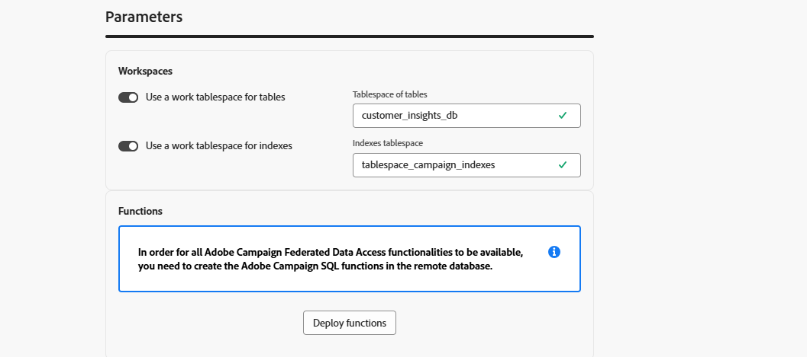
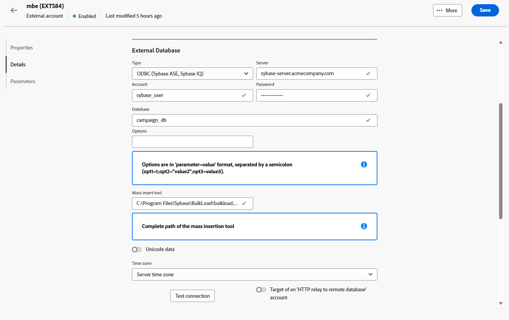
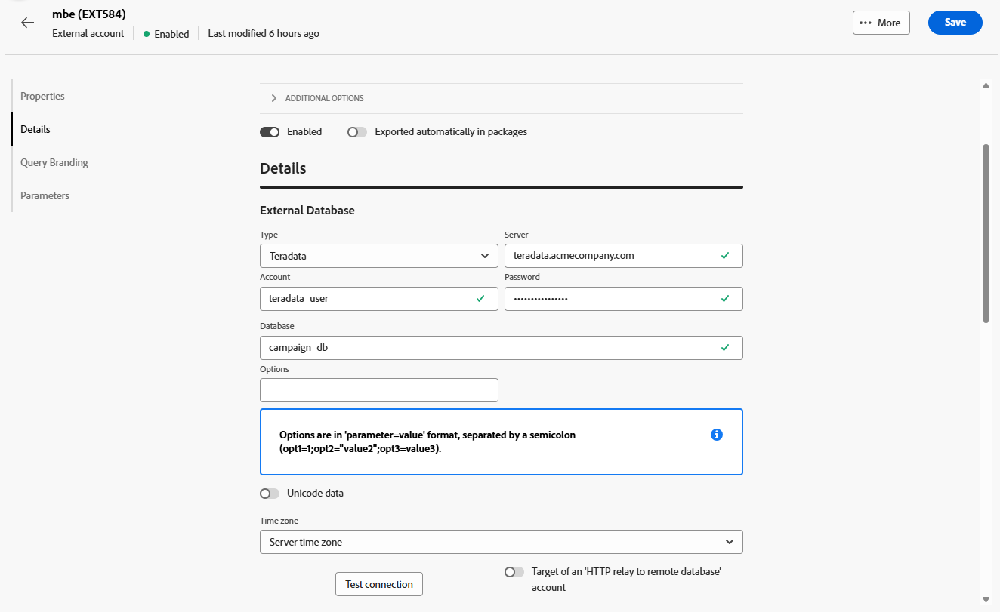

# 외부 데이터베이스 계정 {#external-accounts}

외부 데이터베이스 유형 외부 계정을 사용하여 Adobe Campaign을 타사 데이터베이스에 연결합니다.

외부 계정에 대한 구성 설정은 연결 중인 데이터베이스 엔진에 따라 다릅니다. 지원되는 각 데이터베이스에 대한 자세한 지침은 아래 섹션에서 확인할 수 있습니다.

## Amazon Redshift

Amazon Redshift 외부 계정을 사용하면 Campaign 인스턴스를 Amazon Redshift 외부 데이터베이스에 연결할 수 있습니다.

Adobe Campaign 웹 사용자 인터페이스에서 Amazon Redshift 외부 계정을 구성합니다.

1. [외부 계정을 만들고](external-account.md) **[!UICONTROL 외부 데이터베이스]**&#x200B;을(를) 외부 계정의 **[!UICONTROL 유형]**(으)로 선택하고 Amazon Redshift를 **[!UICONTROL 공급자 유형]**(으)로 선택합니다.

1. **[!UICONTROL 만들기]**&#x200B;를 클릭합니다.

1. **[!UICONTROL Amazon Redshift]** 외부 계정을 구성하려면 다음 필드를 채우십시오.

   * **[!UICONTROL 유형]**: Amazon Redshift

   * **[!UICONTROL 서버]**: Redshift 서버의 DNS 이름을 입력합니다.

   * **[!UICONTROL 계정]**: 인증에 사용할 Redshift 사용자 이름을 입력하십시오.

   * **[!UICONTROL 암호]**: 사용자 계정과 연결된 암호를 입력하십시오.

   * **[!UICONTROL 데이터베이스]**: 데이터베이스 이름이 DSN에 아직 정의되어 있지 않은 경우 데이터베이스 이름을 지정하십시오. DSN에 데이터베이스가 포함된 경우 이 필드를 비워 둡니다.

   * **[!UICONTROL 작업 스키마]**: Adobe Campaign이 작동할 스키마 이름을 입력합니다.

   * **[!UICONTROL 옵션]**: 환경에 필요할 수 있는 고급 구성 옵션을 추가합니다.

   * **[!UICONTROL 표준 시간대]**: 정확한 시간 기반 작업을 위해 서버의 표준 시간대를 선택하거나 입력하십시오.

   

1. 연결을 설정한 후 원격 Redshift 데이터베이스에 Adobe Campaign SQL 함수를 만듭니다. 이러한 함수를 사용할 수 있게 되면 **[!UICONTROL 함수 배포]**&#x200B;를 클릭하여 활성화하십시오.

1. **[!UICONTROL 저장소 계정]**&#x200B;을(를) 연결하여 성능을 최적화하고 Adobe Campaign과 Amazon Redshift 간의 데이터 로드 프로세스를 빠르게 합니다.

1. Redshift 환경과 상호 작용할 때 Adobe Campaign에서 사용할 권한을 결정하는 **[!UICONTROL 계정 역할]**&#x200B;을 입력합니다.

## Amazon Redshift(이전)

Amazon Redshift(기존) 외부 계정을 사용하면 Campaign 인스턴스를 Amazon Redshift 외부 데이터베이스에 연결할 수 있습니다.

Adobe Campaign 웹 사용자 인터페이스에서 Amazon Redshift(기존) 외부 계정을 구성합니다.

1. [외부 계정을 만들고](external-account.md) **[!UICONTROL 외부 데이터베이스]**&#x200B;을(를) 외부 계정의 **[!UICONTROL 유형]**(으)로 선택하고 Amazon Redshift(기존)를 **[!UICONTROL 공급자 유형]**(으)로 선택합니다.

1. **[!UICONTROL 만들기]**&#x200B;를 클릭합니다.

1. **[!UICONTROL Amazon Redshift(기존)]** 외부 계정을 구성하려면 다음 필드를 채우십시오.

   * **[!UICONTROL 유형]**: Amazon Redshift(기존)

   * **[!UICONTROL 서버]**: Redshift 서버의 DNS 이름을 입력합니다.

   * **[!UICONTROL 계정]**: 인증에 사용할 Redshift 사용자 이름을 입력하십시오.

   * **[!UICONTROL 암호]**: 사용자 계정과 연결된 암호를 입력하십시오.

   * **[!UICONTROL 데이터베이스]**: 데이터베이스 이름이 DSN에 아직 정의되어 있지 않은 경우 데이터베이스 이름을 지정하십시오. DSN에 데이터베이스가 포함된 경우 이 필드를 비워 둡니다.

   * **[!UICONTROL 작업 스키마]**: Adobe Campaign이 작동할 스키마 이름을 입력합니다.

   * **[!UICONTROL 표준 시간대]**: 정확한 시간 기반 작업을 위해 서버의 표준 시간대를 선택하거나 입력하십시오.

   

1. 연결을 설정한 후 원격 Redshift 데이터베이스에 Adobe Campaign SQL 함수를 만듭니다. 이러한 함수를 사용할 수 있게 되면 **[!UICONTROL 함수 배포]**&#x200B;를 클릭하여 활성화하십시오.

## Azure Synapse Analytics

Azure Synapse Analytics 외부 계정을 사용하면 Campaign 인스턴스를 Azure Synapse 외부 데이터베이스에 연결할 수 있습니다.

Adobe Campaign 웹 사용자 인터페이스에서 Azure Synapse Analytics 외부 계정을 구성합니다.

1. [외부 계정을 만들고](external-account.md) **[!UICONTROL 외부 데이터베이스]**&#x200B;을(를) 외부 계정의 **[!UICONTROL 유형]**(으)로 선택하고 Amazon Redshift를 **[!UICONTROL 공급자 유형]**(으)로 선택합니다.

1. **[!UICONTROL 만들기]**&#x200B;를 클릭합니다.

1. **[!UICONTROL Azure Synapse Analytics]** 외부 계정을 구성하려면 다음 필드를 채우십시오.

   * **[!UICONTROL 유형]**: Azure Synapse Analytics

   * **[!UICONTROL 서버]**: Azure Synapse 서버의 URL을 입력하십시오.

   * **[!UICONTROL 계정]**: Synapse 데이터베이스로 인증할 사용자 이름을 입력하십시오.

   * **[!UICONTROL 암호]**: 계정과 연결된 암호를 입력하십시오.

   * **[!UICONTROL 데이터베이스]**: Adobe Campaign에서 연결할 대상 데이터베이스를 지정하십시오.

   * **[!UICONTROL 테이블 및 함수 접두사]**: 기본적으로 계정 이름으로 설정됩니다. 캠페인 관련 객체를 식별하기 위해 다른 접두사를 사용하려는 경우 조정할 수 있습니다.

   * **[!UICONTROL 옵션]**: 환경에 필요할 수 있는 고급 구성 옵션을 추가합니다.

   * **[!UICONTROL 표준 시간대]**: 정확한 시간 기반 작업을 위해 서버의 표준 시간대를 선택하거나 입력하십시오.

   

1. **[!UICONTROL 테이블에 작업 테이블 공간 사용]** 옵션을 사용하도록 선택한 다음 작업 테이블이 저장되는 **[!UICONTROL 테이블의 테이블 공간]**&#x200B;을 지정할 수 있습니다.

1. 필요한 경우 **[!UICONTROL 인덱스에 작업 테이블 공간 사용]** 옵션을 활성화한 다음 **[!UICONTROL 인덱스 테이블 공간 사용]**&#x200B;을 제공하십시오.

   

1. 연결을 설정한 후 원격 Adobe Campaign 데이터베이스에서 Azure Synapse SQL 함수를 만듭니다. 이러한 함수를 사용할 수 있게 되면 **[!UICONTROL 함수 배포]**&#x200B;를 클릭하여 활성화하십시오.

## Databricks

Databricks 외부 계정을 사용하면 Campaign 인스턴스를 Databricks 외부 데이터베이스에 연결할 수 있습니다.

Adobe Campaign 웹 사용자 인터페이스에서 Databricks 외부 계정을 구성합니다.

1. [외부 계정을 만들고](external-account.md) **[!UICONTROL 외부 데이터베이스]**&#x200B;을(를) 외부 계정의 **[!UICONTROL Type]**(으)로 선택하고 Databricks를 **[!UICONTROL 공급자 형식]**(으)로 선택합니다.

1. **[!UICONTROL 만들기]**&#x200B;를 클릭합니다.

1. **[!UICONTROL Databricks]** 외부 계정을 구성하려면 다음 필드를 채우십시오.

   * **[!UICONTROL Type]**: 데이터 블록

   * **[!UICONTROL 서버]**: Databricks 서버의 DNS 이름을 입력하십시오.

   * **[!UICONTROL 계정]**: 인증에 사용할 Databricks 사용자 이름을 입력하십시오.

   * **[!UICONTROL 암호]**: 사용자 계정과 연결된 암호를 입력하십시오.

   * **[!UICONTROL 카탈로그]**: 사용할 카탈로그를 지정합니다.

   * **[!UICONTROL 작업 스키마]**: Adobe Campaign에서 작업 개체를 만들고 관리할 스키마 이름을 입력하십시오.

   * **[!UICONTROL 옵션]**: 환경에 필요할 수 있는 고급 구성 옵션을 추가합니다.

   

1. 연결을 설정한 후 원격 데이터베이스 데이터베이스에 Adobe Campaign SQL 함수를 만듭니다. 이러한 함수를 사용할 수 있게 되면 **[!UICONTROL 함수 배포]**&#x200B;를 클릭하여 활성화하십시오.

1. 성능을 최적화하고 Adobe Campaign과 데이터 블록 간의 데이터 로드 프로세스를 더 빠르게 하려면 **[!UICONTROL 저장소 계정]**&#x200B;을(를) 연결하십시오.

## Google BigQuery

Google BigQuery 외부 계정을 사용하면 Campaign 인스턴스를 Google BigQuery 외부 데이터베이스에 연결할 수 있습니다.

Adobe Campaign 웹 사용자 인터페이스에서 Google BigQuery 외부 계정을 구성합니다.

1. [외부 계정을 만들고](external-account.md) **[!UICONTROL 외부 데이터베이스]**&#x200B;을(를) 외부 계정의 **[!UICONTROL 유형]**(으)로 선택하고 Google BigQuery를 **[!UICONTROL 공급자 유형]**(으)로 선택합니다.

1. **[!UICONTROL 만들기]**&#x200B;를 클릭합니다.

1. **[!UICONTROL Google BigQuery]** 외부 계정을 구성하려면 다음 필드를 입력하십시오.

   * **[!UICONTROL 유형]**: Google BigQuery

   * **[!UICONTROL 계정]**: Adobe Campaign에서 BigQuery에 연결하는 데 사용할 사용자 이름 또는 서비스 계정을 입력하십시오.

   * **[!UICONTROL 로그인 파일 업로드 방법]**: 키 파일 경로를 수동으로 입력하거나 서버에 직접 키 파일을 업로드하여 서비스 계정 키를 제공하는 방법을 선택하십시오.

   * **[!UICONTROL 서버]**: 수동 입력 옵션을 선택하는 경우 서버 URL을 제공하십시오.

   * **[!UICONTROL 프로젝트]**: BigQuery 인스턴스와 연결된 Google Cloud 프로젝트 ID를 지정합니다.

   * **[!UICONTROL 데이터 집합]**: Adobe Campaign에서 데이터를 저장하고 쿼리할 데이터 집합의 이름을 입력하십시오.

   * **[!UICONTROL 옵션]**: 환경에 필요할 수 있는 고급 구성 옵션을 추가합니다.

   

1. **[!UICONTROL 매개 변수]**&#x200B;에서 서비스 계정 키 JSON 파일의 내용을 붙여넣어 Google BigQuery로 Adobe Campaign을 인증합니다.

1. 연결을 설정한 후 원격 Adobe Campaign BigQuery 데이터베이스에서 Google SQL 함수를 만듭니다. 이러한 함수를 사용할 수 있게 되면 **[!UICONTROL 함수 배포]**&#x200B;를 클릭하여 활성화하십시오.

1. BigQuery 서버에 연결하기 위해 프록시 액세스 권한이 필요한 경우 프록시 설정을 구성합니다.

   먼저 프록시 유형(http, http_no_tunnel, socks4 또는 socks5)을 선택합니다.

1. 보안 액세스를 설정하려면 다음 프록시 구성 필드를 입력합니다.

   * **[!UICONTROL 프록시 호스트]**: 프록시 서버의 주소입니다.
   * **[!UICONTROL 프록시 포트]**: 프록시 서버에서 사용하는 포트입니다.
   * **[!UICONTROL 프록시 UID]**: 필요한 경우 프록시 서버로 인증하기 위한 사용자 ID입니다.
   * **[!UICONTROL 프록시 호스트]**: 프록시 UID에 해당하는 암호입니다(해당하는 경우).

   

## Microsoft SQL Server

Microsoft SQL Server 외부 계정을 사용하면 Campaign 인스턴스를 Microsoft SQL Server 외부 데이터베이스에 연결할 수 있습니다.

Adobe Campaign 웹 사용자 인터페이스에서 Microsoft SQL Server 외부 계정을 구성합니다.

1. [외부 계정을 만들고](external-account.md) **[!UICONTROL 외부 데이터베이스]**&#x200B;을(를) 외부 계정의 **[!UICONTROL 유형]**(으)로 선택하고 Microsoft SQL Server를 **[!UICONTROL 공급자 유형]**(으)로 선택합니다.

1. **[!UICONTROL 만들기]**&#x200B;를 클릭합니다.

1. **[!UICONTROL Microsoft SQL Server]** 외부 계정을 구성하려면 다음 필드를 채우십시오.

   * **[!UICONTROL 유형]**: Microsoft SQL Server

   * **[!UICONTROL 서버]**: Microsoft SQL Server의 DNS 이름을 입력하십시오.

   * **[!UICONTROL 계정]**: 인증에 사용할 Microsoft SQL Server 사용자 이름을 제공하십시오.

   * **[!UICONTROL 암호]**: 사용자 계정과 연결된 암호를 입력하십시오.

   * **[!UICONTROL 데이터베이스]**: 데이터베이스 이름이 DSN에 아직 정의되어 있지 않은 경우 데이터베이스 이름을 지정하십시오. DSN에 데이터베이스가 포함된 경우 이 필드를 비워 둡니다.

   * **[!UICONTROL 옵션]**: 환경에 필요할 수 있는 고급 구성 옵션을 추가합니다.

   * **[!UICONTROL 테이블 및 함수 접두사]**: 기본적으로 계정 이름으로 설정됩니다. 캠페인 관련 객체를 식별하기 위해 다른 접두사를 사용하려는 경우 조정할 수 있습니다.

   * **[!UICONTROL 표준 시간대]**: 정확한 시간 기반 작업을 위해 서버의 표준 시간대를 선택하거나 입력하십시오.

   

1. **[!UICONTROL 테이블에 작업 테이블 공간 사용]** 옵션을 사용하도록 선택한 다음 작업 테이블이 저장되는 **[!UICONTROL 테이블의 테이블 공간]**&#x200B;을 지정할 수 있습니다.

1. 필요한 경우 **[!UICONTROL 인덱스에 작업 테이블 공간 사용]** 옵션을 활성화한 다음 **[!UICONTROL 인덱스 테이블 공간 사용]**&#x200B;을 제공하십시오.

1. 연결을 설정한 후 원격 Adobe Campaign SQL Server 데이터베이스에 Microsoft SQL 함수를 만듭니다. 이러한 함수를 사용할 수 있게 되면 **[!UICONTROL 함수 배포]**&#x200B;를 클릭하여 활성화하십시오.

## MySQL

MySQL 외부 계정을 사용하면 Campaign 인스턴스를 MySQL 외부 데이터베이스에 연결할 수 있습니다.
Adobe Campaign 웹 사용자 인터페이스에서 MySQL 외부 계정을 구성합니다.

1. [외부 계정을 만들고](external-account.md) **[!UICONTROL 외부 데이터베이스]**&#x200B;을(를) 외부 계정의 **[!UICONTROL 유형]**(으)로 선택하고 MySQL을 **[!UICONTROL 공급자 유형]**(으)로 선택합니다.

1. **[!UICONTROL 만들기]**&#x200B;를 클릭합니다.

1. **[!UICONTROL MySQL]** 외부 계정을 구성하려면 다음 필드를 입력하십시오.

   * **[!UICONTROL 유형]**: MySQL

   * **[!UICONTROL 서버]**: MySQL 서버의 DNS 이름을 입력하십시오.

   * **[!UICONTROL 계정]**: 인증에 사용할 MySQL 사용자 이름을 제공하십시오.

   * **[!UICONTROL 암호]**: 사용자 계정과 연결된 암호를 입력하십시오.

   * **[!UICONTROL 데이터베이스]**: 데이터베이스 이름이 DSN에 아직 정의되어 있지 않은 경우 데이터베이스 이름을 지정하십시오. DSN에 데이터베이스가 포함된 경우 이 필드를 비워 둡니다.

   * **[!UICONTROL 표준 시간대]**: 정확한 시간 기반 작업을 위해 서버의 표준 시간대를 선택하거나 입력하십시오.

   

1. **[!UICONTROL 테이블에 작업 테이블 공간 사용]** 옵션을 사용하도록 선택한 다음 작업 테이블이 저장되는 **[!UICONTROL 테이블의 테이블 공간]**&#x200B;을 지정할 수 있습니다.

1. 필요한 경우 **[!UICONTROL 인덱스에 작업 테이블 공간 사용]** 옵션을 활성화한 다음 **[!UICONTROL 인덱스 테이블 공간 사용]**&#x200B;을 제공하십시오.

1. 연결을 설정한 후 원격 MySQL 데이터베이스에 Adobe Campaign SQL 함수를 만듭니다. 이러한 함수를 사용할 수 있게 되면 **[!UICONTROL 함수 배포]**&#x200B;를 클릭하여 활성화하십시오.

## Netezza

Netezza 외부 계정을 사용하면 Campaign 인스턴스를 Netezza 외부 데이터베이스에 연결할 수 있습니다.

Adobe Campaign 웹 사용자 인터페이스에서 Netezza 외부 계정을 구성합니다.

1. [외부 계정을 만들고](external-account.md) **[!UICONTROL 외부 데이터베이스]**&#x200B;을(를) 외부 계정의 **[!UICONTROL 유형]**(으)로 선택하고 Netezza을 **[!UICONTROL 공급자 유형]**(으)로 선택합니다.

1. **[!UICONTROL 만들기]**&#x200B;를 클릭합니다.

1. **[!UICONTROL Netezza]** 외부 계정을 구성하려면 다음 필드를 입력하십시오.

   * **[!UICONTROL 유형]**: Netezza

   * **[!UICONTROL 서버]**: Netezza 서버의 DNS 이름을 입력하십시오.

   * **[!UICONTROL 계정]**: 인증에 사용할 Netezza 사용자 이름을 제공하십시오.

   * **[!UICONTROL 암호]**: 사용자 계정과 연결된 암호를 입력하십시오.

   * **[!UICONTROL 데이터베이스]**: 데이터베이스 이름이 DSN에 아직 정의되어 있지 않은 경우 데이터베이스 이름을 지정하십시오. DSN에 데이터베이스가 포함된 경우 이 필드를 비워 둡니다.

   * **[!UICONTROL 표준 시간대]**: 정확한 시간 기반 작업을 위해 서버의 표준 시간대를 선택하거나 입력하십시오.

   

1. **[!UICONTROL 테이블에 작업 테이블 공간 사용]** 옵션을 사용하도록 선택한 다음 작업 테이블이 저장되는 **[!UICONTROL 테이블의 테이블 공간]**&#x200B;을 지정할 수 있습니다.

1. 필요한 경우 **[!UICONTROL 인덱스에 작업 테이블 공간 사용]** 옵션을 활성화한 다음 **[!UICONTROL 인덱스 테이블 공간 사용]**&#x200B;을 제공하십시오.

1. 연결을 설정한 후 원격 Adobe Campaign 데이터베이스에 Netezza SQL 함수를 만듭니다. 이러한 함수를 사용할 수 있게 되면 **[!UICONTROL 함수 배포]**&#x200B;를 클릭하여 활성화하십시오.

## ODBC (Sybase ASE, Sybase IQ)

ODBC(Sybase ASE, Sybase IQ) 외부 계정을 사용하면 Campaign 인스턴스를 ODBC(Sybase ASE, Sybase IQ) 외부 데이터베이스에 연결할 수 있습니다.
Adobe Campaign 웹 사용자 인터페이스에서 ODBC(Sybase ASE, Sybase IQ) 외부 계정을 구성합니다.

1. [외부 계정을 만들고](external-account.md) **[!UICONTROL 외부 데이터베이스]**&#x200B;을(를) 외부 계정의 **[!UICONTROL 유형]**(으)로 선택하고 ODBC(Sybase ASE, Sybase IQ)를 **[!UICONTROL 공급자 유형]**(으)로 선택합니다.

1. **[!UICONTROL 만들기]**&#x200B;를 클릭합니다.

1. **[!UICONTROL ODBC(Sybase ASE, Sybase IQ)]** 외부 계정을 구성하려면 다음 필드를 입력하십시오.

   * **[!UICONTROL 유형]**: ODBC(Sybase ASE, Sybase IQ)

   * **[!UICONTROL 서버]**: ODBC(Sybase ASE, Sybase IQ) 서버의 DNS 이름을 입력하십시오.

   * **[!UICONTROL 계정]**: 인증에 사용할 ODBC(Sybase ASE, Sybase IQ) 서버 사용자 이름을 제공하십시오.

   * **[!UICONTROL 암호]**: 사용자 계정과 연결된 암호를 입력하십시오.

   * **[!UICONTROL 데이터베이스]**: 데이터베이스 이름이 DSN에 아직 정의되어 있지 않은 경우 데이터베이스 이름을 지정하십시오. DSN에 데이터베이스가 포함된 경우 이 필드를 비워 둡니다.

   * **[!UICONTROL 옵션]**: 환경에 필요할 수 있는 고급 구성 옵션을 추가합니다.

   * **[!UICONTROL 대량 삽입 도구]**: 대량 삽입 도구 실행 파일의 전체 경로를 지정합니다.

   * **[!UICONTROL 표준 시간대]**: 정확한 시간 기반 작업을 위해 서버의 표준 시간대를 선택하거나 입력하십시오.

   

1. **[!UICONTROL 테이블에 작업 테이블 공간 사용]** 옵션을 사용하도록 선택한 다음 작업 테이블이 저장되는 **[!UICONTROL 테이블의 테이블 공간]**&#x200B;을 지정할 수 있습니다.

1. 필요한 경우 **[!UICONTROL 인덱스에 작업 테이블 공간 사용]** 옵션을 활성화한 다음 **[!UICONTROL 인덱스 테이블 공간 사용]**&#x200B;을 제공하십시오.

1. 연결을 설정한 후 원격 ODBC 데이터베이스에 Adobe Campaign SQL 함수를 만듭니다. 이러한 함수를 사용할 수 있게 되면 **[!UICONTROL 함수 배포]**&#x200B;를 클릭하여 활성화하십시오.

## 원격 데이터베이스로 HTTP 릴레이

원격 데이터베이스 외부 계정에 대한 HTTP 릴레이를 사용하면 Campaign 인스턴스를 원격 데이터베이스 외부 데이터베이스에 대한 HTTP 릴레이에 연결할 수 있습니다.

Adobe Campaign 웹 사용자 인터페이스에서 원격 데이터베이스 외부 계정에 대한 HTTP 릴레이를 구성합니다.

1. [외부 계정을 만들고](external-account.md) **[!UICONTROL 외부 데이터베이스]**&#x200B;을(를) 외부 계정의 **[!UICONTROL 유형]**(으)로 선택하고 Amazon Redshift를 **[!UICONTROL 공급자 유형]**(으)로 선택합니다.

1. **[!UICONTROL 만들기]**&#x200B;를 클릭합니다.

1. 원격 데이터베이스에 대한 **[!UICONTROL HTTP 릴레이]** 외부 계정을 구성하려면 다음 필드를 채우십시오.

   * **[!UICONTROL 유형]**: 원격 데이터베이스에 대한 HTTP 릴레이

   * **[!UICONTROL 서버]**: 원격 데이터베이스에 연결하는 HTTP 릴레이 서버의 전체 URL을 입력하십시오.

   * **[!UICONTROL 계정]**: HTTP 릴레이 서버에 인증하는 데 사용되는 사용자 이름을 입력하십시오.

   * **[!UICONTROL 암호]**: 이 계정과 연결된 암호를 입력하십시오.

   * **[!UICONTROL Datasource]**: Adobe Campaign이 릴레이를 통해 연결할 대상 데이터베이스를 지정합니다.

   * **[!UICONTROL 옵션]**: 환경에 필요할 수 있는 고급 구성 옵션을 추가합니다.

   

1. **[!UICONTROL 테이블에 작업 테이블 공간 사용]** 옵션을 사용하도록 선택한 다음 작업 테이블이 저장되는 **[!UICONTROL 테이블의 테이블 공간]**&#x200B;을 지정할 수 있습니다.

1. 필요한 경우 **[!UICONTROL 인덱스에 작업 테이블 공간 사용]** 옵션을 활성화한 다음 **[!UICONTROL 인덱스 테이블 공간 사용]**&#x200B;을 제공하십시오.

1. 연결을 설정한 후 원격 데이터베이스 데이터베이스에 대한 원격 HTTP 릴레이에 Adobe Campaign SQL 함수를 만듭니다. 이러한 함수를 사용할 수 있게 되면 **[!UICONTROL 함수 배포]**&#x200B;를 클릭하여 활성화하십시오.

## Oracle

Oracle 외부 계정을 사용하면 Campaign 인스턴스를 Oracle 외부 데이터베이스에 연결할 수 있습니다.
Adobe Campaign 웹 사용자 인터페이스에서 Oracle 외부 계정을 구성합니다.

1. [외부 계정을 만들고](external-account.md) **[!UICONTROL 외부 데이터베이스]**&#x200B;을(를) 외부 계정의 **[!UICONTROL 유형]**(으)로 선택하고 Oracle을 **[!UICONTROL 공급자 유형]**(으)로 선택합니다.

1. **[!UICONTROL 만들기]**&#x200B;를 클릭합니다.

1. **[!UICONTROL Oracle]** 외부 계정을 구성하려면 다음 필드를 입력하십시오.

   * **[!UICONTROL 유형]**: Oracle

   * **[!UICONTROL 서버]**: Oracle 서버의 DNS 이름을 입력하십시오.

   * **[!UICONTROL 계정]**: 인증에 사용할 Oracle 사용자 이름을 제공하십시오.

   * **[!UICONTROL 암호]**: 사용자 계정과 연결된 암호를 입력하십시오.

   * **[!UICONTROL 표준 시간대]**: 정확한 시간 기반 작업을 위해 서버의 표준 시간대를 선택하거나 입력하십시오.

   

1. **[!UICONTROL 테이블에 작업 테이블 공간 사용]** 옵션을 사용하도록 선택한 다음 작업 테이블이 저장되는 **[!UICONTROL 테이블의 테이블 공간]**&#x200B;을 지정할 수 있습니다.

1. 필요한 경우 **[!UICONTROL 인덱스에 작업 테이블 공간 사용]** 옵션을 활성화한 다음 **[!UICONTROL 인덱스 테이블 공간 사용]**&#x200B;을 제공하십시오.

1. 연결을 설정한 후 원격 Adobe Campaign 데이터베이스에 Oracle SQL 함수를 만듭니다. 이러한 함수를 사용할 수 있게 되면 **[!UICONTROL 함수 배포]**&#x200B;를 클릭하여 활성화하십시오.

## PostgreSQL

PostgreSQL 외부 계정을 사용하면 Campaign 인스턴스를 PostgreSQL 외부 데이터베이스에 연결할 수 있습니다.
Adobe Campaign 웹 사용자 인터페이스에서 PostgreSQL 외부 계정을 구성합니다.

1. [외부 계정을 만들고](external-account.md) **[!UICONTROL 외부 데이터베이스]**&#x200B;을(를) 외부 계정의 **[!UICONTROL 유형]**(으)로 선택하고 PostgreSQL을 **[!UICONTROL 공급자 유형]**(으)로 선택합니다.

1. **[!UICONTROL 만들기]**&#x200B;를 클릭합니다.

1. **[!UICONTROL PostgreSQL]** 외부 계정을 구성하려면 다음 필드를 입력하십시오.

   * **[!UICONTROL 유형]**: PostgreSQL

   * **[!UICONTROL 서버]**: PostgreSQL 서버의 DNS 이름을 입력하십시오.

   * **[!UICONTROL 계정]**: 인증에 사용할 PostgreSQL 사용자 이름을 제공하십시오.

   * **[!UICONTROL 암호]**: 사용자 계정과 연결된 암호를 입력하십시오.

   * **[!UICONTROL 데이터베이스]**: 데이터베이스 이름이 DSN에 아직 정의되어 있지 않은 경우 데이터베이스 이름을 지정하십시오. DSN에 데이터베이스가 포함된 경우 이 필드를 비워 둡니다.

   * **[!UICONTROL 작업 스키마]**: Adobe Campaign에서 작업 개체를 만들고 관리할 스키마 이름을 입력하십시오.

   * **[!UICONTROL 표준 시간대]**: 정확한 시간 기반 작업을 위해 서버의 표준 시간대를 선택하거나 입력하십시오.

   

1. **[!UICONTROL 테이블에 작업 테이블 공간 사용]** 옵션을 사용하도록 선택한 다음 작업 테이블이 저장되는 **[!UICONTROL 테이블의 테이블 공간]**&#x200B;을 지정할 수 있습니다.

1. 필요한 경우 **[!UICONTROL 인덱스에 작업 테이블 공간 사용]** 옵션을 활성화한 다음 **[!UICONTROL 인덱스 테이블 공간 사용]**&#x200B;을 제공하십시오.

1. 연결을 설정한 후 원격 PostgreSQL 데이터베이스에 Adobe Campaign SQL 함수를 만듭니다. 이러한 함수를 사용할 수 있게 되면 **[!UICONTROL 함수 배포]**&#x200B;를 클릭하여 활성화하십시오.

## SAP HANA

SAP HANA 외부 계정을 사용하면 Campaign 인스턴스를 SAP HANA 외부 데이터베이스에 연결할 수 있습니다.

Adobe Campaign 웹 사용자 인터페이스에서 SAP HANA 외부 계정을 구성합니다.

1. [외부 계정을 만들고](external-account.md) **[!UICONTROL 외부 데이터베이스]**&#x200B;을(를) 외부 계정의 **[!UICONTROL 유형]**(으)로 선택하고 SAP HANA을 **[!UICONTROL 공급자 유형]**(으)로 선택합니다.

1. **[!UICONTROL 만들기]**&#x200B;를 클릭합니다.

1. **[!UICONTROL SAP HANA]** 외부 계정을 구성하려면 다음 필드를 입력하십시오.

   * **[!UICONTROL 유형]**: SAP HANA

   * **[!UICONTROL 서버]**: SAP HANA 서버의 DNS 이름을 입력하십시오.

   * **[!UICONTROL 계정]**: 인증에 사용할 SAP HANA 사용자 이름을 제공하십시오.

   * **[!UICONTROL 암호]**: 사용자 계정과 연결된 암호를 입력하십시오.

   * **[!UICONTROL 옵션]**: 환경에 필요할 수 있는 고급 구성 옵션을 추가합니다.

   * **[!UICONTROL 작업 스키마]**: Adobe Campaign에서 작업 개체를 만들고 관리할 스키마 이름을 입력하십시오.

   * **[!UICONTROL 표준 시간대]**: 정확한 시간 기반 작업을 위해 서버의 표준 시간대를 선택하거나 입력하십시오.

   

1. **[!UICONTROL 테이블에 작업 테이블 공간 사용]** 옵션을 사용하도록 선택한 다음 작업 테이블이 저장되는 **[!UICONTROL 테이블의 테이블 공간]**&#x200B;을 지정할 수 있습니다.

1. 필요한 경우 **[!UICONTROL 인덱스에 작업 테이블 공간 사용]** 옵션을 활성화한 다음 **[!UICONTROL 인덱스 테이블 공간 사용]**&#x200B;을 제공하십시오.

1. 연결을 설정한 후 원격 Adobe Campaign 데이터베이스에 SAP HANA SQL 함수를 만듭니다. 이러한 함수를 사용할 수 있게 되면 **[!UICONTROL 함수 배포]**&#x200B;를 클릭하여 활성화하십시오.

## Snowflake

Snowflake 외부 계정을 사용하면 Campaign 인스턴스를 Snowflake 외부 데이터베이스에 연결할 수 있습니다.

Adobe Campaign 웹 사용자 인터페이스에서 Snowflake 외부 계정을 구성합니다.

1. [외부 계정을 만들고](external-account.md) **[!UICONTROL 외부 데이터베이스]**&#x200B;을(를) 외부 계정의 **[!UICONTROL 유형]**(으)로 선택하고 Snowflake을 **[!UICONTROL 공급자 유형]**(으)로 선택합니다.

1. **[!UICONTROL 만들기]**&#x200B;를 클릭합니다.

1. **[!UICONTROL Snowflake]** 외부 계정을 구성하려면 다음 필드를 입력하십시오.

   * **[!UICONTROL 유형]**: Snowflake

   * **[!UICONTROL 서버]**: Snowflake 서버의 DNS 이름을 입력하십시오.

   * **[!UICONTROL 계정]**: 인증에 사용할 Snowflake 사용자 이름을 제공하십시오.

   * **[!UICONTROL 암호]**: 사용자 계정과 연결된 암호를 입력하십시오.

   * **[!UICONTROL 데이터베이스]**: 데이터베이스 이름이 DSN에 아직 정의되어 있지 않은 경우 데이터베이스 이름을 지정하십시오. DSN에 데이터베이스가 포함된 경우 이 필드를 비워 둡니다.

   * **[!UICONTROL 작업 스키마]**: Adobe Campaign에서 작업 개체를 만들고 관리할 스키마 이름을 입력하십시오.

   * **[!UICONTROL 옵션]**: 환경에 필요할 수 있는 고급 구성 옵션을 추가합니다.

   * **[!UICONTROL 표준 시간대]**: 정확한 시간 기반 작업을 위해 서버의 표준 시간대를 선택하거나 입력하십시오.

   

1. 연결을 설정한 후 원격 Adobe Campaign 데이터베이스에 Snowflake SQL 함수를 만듭니다. 이러한 함수를 사용할 수 있게 되면 **[!UICONTROL 함수 배포]**&#x200B;를 클릭하여 활성화하십시오.

1. 키 쌍 인증을 사용하는 경우 **[!UICONTROL keypair.auth]** 메뉴에서 다음에 필요한 값을 입력하십시오.

   * **[!UICONTROL 암호]**: 개인 키를 보호하는 암호입니다(해당하는 경우).

   * **[!UICONTROL 개인 키]**: Snowflake 계정을 인증하는 데 사용되는 개인 키입니다.

## Teradata

Teradata 외부 계정을 사용하면 Campaign 인스턴스를 Teradata 외부 데이터베이스에 연결할 수 있습니다.

Adobe Campaign 웹 사용자 인터페이스에서 Teradata 외부 계정을 구성합니다.

1. [외부 계정을 만들고](external-account.md) **[!UICONTROL 외부 데이터베이스]**&#x200B;을(를) 외부 계정의 **[!UICONTROL 유형]**(으)로 선택하고 Teradata을 **[!UICONTROL 공급자 유형]**(으)로 선택합니다.

1. **[!UICONTROL 만들기]**&#x200B;를 클릭합니다.

1. **[!UICONTROL Teradata]** 외부 계정을 구성하려면 다음 필드를 입력하십시오.

   * **[!UICONTROL 유형]**: Teradata

   * **[!UICONTROL 서버]**: Teradata 서버의 DNS 이름을 입력하십시오.

   * **[!UICONTROL 계정]**: 인증에 사용할 Teradata 사용자 이름을 제공하십시오.

   * **[!UICONTROL 암호]**: 사용자 계정과 연결된 암호를 입력하십시오.

   * **[!UICONTROL 데이터베이스]**: 데이터베이스 이름이 DSN에 아직 정의되어 있지 않은 경우 데이터베이스 이름을 지정하십시오. DSN에 데이터베이스가 포함된 경우 이 필드를 비워 둡니다.

   * **[!UICONTROL 옵션]**: 환경에 필요할 수 있는 고급 구성 옵션을 추가합니다.

   * **[!UICONTROL 표준 시간대]**: 정확한 시간 기반 작업을 위해 서버의 표준 시간대를 선택하거나 입력하십시오.

   

1. **[!UICONTROL 테이블에 작업 테이블 공간 사용]** 옵션을 사용하도록 선택한 다음 작업 테이블이 저장되는 **[!UICONTROL 테이블의 테이블 공간]**&#x200B;을 지정할 수 있습니다.

1. 필요한 경우 **[!UICONTROL 인덱스에 작업 테이블 공간 사용]** 옵션을 활성화한 다음 **[!UICONTROL 인덱스 테이블 공간 사용]**&#x200B;을 제공하십시오.

1. 연결을 설정한 후 원격 Adobe Campaign 데이터베이스에 Teradata SQL 함수를 만듭니다. 이러한 함수를 사용할 수 있게 되면 **[!UICONTROL 함수 배포]**&#x200B;를 클릭하여 활성화하십시오.

1. 필요한 경우 각 연결이 설정된 후 스크립트가 자동으로 실행되도록 하려면 **[!UICONTROL PostConnect 스크립트]**&#x200B;를 입력하십시오. 스크립트를 매번 실행하려면 **[!UICONTROL 항상 실행]** 옵션을 사용하도록 설정하십시오.

## Vertica Analytics

Adobe Campaign 웹 사용자 인터페이스에서 Vertica Analytics 외부 계정을 구성합니다.

1. [외부 계정을 만들고](external-account.md) **[!UICONTROL 외부 데이터베이스]**&#x200B;을(를) 외부 계정의 **[!UICONTROL 유형]**(으)로 선택하고 Vertica Analytics을 **[!UICONTROL 공급자 유형]**(으)로 선택합니다.

1. **[!UICONTROL 만들기]**&#x200B;를 클릭합니다.

1. **[!UICONTROL Vertica Analytics]** 외부 계정을 구성하려면 다음 필드를 입력하십시오.

   * **[!UICONTROL 유형]**: Vertica Analytics

   * **[!UICONTROL 서버]**: Vertica Analytics 서버의 DNS 이름을 입력하십시오.

   * **[!UICONTROL 계정]**: 인증에 사용할 Vertica Analytics 사용자 이름을 제공하십시오.

   * **[!UICONTROL 암호]**: 사용자 계정과 연결된 암호를 입력하십시오.

   * **[!UICONTROL 데이터베이스]**: 데이터베이스 이름이 DSN에 아직 정의되어 있지 않은 경우 데이터베이스 이름을 지정하십시오. DSN에 데이터베이스가 포함된 경우 이 필드를 비워 둡니다.

   * **[!UICONTROL 작업 스키마]**: Adobe Campaign에서 작업 개체를 만들고 관리할 스키마 이름을 입력하십시오.

   * **[!UICONTROL 옵션]**: 환경에 필요할 수 있는 고급 구성 옵션을 추가합니다.

   * **[!UICONTROL 표준 시간대]**: 정확한 시간 기반 작업을 위해 서버의 표준 시간대를 선택하거나 입력하십시오.

   

1. 연결을 설정한 후 원격 Adobe Campaign 데이터베이스에 Vertica Analytics SQL 함수를 만듭니다. 이러한 함수를 사용할 수 있게 되면 **[!UICONTROL 함수 배포]**&#x200B;를 클릭하여 활성화하십시오.

## Microsoft Fabric {#fabric}

Microsoft Fabric 외부 계정을 사용하면 Campaign 인스턴스를 Microsoft Fabric 외부 데이터베이스에 연결할 수 있습니다.

Adobe Campaign 웹 사용자 인터페이스에서 Microsoft Fabric 외부 계정을 구성합니다.

1. [외부 계정을 만들고](external-account.md) **[!UICONTROL 외부 데이터베이스]**&#x200B;을(를) 외부 계정의 **[!UICONTROL 유형]**(으)로 선택하고 Microsoft 패브릭을 **[!UICONTROL 공급자 유형]**(으)로 선택합니다.

1. **[!UICONTROL 만들기]**&#x200B;를 클릭합니다.

1. **[!UICONTROL Microsoft Fabric]** 외부 계정을 구성하려면 다음 필드를 채우십시오.

   * **[!UICONTROL 유형]**: Microsoft 패브릭

   * **[!UICONTROL 서버]**: Microsoft 패브릭 서버의 DNS 이름을 입력합니다.

   * **[!UICONTROL 계정]**: 인증에 사용할 Microsoft Fabric 사용자 이름(또는 서비스 주체)을 제공하십시오.

   * **[!UICONTROL 암호]**: 계정과 연결된 암호나 암호를 입력하십시오.

   * **[!UICONTROL 옵션]**: 환경에 필요할 수 있는 고급 구성 옵션을 추가합니다.

   

1. 연결을 설정한 후 원격 Redshift 데이터베이스에 Adobe Campaign SQL 함수를 만듭니다. 이러한 함수를 사용할 수 있게 되면 **[!UICONTROL 함수 배포]**&#x200B;를 클릭하여 활성화하십시오.

1. **[!UICONTROL 저장소 계정]**&#x200B;을(를) 연결하여 성능을 최적화하고 Adobe Campaign과 Microsoft Fabric 간에 더 빠른 데이터 로드 프로세스를 사용할 수 있습니다.

1. Redshift 환경과 상호 작용할 때 Adobe Campaign에서 사용할 권한을 결정하는 **[!UICONTROL 계정 역할]**&#x200B;을 입력합니다.
