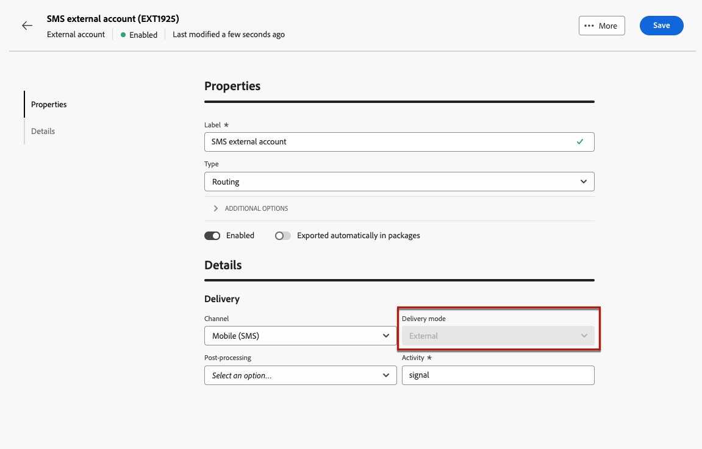

# 외부 계정 관리 {#external-accounts}

>[!CONTEXTUALHELP]
>id="acw_homepage_welcome_rn3"
>title="외부 계정 작성"
>abstract="이제 Campaign 관리자는 Campaign 웹 사용자 인터페이스에서 외부 시스템과의 새 연결을 설정할 수 있습니다. 기존 외부 계정을 확인, 업데이트 및 관리할 수도 있습니다."
>additional-url="https://experienceleague.adobe.com/docs/campaign-web/v8/release-notes/release-notes.html?lang=ko" text="릴리스 정보 참조"

Adobe Campaign에는 다양한 시스템과 쉽게 통합할 수 있도록 사전 구성된 외부 계정이 포함되어 있습니다. 추가 플랫폼에 연결하거나 워크플로에 맞게 연결을 사용자 지정하려면 웹 사용자 인터페이스를 사용하여 새 외부 계정을 만드십시오. 이를 통해 데이터를 원활하게 전송할 수 있습니다.

## 외부 계정 만들기 {#create-ext-account}

새 외부 계정을 만들려면 아래 단계를 수행하십시오. 자세한 설정은 외부 계정 유형에 따라 다릅니다. [자세히 알아보기](#campaign-specific)

1. 왼쪽 창 메뉴에서 **[!UICONTROL 관리]**&#x200B;의 **[!UICONTROL 외부 계정]**&#x200B;을(를) 선택합니다.

1. **[!UICONTROL 외부 계정 만들기]**&#x200B;를 클릭합니다.

   

1. **[!UICONTROL 레이블]**&#x200B;을(를) 입력하고 외부 계정 **[!UICONTROL 유형]**&#x200B;을(를) 선택하십시오.

   >[!NOTE]
   >
   >Campaign 특정 유형에 대한 설정은 [이 섹션](#campaign-specific)에 자세히 설명되어 있습니다.

   

1. **[!UICONTROL 만들기]**&#x200B;를 클릭합니다.

1. 필요한 경우 **[!UICONTROL 추가 옵션]** 드롭다운에서 **[!UICONTROL 내부 이름]** 또는 **[!UICONTROL 폴더]** 경로를 변경합니다.

   

1. 이 외부 계정에서 관리하는 데이터를 자동으로 내보내려면 **[!UICONTROL 자동으로 패키지로 내보내기]** 옵션을 사용하도록 설정하십시오. <!--Exported where??-->

   

1. **[!UICONTROL 세부 정보]** 섹션에서 선택한 외부 계정 유형에 따라 자격 증명을 지정하여 계정에 대한 액세스를 구성합니다. [자세히 알아보기](#bounce)

1. 구성이 올바른지 확인하려면 **[!UICONTROL 연결 테스트]**&#x200B;를 클릭하십시오.

1. **[!UICONTROL 자세히..]** 메뉴에서 외부 계정을 복제하거나 삭제하십시오.

   

1. 구성이 완료되면 **[!UICONTROL 저장]**&#x200B;을 클릭합니다.

## 캠페인별 외부 계정 {#campaign-specific}

선택한 외부 계정 유형에 따라 아래 단계에 따라 계정 설정을 구성합니다.

### 바운스 메일 (POP3) {#bounce}

바운스 메일 외부 계정은 이메일 서비스 연결에 사용되는 외부 POP3 계정을 지정합니다. POP3 액세스용으로 구성된 모든 서버는 반송 메일을 받을 수 있습니다.

**[!UICONTROL 바운스 메일(POP3)]** 외부 계정을 구성하려면 다음 필드를 입력하십시오.

* **[!UICONTROL 서버]** - POP3 서버의 URL입니다.

* **[!UICONTROL 포트]** - POP3 연결 포트 번호(기본 포트: 110).

* **[!UICONTROL 계정]** - 사용자의 이름입니다.

* **[!UICONTROL 암호]** - 사용자 계정 암호입니다.

* **[!UICONTROL 암호화]** - 다음을 포함하여 선택한 암호화 유형:
   * 기본적으로(포트 110인 경우 POP3, 포트 995인 경우 POP3).
   * STARTTLS를 전송한 후 SSL로 전환하는 POP3.
   * POP3 비보안(기본적으로 포트 110).
   * POP3는 SSL(기본적으로 포트 995) 위에 보호됩니다.

* **[!UICONTROL 함수]** - 수신 전자 메일을 받을 계정을 구성하려면 **[!UICONTROL 인바운드 전자 메일]**&#x200B;을 선택하고, SOAP 요청을 처리하려면 **[!UICONTROL SOAP 라우터]**&#x200B;를 선택합니다.

>[!IMPORTANT]
>
>Microsoft OAuth 2.0을 사용하여 POP3 외부 계정을 구성하기 전에 먼저 Azure 포털에 애플리케이션을 등록해야 합니다. 자세한 정보는 이 [페이지](https://learn.microsoft.com/en-us/entra/identity-platform/quickstart-register-app){target=_blank}를 참조하십시오.

Microsoft OAuth 2.0을 사용하여 POP3 외부 환경을 구성하려면 Microsoft OAuth 2.0 옵션을 선택하고 다음 필드를 채우십시오.

* **[!UICONTROL Azure 테넌트]**

  Azure ID(또는 디렉터리(테넌트) ID)는 Azure 포털에 있는 애플리케이션 개요의 Essentials 드롭다운에서 찾을 수 있습니다.

* **[!UICONTROL Azure 클라이언트 ID]**

  클라이언트 ID(또는 애플리케이션(클라이언트) ID)는 Azure 포털에 있는 애플리케이션 개요의 Essentials 드롭다운에서 찾을 수 있습니다.

* **[!UICONTROL Azure 클라이언트 암호]**

  클라이언트 암호 ID는 Azure 포털에 있는 애플리케이션의 인증서 및 암호 메뉴에서 클라이언트 암호 열에 있습니다.

* **[!UICONTROL Azure 리디렉션 URL]**

  리디렉션 URL은 Azure 포털에 있는 애플리케이션의 인증 메뉴에서 찾을 수 있습니다. 다음 구문 nl/jsp/oauth.jsp(예: `https://redirect.adobe.net/nl/jsp/oauth.jsp`)으로 끝나야 합니다.

인터넷 액세스는 클라이언트 콘솔에서 연결 테스트 버튼을 사용하도록 설정해야 합니다. 설정 후 inMail 프로세스는 인터넷 없이 Microsoft 서버와 통신할 수 있습니다.

다른 자격 증명을 입력한 후 연결 설정 을 클릭하여 외부 계정 구성을 완료할 수 있습니다.

### 라우팅 {#routing}

외부 게재에 대한 특정 외부 계정을 구성하려면 아래 단계를 수행합니다.

1. 외부 계정을 만듭니다. [자세히 알아보기](../administration/external-account.md#create-ext-account)

1. **[!UICONTROL 라우팅]** 유형을 선택하십시오.

   {zoomable="yes"}

1. 원하는 채널을 선택하고 **[!UICONTROL 만들기]**&#x200B;를 클릭합니다.

1. 외부 계정 **[!UICONTROL 세부 정보]** 섹션에서 **[!UICONTROL 외부]**&#x200B;이(가) 기본적으로 **[!UICONTROL 배달 모드]**(으)로 선택됩니다.

   {zoomable="yes"}

   >[!NOTE]
   >
   >현재 **[!UICONTROL 외부]**&#x200B;만 사용할 수 있습니다.

1. 게재 실행 후 프로세스를 처리하려면 이를 사후 처리 워크플로우로 외부화합니다. [외부 신호](../workflows/activities/external-signal.md) 활동으로 워크플로우를 만들고 **[!UICONTROL 사후 처리]** 필드에서 선택합니다.

   {zoomable="yes"}

1. **[!UICONTROL 활동]** 필드에서 로그에 표시되는 사후 처리 워크플로 활동의 이름을 편집합니다. <!--you can edit the name of the activity that will be created if you add an external or bulk delivery to a workflow-->

### 실행 인스턴스 {#instance-exec}

세그먼트화된 아키텍처가 있는 경우 제어 인스턴스와 연관된 실행 인스턴스를 식별하고 이들 인스턴스 간에 연결을 설정합니다. 트랜잭션 메시지 템플릿은 실행 인스턴스에 배포됩니다.

**[!UICONTROL 실행 인스턴스]** 외부 계정을 구성하려면:

* **[!UICONTROL URL]** - 실행 인스턴스가 설치된 서버의 URL.

* **[!UICONTROL 계정]** - 연산자 폴더에 정의된 메시지 센터 에이전트와 일치하는 계정의 이름입니다.

* **[!UICONTROL 암호]** - 연산자 폴더에 정의된 계정의 암호입니다.

* **[!UICONTROL 메서드]** - 웹 서비스와 FDA(Federated Data Access) 중에서 선택합니다.

  FDA의 경우 FDA 계정을 선택합니다. 외부 시스템에 대한 Campaign 연결은 고급 사용자로 제한되며 클라이언트 콘솔에서만 사용할 수 있습니다. [자세히 알아보기](https://experienceleague.adobe.com/en/docs/campaign/campaign-v8/connect/fda#_blank)

* **[!UICONTROL 보관 워크플로 만들기]** - 인스턴스가 여러 개 있는지 여부에 관계없이 메시지 센터에 등록된 각 실행 인스턴스에 대해 실행 인스턴스와 연결된 각 외부 계정에 대해 별도의 보관 워크플로를 만드십시오.

## Adobe 솔루션 통합 외부 계정

### Adobe Experience Cloud

Adobe ID을 사용하여 Adobe Campaign 콘솔에 연결하려면 Adobe Experience Cloud(MAC) 외부 계정을 구성해야 합니다.

* **[!UICONTROL IMS 서버]**

  IMS 서버의 URL. 스테이지 및 프로덕션 인스턴스가 동일한 IMS 프로덕션 끝점을 가리켜야 합니다.

* **[!UICONTROL IMS 범위]**

  여기서 정의된 범위는 IMS에서 프로비저닝한 범위의 하위 집합이어야 합니다.

* **[!UICONTROL IMS 클라이언트 식별자]**

  IMS 클라이언트의 ID.

* **[!UICONTROL IMS 클라이언트 암호]**

  IMS 클라이언트 암호의 자격 증명입니다.

* **[!UICONTROL 콜백 서버]**

  Adobe Campaign 인스턴스의 URL에 액세스합니다.

* **[!UICONTROL IMS 조직 ID]**

  조직의 ID. 조직 ID를 찾으려면 [이 페이지](https://experienceleague.adobe.com/docs/core-services/interface/administration/organizations.html?lang=ko){target=_blank}를 참조하세요.

* **[!UICONTROL 연결 마스크]**

  Enterprise Dashboard의 구성 이름을 Adobe Campaign의 그룹과 동기화할 수 있는 구문

* **[!UICONTROL 서버]**

  Adobe Experience Cloud 인스턴스의 URL.

* **[!UICONTROL 테넌트]**

  Adobe Experience Cloud 테넌트의 이름입니다.

## 외부 계정 데이터 전송

### Amazon Simple Storage Service (S3) {#amazon-simple-storage-service--s3--external-account}

Amazon Simple Storage Service (S3) 커넥터를 사용하여 데이터를 Adobe Campaign으로 가져오거나 내보낼 수 있습니다. 워크플로우 활동에서 설정할 수 있습니다. 자세한 정보는 이 [페이지](https://experienceleague.adobe.com/en/docs/campaign-web/v8/wf/design-workflows/transfer-file){target=_blank}를 참조하십시오.

이 새 외부 계정을 설정할 때 다음 세부 사항을 제공해야 합니다.

* **[!UICONTROL AWS S3 계정 서버]**

  서버의 URL은 다음과 같이 채워야 합니다.

  `  <S3bucket name>.s3.amazonaws.com/<s3object path>`

* **[!UICONTROL AWS 액세스 키 ID]**

  AWS 액세스 키 ID를 찾을 수 있는 위치를 확인하려면 이 [페이지](https://docs.aws.amazon.com/general/latest/gr/aws-sec-cred-types.html#access-keys-and-secret-access-keys)를 참조하세요.

* **[!UICONTROL AWS에 대한 비밀 액세스 키]**

  AWS에 대한 비밀 액세스 키를 찾을 수 있는 위치를 파악하려면 이 [페이지](https://aws.amazon.com/fr/blogs/security/wheres-my-secret-access-key/)를 참조하세요.

* **[!UICONTROL AWS 지역]**

  AWS 지역에 대한 자세한 내용은 이 [페이지](https://aws.amazon.com/about-aws/global-infrastructure/regions_az/)를 참조하세요.

* **[!UICONTROL 서버측 암호화 사용]** 확인란을 사용하면 파일을 S3 암호화 모드로 저장할 수 있습니다.

액세스 키 ID 및 비밀 액세스 키를 찾을 수 있는 위치를 알아보려면 Amazon 웹 서비스 [설명서](https://docs.aws.amazon.com/general/latest/gr/aws-sec-cred-types.html#access-keys-and-secret-access-keys)를 참조하세요.

### Azure Blob 스토리지 {#azure-blob-external-account}

**[!UICONTROL Azure Blob 저장소]** 외부 계정을 사용하여 **[!UICONTROL 파일 전송]** 워크플로우 활동을 통해 Adobe Campaign으로 데이터를 가져오거나 내보낼 수 있습니다. 이 작업에 대한 자세한 정보는 [이 섹션](https://experienceleague.adobe.com/en/docs/campaign-web/v8/wf/design-workflows/transfer-file){target=_blank}을 참조하십시오.

Adobe Campaign에서 작동하도록 **[!UICONTROL Azure 외부 계정]**&#x200B;을(를) 구성하려면 다음 세부 정보를 제공해야 합니다.

* **[!UICONTROL 서버]**

  Azure Blob 스토리지 서버의 URL입니다.

* **[!UICONTROL 암호화]**

  **[!UICONTROL 없음]** 또는 **[!UICONTROL SSL]** 중에서 선택한 암호화 유형입니다.

* **[!UICONTROL 액세스 키]**

  **[!UICONTROL 액세스 키]**&#x200B;를 찾을 위치를 확인하려면 이 [페이지](https://docs.microsoft.com/en-us/azure/storage/common/storage-account-keys-manage?tabs=azure-portal)를 참조하세요.

## Hadoop

Hadoop 외부 계정을 사용하면 Campaign 인스턴스를 Hadoop 외부 데이터베이스에 연결할 수 있습니다. Hadoop에 대한 자세한 내용은 [Campaign V7 콘솔 설명서](https://experienceleague.adobe.com/en/docs/campaign-classic/using/installing-campaign-classic/accessing-external-database/configure-fda/config-databases/configure-fda-hadoop){target=_blank}를 참조하세요.

* **[!UICONTROL 서버]**

  Hadoop 스토리지 서버의 URL.

* **[!UICONTROL 계정]**

  Hadoop 서버 계정의 이름입니다.
