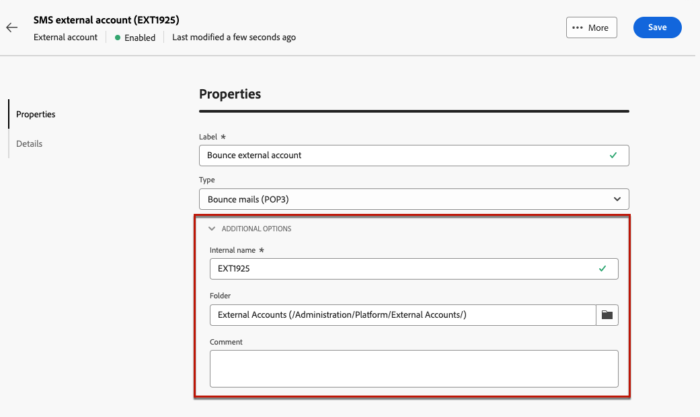

# 외부 계정 구성 {#external-accounts}

>[!CONTEXTUALHELP]
>id="acw_homepage_welcome_rn2"
>title="외부 계정"
>abstract="이제 워크플로우에 맞게 추가 플랫폼에 연결하거나 연결을 사용자 정의하고, 특정 요구 사항을 충족하고 원활한 데이터 전송을 위해 새 외부 계정을 쉽게 만들 수 있습니다."
>additional-url="https://experienceleague.adobe.com/docs/campaign-web/v8/release-notes/release-notes.html?lang=ko" text="릴리스 정보 참조"

>[!AVAILABILITY]
>
> 외부 계정은 현재 바운스 메일(POP3) 및 실행 인스턴스에만 사용할 수 있으며, 향후 추가 계정 유형이 추가됩니다.
> Adobe Campaign 콘솔에서 만든 지원되지 않는 외부 계정은 웹 사용자 인터페이스에 표시되지만 편집하거나 액세스할 수 없습니다.

Adobe Campaign에는 다양한 시스템과 쉽게 통합할 수 있도록 사전 구성된 외부 계정 세트가 포함되어 있습니다. 추가 플랫폼에 연결하거나 워크플로에 맞게 연결을 사용자 정의해야 하는 경우, 이제 웹 사용자 인터페이스를 사용하여 새로운 외부 계정을 쉽게 만들어 특정 요구 사항을 충족하고 데이터를 원활하게 전송할 수 있습니다.

## 외부 계정 만들기 {#create-ext-account}

새 외부 계정을 만들려면 아래 단계를 수행하십시오. 자세한 설정은 외부 계정 유형에 따라 다릅니다.

1. 왼쪽 창 메뉴에서 **[!UICONTROL 관리]**&#x200B;의 **[!UICONTROL 외부 계정]**&#x200B;을(를) 선택합니다.

1. **[!UICONTROL 외부 계정 만들기]**&#x200B;를 클릭합니다.

   

1. **[!UICONTROL 레이블]**&#x200B;을 입력하고 외부 계정 **[!UICONTROL 유형]**&#x200B;을 선택하세요.

   

1. **[!UICONTROL 만들기]**&#x200B;를 클릭합니다.

1. 필요한 경우 **[!UICONTROL 고급 옵션]** 드롭다운에서 **[!UICONTROL 내부 이름]** 또는 **[!UICONTROL 폴더]** 경로를 변경할 수 있습니다.

   

1. 이 외부 계정으로 관리되는 데이터를 자동으로 내보내려면 **[!UICONTROL 자동으로 내보냄]**&#x200B;을 사용하도록 설정하십시오.

1. 선택한 외부 계정 유형에 따라 자격 증명을 지정하여 계정에 대한 액세스를 구성합니다.

1. 구성이 올바른지 확인하려면 **[!UICONTROL 연결 테스트]**&#x200B;를 클릭하십시오.

1. **[!UICONTROL 자세히..]** 메뉴에서 외부 계정을 복제하거나 삭제하십시오.

   

1. 구성이 완료되면 **[!UICONTROL 저장]**&#x200B;을 클릭합니다.

## 캠페인별 외부 계정 {#campaign-specific}

### 바운스 메일 (POP3) {#bounce}

>[!AVAILABILITY]
>
> OAuth 2.0은 현재 지원되지 않습니다.

바운스 메일 외부 계정은 이메일 서비스 연결에 사용되는 외부 POP3 계정을 지정합니다. POP3 액세스용으로 구성된 모든 서버는 반송 메일을 받을 수 있습니다.

**[!UICONTROL 바운스 메일(POP3)]** 외부 계정을 구성하려면:

* **[!UICONTROL 서버]**

  POP3 서버의 URL

* **[!UICONTROL 포트]**

  POP3 연결 포트 번호(기본 포트: 110)

* **[!UICONTROL 계정]**

  사용자 이름

* **[!UICONTROL 암호]**

  사용자 계정 암호

* **[!UICONTROL 암호화]**

  다음 사이에 선택한 암호화 유형:

   * 기본(포트 110인 경우 POP3, 포트 995인 경우 POP3S)
   * STARTTLS 전송 후 SSL로 전환하는 POP3
   * POP3 비보안(기본적으로 포트 110)
   * SSL 이상의 POP3 보안(기본적으로 포트 995)

* **[!UICONTROL 함수]**

  외부 계정이 SOAP 요청을 처리하도록 수신 이메일 또는 SOAP 라우터를 구성한 경우 인바운드 이메일입니다.

### 실행 인스턴스{#instance-exec}

세그먼트화된 아키텍처가 있는 경우 제어 인스턴스와 연관된 실행 인스턴스를 식별하고 이들 인스턴스 간에 연결을 설정해야 합니다. 트랜잭션 메시지 템플릿은 실행 인스턴스에 배포됩니다.

**[!UICONTROL 실행 인스턴스]** 외부 계정을 구성하려면:

* **[!UICONTROL URL]**

  실행 인스턴스가 설치된 서버의 URL.

* **[!UICONTROL 계정]**

  계정 이름입니다. 연산자 폴더에 정의된 메시지 센터 에이전트와 일치해야 합니다.

* **[!UICONTROL 암호]**

  연산자 폴더에 정의된 계정의 암호입니다.

* **[!UICONTROL 방법]**

  웹 서비스와 FDA(Federated Data Access) 중에서 선택합니다.
FDA 방법의 경우 FDA 계정을 선택합니다. 외부 시스템에 대한 Campaign 연결은 고급 사용자로 제한되며 클라이언트 콘솔에서만 사용할 수 있습니다. [자세히 알아보기](https://experienceleague.adobe.com/en/docs/campaign/campaign-v8/connect/fda#_blank)

* **[!UICONTROL 보관 워크플로 만들기]**

  메시지 센터에 등록된 각 실행 인스턴스에 대해 인스턴스가 하나 또는 여러 개 있는지에 관계없이 실행 인스턴스와 연결된 각 외부 계정에 대해 별도의 보관 워크플로우를 만들어야 합니다.
