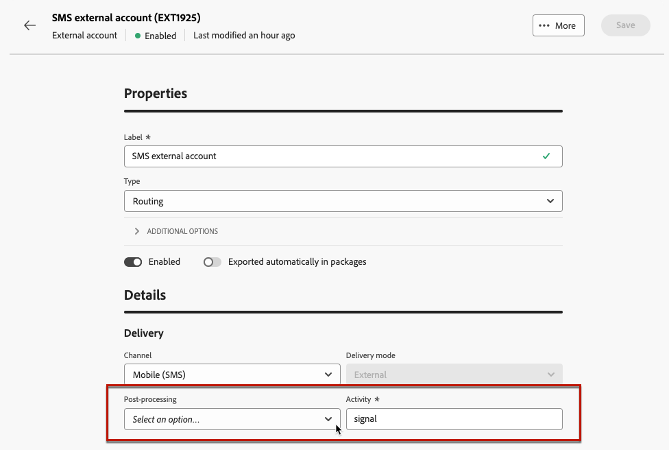

# 외부 계정 관리 {#external-accounts}

>[!AVAILABILITY]
>
>* 현재 외부 계정은 바운스 메일(POP3), 라우팅 및 실행 인스턴스에만 사용할 수 있습니다. 차후에 계정 유형이 추가됩니다.
>
>* Adobe Campaign 콘솔에서 만든 지원되지 않는 외부 계정은 웹 사용자 인터페이스에 표시되지만 편집하거나 액세스할 수 없습니다.

Adobe Campaign에는 다양한 시스템과 쉽게 통합할 수 있도록 사전 구성된 외부 계정 세트가 포함되어 있습니다. 추가 플랫폼에 연결하거나 워크플로에 맞게 연결을 사용자 정의해야 하는 경우, 이제 웹 사용자 인터페이스를 사용하여 새로운 외부 계정을 쉽게 만들어 특정 요구 사항을 충족하고 데이터를 원활하게 전송할 수 있습니다.

## 외부 계정 만들기 {#create-ext-account}

새 외부 계정을 만들려면 아래 단계를 수행하십시오. 자세한 설정은 외부 계정 유형에 따라 다릅니다. [자세히 알아보기](#campaign-specific)

1. 왼쪽 창 메뉴에서 **[!UICONTROL 관리]**&#x200B;의 **[!UICONTROL 외부 계정]**&#x200B;을(를) 선택합니다.

1. **[!UICONTROL 외부 계정 만들기]**&#x200B;를 클릭합니다.

   

1. **[!UICONTROL 레이블]**&#x200B;을(를) 입력하고 외부 계정 **[!UICONTROL 유형]**&#x200B;을(를) 선택하십시오.

   >[!NOTE]
   >
   >Campaign 특정 유형에 대한 설정은 [이 섹션](#campaign-specific)에 자세히 설명되어 있습니다.

   

1. **[!UICONTROL 만들기]**&#x200B;를 클릭합니다.

1. 필요한 경우 **[!UICONTROL 추가 옵션]** 드롭다운에서 **[!UICONTROL 내부 이름]** 또는 **[!UICONTROL 폴더]** 경로를 변경할 수 있습니다.

   

1. 이 외부 계정에서 관리하는 데이터를 자동으로 내보내려면 **[!UICONTROL 패키지에서 자동으로 내보냄]** 옵션을 사용하도록 설정하십시오. <!--Exported where??-->

   

1. **[!UICONTROL 세부 정보]** 섹션에서 선택한 외부 계정 유형에 따라 자격 증명을 지정하여 계정에 대한 액세스를 구성합니다. [자세히 알아보기](#bounce)

1. 구성이 올바른지 확인하려면 **[!UICONTROL 연결 테스트]**&#x200B;를 클릭하십시오.

1. **[!UICONTROL 자세히..]** 메뉴에서 외부 계정을 복제하거나 삭제할 수 있습니다.

   

1. 구성이 완료되면 **[!UICONTROL 저장]**&#x200B;을 클릭합니다.

## 캠페인별 외부 계정 {#campaign-specific}

선택한 외부 계정 유형에 따라 아래 단계에 따라 계정 설정을 구성합니다.

### 바운스 메일 (POP3) {#bounce}

>[!AVAILABILITY]
>
> OAuth 2.0은 현재 지원되지 않습니다.

바운스 메일 외부 계정은 이메일 서비스 연결에 사용되는 외부 POP3 계정을 지정합니다. POP3 액세스용으로 구성된 모든 서버는 반송 메일을 받을 수 있습니다.

**[!UICONTROL 바운스 메일(POP3)]** 외부 계정을 구성하려면 다음 필드를 입력하십시오.

* **[!UICONTROL 서버]** - POP3 서버의 URL

* **[!UICONTROL 포트]** - POP3 연결 포트 번호(기본 포트: 110)

* **[!UICONTROL 계정]** - 사용자 이름

* **[!UICONTROL 암호]** - 사용자 계정 암호

* **[!UICONTROL 암호화]** - 다음 중에서 선택한 암호화 유형:

   * 기본(포트 110인 경우 POP3, 포트 995인 경우 POP3S)
   * STARTTLS 전송 후 SSL로 전환하는 POP3
   * POP3 비보안(기본적으로 포트 110)
   * SSL 이상의 POP3 보안(기본적으로 포트 995)

* **[!UICONTROL 함수]** - 외부 계정이 SOAP 요청을 처리하기 위해 들어오는 전자 메일 또는 SOAP 라우터를 수신하도록 구성된 경우 인바운드 전자 메일입니다.

### 라우팅 {#routing}

외부 게재에서 사용할 특정 외부 계정을 구성하려면 아래 단계를 따르십시오.

1. 외부 계정을 만듭니다. [자세히 알아보기](../administration/external-account.md#create-ext-account)

1. **[!UICONTROL 라우팅]** 유형을 선택하십시오.

   {zoomable="yes"}

1. 원하는 채널을 선택하고 **[!UICONTROL 만들기]**&#x200B;를 클릭합니다.

1. 외부 계정 **[!UICONTROL 세부 정보]** 섹션에서 **[!UICONTROL 외부]**&#x200B;이(가) 기본적으로 **[!UICONTROL 배달 모드]**(으)로 선택됩니다.

   {zoomable="yes"}

   >[!NOTE]
   >
   >현재 **[!UICONTROL 외부]**&#x200B;만 사용할 수 있습니다.

1. 게재 실행 후 프로세스를 처리하기 위해 이를 사후 처리 워크플로우에 외부화할 수 있습니다. 이렇게 하려면 [외부 신호](../workflows/activities/external-signal.md) 활동이 있는 워크플로우를 만들고 **[!UICONTROL 사후 처리]** 필드에서 선택해야 합니다.

   {zoomable="yes"}

1. **[!UICONTROL 활동]** 필드에서 로그에 표시될 사후 처리 워크플로 활동의 이름을 편집할 수 있습니다. <!--you can edit the name of the activity that will be created if you add an external or bulk delivery to a workflow-->

### 실행 인스턴스 {#instance-exec}

세그먼트화된 아키텍처가 있는 경우 제어 인스턴스와 연관된 실행 인스턴스를 식별하고 이들 인스턴스 간에 연결을 설정해야 합니다. 트랜잭션 메시지 템플릿은 실행 인스턴스에 배포됩니다.

**[!UICONTROL 실행 인스턴스]** 외부 계정을 구성하려면:

* **[!UICONTROL URL]**

  실행 인스턴스가 설치된 서버의 URL.

* **[!UICONTROL 계정]**

  계정 이름입니다. 연산자 폴더에 정의된 메시지 센터 에이전트와 일치해야 합니다.

* **[!UICONTROL 암호]**

  연산자 폴더에 정의된 계정의 암호입니다.

* **[!UICONTROL 방법]**

  웹 서비스와 FDA(Federated Data Access) 중에서 선택합니다.
FDA 방법의 경우 FDA 계정을 선택합니다. 외부 시스템에 대한 Campaign 연결은 고급 사용자로 제한되며 클라이언트 콘솔에서만 사용할 수 있습니다. [자세히 알아보기](https://experienceleague.adobe.com/en/docs/campaign/campaign-v8/connect/fda#_blank)

* **[!UICONTROL 보관 워크플로 만들기]**

  메시지 센터에 등록된 각 실행 인스턴스에 대해 인스턴스가 하나 또는 여러 개 있는지에 관계없이 실행 인스턴스와 연결된 각 외부 계정에 대해 별도의 보관 워크플로우를 만들어야 합니다.
