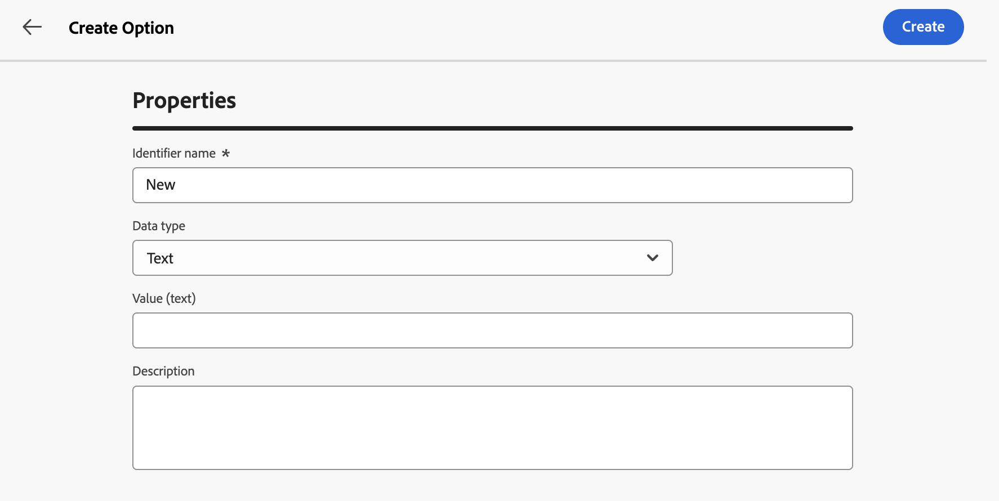

# [!DNL Campaign] 옵션 구성 {#options}

>[!CONTEXTUALHELP]
>id="acw_options_list"
>title="옵션"
>abstract="옵션"

>[!CONTEXTUALHELP]
>id="acw_options_create"
>title="옵션 만들기"
>abstract="옵션 만들기"

Adobe Campaign 웹에는 애플리케이션을 보다 구체적으로 구성할 수 있는 기술 옵션이 제공됩니다. 이러한 옵션 중 일부는 내장되어 있으며, 다른 옵션은 필요에 따라 수동으로 추가할 수 있습니다.

>[!IMPORTANT]
>
>기본 제공 옵션은 사전 구성되어 있으며 고급 사용자만 수정해야 합니다. 질문이 있거나 요청이 있는 경우 Adobe 담당자에게 문의하십시오.

## Campaign 옵션 액세스 {#access}

옵션은 **[!UICONTROL 관리]** / **[!UICONTROL 옵션]** 메뉴에서 사용할 수 있습니다. 필터 창을 사용하여 목록의 범위를 좁히고 필요한 옵션을 빠르게 찾습니다.

>[!NOTE]
>
>Adobe Campaign 콘솔과 웹 사용자 인터페이스 간에 옵션 메뉴 위치가 다르지만 목록은 동일하며 거울처럼 작동합니다. 사용 가능한 옵션에 대한 자세한 내용은 [Campaign v7 설명서](https://experienceleague.adobe.com/en/docs/campaign-classic/using/installing-campaign-classic/appendices/configuring-campaign-options){target="_blank"}의 옵션 목록을 참조하십시오

옵션 목록에서 다음을 수행할 수 있습니다.

* **옵션 복제 또는 삭제**: 줄임표 단추를 클릭하고 원하는 작업을 선택합니다.
* **옵션 수정**: 옵션 이름을 클릭하여 해당 속성을 엽니다. 변경 작업을 수행한 다음 저장합니다.
* **사용자 지정 옵션 만들기**: **[!UICONTROL 옵션 만들기]** 단추를 클릭합니다.

## 옵션 만들기 {#create}

Adobe Campaign 웹 사용자 인터페이스를 사용하면 필요에 따라 사용자 정의 옵션을 만들 수 있습니다. 이 기능은 **[!UICONTROL JavaScript 코드]** 워크플로우 활동을 사용하여 중간 데이터를 저장할 때 특히 유용합니다.

옵션을 만들려면 다음 작업을 수행하십시오.

1. 옵션 목록에 액세스하고 **[!UICONTROL 옵션 만들기]**&#x200B;를 클릭합니다.
1. 옵션 이름을 입력하고 해당 유형을 선택한 다음 원하는 값을 설정합니다.
1. 옵션을 만들려면 **[!UICONTROL 만들기]**&#x200B;를 클릭하십시오.

   

옵션은 데이터를 위한 임시 저장 공간으로 사용할 수 있으므로 다음과 같은 이점이 있습니다.

* 입력된 값: 옵션은 날짜, 정수, 문자열 등과 같은 특정 데이터 형식을 지원합니다.
* 유연성: 옵션을 사용하면 데이터베이스 테이블을 관리하는 오버헤드 없이 데이터를 효율적으로 저장하고 검색할 수 있습니다.

아래 예제에서는 초기 값이 &quot;a&quot;인 사용자 지정 옵션 `sampleOption`을(를) 만듭니다. 워크플로우의 **[!UICONTROL JavaScript 코드]** 활동은 이 옵션의 값을 수정하고 변수에 저장합니다. 업데이트된 값이 워크플로우 로그에 표시되고 **[!UICONTROL 옵션]** 메뉴에 반영됩니다.

1. 옵션을 만듭니다.

   

1. **[!UICONTROL JavaScript 코드]** 활동을 구성하고 워크플로우를 시작합니다.

   

1. 워크플로우를 실행하여 워크플로우 로그에서 업데이트된 값을 확인합니다.

   

1. 업데이트된 값이 이제 **[!UICONTROL 옵션]** 메뉴에 표시됩니다.

   
