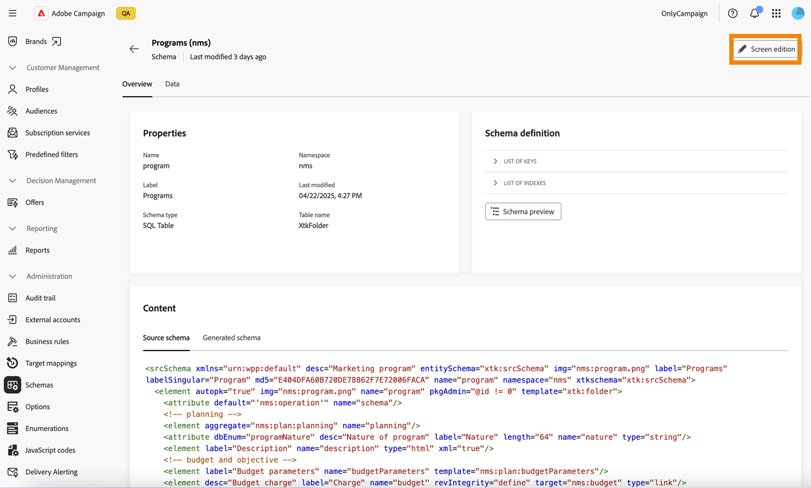

# 플랜 및 프로그램 {#plan-and-programs}

Adobe Campaign을 사용하면 마케팅 플랜 및 프로그램에 대한 폴더 계층 구조를 구성할 수 있습니다.

Adobe 이러한 구성 요소를 보다 효율적으로 구성하려면 다음 계층을 사용하는 것이 좋습니다. 계획 `>` 프로그램 `>` 캠페인.

* **계획**&#x200B;에는 여러 프로그램이 포함될 수 있습니다. 특정 기간에 대한 전략적 목표를 정의합니다.
* **프로그램**&#x200B;에는 캠페인, 워크플로우 및 랜딩 페이지뿐만 아니라 다른 프로그램도 포함될 수 있습니다.
* **campaign**&#x200B;에는 게재, 워크플로우 및 랜딩 페이지가 포함될 수 있습니다.

## 플랜 만들기 및 구성 {#create-plan}

플랜을 만들려면 폴더 유형이 **[!UICONTROL 플랜]**&#x200B;인 폴더를 만드십시오. [폴더 만들기에 대해 자세히 알아보기](../get-started/work-with-folders.md)

{zoomable="yes"}

플랜의 **[!UICONTROL 폴더 설정]**(으)로 이동하여 관리하십시오.

플랜에 대한 폴더 설정을 보여 주는 {zoomable="yes"}

**[!UICONTROL 사용자 지정 옵션]**&#x200B;을(를) 정의하고 계획 예약 날짜를 설정합니다.

플랜에 대한 사용자 지정 옵션을 보여 주는 {zoomable="yes"}

**[!UICONTROL 사용자 지정 옵션]**&#x200B;을 관리하려면:

1. **[!UICONTROL 스키마]**&#x200B;로 이동합니다.
1. 필터에서 **[!UICONTROL 편집 가능]** 스키마를 선택하십시오.
1. 스키마를 클릭합니다.

플랜에 대한 사용자 지정 세부 정보를 편집하는 {zoomable="yes"}

1. **[!UICONTROL 화면 편집]** 단추를 클릭합니다.

   {zoomable="yes"}

사용자 지정 옵션을 구성합니다.

플랜에 대한 사용자 지정 필드 구성을 보여 주는 {zoomable="yes"}

## 프로그램 만들기 및 구성

플랜에 프로그램을 만들려면([플랜 만들기에 대해 자세히 알아보기](#create-plan)) 플랜으로 이동하여 폴더 유형이 **[!UICONTROL 프로그램]**&#x200B;인 폴더를 만드십시오. [폴더 만들기에 대한 자세한 정보](../get-started/work-with-folders.md).

{zoomable="yes"}

관리하려면 프로그램의 **[!UICONTROL 폴더 설정]**(으)로 이동하십시오.

{zoomable="yes"}

**[!UICONTROL 사용자 지정 옵션]**&#x200B;을(를) 정의하고 프로그램의 예약 날짜를 설정하십시오.

{zoomable="yes"}

**[!UICONTROL 사용자 지정 옵션]**&#x200B;을 관리하려면:

1. **[!UICONTROL 스키마]**&#x200B;로 이동합니다.
1. 필터에서 **[!UICONTROL 편집 가능]** 스키마를 선택하십시오.
1. 스키마를 클릭합니다.

{zoomable="yes"}

1. **[!UICONTROL 화면 편집]** 단추를 클릭합니다.

   {zoomable="yes"}

사용자 지정 옵션을 구성합니다.

{zoomable="yes"}

## 캠페인을 프로그램에 연결하는 방법

두 가지 방법으로 캠페인을 프로그램에 연결할 수 있습니다.

### 방법 #1: 이미 프로그램을 가지고 있으며 연결된 캠페인을 만들려고 합니다.

새 캠페인을 프로그램에 연결하려면 프로그램 내에서 직접 캠페인을 만드십시오.

{zoomable="yes"}

**[!UICONTROL 폴더]** 설정은 프로그램의 경로로 자동으로 채워집니다.

{zoomable="yes"}

### 방법 #2: 이미 기존 캠페인이 있으며 이를 기존 프로그램에 연결하려고 합니다.

프로그램에 연결할 캠페인의 **[!UICONTROL 설정]** 단추로 이동합니다.

{zoomable="yes"}

**[!UICONTROL 속성]**&#x200B;에서 **[!UICONTROL 폴더]** 설정의 **[!UICONTROL 폴더]** 아이콘을 클릭하여 **[!UICONTROL 프로그램]** 폴더를 선택하세요.

{zoomable="yes"}

**[!UICONTROL 프로그램]** 폴더를 선택하고 **[!UICONTROL 확인]** 단추를 클릭한 다음 **[!UICONTROL 저장 및 닫기]** 단추를 클릭합니다.

{zoomable="yes"}

이제 캠페인이 프로그램에 나열됩니다.

{zoomable="yes"}