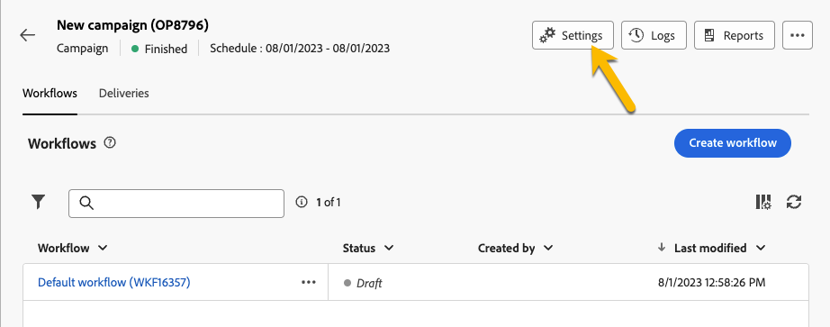

# 계획 및 프로그램 {#plan-and-programs}

>[!CONTEXTUALHELP]
>id="acw_homepage_welcome_rn2"
>title="계획 및 프로그램"
>abstract="이제 Campaign 웹 사용자 인터페이스에서 마케팅 계획 및 프로그램에 대한 폴더 계층 구조를 구성할 수 있습니다."
>additional-url="https://experienceleague.adobe.com/docs/campaign-web/v8/release-notes/release-notes.html?lang=ko-KR" text="릴리스 정보 참조"

Adobe Campaign을 사용하면 마케팅 계획 및 프로그램에 대한 폴더 계층 구조를 구성할 수 있습니다.

Adobe 이를 보다 효율적으로 구성하려면 다음 계층을 사용하는 것이 좋습니다. 계획 `>` 프로그램 `>` 캠페인

* A **플랜** 은 여러 프로그램을 포함할 수 있습니다. 일정 기간 동안의 전략적 목표를 정의합니다.
* A **프로그램** 는 캠페인, 워크플로우 및 랜딩 페이지뿐만 아니라 다른 프로그램을 포함할 수 있습니다.
* A **campaign** 게재, 워크플로우 및 랜딩 페이지를 포함할 수 있습니다.

## 플랜 만들기 및 구성 {#create-plan}

계획을 생성하려면 폴더 유형으로 폴더를 생성해야 합니다 **[!UICONTROL 플랜]** [폴더 만들기에 대해 자세히 알아보기](create-manage-folder.md).

{zoomable="yes"}

로 이동 **[!UICONTROL 폴더 설정]** 관리 계획에 따라.

{zoomable="yes"}

다음을 정의할 수 있습니다. **[!UICONTROL 사용자 지정 옵션]**&#x200B;을 눌러 플랜의 예약 날짜를 설정합니다.

{zoomable="yes"}

을 관리하려면  **[!UICONTROL 사용자 지정 옵션]**:

1. 다음으로 이동 **[!UICONTROL 스키마]**
1. 다음을 선택합니다. **[!UICONTROL 편집 가능]** 필터의 스키마
1. 아이콘 클릭 **[!UICONTROL 사용자 정의 세부 정보 편집]**

{zoomable="yes"}

다음을 구성할 수 있습니다.

{zoomable="yes"}

## 프로그램 만들기 및 구성

플랜에 프로그램을 만들려면([플랜 만들기에 대해 자세히 알아보기](#create-plan))을 설정하는 경우 플랜에 있어야 하며 폴더 유형으로 폴더를 만들어야 합니다 **[!UICONTROL 프로그램]** [폴더 만들기에 대해 자세히 알아보기](create-manage-folder.md).

{zoomable="yes"}

로 이동 **[!UICONTROL 폴더 설정]** 관리할 프로그램의 일부입니다.

{zoomable="yes"}

다음을 정의할 수 있습니다. **[!UICONTROL 사용자 지정 옵션]**&#x200B;을 눌러 프로그램의 예약 날짜를 설정합니다.

{zoomable="yes"}

을 관리하려면  **[!UICONTROL 사용자 지정 옵션]**:

1. 다음으로 이동 **[!UICONTROL 스키마]**
1. 다음을 선택합니다. **[!UICONTROL 편집 가능]** 필터의 스키마
1. 아이콘 클릭 **[!UICONTROL 사용자 정의 세부 정보 편집]**

{zoomable="yes"}

이를 구성할 수 있습니다.

{zoomable="yes"}

## 캠페인을 프로그램에 연결하는 방법

두 가지 방법으로 캠페인을 프로그램에 연결할 수 있습니다.

### 방법 #1 : 이미 프로그램이 있고 여기에 연결된 캠페인을 만들려고 합니다

새 캠페인을 프로그램에 연결하려면 프로그램에서 직접 캠페인을 만듭니다.

{zoomable="yes"}

다음 **[!UICONTROL 폴더]** 설정은 프로그램에 대한 경로로 자동으로 정리됩니다.

{zoomable="yes"}

### 방법 #2 : 이미 기존 캠페인이 있으며 이를 기존 프로그램에 연결하려고 합니다

로 이동 **[!UICONTROL 설정]** 프로그램에 연결할 캠페인의 단추:

{zoomable="yes"}

의 **[!UICONTROL 속성]**&#x200B;를 클릭하고 **[!UICONTROL 폴더]** 아이콘 **[!UICONTROL 폴더]** 설정, 을 선택합니다. **[!UICONTROL 프로그램]** 폴더를 삭제합니다.

{zoomable="yes"}

다음 항목 선택 **[!UICONTROL 프로그램]** 폴더 및 클릭 **[!UICONTROL 확인]** 단추 및 **[!UICONTROL 저장 및 닫기]** 단추를 클릭합니다.

{zoomable="yes"}

이제 캠페인이 프로그램에 나열됩니다.

{zoomable="yes"}
