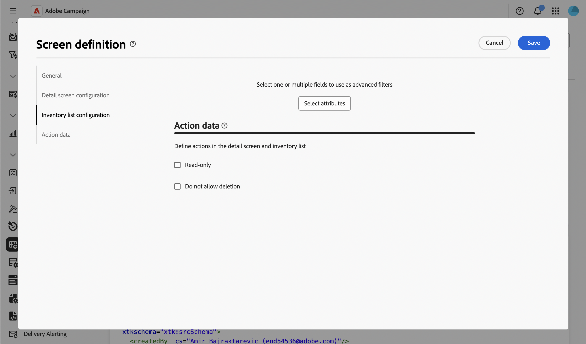

# 데이터에 대한 작업 제어 {#action-data}

>[!CONTEXTUALHELP]
>id="acw_schema_action_data"
>title="작업 데이터"
>abstract="스키마의 세부 정보 및 목록 화면에 대해 사용할 수 있는 작업을 구성합니다. 세부 정보 화면을 읽기 전용으로 설정하고 목록에서 작업을 제거하려면 **[!UICONTROL 읽기 전용]**&#x200B;을 활성화합니다. 세부 정보 및 목록 화면에서 삭제 작업을 제거하려면 **[!UICONTROL 삭제 허용 안 함]**&#x200B;을 활성화합니다."

**[!UICONTROL 작업 데이터]** 섹션을 사용하면 개별 폴더에 구성된 [보안 규칙](../get-started/work-with-folders.md)에 관계없이 사용자 지정 스키마 레코드에 사용할 수 있는 작업을 제한할 수 있습니다. 이 제한 사항은 관리자를 포함하여 모든 사용자에 대해 스키마 수준, 모든 폴더에 적용됩니다.

>[!NOTE]
>
>이 섹션은 사용자 지정 스키마에만 사용할 수 있습니다.

화면 정의 화면 및 액세스 방법에 대한 자세한 내용은 [화면 정의 액세스](schemas-browse-access.md#screen-def) 섹션을 참조하십시오.

작업 데이터를 구성하려면 아래 단계를 수행합니다.

1. **[!UICONTROL 스키마]** 메뉴로 이동한 다음 필터를 사용하여 편집 가능한 스키마를 찾습니다.

1. 목록에서 스키마 이름을 선택하여 열고 스키마 세부 정보 보기에서 **[!UICONTROL 화면 편집]** 단추를 클릭하여 화면 정의에 액세스합니다.

1. 화면 정의의 아래쪽에 있는 **[!UICONTROL 작업 데이터]** 섹션까지 아래로 스크롤합니다.

   

1. 사용 가능한 옵션 중 하나 또는 모두를 선택합니다.

   * **[!UICONTROL 읽기 전용]**: 세부 정보 화면은 모든 사용자에 대해 읽기 전용으로 설정됩니다. 목록에서 만들기, 복제, 업데이트 또는 삭제 작업을 사용할 수 없으며 삭제 및 복제 작업이 세부 정보 화면에서 숨겨집니다. 이 옵션을 선택하는 방법은 보기 구성과 유사합니다. 예를 들어 게재를 타깃팅할 때 사용자는 여전히 레코드를 열고 재사용할 수 있지만 수정할 수는 없습니다.

   * **[!UICONTROL 삭제 허용 안 함]**: 삭제 작업은 모든 폴더의 세부 정보 화면과 목록에서 제거됩니다. 만들기, 복제 및 업데이트와 같은 다른 작업은 계속 사용할 수 있습니다.

     >[!NOTE]
     >
     >**[!UICONTROL 읽기 전용]**&#x200B;을(를) 사용하면 삭제도 자동으로 처리되므로 **[!UICONTROL 읽기 전용]**&#x200B;을(를) 선택하는 동안에는 **[!UICONTROL 삭제 허용 안 함]** 옵션을 사용할 수 없습니다.

1. **[!UICONTROL 저장]**&#x200B;을 클릭합니다.

1. 이 스키마에 대한 레코드 목록으로 이동하여 결과를 확인합니다.

   이 예제에서는 **[!UICONTROL 읽기 전용]**&#x200B;을(를) 사용하도록 설정했습니다. 목록에 더 이상 중복 및 삭제 작업이 표시되지 않습니다.

   

1. 레코드를 열어 세부 정보 화면을 확인합니다. 편집을 허용하지 않고 필드가 표시됩니다.

   
