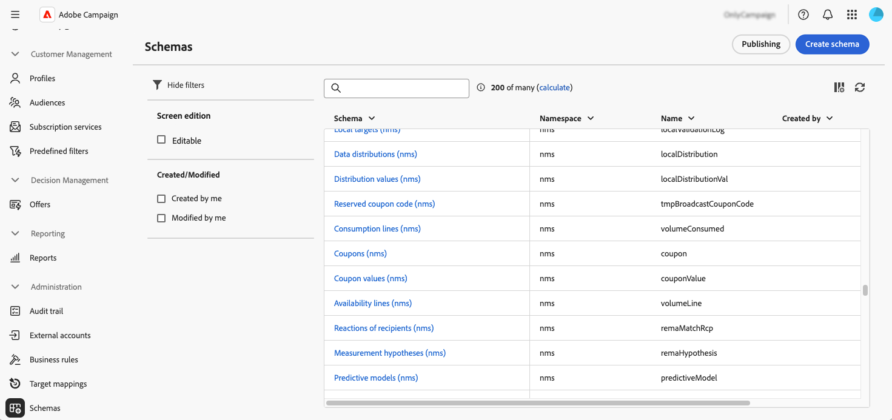
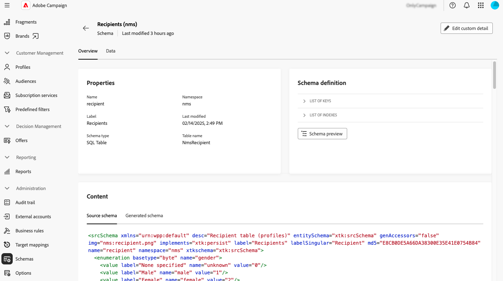
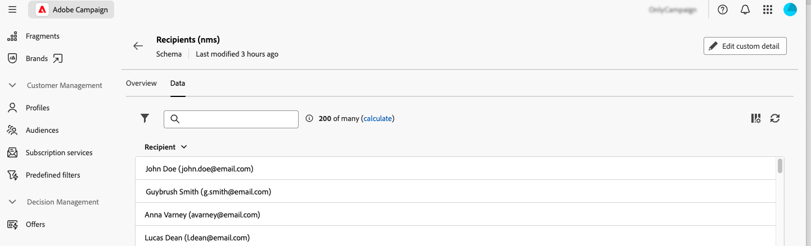
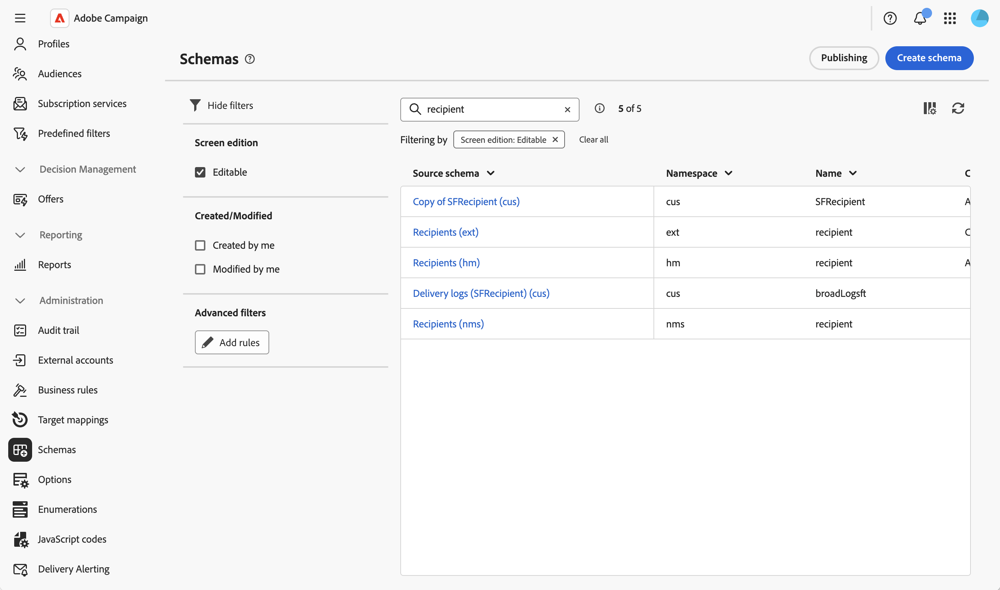
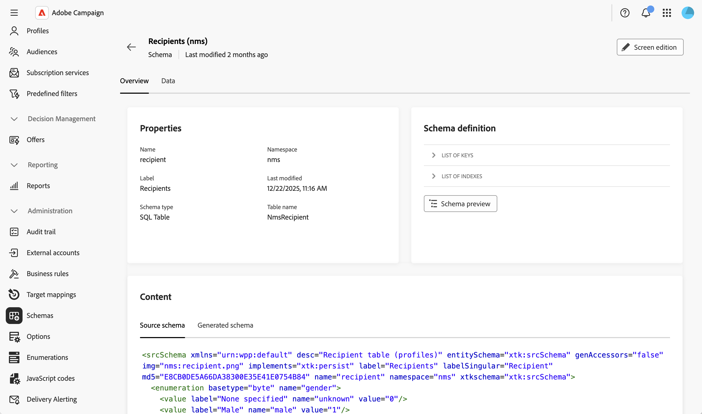
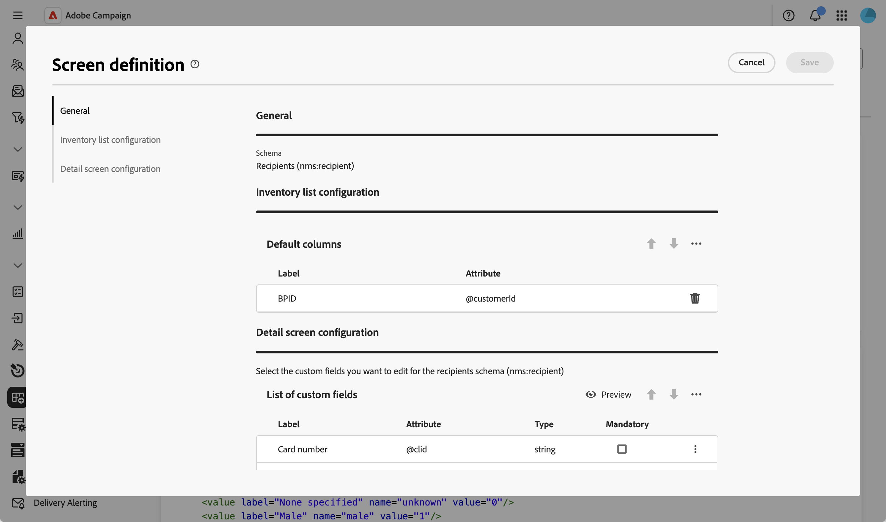

# 스키마 액세스 및 구성 {#access}

**[!UICONTROL 관리]** > **[!UICONTROL 스키마]** 메뉴에서 스키마에 액세스할 수 있습니다.

이 화면에서 기존의 모든 스키마를 볼 수 있습니다. 편집 가능한 스키마만 표시하는 등 목록을 구체화하는 데 도움이 되는 필터를 사용할 수 있습니다.

스키마를 열려면 스키마 이름을 선택합니다. 자세한 스키마 보기가 표시됩니다.

## 스키마 개요 {#overview}

**[!UICONTROL 개요]** 탭에서는 스키마에 대한 일반 보기를 제공합니다.

* **[!UICONTROL 속성]** 섹션에는 스키마 이름, 네임스페이스 및 관련 테이블 이름과 같은 주요 정보가 표시됩니다.

* **[!UICONTROL 스키마 정의]** 섹션에는 데이터 조정에 사용되는 기본 키와 다른 테이블과의 링크를 포함하여 스키마 정의에 대한 세부 정보가 표시됩니다.

  스키마를 구성하는 다양한 필드 및 링크를 보려면 **[!UICONTROL 스키마 미리 보기]** 단추를 클릭하십시오. 이를 통해 스키마의 전체 구조를 확인할 수 있습니다. 스키마가 사용자 지정 필드로 확장된 경우 모든 해당 확장을 시각화할 수 있습니다.

* **[!UICONTROL 콘텐츠]** 섹션에는 스키마의 XML 콘텐츠가 표시되어 소스와 생성된 구문 간에 전환할 수 있습니다.

## 스키마 데이터 {#data}

**[!UICONTROL 데이터]** 탭에서 스키마 데이터에 대한 정보를 제공합니다.

## 화면 표시 사용자 지정 {#screen-def}

화면 정의를 사용하면 인터페이스에서 스키마 필드를 표시하고 편집하는 방법을 구성할 수 있습니다. 목록 보기에 대한 기본 열을 구성하고, 세부 정보 화면에 표시되는 사용자 지정 필드를 사용자 지정하고, 관련 데이터를 표시하기 위해 컬렉션 목록을 추가하고, 구분 기호 및 가시성 기준을 사용하여 필드를 섹션으로 구성할 수 있습니다.

화면 정의에 액세스하려면:

1. **[!UICONTROL 스키마]** 메뉴로 이동한 다음 필터를 사용하여 편집 가능한 스키마를 찾습니다.

   

1. 목록에서 스키마 이름을 선택하여 열고 스키마 세부 정보 보기에서 **[!UICONTROL 화면 편집]** 단추를 클릭하여 화면 정의에 액세스합니다.

   

   다양한 목록을 사용하면 위/아래 화살표 아이콘을 사용하여 요소의 순서를 변경하거나 요소를 드래그 앤 드롭할 수 있습니다. 항목을 제거하려면 특정 행의 휴지통 아이콘을 클릭하거나 줄임표 아이콘에서 **[!UICONTROL 모두 삭제]**&#x200B;를 선택하십시오.

   

화면 정의에서 다음 작업을 수행할 수 있습니다.

* [기본 목록 열 구성](schemas-list-columns.md) - 목록 보기에 기본적으로 표시되는 열을 구성합니다.
* [사용자 정의 필드 편집](schemas-custom-fields.md) - 세부 정보 화면에 표시할 사용자 정의 필드를 구성하고 섹션으로 구성합니다.
* [컬렉션 목록 추가](schemas-collection-lists.md) - 프로필 화면에 관련 데이터를 표시할 컬렉션 목록을 추가합니다.
