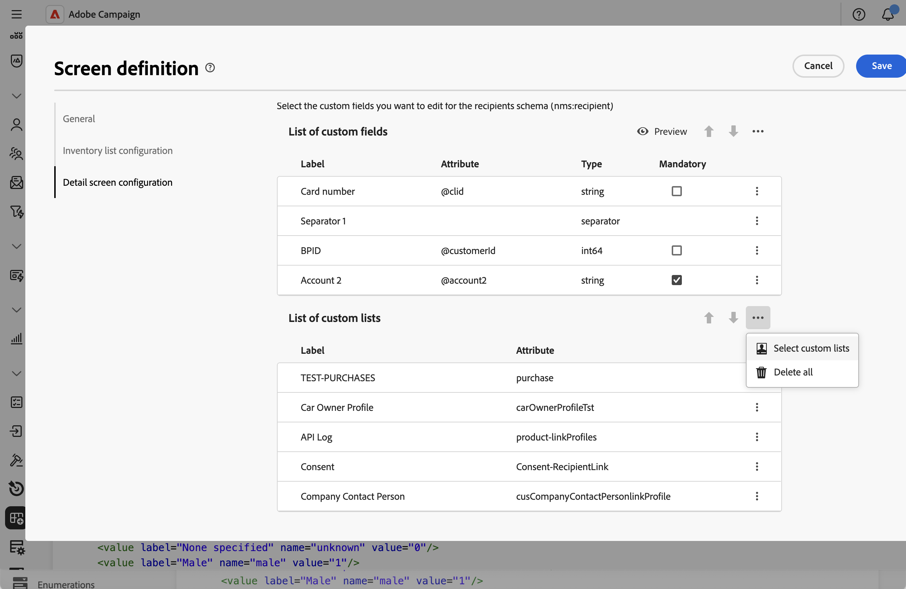
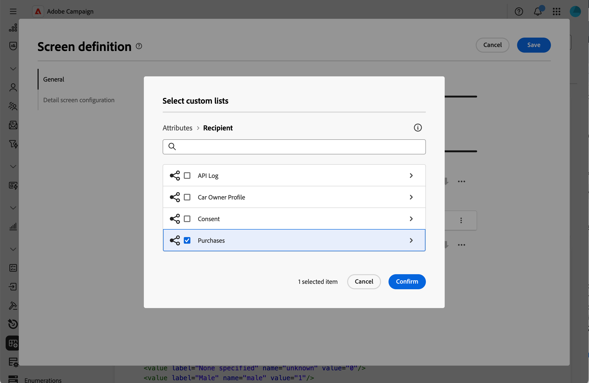
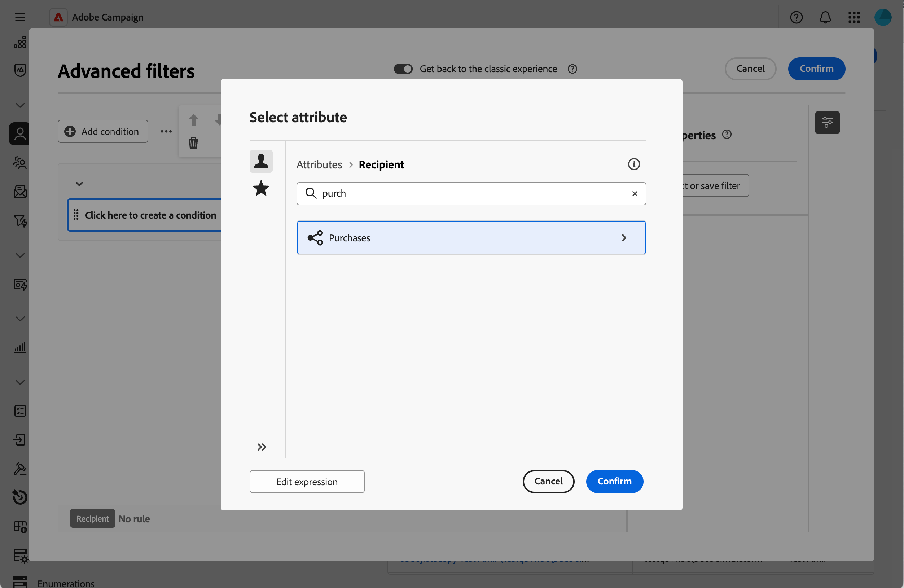
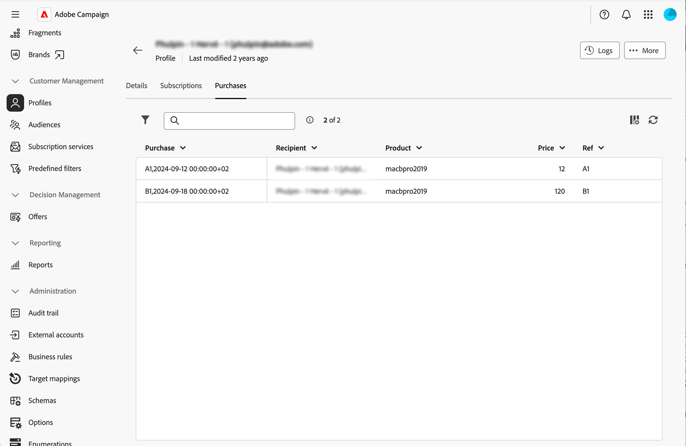

# 컬렉션 목록 추가 {#collection-lists}

**사용자 지정 목록** 섹션에서 구매와 같은 컬렉션 링크를 정의할 수 있습니다. 그런 다음 전용 탭을 통해 관련 데이터가 프로필 화면에 표시됩니다.

화면 정의 화면 및 액세스 방법에 대한 자세한 내용은 [화면 정의 액세스](schemas-browse-access.md#screen-def) 섹션을 참조하십시오.

>[!NOTE]
>
>현재 이 기능은 수신자 스키마에만 사용할 수 있습니다.

컬렉션 목록을 추가하려면 다음 작업을 수행하십시오.

1. **[!UICONTROL 스키마]** 메뉴로 이동한 다음 필터를 사용하여 편집 가능한 스키마를 찾습니다.

1. 목록에서 스키마 이름을 선택하여 열고 스키마 세부 정보 보기에서 **[!UICONTROL 화면 편집]** 단추를 클릭하여 화면 정의에 액세스합니다.

1. 줄임표 아이콘을 클릭하고 **[!UICONTROL 사용자 지정 목록 선택]**&#x200B;을 선택합니다.

   

1. 사용 가능한 사용자 지정 목록(예: 구매) 중 하나를 선택한 다음 **[!UICONTROL 확인]**&#x200B;을 클릭합니다.

   

1. **프로필** 메뉴로 이동하여 구매한 프로필을 필터링합니다.

   

1. 프로필을 클릭합니다. 새 탭이 표시됩니다. 필요한 경우 열을 더 추가할 수 있습니다.

   
