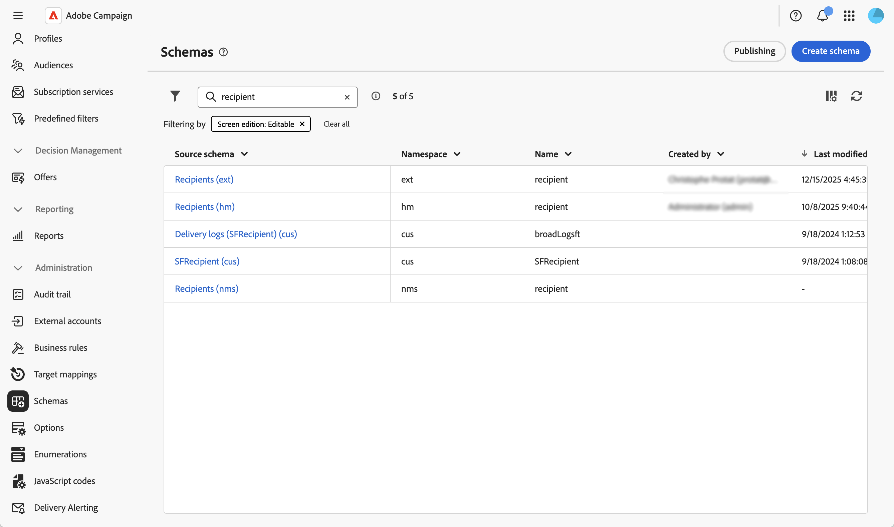
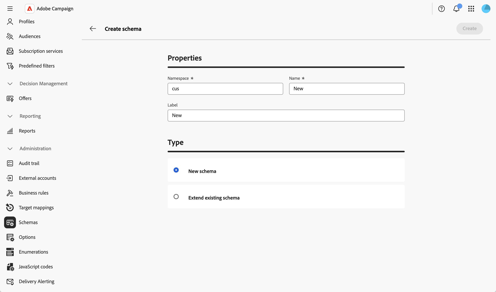
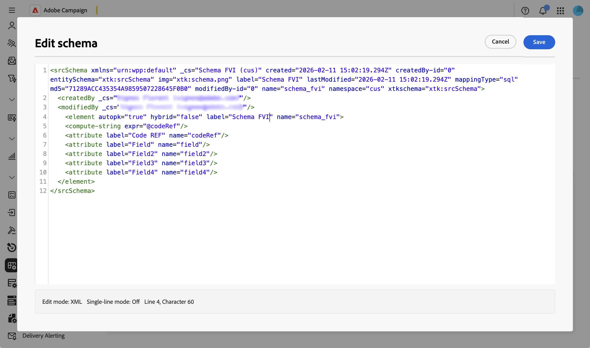
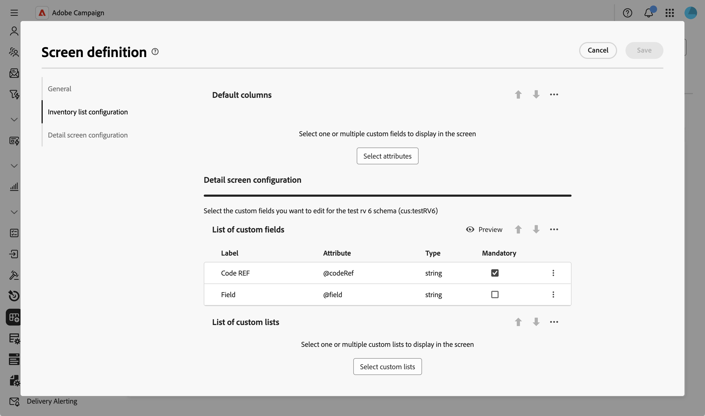
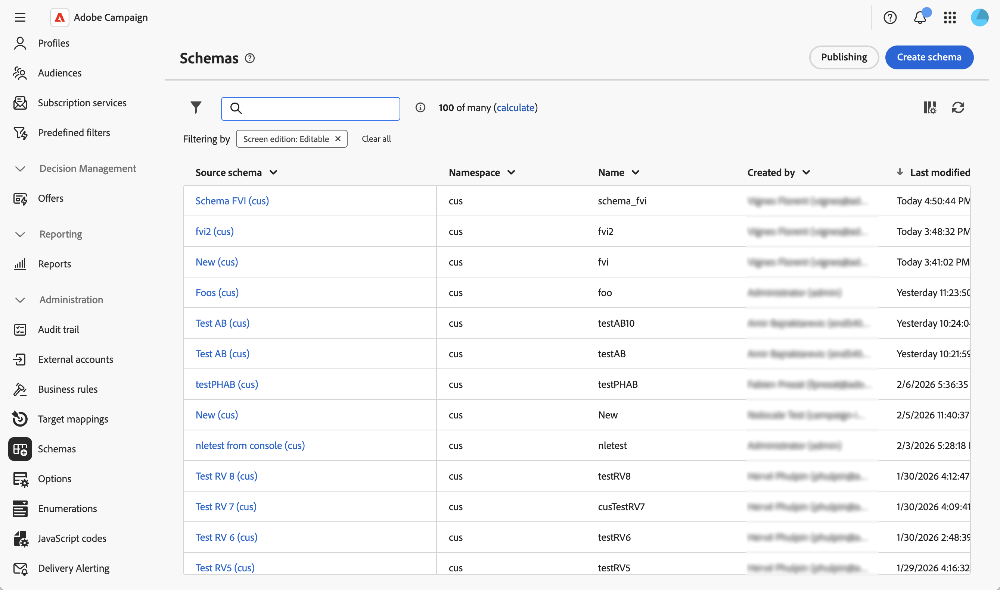
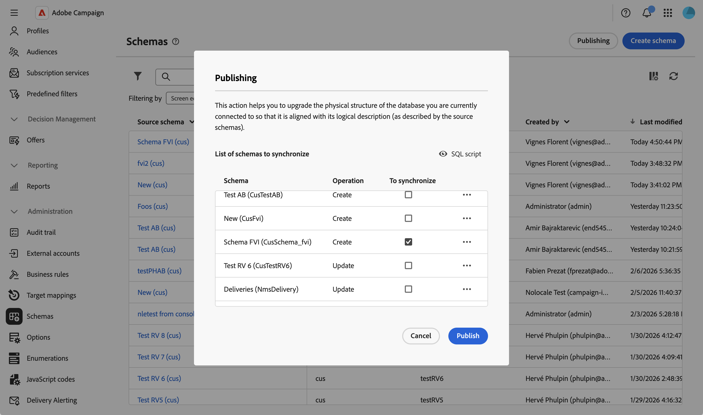
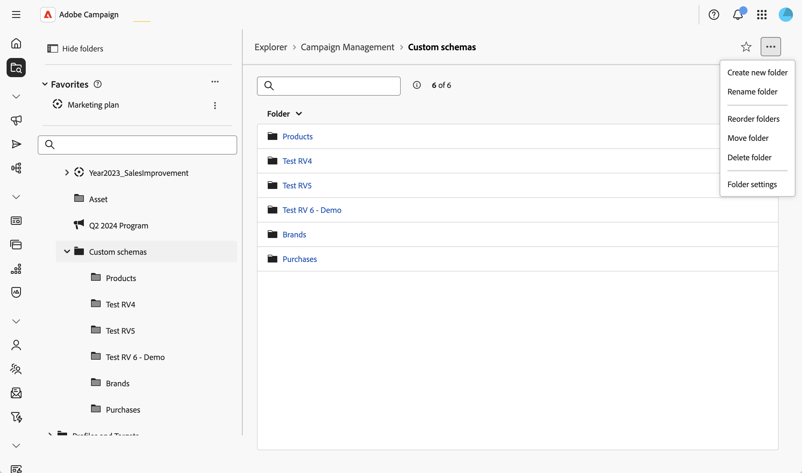
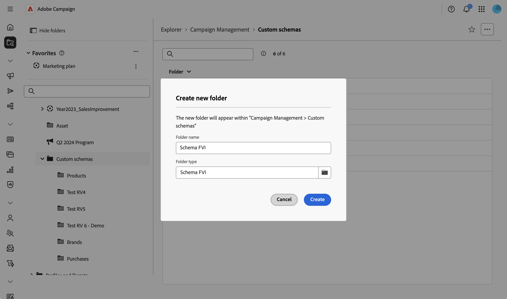

# 스키마 만들기 및 게시 {#create-publish}

## 스키마 만들기 및 관리 {#create-schemas}

새 스키마를 만들고, 기존 스키마를 확장하고, 외부 데이터베이스에 액세스할 수 있습니다.

### 스키마 만들기 또는 확장 {#create-new}

스키마를 만들거나 확장하려면 다음을 수행하십시오.

1. **[!UICONTROL 관리]** > **[!UICONTROL 스키마]**&#x200B;로 이동합니다.
1. **[!UICONTROL 스키마 만들기]**&#x200B;를 클릭합니다.

   

1. 스키마의 네임스페이스를 입력하십시오(예: 사용자 지정 스키마의 경우 `cus`).
1. 고유한 이름과 레이블을 입력하고 새 스키마를 만들거나 기존 스키마를 확장할지 선택합니다.

1. **[!UICONTROL 만들기]**&#x200B;를 클릭합니다.
   

스키마가 생성되고 생성된 스키마 구조가 표시됩니다.

기본적으로 스키마는 비어 있습니다. 이제 스키마 편집기를 사용하여 스키마에 포함할 필드를 추가해야 합니다.

1. 스키마 세부 정보 화면의 **[!UICONTROL 콘텐츠]** 섹션에서 연필 아이콘을 클릭합니다.
2. 필요한 요소를 추가하고 저장합니다. 다음은 사용자 지정 스키마 구조의 예입니다.

   

시스템은 자동으로 XML 구조의 유효성을 검사하고 스키마를 생성합니다.

### 화면 편집 정의 {#define-attributes}

스키마를 생성한 후에는 화면 에디션을 정의해야 합니다.

화면 정의 화면 및 액세스 방법에 대한 자세한 내용은 [화면 정의 액세스](schemas-browse-access.md#screen-def) 섹션을 참조하십시오.

이 예제에서는 두 개의 사용자 정의 필드를 추가하기만 하면 됩니다.

1. 화면 정의에 액세스하려면 스키마 세부 정보 보기에서 **[!UICONTROL 화면 편집]** 단추를 클릭하십시오.

1. **[!UICONTROL 사용자 지정 필드 목록]** 표 위에 있는 줄임표 아이콘을 클릭하고 **[!UICONTROL 특성 선택]**&#x200B;을 선택합니다.
1. 추가하고 확인할 사용자 정의 필드를 선택합니다.

   

## 스키마 게시 및 동기화 {#publish}

스키마를 만들거나 수정한 후에는 스키마를 게시하여 논리적 스키마를 물리적 데이터베이스 구조와 동기화해야 합니다.

### 스키마 변경 사항 게시 {#publish-changes}

>[!CAUTION]
>
>스키마 변경 내용을 게시하면 데이터베이스 구조가 수정됩니다. 게시를 확인하기 전에 이러한 변경 사항의 영향을 이해했는지 확인하십시오.

스키마 변경 사항을 게시하려면:

1. 스키마 목록에 액세스하려면 **[!UICONTROL 관리]** > **[!UICONTROL 스키마]**(으)로 이동합니다.
1. **[!UICONTROL 게시]**&#x200B;를 클릭하고 확인하십시오.

   

1. 목록에서 동기화할 스키마를 선택합니다.

   

1. 데이터베이스 구조를 업데이트하기 위해 실행할 SQL 스크립트를 검토합니다.
1. 게시를 계속하려면 **[!UICONTROL 게시]**&#x200B;를 클릭하고 확인하십시오.

>[!NOTE]
>
>데이터베이스의 크기와 변경 내용의 복잡성에 따라 프로세스에 약간의 시간이 걸릴 수 있습니다.

### 탐색 항목 만들기 {#navigation}

사용자 지정 스키마를 게시한 후 탐색기에서 탐색 항목을 만들어 사용자 지정 데이터에 액세스할 수 있습니다.

1. **[!UICONTROL 탐색기]** 메뉴로 이동한 다음 사용자 지정 스키마를 저장할 폴더를 선택합니다.
1. 줄임표 아이콘을 클릭하고 **[!UICONTROL 새 폴더 만들기]**&#x200B;를 클릭합니다.
   
1. 레이블을 추가하고 **[!UICONTROL 폴더 유형]** 필드에서 스키마를 선택합니다.
   
1. 이제 **[!UICONTROL 탐색기]** 보기에서 사용자 지정 스키마에 액세스할 수 있습니다.

새 폴더에서 다음을 수행할 수 있습니다.

* 사용자 지정 스키마의 레코드 목록을 봅니다.
* 새 레코드를 만듭니다.
* 기존 레코드를 편집하고 삭제합니다.
* 목록 보기에 기본적으로 표시되는 열을 사용자 지정합니다.
