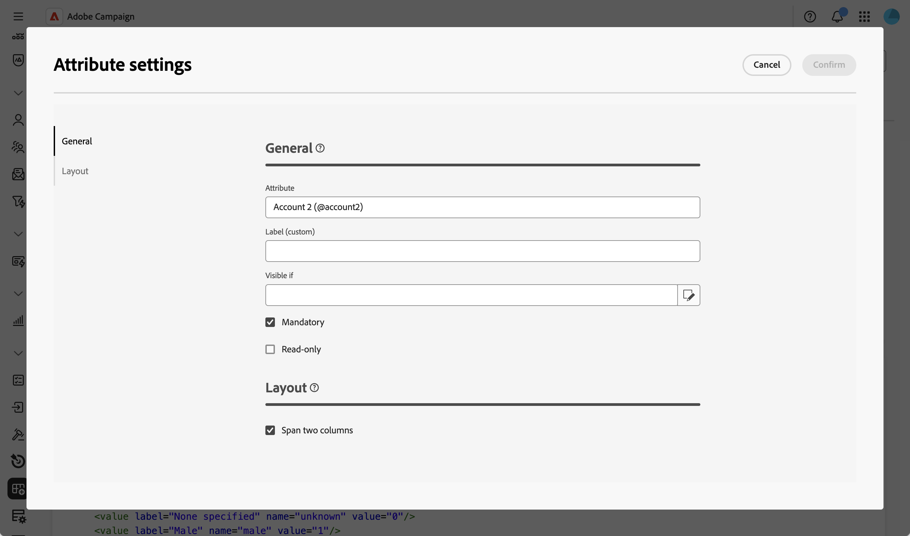
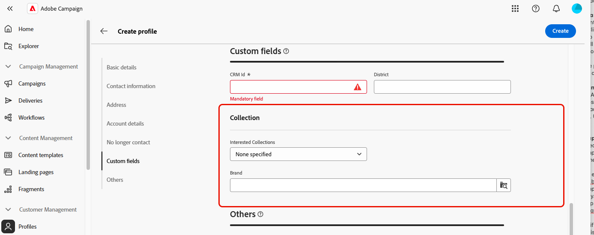

# 사용자 정의 필드 편집 {#fields}

사용자 지정 필드는 Adobe Campaign 콘솔을 통해 기본 스키마에 추가된 추가 속성입니다. 조직의 요구 사항에 맞게 새 속성을 포함하여 스키마를 사용자 지정할 수 있습니다.

사용자 지정 필드는 인터페이스의 프로필 세부 사항과 같은 다양한 화면에 표시할 수 있습니다. 표시되는 필드와 인터페이스에 표시되는 방식을 제어할 수 있습니다.

화면 정의 화면 및 액세스 방법에 대한 자세한 내용은 [화면 정의 액세스](schemas-browse-access.md#screen-def) 섹션을 참조하십시오.

사용자 정의 필드를 목록에 추가하려면:

1. **[!UICONTROL 스키마]** 메뉴로 이동한 다음 필터를 사용하여 편집 가능한 스키마를 찾습니다.

1. 목록에서 스키마 이름을 선택하여 열고 스키마 세부 정보 보기에서 **[!UICONTROL 화면 편집]** 단추를 클릭하여 화면 정의에 액세스합니다.

1. **[!UICONTROL 사용자 지정 필드 목록]** 표 위에 있는 줄임표 아이콘을 클릭하고 **[!UICONTROL 특성 선택]**을 선택하여 인터페이스에 표시할 하나 이상의 사용자 지정 필드를 선택합니다.
   
1. 추가하고 확인할 사용자 정의 필드를 선택합니다.

   

   >[!NOTE]
   >
   > **[!UICONTROL 사용자 지정 필드 목록을 자동으로 채우기]**&#x200B;를 선택하여 스키마에 대해 정의된 모든 사용자 지정 필드를 인터페이스에 추가할 수도 있습니다.

사용자 정의 필드가 추가되면 미리 보거나, 순서를 변경하거나, 필수로 지정하거나, 설정을 편집하거나, 하위 섹션으로 구성할 수 있습니다.

## 필드 설정 구성 {#field-settings}

각 사용자 지정 필드에 대한 특정 설정을 구성하려면 목록의 필드 행에서 줄임표 아이콘을 클릭하고 **[!UICONTROL 편집]**&#x200B;을 선택합니다.

사용 가능한 설정은 다음과 같습니다.

* **[!UICONTROL 특성]**: 사용자 지정 필드의 이름(읽기 전용)입니다.
* **[!UICONTROL 레이블(사용자 지정)]**: 인터페이스에 표시할 레이블입니다. 레이블이 제공되지 않으면 스키마에 정의된 레이블이 표시됩니다.
* **[!UICONTROL 보이는 경우]**: 필드가 표시되는 시기를 제어하는 xtk 식을 사용하여 조건을 정의합니다. 예를 들어 다른 필드가 비어 있으면 이 필드를 숨깁니다.
* **[!UICONTROL 필수]**: 인터페이스에서 필드를 필수 항목으로 만듭니다.
* **[!UICONTROL 읽기 전용]**: 인터페이스에서 필드를 읽기 전용으로 만듭니다. 사용자가 필드의 값을 편집할 수 없습니다.
* **[!UICONTROL 필터 설정]**(링크 유형 필드의 경우): 쿼리 모델러를 사용하여 링크 유형 사용자 지정 필드를 표시하는 규칙을 지정합니다. 예를 들어 다른 필드의 입력에 따라 목록 값을 제한합니다.

  +++보기 예

  `$(<field-name>)` 구문을 사용하여 조건의 다른 필드에 입력한 값을 참조할 수도 있습니다. 이렇게 하면 아직 데이터베이스에 저장되지 않은 경우에도 양식에 입력한 대로 필드의 현재 값을 참조할 수 있습니다.

  아래 예에서 조건은 @ref 필드의 값이 @refCom 필드에 입력한 값과 일치하는지 확인합니다. 반대로 `@refCom` 대신 `$(@refCom)`을(를) 사용하면 데이터베이스에 있는 @ref 필드의 값이 참조됩니다.

  

  +++

* **[!UICONTROL 두 열 분산]**: 기본적으로 사용자 지정 필드는 두 열로 인터페이스에 표시됩니다. 이 옵션을 켜짐으로 토글하면 사용자 정의 필드가 두 개의 열 대신 전체 폭 화면으로 표시됩니다.

## 사용자 정의 필드 미리 보기 {#preview}

**[!UICONTROL 미리 보기]**&#x200B;를 클릭하여 샘플 화면에 사용자 지정 필드를 표시합니다. 필수로 표시되는 필드를 포함하여 인터페이스에 표시되는 필드를 확인할 수 있습니다.

## 하위 섹션의 필드 구성 {#separator}

읽기 쉽도록 인터페이스에서 사용자 정의 필드를 그룹화하는 데 구분 기호를 추가할 수 있습니다. 이렇게 하려면 다음 단계를 수행합니다.

1. **[!UICONTROL 사용자 지정 필드 목록]** 표 위에 있는 줄임표 아이콘을 클릭하고 **[!UICONTROL 구분 기호 추가]**&#x200B;를 선택합니다.

1. 구분 기호를 나타내는 새 줄이 목록에 추가됩니다. 구분 기호 행의 줄임표 아이콘을 클릭하고 **[!UICONTROL 편집]**&#x200B;을 선택합니다.

1. 구분 기호에 대해 **[!UICONTROL 레이블]**&#x200B;을(를) 입력하고, 선택 사항인 경우 **[!UICONTROL 보이는 경우]** 조건을 설정하여 구분 기호가 표시되는 시기를 제어합니다.

   

1. 위쪽 및 아래쪽 화살표를 사용하여 구분 기호를 원하는 위치로 이동합니다. 구분 기호 아래에 나열된 필드는 그 아래에 그룹화됩니다.

   이 예에서 &quot;관심 있는 컬렉션&quot; 및 &quot;브랜드&quot; 필드는 &quot;컬렉션&quot; 하위 섹션으로 그룹화됩니다.

   | 사용자 정의 필드 구성 | 인터페이스에서 렌더링 |
   |  ---  |  ---  |
   | {zoomable="yes"} | {zoomable="yes"} |
