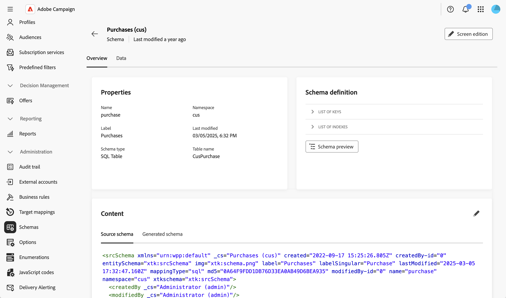
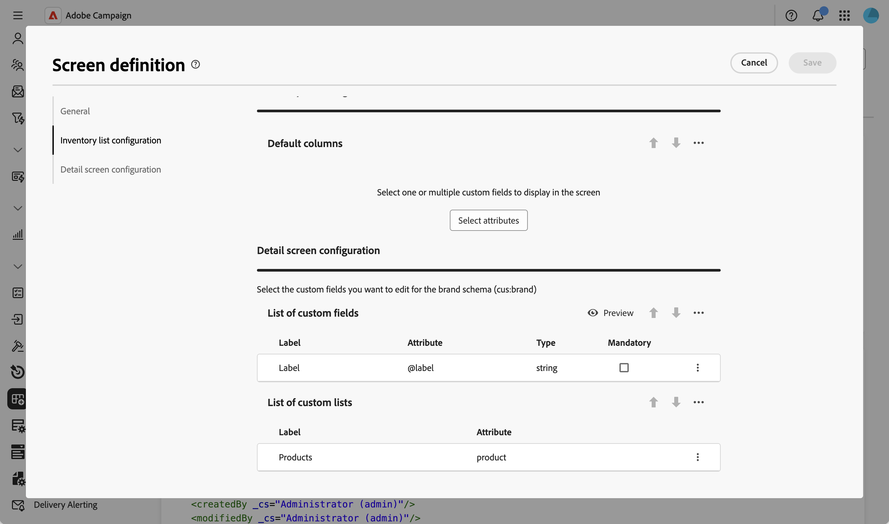
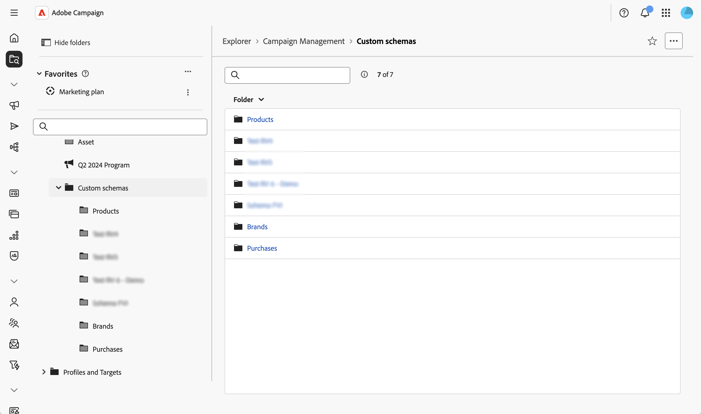
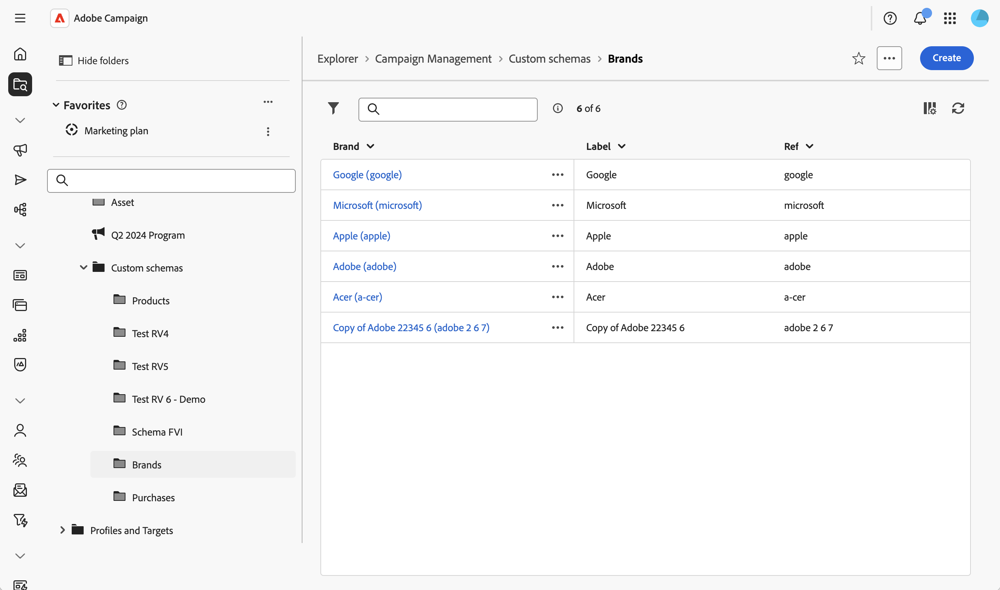

# 사용자 정의 양식을 사용한 작업 {#custom-forms}

사용자 정의 양식은 웹 사용자 인터페이스에서 직접 사용자 정의 스키마의 레코드를 관리할 수 있는 데이터 입력 인터페이스입니다. 각 사용자 정의 양식은 특정 사용자 정의 스키마에 해당하며 레코드를 검색할 수 있는 목록 보기와 레코드를 생성, 편집 및 삭제할 수 있는 세부 사항 보기를 제공합니다.

사용자 정의 양식은 표시되는 필드와 구성 방법을 구성하는 스키마의 양식 정의(화면 정의)를 기반으로 합니다.

>[!NOTE]
>
>사용자 정의 양식은 양식 정의가 구성된 스키마에만 사용할 수 있습니다.

## 사용자 지정 스키마 만들기 및 게시 {#form-schema}

먼저 사용자 지정 스키마를 만들고 게시해야 합니다. 자세한 지침은 이 [섹션](schemas-create-publish.md)을 참조하세요.

다음은 이 예제에 사용되는 데이터 모델입니다.

* 수신자가 여러 품목을 구매합니다.
* 구매가 제품에 연결되어 있습니다.
* 제품이 브랜드에 연결되어 있습니다.

이 사용 사례의 경우 구매, 제품 및 브랜드 스키마의 세 가지 스키마가 만들어집니다. 예를 들면 다음과 같습니다.

## 화면 정의 구성 {#form-screen-schema}

표시되는 필드와 구성 방법을 정의합니다. 자세한 지침은 이 [섹션](schemas-browse-access.md#screen-def)을 참조하세요.

다음은 제품 사용자 지정 목록이 추가되는 브랜드 스키마의 예입니다. 그러면 양식에 브랜드에 연결된 제품 목록이 표시됩니다.

제품 스키마의 경우 구매 사용자 지정 목록을 추가합니다. 구매 스키마의 경우 제품 및 수신자 필드.

## 탐색 항목 만들기 {#form-screen-entries}

탐색기에서 폴더를 만들어 사용자 정의 양식에 액세스합니다. 자세한 지침은 이 [섹션](schemas-create-publish.md#navigation)을 참조하세요.

목록 보기에는 해당 스키마에 대한 모든 레코드가 표시됩니다. 스키마에 양식 정의가 구성된 경우 목록을 편집할 수 있으며 레코드를 생성, 편집 및 삭제할 수 있습니다.

그런 다음 다음을 수행할 수 있습니다.

* **레코드 보기 및 편집**: 목록 보기에서 레코드를 클릭하여 세부 보기로 열고 필드를 직접 편집합니다.
* **새 레코드 만들기**: **[!UICONTROL 만들기]** 단추를 클릭하고 필수 필드를 채웁니다. 연결된 필드의 경우 검색 아이콘을 사용하여 사용 가능한 관련 레코드 중에서 선택합니다.
* **레코드 삭제**: 레코드를 선택하고 레코드 세부 정보 또는 목록 보기에서 사용할 수 있는 삭제 작업을 사용합니다.
* **탭에서 관련 데이터 보기**: 세부 사항 보기의 전용 탭을 통해 관련 레코드에 액세스합니다(예: 브랜드에 연결된 모든 제품 또는 제품에 연결된 모든 구매 보기).
* **필터 적용**: 필터 패널을 사용하여 목록 보기를 세분화하고 스키마의 필드를 기반으로 특정 레코드를 찾습니다.
* **목록 열 사용자 지정**: 화면 정의를 통해 목록 보기에 기본적으로 표시되는 열을 구성합니다.
