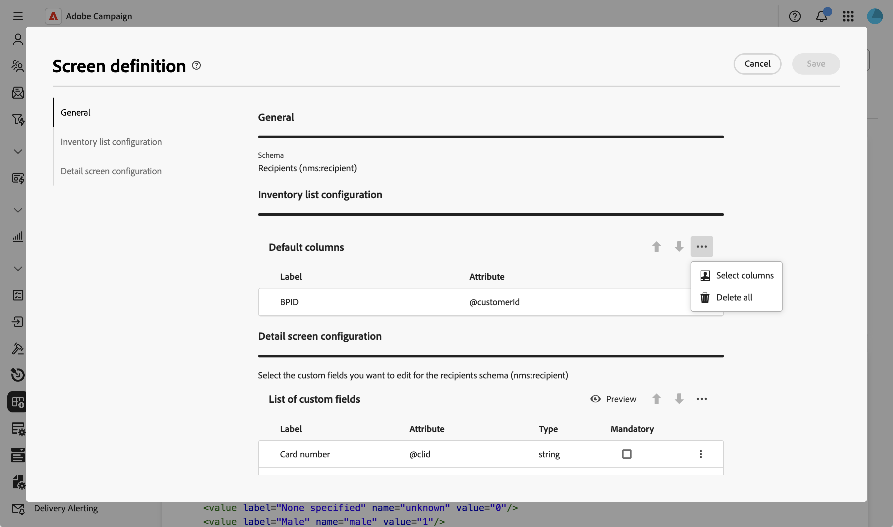
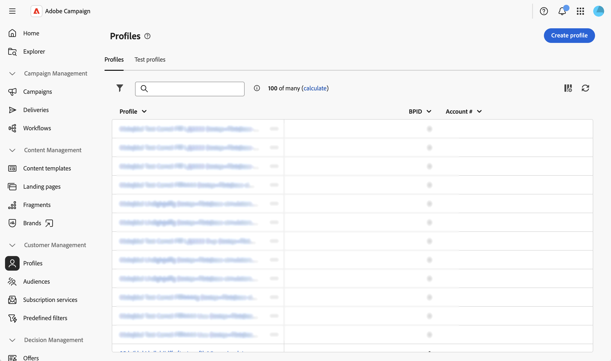

# 목록 열 구성 {#list-columns}

**[!UICONTROL 인벤토리 목록 구성]** 섹션에서 목록 보기에 기본적으로 표시되는 열을 구성할 수 있습니다. 각 열에는 해당 레이블과 해당 속성이 표시됩니다.

화면 정의 화면 및 액세스 방법에 대한 자세한 내용은 [화면 정의 액세스](schemas-browse-access.md#screen-def) 섹션을 참조하십시오.

기본 목록에 새 열을 추가하려면 다음을 수행합니다.

1. **[!UICONTROL 스키마]** 메뉴로 이동한 다음 필터를 사용하여 편집 가능한 스키마를 찾습니다.

1. 목록에서 스키마 이름을 선택하여 열고 스키마 세부 정보 보기에서 **[!UICONTROL 화면 편집]** 단추를 클릭하여 화면 정의에 액세스합니다.

1. 줄임표 아이콘(세 점)을 클릭합니다.
1. **[!UICONTROL 열 선택]**&#x200B;을 선택하세요.
   

1. 목록 보기에 표시할 속성을 선택하고 확인합니다.

   

1. **프로필** 메뉴로 이동하여 프로필 목록 보기에 액세스합니다. 새 탭이 표시됩니다. 필요한 경우 열을 더 추가할 수 있습니다.

   
