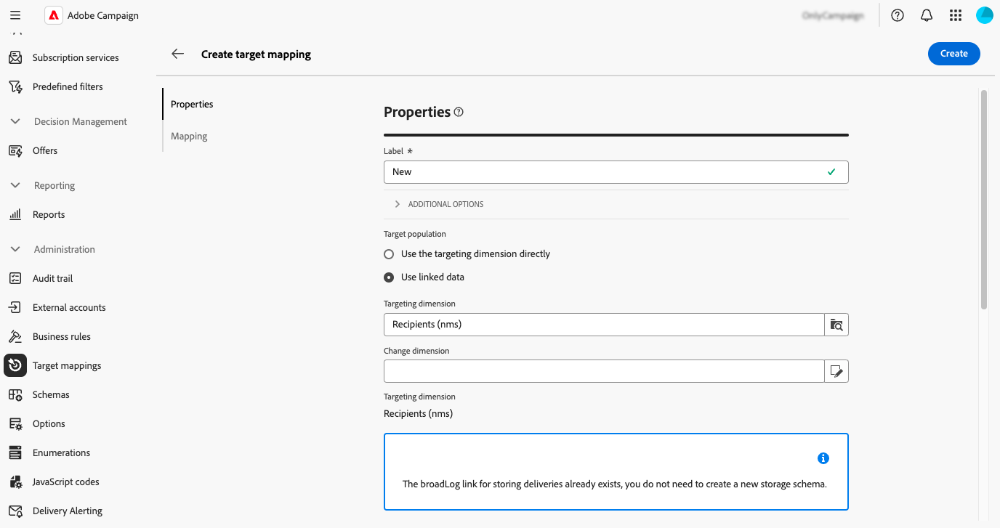

# 대상 매핑 관리 {#target-mappings}

>[!CONTEXTUALHELP]
>id="acw_homepage_welcome_rn5"
>title="대상 매핑"
>abstract="이제 Campaign Web 사용자 인터페이스에서 대상 매핑을 만들 수 있습니다. 대상 매핑은 다양한 게재 채널(이메일, SMS, 푸시 알림)이 스키마의 데이터 필드에 연결되는 방식을 정의합니다."
>additional-url="https://experienceleague.adobe.com/docs/campaign-web/v8/release-notes/release-notes.html" text="릴리스 정보 참조"

>[!CONTEXTUALHELP]
>id="acw_targetmapping_list"
>title="대상 매핑 "
>abstract="대상 매핑"

## 대상 매핑 정보 {#about}

각 통신 채널은 기본 대상 매핑을 사용하여 수신자를 타깃팅합니다. 예를 들어 기본적으로 전자 메일 및 SMS 게재 템플릿은 **[!UICONTROL 수신자]**&#x200B;를 타겟팅합니다. 따라서 대상 매핑은 **nms:recipient** 테이블의 필드를 사용합니다. 푸시 알림의 경우 기본 대상 매핑은 수신자 테이블에 연결된 **구독자 애플리케이션(nms:appSubscriptionRcp)**&#x200B;입니다.

대상 매핑은 **[!UICONTROL 관리]** > **[!UICONTROL 대상 매핑]** 메뉴에서 액세스할 수 있습니다. 이 화면에서 각 대상 매핑에 대한 세부 정보에 액세스하거나 필요에 따라 새 대상 매핑을 만들 수 있습니다.

Adobe Campaign과 함께 제공되는 기본 제공 대상 매핑에 대한 자세한 내용은 [Campaign v8 클라이언트 콘솔 설명서](https://experienceleague.adobe.com/docs/campaign/campaign-v8/audience/add-profiles/target-mappings.html){target="_blank"}를 참조하십시오.

## 대상 매핑 만들기 {#create-mapping}

>[!CONTEXTUALHELP]
>id="acw_targetmapping_properties"
>title="대상 매핑 속성"
>abstract="**[!UICONTROL 속성]** 섹션을 사용하면 대상 매핑과 대상 집단에 대한 일반적인 설정을 정의할 수 있습니다."

>[!CONTEXTUALHELP]
>id="acw_targetmapping_mapping"
>title="대상 매핑 매핑"
>abstract="**[!UICONTROL 매핑]** 섹션을 사용하면 다양한 게재 주소 필드에 사용할 대상 매핑 스키마의 속성을 식별할 수 있습니다."

>[!CONTEXTUALHELP]
>id="acw_targetmapping_denylist"
>title="대상 매핑 차단 목록"
>abstract="대상 매핑 차단 목록"

>[!CONTEXTUALHELP]
>id="acw_targetmapping_storage"
>title="대상 매핑 스토리지"
>abstract="**[!UICONTROL 스토리지]** 섹션을 사용하면 로그를 저장해야 하는 위치를 식별할 수 있습니다."

새 대상 매핑을 만들려면 **[!UICONTROL 관리]** > **[!UICONTROL 대상 매핑]** 메뉴에 액세스하십시오. **[!UICONTROL 매핑 만들기]** 단추를 클릭한 다음 아래 섹션에 설명된 단계를 수행합니다.

1. **[!UICONTROL 속성]** 섹션에서 대상 매핑에 대한 **[!UICONTROL 레이블]**&#x200B;을(를) 입력하십시오.

1. **[!UICONTROL 추가 옵션]** 섹션을 확장하여 대상 매핑의 내부 이름, 저장소 폴더 및 설명과 같은 고급 설정을 정의합니다.

1. 대상 모집단을 선택합니다. 다음 중 하나를 수행할 수 있습니다.

   * **[!UICONTROL 타겟팅 차원을 직접 사용]**: 사용 가능한 차원 목록에서 직접 타겟팅할 차원을 선택합니다.
   * **[!UICONTROL 연결된 데이터 사용]**: 타깃팅 차원(예: 구독)에서 시작한 다음 타깃팅할 타깃팅 차원(예: 수신자)으로 전환합니다.

   

1. 선택한 차원이 기존 대상 매핑에서 아직 사용되지 않은 경우 로그를 저장할 스키마를 만들어야 합니다. 추가 옵션은 **[!UICONTROL 저장소]** 섹션에서 사용할 수 있습니다. 자세한 내용을 보려면 아래 섹션을 확장하십시오.

   +++새 타겟팅 차원에 대한 저장 공간 옵션

   1. **[!UICONTROL 네임스페이스]**: 로그를 만드는 데 사용할 네임스페이스를 식별합니다.
   1. **[!UICONTROL 확장 스키마의 접미사]**: 새 스키마의 접미사를 제공합니다.

      아래 예에서 broadlog 이름은 &quot;custobroadlogSupplier&quot;가 됩니다.

      

   1. **[!UICONTROL 게재 로그]**: 이 섹션의 옵션을 활성화하여 세그먼트 코드 필드 또는 게재 IP 주소가 포함된 필드로 전송 로그를 보강합니다. 예를 들어 나중에 타겟을 세분화하기 위해 워크플로우 중에 계산된 세그먼트 코드를 전송 로그에 저장합니다. 이렇게 하면 이 특정 세그먼트 코드로 프로필을 타겟팅할 수 있습니다.

   1. **[!UICONTROL 제외]**: 제외 로그를 저장하는 방법을 지정하십시오.

   1. **[!UICONTROL 추적 로그]**: **[!UICONTROL 추적할 스키마 생성]** 옵션을 활성화하여 추적 로그에 대한 저장소 스키마를 생성합니다.

+++

1. **[!UICONTROL 매핑]** 섹션을 사용하여 각 게재 주소 필드에 사용할 대상 매핑의 스키마에서 특성을 식별합니다. 각 필드에 대해 매핑할 속성을 선택합니다. 필드를 식별하는 표현식을 작성할 수도 있습니다. 예를 들어, address 속성에 lower 함수를 적용합니다.

   

1. 대상 매핑이 준비되면 **[!UICONTROL 만들기]** 단추를 클릭합니다. 타겟 매핑 및 로그에 대한 모든 관련 스키마를 자동으로 생성합니다.

대상 매핑이 생성되면 화면에 두 개의 추가 섹션이 표시됩니다.

* **[!UICONTROL 차단 목록에 추가]**: 이 섹션에서 차단 목록에 사용할 대상 매핑의 스키마에서 특성을 식별할 수 있습니다.

  

* **[!UICONTROL 저장소]**: 이 섹션에서 로그를 저장하는 데 사용할 테이블을 식별할 수 있습니다.

  

   * **[!UICONTROL 메시지 스키마]**: 전송 로그를 저장하는 데 사용할 스키마를 식별합니다.
   * **[!UICONTROL 제외된 메시지]**: 게재 및 제외 로그 저장소를 관리하는 방법을 지정합니다.

      * **[!UICONTROL 같은 테이블에 제외 및 메시지 저장]**
      * **[!UICONTROL 메시지만 저장]**: 제외를 저장하지 않습니다.
      * **[!UICONTROL 개별 테이블에 제외 및 메시지 저장]**: **[!UICONTROL 거부 스키마]** 필드에 제외 로그를 저장하는 데 사용할 스키마를 선택하십시오.

   * **[!UICONTROL 추적 로그]**: 추적 로그 및 기본 트래픽 원본을 저장할 위치를 선택하십시오.
   * **[!UICONTROL 추가 필드]**: 게재 로그에 저장할 추가 필드 목록을 지정하십시오. 이러한 필드는 대상의 개별 멤버에 대한 정보를 영구적으로 저장하거나(예: `recipient/@firstName`) 워크플로 중에 계산된 추가 데이터를 저장할 수 있습니다(예: `[targetData/@offeCode]`).

     이렇게 하려면 **[!UICONTROL 필드 추가]**&#x200B;를 선택하십시오. **[!UICONTROL Source]** 필드에 저장할 정보와 **[!UICONTROL 대상]** 필드에 이 정보를 저장하기 위해 전송 로그에서 사용할 특성을 식별하십시오.

     {width="50%" zoomable="yes"}