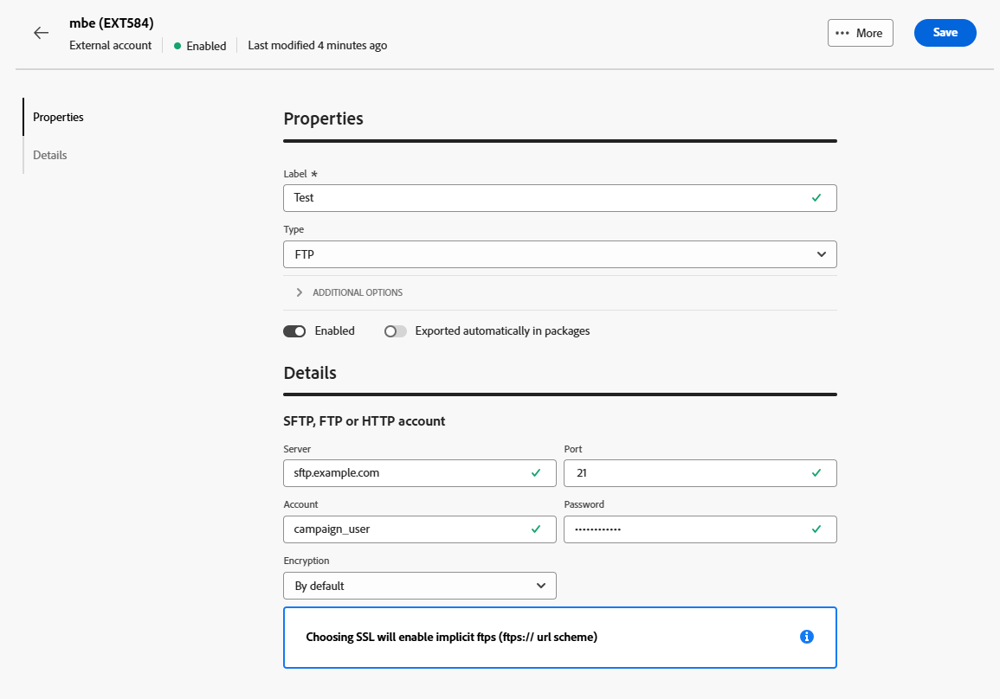

# 외부 계정 데이터 전송 {#transfer-external-account}

## Amazon Simple Storage Service (S3) {#amazon-simple-storage-service--s3--external-account}

Amazon Simple Storage Service (S3) 커넥터를 사용하여 데이터를 Adobe Campaign으로 가져오거나 내보낼 수 있습니다. 워크플로우 활동에서 설정할 수 있습니다. 자세한 정보는 이 [페이지](https://experienceleague.adobe.com/ko/docs/campaign-web/v8/wf/design-workflows/transfer-file){target=_blank}를 참조하십시오.

이 새 외부 계정을 설정할 때 다음 세부 사항을 제공해야 합니다.

* **[!UICONTROL AWS S3 계정 서버]**

  서버의 URL은 다음과 같이 채워야 합니다.

  `  <S3bucket name>.s3.amazonaws.com/<s3object path>`

* **[!UICONTROL AWS 액세스 키 ID]**

  AWS 액세스 키 ID를 찾을 수 있는 위치를 확인하려면 이 [페이지](https://docs.aws.amazon.com/general/latest/gr/aws-sec-cred-types.html#access-keys-and-secret-access-keys)를 참조하세요.

* **[!UICONTROL AWS에 대한 비밀 액세스 키]**

  AWS에 대한 비밀 액세스 키를 찾을 수 있는 위치를 파악하려면 이 [페이지](https://aws.amazon.com/fr/blogs/security/wheres-my-secret-access-key/)를 참조하세요.

* **[!UICONTROL AWS 지역]**

  AWS 지역에 대한 자세한 내용은 이 [페이지](https://aws.amazon.com/about-aws/global-infrastructure/regions_az/)를 참조하세요.

* **[!UICONTROL 서버측 암호화 사용]** 확인란을 사용하면 파일을 S3 암호화 모드로 저장할 수 있습니다.

액세스 키 ID 및 비밀 액세스 키를 찾을 수 있는 위치를 알아보려면 Amazon 웹 서비스 [설명서](https://docs.aws.amazon.com/general/latest/gr/aws-sec-cred-types.html#access-keys-and-secret-access-keys)를 참조하세요.

## Azure Blob 스토리지 {#azure-blob-external-account}

**[!UICONTROL Azure Blob 저장소]** 외부 계정을 사용하여 **[!UICONTROL 파일 전송]** 워크플로우 활동을 통해 Adobe Campaign으로 데이터를 가져오거나 내보낼 수 있습니다. 이 작업에 대한 자세한 정보는 [이 섹션](https://experienceleague.adobe.com/ko/docs/campaign-web/v8/wf/design-workflows/transfer-file){target=_blank}을 참조하십시오.

Adobe Campaign에서 작동하도록 **[!UICONTROL Azure 외부 계정]**&#x200B;을(를) 구성하려면 다음 세부 정보를 제공해야 합니다.

* **[!UICONTROL 서버]**

  Azure Blob 스토리지 서버의 URL입니다.

* **[!UICONTROL 암호화]**

  **[!UICONTROL 없음]** 또는 **[!UICONTROL SSL]** 중에서 선택한 암호화 유형입니다.

* **[!UICONTROL 액세스 키]**

  **[!UICONTROL 액세스 키]**&#x200B;를 찾을 위치를 확인하려면 이 [페이지](https://docs.microsoft.com/en-us/azure/storage/common/storage-account-keys-manage?tabs=azure-portal)를 참조하세요.

## SFTP

SFTP 외부 계정을 사용하여 Adobe Campaign 외부의 서버에 대한 액세스를 구성하고 테스트할 수 있습니다.

**[!UICONTROL SFTP]** 외부 계정을 구성하려면 다음 필드를 채우십시오.

* **[!UICONTROL 서버]**

  SFTP 서버의 이름 또는 주소를 입력합니다.

* **[!UICONTROL 포트]**

  SFTP 연결 포트 번호를 지정합니다. 기본 포트는 22입니다.

* **[!UICONTROL 계정]**

  SFTP 서버에 연결하는 데 사용되는 사용자 이름을 입력합니다.

* **[!UICONTROL 암호]**

  SFTP 계정의 암호를 입력합니다.

* **[!UICONTROL SFTP 인증 유형]**

  SFTP 서버로 인증할 방법을 선택합니다. 옵션은 다음과 같습니다.

   * **[!UICONTROL 암호]**: 계정의 암호를 사용하여 인증합니다.

   * **[!UICONTROL 공개 키]**: SSH 키 쌍(개인 및 공개 키)을 사용하여 인증합니다.

**[!UICONTROL 공개 키]** 인증을 선택한 경우 다음 필드를 채워야 합니다.

* **[!UICONTROL 개인 키 파일]**

  인증에 사용되는 개인 SSH 키 파일을 지정합니다.

* **[!UICONTROL 공개 키 파일]**

  SFTP 서버에 등록된 해당 공개 SSH 키를 지정합니다.

* **[!UICONTROL SSH 키 암호]**

  개인 키가 보호되어 있는 경우 암호를 입력하여 암호를 해독하십시오.

## HTTP

HTTP 외부 계정을 사용하여 Adobe Campaign 외부의 서버에 대한 액세스를 구성하고 테스트할 수 있습니다.

**[!UICONTROL HTTP]** 외부 계정을 구성하려면 다음 필드를 채우십시오.

* **[!UICONTROL 서버]**

  HTTP 서버의 이름 또는 주소를 입력합니다.

* **[!UICONTROL 포트]**

  HTTP 연결 포트 번호를 지정합니다. 기본 포트는 80입니다.

* **[!UICONTROL 계정]**

  인증을 위한 사용자 이름을 입력합니다.

* **[!UICONTROL 암호]**

  사용자 계정과 연계된 비밀번호를 입력합니다.

* **[!UICONTROL SFTP 인증 유형]**

  연결에 대한 인증 유형 을 선택합니다. 옵션은 다음과 같습니다.

   * 암호
   * 공개 키

**[!UICONTROL 공개 키]** 인증을 사용하는 경우 **[!UICONTROL 공개 키 인증]** 메뉴에서 다음에 필요한 값을 입력하십시오.

* **[!UICONTROL 암호]**: 개인 키를 보호하는 암호입니다(해당하는 경우).

* **[!UICONTROL 개인 키]**: Snowflake 계정을 인증하는 데 사용되는 개인 키입니다.

## FTP

FTP 외부 계정을 사용하여 Adobe Campaign 외부의 서버에 대한 액세스를 구성하고 테스트할 수 있습니다.

**[!UICONTROL FTP]** 외부 계정을 구성하려면 다음 필드를 입력하십시오.

* **[!UICONTROL 서버]**

  FTP 서버의 이름이나 주소를 입력합니다.

* **[!UICONTROL 포트]**

  FTP 연결 포트 번호를 지정합니다. 기본 포트는 21입니다.

* **[!UICONTROL 계정]**

  인증을 위한 사용자 이름을 입력합니다.

* **[!UICONTROL 암호]**

  사용자 계정과 연계된 비밀번호를 입력합니다.

* **[!UICONTROL 암호화]**

  연결에 대한 암호화 유형을 선택합니다. 옵션은 다음과 같습니다.

   * 기본
   * POP3 + STARTTLS
   * POP3 비보안
   * POP3 보안
