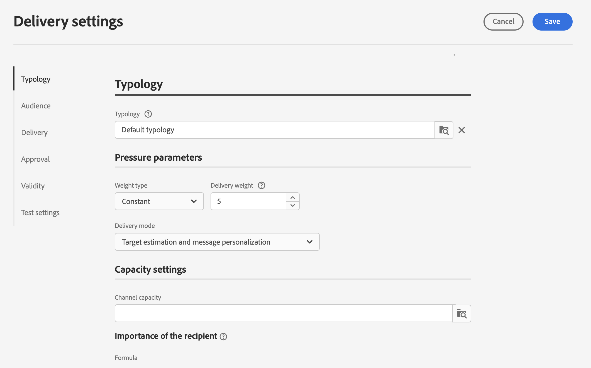
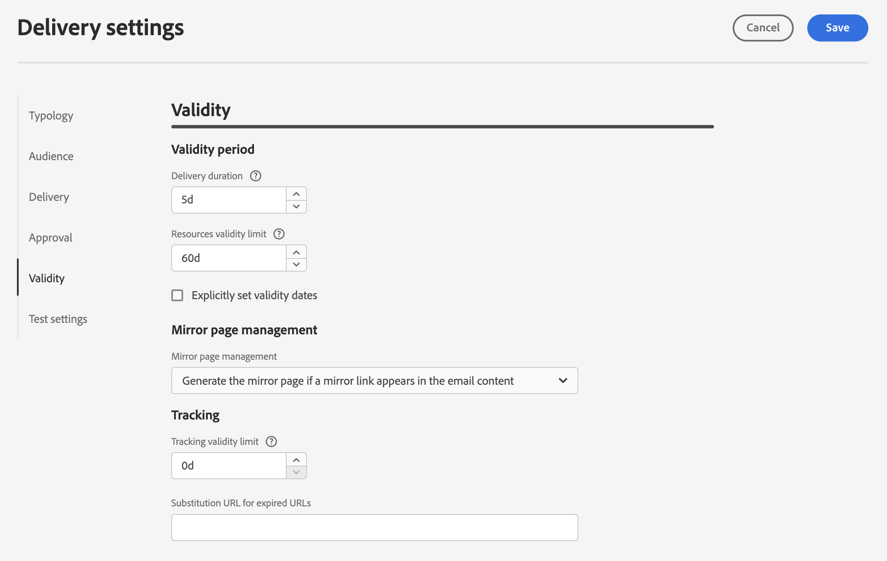

# 이메일 게재 설정 {#email-del-settings}

이러한 설정은 이메일 템플릿에 정의되어 있는 **기술적 게재 매개변수**&#x200B;입니다. 이메일 게재 편집 시 표시되는 **게재 설정 구성** 아이콘에서 사용할 수 있습니다.

## 이메일 게재 설정 {#email-delivery-settings}

>[!CAUTION]
>
> 이러한 설정은 정보 목적으로만 설명됩니다. 그 중 일부는 구성 및 권한에 따라 다릅니다. 이 버전의 제품에서는 수정할 수 없습니다.

## 유형화 {#typology}

>[!CONTEXTUALHELP]
>id="acw_email_settings_typology"
>title="유형화"
>abstract="유형화로 게재 전송을 제어, 필터링 및 모니터링할 수 있습니다."

유형화는 메시지 분석 단계 동안 실행되는 **유형화 규칙** 세트입니다. 이메일에 항상 특정 요소(예: 구독 취소 링크 또는 제목 줄)가 포함되어 있는지 확인하거나 그룹을 의도한 타겟(구독 취소자, 경쟁 업체 또는 비충성 고객)에서 제외하는 필터링 규칙이 있는지 확인할 수 있습니다.

유형화를 메시지 또는 메시지 템플릿과 연결하면 해당 유형화에 포함된 유형화 규칙이 실행되어 메시지 준비 도중 메시지의 유효성을 검사합니다.

### 압력 매개변수 {#pressure-parameters}

>[!CONTEXTUALHELP]
>id="acw_email_settings_delivery_weight"
>title="게재 가중치"
>abstract="게재 가중치를 통해 압력 관리 프레임워크 내에서 최우선 게재를 식별할 수 있습니다. 가중치가 가장 높은 메시지는 우선 순위가 높습니다."

이 섹션에서는 압력 매개변수를 사용하여 **임계값**&#x200B;을 정의할 수 있습니다. 주어진 기간 동안 하나의 프로필에 전송할 수 있는 최대 메시지 수입니다. 이 임계값에 도달하면, 고려된 기간이 끝날 때까지 더 이상 게재할 수 없습니다. 이 프로세스를 사용하면 메시지가 설정된 임계값을 초과하는 경우 게재 시 프로필을 자동으로 제외하여 과도한 요청을 방지할 수 있습니다.

임계값은 상수 또는 변수일 수 있습니다. 즉, 특정 기간 동안 임계값은 프로필마다 또는 심지어 동일한 프로필에 대해서도 다를 수 있습니다.

**가중치 유형** 필드에서 다음 세 가지 옵션을 사용할 수 있습니다.

* **일정**
* **수신자에 따라 다름**
* **각 규칙에 정의됨**

**게재 가중치** 필드를 사용하여 게재 우선 순위를 정의합니다. 각 게재에는 우선 순위 수준을 나타내는 가중치가 있습니다. 기본적으로 게재 가중치는 5로 설정되어 있습니다. 압력 규칙을 사용하면 적용되는 게재의 가중치를 정의할 수 있습니다. 가중치는 수신자에 맞게 공식을 통해 설정하거나 계산할 수 있습니다. 예를 들어, 수신자의 관심사에 따라 게재 가중치를 정의할 수 있습니다.

대상 평가 모드를 선택하려면 **게재 모드**&#x200B;를 사용합니다. 다음 세 가지 모드를 사용할 수 있습니다.

* **대상 예상 및 메시지 개인화**
* **잠정 대상 예상 및 승인**
* **대상 평가**

피로도 관리는 **캠페인 최적화** 추가 기능과 함께 제공됩니다. [Campaign v8 설명서](https://experienceleague.adobe.com/docs/campaign/automation/campaign-optimization/pressure-rules.html){target="_blank"}에서 압력 규칙 및 피로도 관리 구성 방법에 대해 자세히 알아보십시오.

### 용량 설정 {#capacity-settings}

>[!CONTEXTUALHELP]
>id="acw_email_settings_recipient_importance"
>title="수신자 중요도"
>abstract="수신자 중요도는 용량 유형화 규칙 초과 시 유지되는 수신자를 결정하는 데 사용되는 공식입니다."

이 섹션에서는 Adobe Campaign v8 Console에 정의된 용량 규칙을 선택할 수 있습니다. 이 규칙은 이메일 채널과 연결되어 있습니다.

**수신자 중요도** 필드는 용량 유형화 규칙 초과 시 유지되는 수신자를 결정하는 데 사용되는 공식입니다.

[Campaign v8 설명서](https://experienceleague.adobe.com/docs/campaign/automation/campaign-optimization/consistency-rules.html){target="_blank"}에서 일관성 및 용량 규칙과 그 구성 방법에 대해 자세히 알아보십시오.

## 대상자 {#audience}

이 섹션에서는 사용 가능한 **대상 매핑** 중 원하는 옵션을 선택할 수 있습니다. 대상 매핑은 Adobe Campaign v8 콘솔에서 정의됩니다.

[Campaign v8 설명서](https://experienceleague.adobe.com/docs/campaign/campaign-v8/audience/add-profiles/target-mappings.html){target="_blank"}에서 대상 매핑에 대해 자세히 알아보십시오.

## 게재 {#delivery}

게재 매개변수는 게재에 적용되는 기술 설정입니다.

* **라우팅**: 통합 이메일 라우팅 외부 계정이 기본으로 제공됩니다. 애플리케이션이 전자 메일을 보낼 수 있는 기술 매개 변수가 포함되어 있습니다.

* **테스트 SMTP 게재**: 이 옵션은 SMTP를 통한 전송을 테스트하는 데 사용됩니다. 게재는 SMTP 서버에 연결될 때까지 처리되지만 전송되지는 않습니다. 게재의 모든 수신자에 대해 Campaign은 SMTP 공급자 서버에 연결하고 SMTP RCPT TO 명령을 실행한 다음 SMTP DATA 명령 전에 연결을 종료합니다.

* **이메일 BCC**: 이 옵션은 BCC 이메일 주소를 메시지 대상에 추가하여 BCC를 통해 외부 시스템에 이메일을 저장하는 데 사용됩니다. [Campaign v8 설명서](https://experienceleague.adobe.com/docs/campaign/campaign-v8/config/configuration/email-settings.html){target="_blank"}에서 이메일 BCC에 대해 자세히 알아보십시오.

### 재시도 {#retries}

>[!CONTEXTUALHELP]
>id="acw_email_settings_retries"
>title="최대 재시도 수"
>abstract="일시적인 오류로 인해 메시지 전송이 실패하면 게재 기간이 종료될 때까지 재시도를 수행합니다."

<!--Temporarily undelivered messages due to a Soft or Ignored error are subject to an automatic retry. By default, five retries are scheduled for the first day of the delivery with a minimum interval of one hour spread out over the 24 hours of the day. -->

[Campaign v8 설명서](https://experienceleague.adobe.com/docs/campaign/campaign-v8/config/configuration/email-settings.html){target="_blank"}에서 재시도 관리에 대해 자세히 알아보십시오.

## 승인 {#approval}

>[!CONTEXTUALHELP]
>id="acw_email_settings_approval"
>title="승인 모드"
>abstract="각 게재 단계는 승인을 받아 다양한 프로세스를 전체 모니터링하고 제어할 수 있습니다."

게재 준비 중에 경고가 생성되면 게재를 계속 실행해야 하는지 여부를 정의하도록 구성할 수 있습니다. 사용자는 기본적으로 분석 단계가 끝나면 메시지 전송을 확인해야 합니다. 이를 **수동** 유효성 검사라고 합니다.

적절한 필드에서 다른 승인 모드를 선택할 수 있습니다. 사용 가능한 모드는 다음과 같습니다.

* **수동**: 분석 단계가 끝나면 사용자는 전송을 시작하기 위해 게재를 확인해야 합니다.

* **반자동**: 분석 단계에서 경고 메시지가 생성되지 않으면 자동으로 전송이 시작됩니다.

* **자동**: 결과와 관계없이 분석 단계가 끝나면 자동으로 전송이 시작됩니다.

## 유효성 {#validity}

>[!CONTEXTUALHELP]
>id="acw_email_settings_delivery_duration"
>title="게재 기간"
>abstract="게재 기간 필드를 통해 글로벌 게재 재시도에 대한 제한 값을 입력할 수 있습니다. 즉, Adobe Campaign은 시작 날짜부터 메시지를 전송하고 나서 메시지가 오류만 반환하는 경우 유효성 검사 제한에 도달할 때까지 구성 가능한 일반 재시도를 수행합니다."

>[!CONTEXTUALHELP]
>id="acw_email_settings_resources_validity"
>title="리소스 유효성 검사 제한"
>abstract="유효성 검사 제한 필드는 미러 페이지나 이미지와 같이 업로드된 리소스에 사용됩니다. 이러한 리소스는 제한된 시간 동안만 유효합니다. 한도에 도달하면 리소스를 더 이상 사용할 수 없습니다."

**게재 기간** 필드를 통해 글로벌 게재 재시도에 대한 제한 값을 입력할 수 있습니다. 즉, Adobe Campaign은 시작 날짜부터 메시지를 전송하고 나서 메시지가 오류만 반환하는 경우 유효성 검사 제한에 도달할 때까지 구성 가능한 일반 재시도를 수행합니다.

날짜를 지정할 수도 있습니다. 이렇게 하려면 **명시적으로 유효일자 설정**&#x200B;을 선택하십시오. 이 경우 게재 및 유효성 검사 제한 날짜를 통해 시간을 지정할 수도 있습니다. 기본적으로 현재 시간이 사용되지만 입력 필드에서 직접 수정할 수 있습니다.

**리소스 유효성 검사 제한**&#x200B;은 주로 미러 페이지와 이미지에 대해 업로드된 리소스에 사용됩니다. 이 페이지의 리소스는 제한된 시간 동안 유효합니다(디스크 공간을 절약하기 위함). 이 제한이 지나면 이러한 리소스를 더 이상 사용할 수 없습니다.

[Campaign v8 설명서](https://experienceleague.adobe.com/docs/campaign/campaign-v8/campaigns/send/failures/delivery-failures.html#validity-period){target="_blank"}에서 게재 유효 기간에 대해 자세히 알아보십시오.

### 미러 페이지 관리 {#mirror}

미러 페이지는 웹 브라우저를 통해 온라인으로 액세스할 수 있는 HTML 페이지입니다. 콘텐츠는 이메일과 동일합니다. 기본적으로 링크가 메일의 콘텐츠에 삽입된 경우 미러 페이지가 생성됩니다.

기본 모드 이외에 다음 옵션도 사용할 수 있습니다.

* **[!UICONTROL 미러 페이지 강제 생성]**: 게재에 미러 페이지에 대한 링크가 삽입되어 있지 않은 경우에도 미러 페이지를 생성하려면 이 모드를 사용하십시오.
* **[!UICONTROL 미러 페이지 생성 안 함]**: 게재에 링크가 있는 경우에도 미러 페이지를 생성하지 않으려면 이 모드를 사용하십시오.
* **[!UICONTROL 메시지 식별자를 사용해서만 액세스할 수 있는 미러 페이지 생성]**: 이메일 콘텐츠에 미러 페이지 링크가 없는 경우 이 옵션을 사용하여 클라이언트 콘솔에서 게재 로그 창의 미러 페이지 콘텐츠에 액세스할 수 있습니다.

### 추적 {#tracking}

>[!CONTEXTUALHELP]
>id="acw_email_settings_tracking_validity"
>title="유효 기간"
>abstract="이 옵션은 추적이 URL에서 활성화되는 기간을 정의합니다."

추적 매개변수는 관련 섹션에서 정의됩니다. 가능한 옵션은 다음과 같습니다.

**추적 유효성 검사 제한**: 추적이 URL에서 활성화되는 기간을 변경하려면 이 옵션을 사용하십시오.

**만료 URL의 대체 URL**: 대체 웹 페이지에 대한 URL을 입력하려면 이 옵션을 사용하십시오. 이 옵션은 추적이 만료되면 표시됩니다.

## 테스트 설정 {#test-setttings}

이 섹션에서는 제외 매개변수를 설정할 수 있습니다. 사용 가능한 옵션은 다음과 같습니다.

* **중복 보관** 옵션을 사용하면 여러 타겟팅 기준을 충족하는 수신자에 대한 중복 게재를 승인할 수 있습니다.

* **차단 목록에 추가된 주소 보관** 옵션을 사용하면 구독 취소(옵트아웃) 후와 같이 게재에서 더 이상 대상으로 지정되지 않는 프로필을 대상에서 유지할 수 있습니다.

* **격리된 주소 보관** 옵션을 사용하면 주소가 응답하지 않는 프로필을 대상에서 유지할 수 있습니다.

테스트 이메일의 이름을 사용자 정의할 수도 있습니다.

관련 게재에 대해 정의된 것과 동일한 게재 코드를 테스트 이메일에 연결하려면 **증명을 위해 게재 코드 보관**&#x200B;을 사용하십시오.

기본적으로 테스트 이메일의 제목에는 “PROOF #” 접두사가 붙습니다. 여기서 #은 테스트 이메일의 번호입니다. 이 접두사는 **레이블 접두사** 필드에서 변경할 수 있습니다.