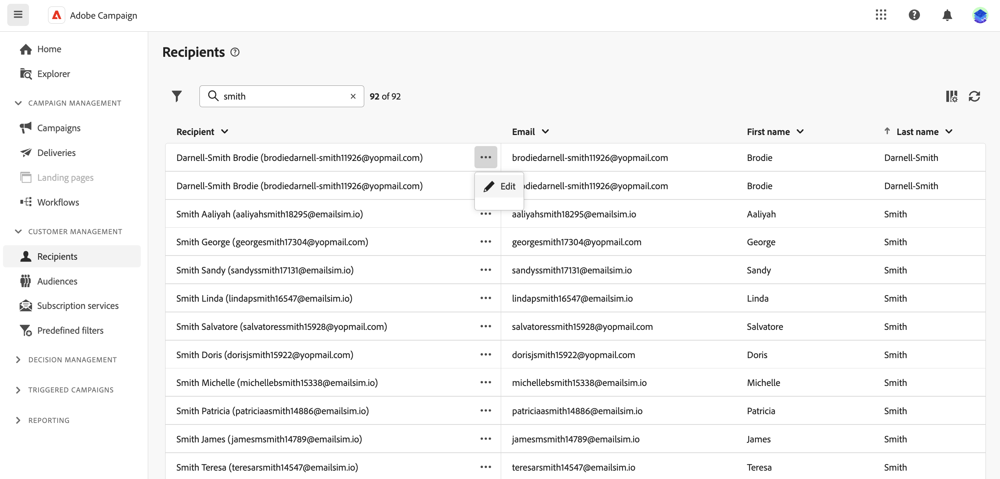

# 수신자 및 대상자 작업 {#about-recipients}

>[!CONTEXTUALHELP]
>id="acw_homepage_rn4"
>title="수신자 자세히 살펴보기"
>abstract="새로운 수신자를 생성하고, 강력한 보고서와 도구를 통해 모니터링합니다. 수신자의 속성, 상호 작용 및 로그에 액세스합니다. 필터링 옵션을 사용하여 수신자 목록을 찾아보고 프로필을 편집 및 업데이트합니다."
>additional-url="https://experienceleague.adobe.com/docs/campaign-web/v8/whats-new.html" text="릴리스 정보 참조"

>[!CONTEXTUALHELP]
>id="acw_recipients_list"
>title="프로필"
>abstract="프로필은 Adobe Campaign에서 보낸 메시지를 수신하도록 대상으로 지정된 개인입니다. Adobe Campaign에서 수신자는 게재(이메일, SMS)를 보낼 타겟팅된 기본 프로필입니다. 권한에 따라 이 목록에서 수신자의 프로필을 볼 수 있습니다. 필터링 옵션을 사용하여 이 목록을 찾아볼 수 있습니다. 일부 수신자의 속성을 편집하고 업데이트할 수 있습니다."

수신자는 Adobe Campaign에서 보낸 메시지를 수신하도록 대상으로 지정된 프로필입니다. Adobe Campaign에서 수신자는 게재(전자 메일, SMS 등)를 보낼 타겟팅된 기본 프로필입니다. 데이터베이스에 저장된 수신자 데이터를 사용하면 주어진 게재를 받을 대상을 만들고 게재 콘텐츠에 개인화 데이터를 추가할 수 있습니다. 다른 유형의 프로필은 데이터베이스에 저장됩니다. 다양한 용도로 디자인되었습니다. 예를 들어 최종 대상자에게 전송되기 전에 시드 프로필을 테스트하여 게재를 테스트합니다.

수신자는 Campaign 클라이언트 콘솔에서만 추가할 수 있습니다. 하지만 Campaign 웹의 **수신자** 왼쪽 탐색 레일의 항목. 해당 화면에서 수신자의 속성을 편집할 수도 있습니다.

수신자의 데이터를 편집하려면 이름 옆에 있는 세 점을 클릭하고 **편집...**.

이름, 성, 이메일 및 전화번호와 같은 제한된 속성 세트를 업데이트할 수 있습니다.

>[!NOTE]
>
>이 제한된 프로필 편집 양식은 Beta 프로그램 테스트용으로만 제공됩니다. 향후 릴리스에서 개선될 예정입니다. 사용자가 이메일 및 SMS 채널을 테스트하고 보낸 메시지를 받을 수 있도록 모든 프로필에 이메일 주소와 전화 번호를 빠르게 추가할 수 있습니다.

에서 검색 필드를 사용하여 수신자를 필터링할 수 있습니다. **필터 표시** 단추를 클릭합니다.

에서 수신자에 액세스할 수도 있습니다. **탐색기** 폴더 및 하위 폴더를 보고 탐색하며 만들고 관련 권한을 확인합니다.

>[!NOTE]
>
>사용 권한에 따라 데이터베이스에 저장된 전체 수신자 목록에 액세스하지 못할 수 있습니다. [이 섹션](../get-started/permissions.md)에서 권한에 대해 자세히 알아보십시오.

또한 뉴스레터와 같은 서비스에 대한 수신자의 구독 및 구독 취소를 관리할 수 있습니다. 에서 구독 서비스를 사용하여 작업하는 방법을 알아봅니다. [이 페이지](manage-services.md)

중복 제거, 강화, 프로필 결합 및 대상자 구축을 위한 워크플로우를 구축할 수 있습니다. [이 섹션](../workflows/gs-workflows.md)에서 자세히 알아보십시오.
