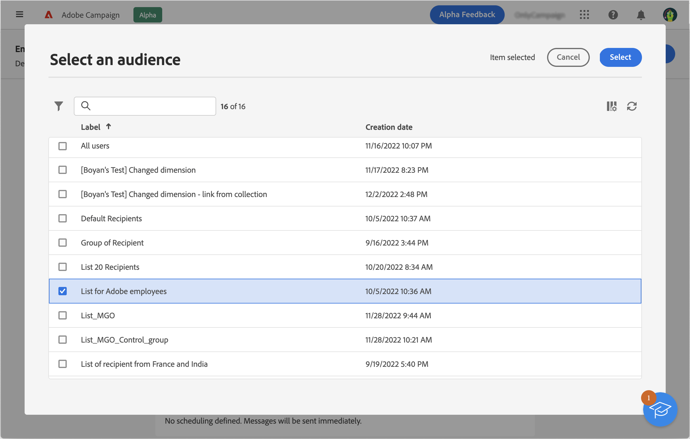

# 기존 대상자 선택 {#add-audience}

>[!CONTEXTUALHELP]
>id="acw_deliveries_email_audience_select"
>title="기존 대상자 선택"
>abstract="목록을 찾아 기존 대상자를 선택합니다. “필터 표시” 아이콘을 사용하여 목록을 필터링하거나 특정 폴더를 선택합니다."

이 섹션에서는 이메일 게재의 대상 모집단을 정의할 때 기존 대상자를 선택하는 방법에 대해 설명합니다.

이외에 수행할 수 있는 작업은 다음과 같습니다.

* 새 대상을 작성합니다. [자세히 알아보기](segment-builder.md)
* 외부 파일에서 대상자를 로드합니다(이메일에만 해당). [자세히 알아보기](file-audience.md)
* Adobe Experience Platform 대상자 사용 [자세히 알아보기](aep-audience.md)

메시지의 기존 대상자를 선택하려면 아래 단계를 따르십시오.

1. 게재 생성 도우미의 **대상자** 섹션에서 **[!UICONTROL 대상자 선택]** 버튼을 클릭합니다.

   

1. 기존 대상자를 사용하려면 **[!UICONTROL 대상자 선택]**&#x200B;을 선택합니다. 이 이메일에서 사용할 새 대상자를 만들려면 **직접 만들기**&#x200B;를 선택합니다. 이 [섹션](segment-builder.md)을 참조하십시오.

   이 화면에는 현재 폴더의 기존 대상이 모두 표시됩니다.

   

   대상자는 다음에서 만들어집니다. **대상자** 왼쪽 메뉴. 클라이언트 콘솔에서 만들 수도 있습니다.

   Adobe Experience Platform 대상을 사용하려면 대상과의 통합을 구성해야 합니다. 다음을 참조하십시오. [Adobe Experience Platform 대상 설명서](https://experienceleague.adobe.com/docs/experience-platform/destinations/home.html){target="_blank"}.

   >[!IMPORTANT]
   >
   >해당 제품 버전에서 규칙을 작성하거나, 게재 대상을 선택하거나, 워크플로우에서 대상을 작성할 때 사용자 인터페이스에서 사전 정의된 일부 필터를 사용할 수 없습니다. 계속 사용할 수 있습니다. [자세히 알아보기](../get-started/guardrails.md#predefined-filters-filters-guardrails-limitations)

1. 대상자를 선택하고 **선택**&#x200B;을 클릭합니다.
1. 사용 **필터 표시** 아이콘을 클릭하여 필터링 옵션을 표시합니다. 클릭 **규칙 추가** 규칙 빌더에 액세스: 규칙 빌더를 사용하면 대상자 목록에 대한 고급 필터를 만들 수 있습니다. 에서 규칙 빌더를 사용하는 방법을 알아봅니다 [섹션](segment-builder.md).

   

1. **저장**&#x200B;을 클릭합니다.

캠페인의 영향을 측정하기 위해 컨트롤 그룹을 설정할 수도 있습니다. 컨트롤 그룹은 메시지를 받지 않습니다. 그러면 메시지를 받은 모집단과 메시지를 받지 않은 연락처의 동작을 비교할 수 있습니다. [이 섹션](control-group.md)에서 자세히 알아보십시오.