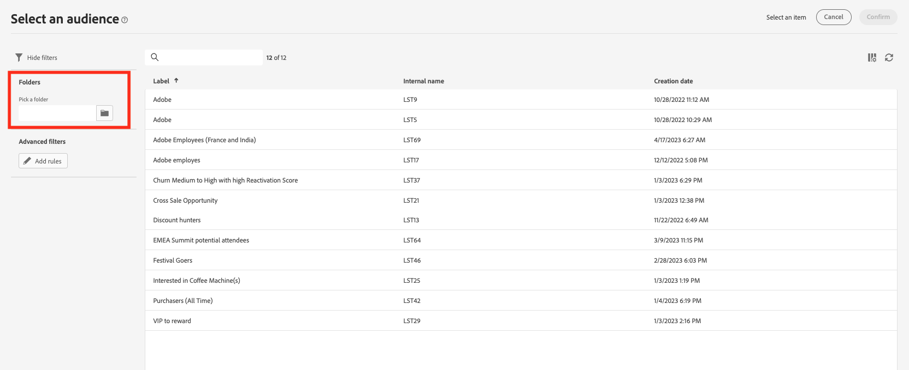

# 기존 대상자 선택 {#add-audience}

>[!CONTEXTUALHELP]
>id="acw_deliveries_email_audience_select"
>title="기존 대상자 선택"
>abstract="목록을 찾아 기존 대상자를 선택합니다. “필터 표시” 아이콘을 사용하여 목록을 필터링하거나 특정 폴더를 선택합니다."

이 섹션에서는 게재의 대상 모집단을 정의할 때 기존 대상자를 선택하는 방법을 설명합니다. 게재의 기본 대상을 정의할 때 다음을 수행할 수도 있습니다.
* [일회성 대상자 작성](one-time-audience.md) 쿼리 모델러를 사용하는 중입니다.
* [외부 파일에서 대상자 로드](file-audience.md) (이메일에만 해당).

게재에서 타겟팅할 수 있는 대상은에서 액세스할 수 있습니다. **대상자** 왼쪽 메뉴. 이는 클라이언트 콘솔, Campaign 웹 대상자 워크플로우 또는 Adobe Experience Platform과 같은 여러 소스에서 생성됩니다. [대상자에 대해 자세히 알아보기](manage-audience.md)

메시지의 기존 대상자를 선택하려면 아래 단계를 따르십시오.

1. 다음에서 **대상자** 게재 만들기 도우미의 섹션에서 **[!UICONTROL 대상자 선택]** 버튼을 누른 다음 선택 **[!UICONTROL 대상자 선택]**.

   {zoomable=&quot;yes&quot;}

1. 이 화면에는 현재 폴더의 기존 대상이 모두 표시됩니다.

   {zoomable=&quot;yes&quot;}

   Adobe Experience Platform에서 대상을 선택하려면 `AEP Audiences folder` 을 클릭합니다. [Adobe Experience Platform 대상자에 대해 자세히 알아보기](manage-audience.md#monitor)

   {zoomable=&quot;yes&quot;}

1. 필터 섹션에서 필터링 옵션에 액세스하여 대상자 목록을 세분화할 수 있습니다. 이렇게 하려면 다음을 클릭하십시오. **규칙 추가** 대상자 목록에 대한 고급 필터를 만들 수 있는 쿼리 모델러에 액세스합니다. [쿼리 모델러를 사용하는 방법 알아보기](../query/query-modeler-overview.md)

   예를 들어 아래와 같이 대상의 출처를 기준으로 필터링하는 규칙을 정의할 수 있습니다.

   {zoomable=&quot;yes&quot;}

1. 클릭 **확인** 게재 주요 타겟으로 대상을 추가합니다. 완료되면 쿼리 모델러를 사용하여 대상을 세분화할 수 있습니다. **규칙 편집** 단추를 클릭합니다.

   {zoomable=&quot;yes&quot;}

   캠페인의 영향을 측정하기 위해 컨트롤 그룹을 설정할 수도 있습니다. 컨트롤 그룹은 메시지를 받지 않습니다. 그러면 메시지를 받은 모집단과 메시지를 받지 않은 연락처의 동작을 비교할 수 있습니다. [자세히 알아보기](control-group.md)
