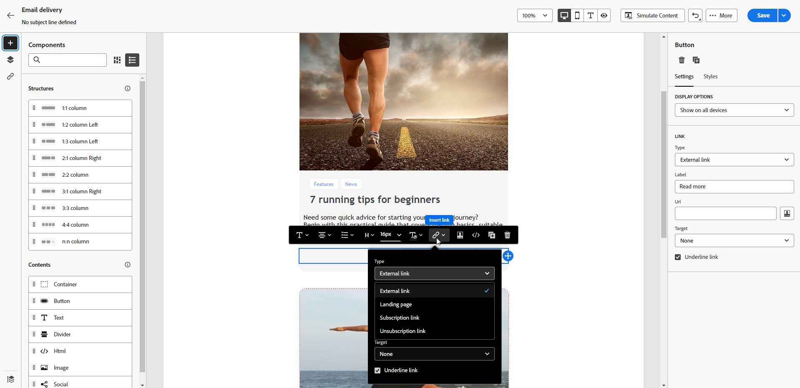

# 동의 관리 {#manage-consent}

## 일반 권장 사항 {#general-recommendations}

Adobe Campaign을 사용하면 개인 및 중요한 정보를 포함한 데이터를 수집할 수 있습니다. GDPR(일반 데이터 보호 규정) 및 기타 적용 가능한 개인 정보 보호법과 같은 데이터 보호 규정을 준수하여 수신자의 동의를 받고 모니터링하는 것이 필수적입니다.

* 먼저 요청하지 않은 이메일, 푸시 알림 및 SMS 메시지(&quot;스팸&quot;)를 보내지 마십시오. Adobe은 고객 생애 가치 및 충성도를 높이기 위한 허가 마케팅의 원칙을 강력하게 지원합니다. Adobe은 요청하지 않은 메시지 전송에 Adobe Campaign을 사용하는 것을 엄격히 금지합니다. [자세히 알아보기](#denylisted-profiles)

* 수신자가 <!-- and keep honoring opt-out requests as quickly as possible--> 게재에서 옵트아웃할 수 있는 기능을 제공하여 커뮤니케이션 수신에 동의하는지 항상 확인하십시오. [자세히 알아보기](#opt-out)

* 구독 관리 프로세스를 사용하여 수신자의 환경 설정을 관리하고 특정 구독 유형을 선택한 수신자를 추적합니다. [자세히 알아보기](../../delivery/using/about-services-and-subscriptions.md)

## 옵트아웃 관리 {#opt-out}

수신자가 브랜드로부터 커뮤니케이션 수신을 거부할 수 있는 기능을 제공하는 것은 법적 요구 사항입니다. 이 선택이 존중되도록 하는 것도 필요하다. <!--Learn more about the applicable legislation in the [Adobe Campaign Classic v7 documentation](https://experienceleague.adobe.com/docs/campaign-classic/using/getting-started/privacy/privacy-and-recommendations.html?lang=ko#privacy-regulations){target="_blank"}.-->

**중요한 이유**

* 이러한 규정을 준수하지 않으면 브랜드에 대한 규제 법률 리스크가 발생합니다.
* 이는 원하지 않는 커뮤니케이션을 수신자에게 보내지 않도록 하여 메시지를 스팸으로 표시하고 명성을 손상시킬 수 있습니다.

Adobe Campaign 웹을 사용하여 게재를 보낼 때 고객이 향후 커뮤니케이션에서 구독을 취소할 수 있는지 확인합니다. 구독을 취소하면 향후 마케팅 메시지 대상자에서 프로필이 자동으로 제거됩니다.

### 이메일 옵트아웃 {#email-opt-out}

수신자가 이메일 커뮤니케이션 수신을 거부할 수 있도록 하려면 수신자에게 보내는 모든 이메일에 **구독 취소 링크**&#x200B;를 포함하십시오.

다음 단계를 수행하십시오.

1. 외부 랜딩 페이지를 만들고 원하는 서드파티 시스템에 호스팅합니다.

1. 이메일 게재를 만듭니다. [방법 알아보기](../email/create-email.md)

1. 이메일 콘텐츠에 링크를 삽입합니다. [방법 알아보기](../email/message-tracking.md#insert-links)

   

1. **[!UICONTROL Url]** 필드에 서드파티 랜딩 페이지 링크를 붙여 넣습니다.

1. 추적할 콘텐츠의 모든 URL 목록을 표시하려면 왼쪽 창에서 **[!UICONTROL 링크]** 아이콘을 클릭합니다.

1. 새 링크 옆에 있는 연필 아이콘을 클릭하여 편집합니다.

1. **[!UICONTROL 추적 유형]**&#x200B;을(를) 수정하고 **[!UICONTROL 옵트아웃]**(으)로 설정합니다.

   

1. **[!UICONTROL 저장]**&#x200B;을 클릭하고 메시지를 보냅니다. [자세히 알아보기](../monitor/prepare-send.md)

1. 메시지가 수신되면 수신자가 구독 취소 링크를 클릭하면 랜딩 페이지가 표시됩니다.

1. 수신자가 랜딩 페이지 양식을 제출하면 프로필 데이터가 업데이트됩니다. [자세히 알아보기](#denylisted-profiles)

<!--Any other option available such as one-click opt-out link or List-Unsubscribe (to include an unsubscribe link in the email header) to enable opt-out in a delivery?-->

## 차단 목록에 추가된 프로필 {#denylisted-profiles}

구독 취소(옵트아웃) 후 프로필이 지정된 채널의 **차단 목록**&#x200B;에 추가됩니다. 즉, 더 이상 게재의 대상이 아닙니다.

>[!NOTE]
>
>이메일 채널에 대한 차단 목록에 추가하다의 프로필에 두 개의 이메일 주소가 있는 경우 두 주소 모두 게재에서 제외됩니다.

프로필의 **[!UICONTROL 세부 정보]** 탭에 있는 **[!UICONTROL 더 이상 연락하지 않음]** 섹션에서 하나 이상의 채널에 대해 프로필이 차단 목록 중인지 확인할 수 있습니다. [자세히 알아보기](../audience/about-recipients.md#access)

프로필 세부 정보의 

<!--Denylisted status on quarantine list

Additionally, when recipients report your message as spam, or reply to an SMS message with a keyword such as "STOP", their address or phone number is quarantined with the **[!UICONTROL Denylisted]** status. Their profile is updated accordingly.

QUESTION: When a user marks an email as spam, is the profile's No longer contact section also updated? Apparently no (not the same = quarantine vs denylist)

>[!NOTE]
>
>The **[!UICONTROL Denylisted]** status refers to the address only, the profile is not on the denylist, so that the user continues receiving SMS messages and push notifications.

Learn more about Feedback loops in the [Delivery Best Practices Guide](https://experienceleague.adobe.com/docs/deliverability-learn/deliverability-best-practice-guide/transition-process/infrastructure.html?lang=ko#feedback-loops){target="_blank"}.

Learn more about quarantine in the [Campaign v8 (client console) documentation](https://experienceleague.adobe.com/docs/campaign/campaign-v8/send/failures/quarantines.html?lang=ko#non-deliverable-bounces){target="_blank"}.-->