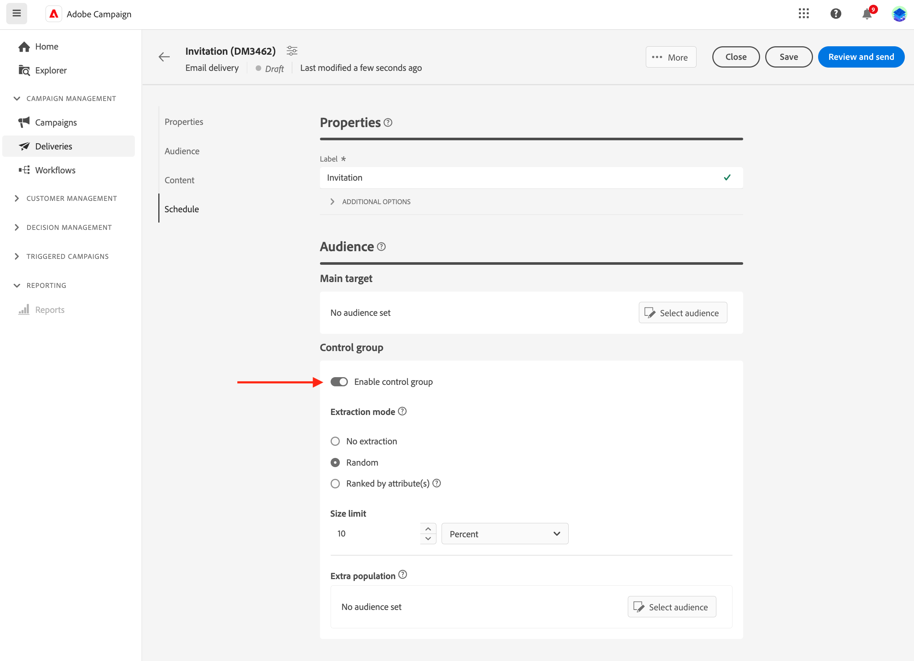
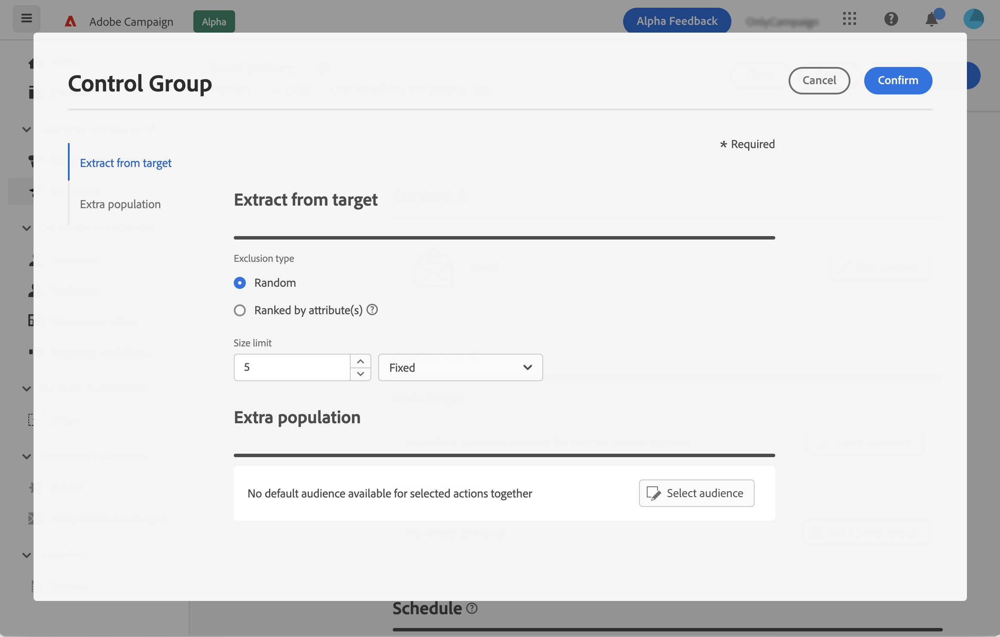

# 컨트롤 그룹 설정 {#control-group}

캠페인의 영향을 측정하기 위해 컨트롤 그룹을 사용하여 대상의 일부에 메시지를 보내지 않아도 됩니다.

이렇게 하려면 게재 대상자를 정의할 때 컨트롤 그룹을 만듭니다. 프로필은 임의로, 필터링 여부에 따라, 또는 기준에 따라 컨트롤 그룹에 추가됩니다. 그러면 메시지를 받은 대상 모집단과 타겟팅되지 않은 연락처의 동작을 비교할 수 있습니다.

컨트롤 그룹은 기본 대상에서 임의로 추출하거나 특정 모집단에서 선택할 수 있습니다. 따라서 컨트롤 그룹을 정의하는 방법에는 두 가지가 있습니다.

* 기본 타겟에서 프로필을 몇 개 추출합니다.
* 쿼리에 정의된 기준을 기반으로 일부 프로필을 제외합니다.

컨트롤 그룹을 정의할 때 두 가지 방법을 모두 사용할 수 있습니다.

게재 준비 단계에서 컨트롤 그룹에 속한 모든 프로필은 기본 대상에서 제거됩니다. 전송되면 메시지가 수신되지 않습니다.

컨트롤 그룹을 만들려면 **[!UICONTROL 컨트롤 그룹 설정]** 버튼, **Audience** 게재 만들기 도우미의 섹션을 참조하십시오.

## 대상에서 추출 {#extract-target}

>[!CONTEXTUALHELP]
>id="acw_deliveries_email_controlgroup_target"
>title="대상에서 추출"
>abstract="TBC"

컨트롤 그룹을 정의하려면, 임의로 또는 대상 모집단에서 정렬, 백분율 또는 고정된 수의 프로필을 추출하도록 선택할 수 있습니다.

먼저 대상에서 프로필을 추출하는 방법을 정의합니다. 임의로 또는 정렬을 기준으로 합니다.

아래에 **대상에서 추출** 섹션에서 **제외 유형**:

* **Random**: 게재를 준비할 때, Adobe Campaign은 백분율이나 크기 제한으로 설정할 최대 수에 해당하는 여러 개의 프로필을 임의로 추출합니다.

   

* **속성별 등급**: 이 옵션을 사용하면 특정 정렬 순서에서 특정 속성에 따라 프로필 세트를 제외할 수 있습니다.

   

그런 다음 을(를) 정의합니다 **크기 제한**: 기본 대상에서 추출하는 프로필 수를 제한하는 방법을 설정해야 합니다.

**예제**

로그를 보고 제외된 프로필을 확인하고 식별할 수 있습니다. 다섯 개의 프로필에 대한 임의 제외 예를 살펴보겠습니다.

게재를 준비한 후 다음 화면에서 제외를 볼 수 있습니다.

* 다음 **제외하려면** 전송 전 게재 대시보드의 KPI입니다.

   

* 다음 **제외 로그** 각 프로필 및 관련 제외 표시 **이유**.

   

* 다음 **제외 원인** 각 유형화 규칙에 대해 제외된 프로필 수를 표시합니다.

   

게재 로그에 대한 자세한 내용은 다음을 참조하십시오 [섹션](../monitor/delivery-logs.md).

## 추가 모집단 {#extra-population}

>[!CONTEXTUALHELP]
>id="acw_deliveries_email_controlgroup_extra"
>title="추가 모집단"
>abstract="TBC"

컨트롤 그룹을 정의하는 또 다른 방법은 기존 대상자를 사용하거나 쿼리를 정의하여 특정 모집단을 대상에서 제외하는 것입니다.

에서 **추가 모집단** 섹션 **컨트롤 그룹** 정의 화면에서 **[!UICONTROL 대상 선택]** 버튼을 클릭합니다.

* 기존 대상자를 사용하려면 **대상 선택**. 다음을 참조하십시오 [섹션](add-audience.md).

* 새 쿼리를 정의하려면 **직접 만들기** 및 규칙 빌더를 사용하여 제외 기준을 정의합니다. 다음을 참조하십시오 [섹션](segment-builder.md).

대상에 포함되거나 쿼리 결과와 일치하는 프로필은 대상에서 제외됩니다.