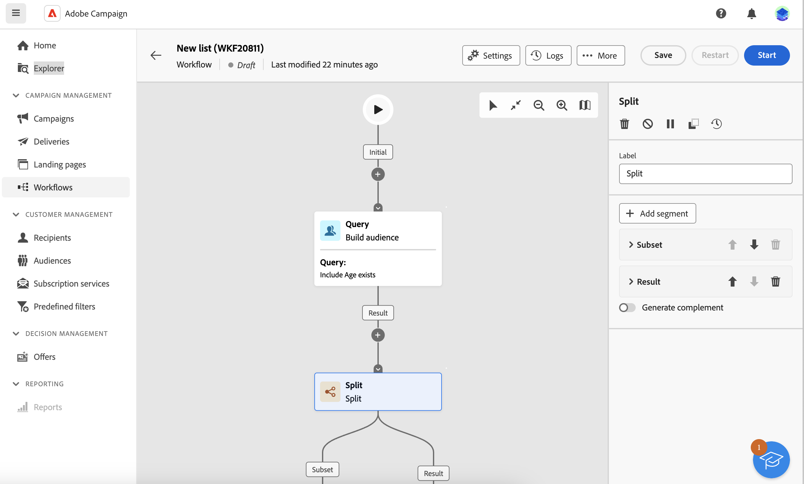

# 대상자 만들기 {#create-audiences}

Campaign 웹을 사용하면 기존 대상자를 시각적 캔버스로 결합할 수 있는 워크플로우를 만들 수 있습니다. Split 또는 Excluse와 같은 다양한 워크플로우 활동을 통합하여 새롭고 세분화된 대상을 생성할 수 있습니다.

워크플로우를 만들면 결과 대상자가 기존 대상자와 함께 Campaign 웹 내에 자동으로 저장됩니다. 그런 다음 이러한 대상을 캠페인 또는 독립 실행형 게재에서 타기팅할 수 있습니다.

## 첫 번째 대상자 만들기 {#create}

대상자를 만들려면 다음 단계를 수행합니다.

1. 다음 위치로 이동 **[!UICONTROL 대상]** 메뉴를 클릭하고 **[!UICONTROL 대상자 만들기]** 오른쪽 상단 모서리에 있는 단추입니다.
1. 대상자에 대한 레이블을 제공합니다.
1. 확장 **[!UICONTROL 추가 옵션]** 섹션을 통해 고급 대상 매개 변수를 구성합니다.

   기본적으로 대상자는 **[!UICONTROL 프로필 및 타겟]** / **[!UICONTROL 목록]** explorer 메뉴. 를 사용하여 기본 저장소 위치를 변경할 수 있습니다. **[!UICONTROL 폴더]** 필드.

   

1. 대상자 설정을 구성한 후 **[!UICONTROL 대상자 만들기]** 단추를 클릭합니다.

1. 두 개의 기본 활동을 특징으로 하는 워크플로 캔버스가 표시됩니다.

   * **[!UICONTROL 대상자 작성]**: 대상자를 만들고 워크플로우의 기반으로 사용할 수 있도록 하는 워크플로우의 시작점입니다.
   * **[!UICONTROL 대상자 저장]**: 워크플로우의 마지막 단계를 나타내므로 결과를 새 대상자로 저장할 수 있습니다.

1. 필요한 만큼 활동을 추가하여 워크플로우를 사용자 정의합니다. 워크플로우 활동 구성 방법에 대한 자세한 내용은 [워크플로우 설명서](../workflows/activities/about-activities.md).

   >[!NOTE]
   >
   >채널 활동은 대상자 워크플로우에서 사용할 수 없습니다.

   

1. 워크플로우가 준비되면 **[!UICONTROL 시작]** 실행할 수 있습니다.

1. 워크플로는에 저장됩니다. **[!UICONTROL 워크플로]** 목록을에서 액세스할 수 있는 동안 **[!UICONTROL 대상]** 목록을 표시합니다. [대상자 모니터링 및 관리 방법 알아보기](access-audiences.md)
