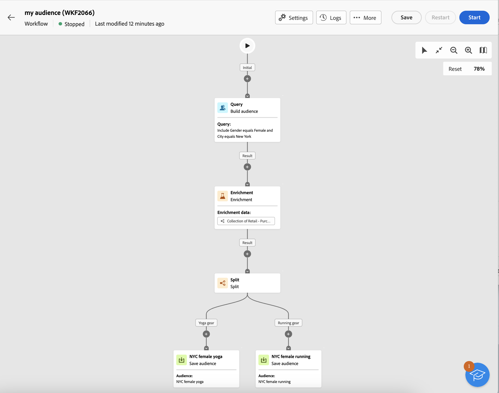

# 대상자 만들기 {#create-audiences}

>[!CONTEXTUALHELP]
>id="acw_audiences_list"
>title="대상자"
>abstract="이 화면에서 워크플로 또는 독립 실행형 게재에서 타겟팅할 수 있는 모든 대상자 목록에 액세스할 수 있습니다. 시각적 캔버스에 새 대상자를 만들려면 **만들기**&#x200B;를 클릭합니다.  처음부터 시작하여 간단한 대상자를 만드는 것 외에도 워크플로 활동을 활용하여 대상자를 세분화할 수도 있습니다. 예를 들어 여러 대상자를 하나로 결합하거나, 외부 속성으로 대상자를 강화하거나, 선택한 규칙에 따라 여러 대상자로 나눌 수 있습니다."

<!--
[!CONTEXTUALHELP]
>id="acw_audiences_create_settings"
>title="Audience settings"
>abstract="Enter the name of the audience and additional options, then click the **Create Audience** button."-->

Campaign 웹을 사용하면 시각적 워크플로우 캔버스로 새로운 대상을 만들 수 있습니다. 처음부터 시작하여 간단한 대상자를 만드는 것 외에도 워크플로 활동을 활용하여 대상자를 세분화할 수도 있습니다. 예를 들어 여러 대상자를 하나로 결합하거나, 외부 속성으로 대상자를 강화하거나, 선택한 규칙에 따라 여러 대상자로 나눌 수 있습니다.

워크플로우를 만들면 결과 대상자가 기존 대상자와 함께 Campaign 데이터베이스 내에 자동으로 저장됩니다. 그런 다음 워크플로우 또는 독립 실행형 게재에서 이러한 대상을 타기팅할 수 있습니다.

**[!UICONTROL 원본]** 열은 대상의 원본을 나타냅니다. **[!UICONTROL Adobe Campaign]** 대상은 Adobe Campaign v8 콘솔 또는 웹 사용자 인터페이스를 만들었으며 **[!UICONTROL Adobe Experience Platform:]** 대상은 Adobe Experience Platform 내에서 만들어졌고 Adobe 원본 및 대상 통합을 사용하여 Campaign에 통합되었습니다.

➡️0}비디오에서 이 기능 살펴보기](#video)[

## 첫 번째 대상자 만들기 {#create}

대상자를 만들려면 다음 단계를 수행합니다.

1. **[!UICONTROL 대상자]** 메뉴로 이동한 다음 오른쪽 상단의 **[!UICONTROL 대상자 만들기]** 단추를 클릭합니다.

1. 새 워크플로우가 자동으로 만들어지므로 활동을 결합하여 대상을 생성할 수 있습니다. 기본적으로 캔버스에는 두 개의 기본 활동이 포함되어 있습니다.

   * &quot;쿼리&quot; **[!UICONTROL 대상 작성]** 활동은 워크플로우의 시작점이며, 이를 통해 대상을 만들고 워크플로우의 기반으로 사용할 수 있습니다.

   * &quot;새 대상&quot; **[!UICONTROL 대상 저장]** 활동은 워크플로우의 마지막 단계를 나타내므로 결과를 새 대상으로 저장할 수 있습니다.

   {zoomable="yes"}

   >[!IMPORTANT]
   >
   >대상자 워크플로는 다른 캠페인 워크플로와 함께 **워크플로** 메뉴에 저장됩니다. 대상자를 빌드하도록 특별히 설계되었으며 세로 캔버스로 식별할 수 있습니다.

1. 가독성을 높이려면 워크플로 설정의 **레이블** 필드에서 워크플로 이름을 변경하는 것이 좋습니다. [워크플로 설정을 구성하는 방법 알아보기](../workflows/workflow-settings.md)

1. **[!UICONTROL 대상 만들기]** 활동을 열고 쿼리 모델러를 사용하여 데이터베이스에 포함된 데이터를 필터링하여 대상에 포함할 모집단을 정의합니다. [대상 만들기 활동을 구성하는 방법을 알아봅니다](../workflows/activities/build-audience.md)

1. 워크플로우에 타겟팅된 모집단에서 추가 작업을 수행하려면 필요한 만큼 활동을 추가하고 함께 연결합니다. 워크플로우 활동을 구성하는 방법에 대한 자세한 내용은 [워크플로우 설명서](../workflows/activities/about-activities.md)를 참조하세요.

   >[!NOTE]
   >
   >채널 활동은 대상자 워크플로우에서 사용할 수 없습니다.

   {zoomable="yes"}

1. 워크플로우에서 업스트림으로 계산한 모집단을 저장할 방법을 지정하려면 **[!UICONTROL 대상자 저장]** 활동을 구성하십시오. [대상자 저장 활동을 구성하는 방법을 알아봅니다](../workflows/activities/save-audience.md)

1. 워크플로우가 준비되면 **[!UICONTROL 시작]**&#x200B;을 클릭하여 실행합니다.

워크플로는 **[!UICONTROL 워크플로]** 목록에 저장되지만, 결과 대상자는 **[!UICONTROL 대상자]** 목록에서 **대상자 저장** 활동에 정의된 레이블로 액세스할 수 있습니다. [이 섹션](manage-audience.md)에서 대상을 모니터링하고 관리하는 방법을 알아보세요.

이제 이 대상을 게재의 주요 대상으로 사용할 수 있습니다. [자세히 알아보기](add-audience.md)

## 대상 워크플로우 예 {#example}

아래 예제는 뉴욕에 거주하는 여성 고객을 타겟팅하고 최신 구매 내역(요가 또는 러닝 기어)에 따라 두 개의 새 대상을 만들도록 구성된 대상 워크플로우를 보여 줍니다.

{zoomable="yes"}

1. **[!UICONTROL 대상자 만들기]** 활동은 뉴욕에 사는 모든 여성 프로필을 타깃팅합니다.
1. **[!UICONTROL 데이터 보강]** 활동은 고객이 구매한 제품 유형을 식별하기 위해 구매 테이블의 정보를 통해 대상자를 강화합니다.
1. **[!UICONTROL 분할]** 활동은 고객의 최신 구매를 기준으로 워크플로우를 두 개의 경로로 나눕니다.
1. 각 경로 끝에 있는 **[!UICONTROL 대상자 저장]** 활동은 각 경로에서 계산한 모집단을 포함하여 데이터베이스에 두 개의 새 대상을 만듭니다.

## 대상자 편집 {#edit}

필요한 경우 해당 워크플로우를 다시 실행하여 워크플로우에서 생성된 대상자를 수정할 수 있습니다. 이를 통해 손쉽게 대상 데이터를 새로 고치거나 필요에 따라 쿼리를 조정하여 대상을 세분화할 수 있습니다.

1. **대상자** 메뉴로 이동하여 편집할 대상자를 엽니다.
1. **개요** 탭에서 **마지막 워크플로** 섹션은 대상자를 생성하는 데 사용되는 워크플로에 대한 링크를 제공합니다. 워크플로우에 액세스하려면 클릭합니다.
1. 원하는 대로 변경하고 **시작** 단추를 클릭하여 워크플로우를 다시 실행하십시오. 완료되면 워크플로우로 인한 대상자가 최신 워크플로우 결과로 자동 업데이트됩니다.

기본적으로 대상 워크플로우를 다시 실행하면 대상의 전체 콘텐츠가 새 데이터로 대체되므로 이전 데이터가 손실됩니다.

기존 대상 결과를 바꾸지 않으려면 요구 사항에 맞게 **대상 저장** 활동을 구성하십시오. 예를 들어 **대상 레이블** 필드를 변경하여 새 결과를 새 대상으로 저장하거나 이전 데이터를 지우는 일 없이 기존 대상 콘텐츠에 새 결과를 추가할 수 있습니다. [대상자 저장 활동을 구성하는 방법에 대해 알아보세요](../workflows/activities/save-audience.md)

{zoomable="yes"}

## 사용법 비디오 {#video}

대상을 빌드 및 관리하고, 게재할 대상을 선택하고, 컨트롤 그룹을 정의하는 방법에 대해 알아봅니다.

>[!VIDEO](https://video.tv.adobe.com/v/3425861?quality=12)
