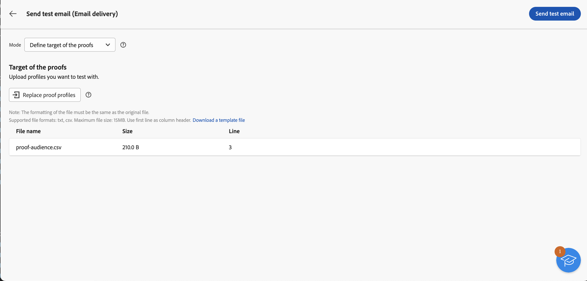

# 파일에서 이메일 대상자 로드 {#audience-from-file}

>[!CONTEXTUALHELP]
>id="acw_audience_fromfile_select"
>title="파일 선택"
>abstract="업로드할 로컬 파일을 선택합니다. 지원되는 형식은 TXT 및 CSV입니다. 파일 형식을 아래 링크된 샘플 파일에 일치시킵니다."

>[!CONTEXTUALHELP]
>id="acw_audience_fromfile_columns"
>title="열 정의"
>abstract="외부 파일의 열 형식을 확인합니다."

>[!CONTEXTUALHELP]
>id="acw_audience_fromfile_formatting"
>title="서식 지정 매개변수"
>abstract="데이터를 올바르게 가져올 수 있도록 외부 파일의 형식을 지정하는 방법을 지정합니다."

>[!CONTEXTUALHELP]
>id="acw_audience_fromfile_preview"
>title="파일 미리보기"
>abstract="외부 파일의 열 미리보기를 확인합니다. 이 화면에는 최대 30개까지의 레코드만 표시됩니다."

외부 파일에 저장된 프로필을 타겟팅할 수 있습니다. 프로필이 데이터베이스에 추가되지 않지만 입력 파일의 모든 필드를 사용할 수 있습니다. [개인화](../personalization/gs-personalization.md). 지원되는 파일 형식은 텍스트(TXT) 및 쉼표로 구분된 값(CSV)입니다. 이 문서에서는 독립 실행형 이메일 게재를 만들 때 외부 프로필을 로드하는 방법을 설명합니다. 워크플로우의 파일에서 데이터를 로드하려면 다음을 참조하십시오. [이 페이지](../workflows/activities/load-file.md).

>[!CAUTION]
>
>* 이 기능은 에만 사용할 수 있습니다. **이메일 게재**. SMS 또는 푸시 게재에서는 사용할 수 없습니다.
>
>* 외부 파일에서 대상 모집단을 로드하면 [컨트롤 그룹](control-group.md)을 사용할 수 없습니다.
>
>* 프로필은 데이터베이스에 추가되지 않고 이 특정 독립 실행형 이메일 게재에만 로드되고 사용할 수 있습니다.

## 파일 선택 및 구성 {#upload}

이메일 인터페이스에서 직접 로컬 파일의 프로필을 타겟팅하려면 다음 단계를 수행합니다.

1. 기존 이메일 게재를 열거나 [새 이메일 게재 만들기](../email/create-email.md).
1. **대상자** 섹션의 이메일 게재 생성 창에서 **대상자 선택** 버튼을 클릭하고 **파일에서 선택** 옵션을 선택합니다.

   {zoomable=&quot;yes&quot;}

1. 사용할 로컬 파일을 선택합니다. 형식은 와 일치해야 합니다. [샘플 파일](#sample-file).
1. 화면 중앙 섹션에서 데이터가 매핑되는 방식을 미리 보고 확인합니다.
1. **주소 필드** 드롭다운에서 이메일 주소가 포함된 열을 선택합니다. 입력 파일에 이러한 정보가 있는 경우 차단 목록 열을 선택할 수도 있습니다.
1. 열 설정과 사용 가능한 옵션에서 데이터 서식을 지정하는 방법을 조정합니다.
1. 설정이 적절하면 **확인**&#x200B;을 클릭합니다.

메시지 콘텐츠를 만들고 개인화할 때 의 입력 파일에서 필드를 선택할 수 있습니다. [개인화 편집기](../personalization/gs-personalization.md).

{zoomable=&quot;yes&quot;}

## 샘플 파일 {#sample-file}

>[!CONTEXTUALHELP]
>id="acw_audience_fromfile_samplefile"
>title="파일에서 대상자 로드"
>abstract="지원되는 파일 형식은 TXT 및 CSV입니다. 첫 번째 라인을 열 머리글로 사용합니다. 파일 형식을 아래 링크에서 확인할 수 있는 샘플 파일에 일치시킵니다."

지원되는 형식은 TXT 및 CSV입니다. 첫 번째 줄은 열 머리글입니다.

파일 형식을 아래의 샘플 파일과 일치시키십시오.

```javascript
{
lastname,firstname,city,birthdate,email,denylist
Smith,Hayden,Paris,23/05/1985,hayden.smith@example.com,0
Mars,Daniel,London,17/11/1999,danny.mars@example.com,0
Smith,Clara,Roma,08/02/1979,clara.smith@example.com,0
Durance,Allison,San Francisco,15/12/2000,allison.durance@example.com,1
}
```

## 이메일 미리 보기 및 테스트 {#test}

Campaign 웹을 사용하면 파일에서 업로드한 대상자를 사용할 때 증명을 미리 보고 보낼 수 있습니다. 이렇게 하려면 다음 단계를 수행합니다.

1. 다음을 클릭합니다. **[!UICONTROL 콘텐츠 시뮬레이션 버튼]** 게재 콘텐츠 편집 화면에서 **[!UICONTROL 테스트 프로필 추가]** 단추를 클릭합니다.

1. 업로드된 파일에 포함된 프로필이 표시됩니다. 콘텐츠를 미리 보는 데 사용할 프로필을 선택하고 **[!UICONTROL 선택]**.

1. 게재 콘텐츠 미리보기가 화면의 오른쪽 창에 표시됩니다. 개인화된 요소는 왼쪽 창에서 선택한 프로필의 데이터로 바뀝니다. [게재 콘텐츠 미리 보기에 대해 자세히 알아보기](../preview-test/preview-content.md)

   {zoomable=&quot;yes&quot;}

1. 증명을 보내려면 **[!UICONTROL 증명 보내기]** 단추를 클릭합니다.

1. 다음을 클릭합니다. **[!UICONTROL 증명 프로필 업로드]** 버튼을 클릭하고 증명 수신자가 포함된 .txt 또는 .csv 파일을 선택합니다.

   >[!CAUTION]
   >
   >파일 형식이 대상자를 업로드하는 데 사용된 형식과 일치하는지 확인합니다. 형식 오류가 발생하면 경고가 표시됩니다.

1. 증명 수신자가 추가되고 증명을 보낼 준비가 되면 **[!UICONTROL 증명 보내기]** 단추를 클릭하고 전송을 확인합니다.

   {zoomable=&quot;yes&quot;}

1. 다음을 사용하여 증명 전송을 모니터링할 수 있습니다. **[!UICONTROL 증명 보기]** 언제든지 버튼을 누릅니다. [증명 모니터링에 대해 자세히 알아보기](../preview-test/test-deliveries.md#access-test-deliveries)
