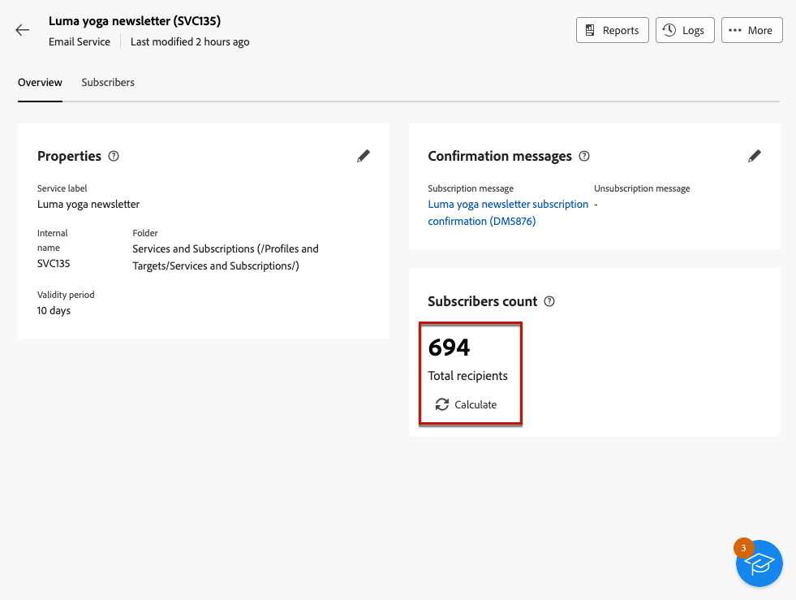

# 구독 서비스 만들기 및 관리 {#manage-services}

>[!CONTEXTUALHELP]
>id="acw_subscriptions_list"
>title="서비스 만들기 및 관리"
>abstract="Adobe Campaign을 사용하면 뉴스레터와 같은 서비스를 생성 및 모니터링하고 이러한 서비스에 대한 구독 또는 구독 취소를 확인할 수 있습니다. 구독은 이메일 및 SMS 게재에만 적용됩니다."

Adobe Campaign 웹을 사용하여 뉴스레터와 같은 서비스를 관리 및 생성하고, 이러한 서비스의 구독 또는 구독 취소를 확인하십시오.

예를 들어 특정 제품 카테고리에 대한 뉴스레터, 웹 사이트의 테마 또는 영역, 다양한 유형의 경고 메시지 구독 및 실시간 알림과 같은 여러 서비스를 동시에 정의할 수 있습니다.

>[!NOTE]
>
>구독은 이메일 및 SMS 게재에만 적용됩니다.

## 구독 서비스 액세스 {#access-services}

플랫폼에서 사용할 수 있는 구독 서비스에 액세스하려면 아래 단계를 따르십시오.

1. 다음으로 이동 **[!UICONTROL 구독 서비스]** 메뉴 아래의 왼쪽 탐색 레일에서 사용할 수 있습니다.

   {zoomable=&quot;yes&quot;}

1. 모든 기존 구독 서비스 목록이 표시됩니다. 서비스를 검색하고 채널, 폴더에서 필터링하거나 [쿼리 모델러](../query/query-modeler-overview.md).

   {zoomable=&quot;yes&quot;}

1. 기존 서비스를 편집하려면 해당 이름을 클릭합니다.

1. 서비스 이름 옆에 있는 세 점 아이콘을 사용하여 서비스를 삭제하거나 복제할 수 있습니다.<!--so all subscribers are unsubscribed - need to mention?-->

## 첫 구독 서비스 만들기 {#create-service}

>[!CONTEXTUALHELP]
>id="acw_subscriptions_list_properties"
>title="서비스 속성 정의"
>abstract="구독 서비스의 레이블을 입력하고 서비스 유효 기간과 같은 추가 옵션을 정의합니다."

>[!CONTEXTUALHELP]
>id="acw_subscriptions_list_confirm"
>title="확인 메시지 선택"
>abstract="사용자가 서비스를 구독하거나 구독 취소하면 확인 메시지를 전송할 수 있습니다. 확인 메시지에 사용할 템플릿을 선택합니다."

구독 서비스를 만들려면 아래 단계를 수행하십시오.

1. 다음 항목 선택 **[!UICONTROL 구독 서비스 만들기]** 단추를 클릭합니다.

   {zoomable=&quot;yes&quot;}

1. 채널 선택: **[!UICONTROL 이메일]** 또는 **[!UICONTROL SMS]**.

1. 서비스 속성에서 레이블을 입력하고 다음을 정의합니다 **[!UICONTROL 추가 옵션]** 원하는대로

   {zoomable=&quot;yes&quot;}

1. 기본적으로 서비스는 **[!UICONTROL 서비스 및 구독]** 폴더를 삭제합니다. 원하는 위치로 이동하여 변경할 수 있습니다. [폴더 작업 방법 알아보기](../get-started/permissions.md#folders)

1. 기본적으로 구독은 무제한입니다.

   다음을 비활성화할 수 있습니다. **[!UICONTROL 무제한 유효 기간]** 서비스의 유효 기간을 정의하는 옵션. 유효 기간이 종료되면:
   * 더 이상 이 서비스를 구독할 수 있는 프로필이 없습니다.
   * 이 서비스의 모든 구독자는 자동으로 구독 취소됩니다.

   {zoomable=&quot;yes&quot;}

1. 사용자가 서비스를 구독하거나 구독 취소하면 확인 메시지를 전송할 수 있습니다. 사용 사례에 따라 해당 메시지에 사용할 템플릿을 선택합니다. 이러한 템플릿은 **[!UICONTROL 구독]** 대상 매핑. [자세히 알아보기](#create-confirmation-message)

   {zoomable=&quot;yes&quot;}

1. 클릭 **[!UICONTROL 저장 및 검토]**. 새 서비스가 다음에 추가됩니다. **[!UICONTROL 구독 서비스]** 목록을 표시합니다.

이제 다음을 수행할 수 있습니다.

* 이 서비스에 가입자를 추가하고 프로필 가입을 취소합니다. [자세히 알아보기](../msg/send-to-subscribers.md)

* 이 서비스의 구독자에게 메시지를 보냅니다. [방법 알아보기](../msg/send-to-subscribers.md)

## 확인 메시지 만들기 {#create-confirmation-message}

>[!CONTEXTUALHELP]
>id="acw_subscriptions_delivery_template"
>title="구독 게재 템플릿 선택"
>abstract="서비스를 구독하는 사용자에게 확인 메시지를 보내려면 정의된 대상 없이 **[!UICONTROL 구독]** 대상 매핑을 기반으로 특정 게재 템플릿을 선택해야 합니다."

>[!CONTEXTUALHELP]
>id="acw_unsubscriptions_delivery_template"
>title="구독 취소 게재 템플릿 선택"
>abstract="서비스 구독을 취소하는 사용자에게 확인 메시지를 보내려면 정의된 대상 없이 **[!UICONTROL 구독]** 대상 매핑을 기반으로 특정 게재 템플릿을 선택해야 합니다."

서비스를 구독하거나 구독 취소하는 사용자에게 확인 메시지를 보내려면 **[!UICONTROL 구독]** 정의된 대상 없이 대상 매핑. 이렇게 하려면 아래 절차를 따르십시오.

1. 구독 확인을 위한 게재 템플릿을 만듭니다. [템플릿을 만드는 방법 알아보기](../msg/delivery-template.md)

1. 이 게재의 대상자를 선택하지 마십시오. 대신 게재에 액세스합니다 **[!UICONTROL 설정]**&#x200B;로 이동합니다. [대상자](../advanced-settings/delivery-settings.md#audience) 탭을 클릭하고 다음을 선택합니다. **[!UICONTROL 구독]** 목록에서 대상 매핑입니다.

   {zoomable=&quot;yes&quot;}

   >[!NOTE]
   >
   >을(를) 선택하지 않으면  **[!UICONTROL 구독]** 대상 매핑에서 구독자가 확인 메시지를 받지 못합니다. 다음에서 대상 매핑에 대해 자세히 알아보기: [이 섹션](../audience/targeting-dimensions.md) .

1. 게재 템플릿의 콘텐츠를 편집하고 저장하고 닫습니다.

   {zoomable=&quot;yes&quot;}

   >[!NOTE]
   >
   >게재 채널 및 에서 게재 콘텐츠를 정의하는 방법에 대해 자세히 알아보기 [이메일 채널](../email/create-email.md) 및 [SMS 채널](../sms/create-sms.md) 섹션.

1. 구독 취소 확인을 위한 게재 템플릿을 만들려면 위의 단계를 반복하십시오.

이제 다음과 같은 경우에 이러한 메시지를 선택할 수 있습니다. [구독 서비스 만들기](#create-service). 해당 서비스를 구독하거나 구독 취소하는 사용자는 선택한 확인 메시지를 받게 됩니다.

## 구독 서비스 모니터링 {#logs-and-reports}

>[!CONTEXTUALHELP]
>id="acw_subscriptions_totalnumber_subscribers"
>title="구독자 수"
>abstract="이 서비스의 총 구독자 수를 확인하려면 **계산**&#x200B;을 클릭하십시오."

>[!CONTEXTUALHELP]
>id="acw_subscriptions_totalnumber_subscribers_report"
>title="총 구독자 수"
>abstract="주요 성과 지표(KPI)는 구독자 기반에 대한 포괄적인 보기를 제공하여 이 서비스를 구독한 개인의 총 수를 보여 줍니다."

>[!CONTEXTUALHELP]
>id="acw_subscriptions_overtheperiod_subscribers"
>title="해당 기간의 구독 수"
>abstract="드롭다운 목록을 사용하여 기간을 변경하고 선택한 기간 동안의 구독 및 구독 취소 수를 확인합니다."

>[!CONTEXTUALHELP]
>id="acw_subscriptions_overallevolution_subscribers"
>title="구독의 전반적인 진화"
>abstract="이 그래프는 구독, 구독 취소, 숫자 변화, 충성도 비율 등 기간별 분류를 보여 줍니다."

SMS 및 이메일 채널에 대한 구독 서비스의 효과를 측정하기 위해 주어진 서비스에 대한 로그 및 보고서에 액세스할 수 있습니다.

1. 에서 기존 서비스 선택 **[!UICONTROL 구독 서비스]** 목록을 표시합니다. 클릭 **[!UICONTROL 계산]** 총 구독자 수를 가져옵니다.

   {zoomable=&quot;yes&quot;}

1. 서비스 대시보드에서 을(를) 선택합니다 **[!UICONTROL 로그]** 이 서비스의 구독자 목록을 봅니다.

   전체 가입자 수, 각 수신자의 이름 및 주소, 가입 또는 가입 해지 시 확인이 가능하다. 필터링할 수도 있습니다.

   {zoomable=&quot;yes&quot;}

1. 서비스 대시보드에서 을(를) 선택합니다 **[!UICONTROL 보고서]**. 다음 지표를 확인하십시오.

   * 다음 **[!UICONTROL 총 구독자 수]** 이 표시됩니다.

   * 선택한 기간 동안의 구독 및 구독 취소 수를 볼 수 있습니다. 드롭다운 목록을 사용하여 시간 범위를 변경합니다.

     {zoomable=&quot;yes&quot;}

   * 다음 **[!UICONTROL 구독의 전반적인 발전]** 그래프는 구독, 구독 취소, 숫자 진화 및 충성도 비율을 포함하여 기간별 분류를 보여 줍니다.<!--what is Registered?-->

1. 사용 **[!UICONTROL 다시 로드]** 추적 워크플로우의 실행 및 일정에서 마지막 값을 검색하는 단추입니다.
