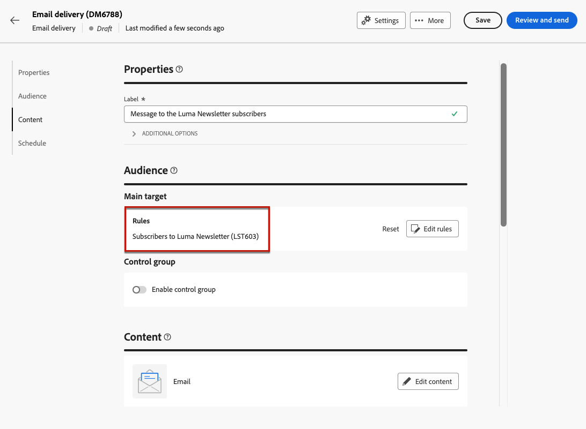

# 서비스 구독자 관리 {#manage-subscribers}

한 번 [서비스를 만들었습니다.](manage-services.md#create-service), 구독자를 추가하고, 수신자의 구독을 취소하고, 해당 서비스의 구독자에게 전달할 수 있습니다.

## 서비스에 구독자 추가 {#add-subscribers}

가입자를 수동으로 추가하려면 아래 단계를 따르십시오.

1. 에서 기존 서비스 선택 **[!UICONTROL 구독 서비스]** 목록을 표시합니다.

1. 다음 항목 선택 **[!UICONTROL 구독자]** tab 키를 누른 다음 클릭 **[!UICONTROL 프로필 추가]**.

   

1. 목록에서 추가할 프로필을 선택하고 **[!UICONTROL 확인]**.

   

1. 클릭 **[!UICONTROL 보내기]**.<!--if you click cancel, does it mean that no message is sent but recipients are still subscribed, or they are not subscribed? it's 2 different actions in the console)--> 선택한 수신자는 구독을 받게 됩니다. [확인 메시지](manage-services.md#create-confirmation-message) 다음 경우에 선택함: [서비스 만들기](manage-services.md#create-service).

   

추가된 프로필은 **[!UICONTROL 구독자]** 목록을 표시합니다. 이제 서비스를 구독합니다.

## 서비스에서 구독자 제거 {#remove-subscribers}

### 수신자의 수동 구독 취소 {#manual-unsubscription}

한 번 [구독자 추가됨](#add-subscribers) 서비스에 대해 각 가입을 수동으로 해지할 수 있습니다. 아래 단계를 수행합니다.

1. 에서 기존 서비스 선택 **[!UICONTROL 구독 서비스]** 목록을 표시합니다.

1. 원하는 수신자 이름 옆에 있는 세 점 아이콘을 클릭하고 을 선택합니다 **[!UICONTROL 삭제]**.

   

1. 삭제를 확인하고 를 클릭합니다. **[!UICONTROL 보내기]**. 선택한 수신자는 구독 취소를 받게 됩니다. [확인 메시지](manage-services.md#create-confirmation-message) 다음 경우에 선택함: [서비스 만들기](manage-services.md#create-service).

   

수신자가 다음에서 제거됨: **[!UICONTROL 구독자]** 을(를) 나열하고 더 이상 서비스를 구독하지 않습니다.

### 수신자 자동 구독 취소 {#automatic-unsubscription}

구독 서비스의 기간은 제한될 수 있습니다. 유효 기간이 만료되면 수신자는 자동으로 구독 취소됩니다.

이 기간은 다음과 같은 경우에 지정됩니다. [서비스 만들기](manage-services.md#create-service). 다음에서 **[!UICONTROL 추가 옵션]**, 비활성화 **[!UICONTROL 무제한 유효 기간]** 서비스를 선택하고 유효 기간을 정의합니다.

지정된 기간이 만료되면 모든 구독자는 해당 서비스에서 자동으로 구독 취소됩니다.

## 서비스 구독자에게 게재

한 번 [구독 서비스를 만들었습니다.](manage-services.md#create-service), 게재 시 구독자를 타겟팅할 수 있습니다. 아래 단계를 수행합니다.

1. [대상자 만들기](../audience/create-audience.md) 만든 서비스의 구독자를 포함합니다.

   * 다음에서 **[!UICONTROL 대상자 작성]** 활동, 고급 속성 표시 및 선택 **[!UICONTROL 수신자]** > **[!UICONTROL 구독]** > **[!UICONTROL 서비스]**.

   * 이 예에서는 다음과 같은 서비스를 구독한 사용자를 선택합니다. **Luma 뉴스레터** 레이블.

   

1. [게재 만들기](../msg/gs-messages.md#create-delivery) 위에서 만든 대상자를 선택합니다.

   

1. 메시지 콘텐츠를 원하는 대로 편집하고 게재를 보냅니다.

   

게재는 해당 서비스 가입자에게만 전송됩니다.
