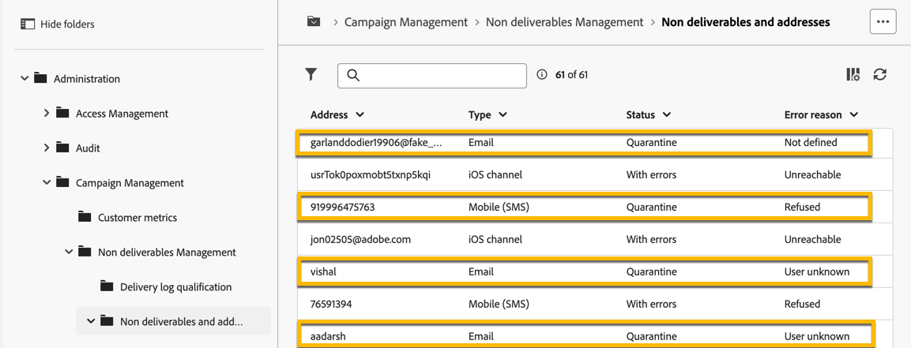

# 격리 관리 {#quarantines}

Adobe Campaign은 이메일, 푸시 및 SMS 채널에 대한 격리 주소를 관리합니다.

격리는 **전자 메일 주소**, **전화 번호** 또는 **장치 토큰**&#x200B;에만 적용되며 프로필 자체에는 적용되지 않습니다. 예를 들어 이메일 주소가 격리된 프로필은 새 주소로 업데이트할 수 있습니다. 그런 다음 게재 작업으로 프로필을 다시 타겟팅할 수 있습니다. 마찬가지로, 두 프로필이 동일한 전화 번호를 공유하는 경우 해당 번호가 격리되면 두 프로필 모두에 영향을 미칩니다.

>[!CAUTION]
>
>Adobe Campaign의 격리는 대소문자를 구분합니다.

## 격리 기능 {#quarantines-what}

격리는 **게재에서 잘못된 주소를 관리**&#x200B;하는 데 사용되는 방법입니다.

게재에 잘못된 주소 비율이 높은 경우 스팸으로 간주할 수 있습니다. 이러한 주소를 격리하여 관리하면 인터넷 공급자가 차단 목록에 추가된으로 제공하는 것을 방지할 수 있습니다. 이것은 명성을 유지하는 데 중요합니다.

Adobe Campaign에서 주소가 격리되면 게재 분석 중에 프로필이 대상에서 자동으로 제외됩니다.

격리는 잘못된 전화번호를 게재에서 제외하여 SMS 전송 비용을 줄입니다.

[Campaign v8(콘솔) 설명서](https://experienceleague.adobe.com/ko/docs/campaign/campaign-v8/send/failures/quarantines){target="_blank"}에서 격리에 대해 자세히 알아보세요.

## 주소가 격리되는 이유 {#quarantines-why}

다음과 같은 여러 가지 이유로 주소를 격리할 수 있습니다.

* SMS의 경우, 잘못된 전화번호
* SMS의 경우, 프로필이 &quot;STOP&quot;과 같은 키워드로 SMS 메시지에 답장할 때
* 이메일의 경우, 메시지가 스팸으로 보고되는 경우입니다. 메시지는 Adobe에서 관리하는 기술 사서함으로 자동으로 리디렉션됩니다. 그러면 사용자의 이메일 주소가 자동으로 차단 목록에 추가된 상태로 격리됩니다.
* 예를 들어, 사서함이 가득 찼거나 주소가 존재하지 않거나 이메일 서버를 사용할 수 없는 경우 이메일 주소를 격리할 수 있습니다.

[Campaign v8(콘솔) 설명서](https://experienceleague.adobe.com/ko/docs/campaign/campaign-v8/send/failures/delivery-failures){target="_blank"}에서 게재 실패에 대해 자세히 알아보세요.

## 격리 주소를 찾을 위치 {#quarantines-where}

**[!UICONTROL 탐색기]** > **[!UICONTROL 관리]** > **[!UICONTROL 캠페인 관리]** > **[!UICONTROL 비게재 항목 관리]** > **[!UICONTROL 비게재 항목 및 주소]**&#x200B;에서 인스턴스에 있는 모든 격리 주소를 볼 수 있습니다. 이 섹션에는 이메일, SMS 및 푸시 알림 채널에 대해 격리된 요소 목록이 있습니다.

{zoomable="yes"}

또한 인스턴스의 격리에 대한 보고서에 액세스할 수 있습니다.

{zoomable="yes"}

각 게재에 대해 게재 요약 보고서를 확인할 수 있습니다. 게재 대상에 격리된 주소 수를 표시합니다.

{zoomable="yes"}

Adobe Campaign 콘솔에서 격리 주소를 관리하는 추가 옵션을 탐색할 수 있습니다. [자세히 알아보기](https://experienceleague.adobe.com/ko/docs/campaign/campaign-v8/send/failures/quarantines#access-quarantined-addresses).