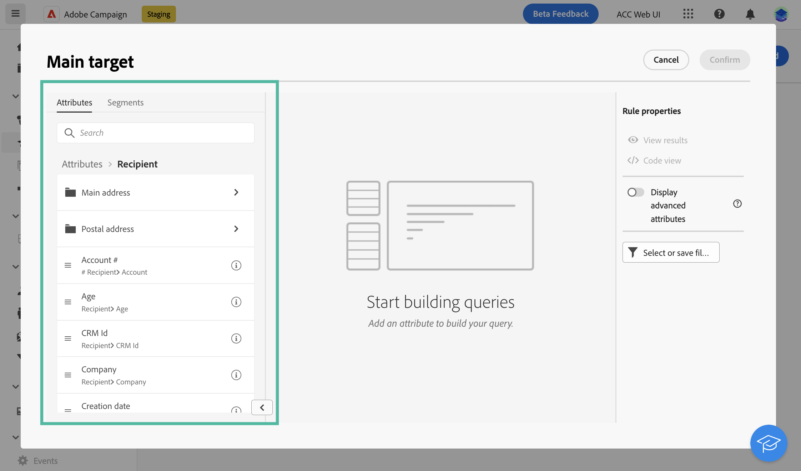
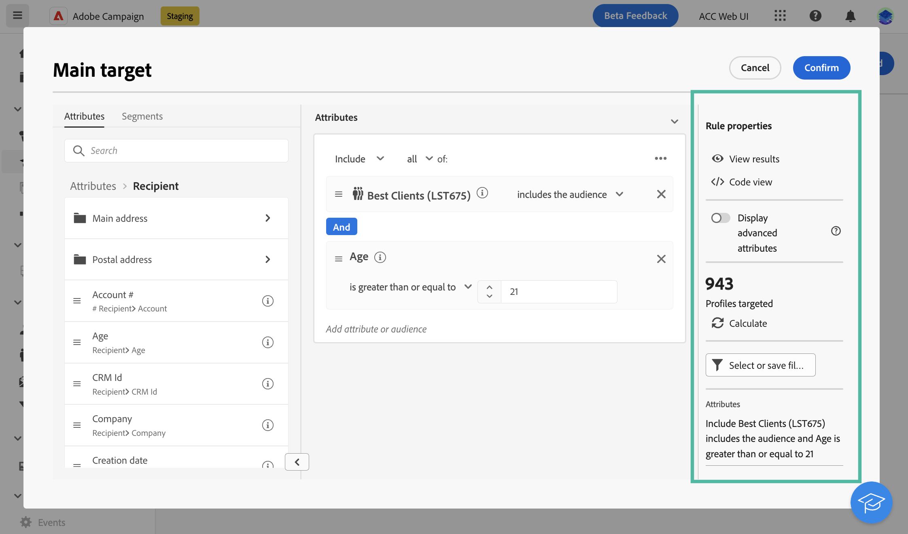

# 규칙 빌더를 사용하여 대상자 정의 {#segment-builder}

이 섹션에서는 새 이메일을 디자인할 때 대상자를 만드는 방법에 대해 설명합니다. 생성된 대상자는 이 이메일에서만 사용할 수 있습니다.

규칙 빌더를 사용하면 데이터베이스에 포함된 데이터를 필터링하여 메시지에 의해 타겟팅된 모집단을 정의할 수 있습니다. 기존 대상자를 선택하려면 이 [섹션](add-audience.md)을 참조하십시오.

규칙 빌더에 대한 자세한 내용은 [세분화 서비스 설명서](https://experienceleague.adobe.com/docs/experience-platform/segmentation/ui/segment-builder.html)를 참조하십시오.

이메일을 디자인할 때 새 대상자를 만들려면 다음 단계를 따르십시오.

1. 게재 생성 도우미의 **대상자** 섹션에서 **[!UICONTROL 대상자 선택]** 버튼을 클릭합니다.

   

1. **직접 만들기**&#x200B;를 선택합니다. 규칙 빌더가 표시됩니다.

   

## 팔레트

왼쪽에 있는 팔레트에는 대상자를 만들기 위해 필터링할 수 있는 모든 요소가 포함되어 있습니다. 팔레트에 포함된 타일을 구성하고 고려하려면 중앙 캔버스로 이동해야 합니다. 팔레트는 두 개의 탭으로 나뉩니다.

* **속성**: 이 탭에서는 스키마에서 사용 가능한 모든 필드에 액세스할 수 있습니다. 필드 목록은 이메일 템플릿에 정의된 타겟팅 스키마에 따라 다릅니다.

  {width="70%" align="left"}

* **대상자**: 이 탭에서는 Campaign Classic 콘솔 또는 Adobe Experience Platform에서 정의된 기존 대상 중 하나를 사용하여 필터링할 수 있습니다.

  {width="70%" align="left"}

  >[!NOTE]
  >
  >Adobe Experience Platform 대상자를 활용하려면 대상과의 통합을 구성해야 합니다. 다음을 참조하십시오. [Adobe Experience Platform 대상 설명서](https://experienceleague.adobe.com/docs/experience-platform/destinations/home.html){target="_blank"}.

검색 창을 사용하면 요소를 빠르게 찾을 수 있습니다.

## 캔버스

캔버스는 팔레트에서 추가한 요소를 기반으로 규칙을 구성하고 결합할 수 있는 중앙 영역입니다. 새 규칙을 추가하려면 팔레트에서 타일을 드래그하여 캔버스에 놓습니다. 이렇게 하면 추가되는 데이터 유형에 따라 상황에 맞는 옵션을 볼 수 있습니다.

{width="70%" align="left"}

## 규칙 속성 창

오른쪽의 **규칙 속성** 창에서는 다음 작업을 수행할 수 있습니다.

{width="70%" align="left"}

* **결과 보기:** 대상자에 의해 타겟팅되는 수신자 목록을 표시합니다.
* **코드 보기**: SQL에 대상자의 코드 기반 버전을 표시합니다.
* **고급 속성 표시**: 왼쪽 팔레트에서 노드, 그룹화, 1-1 링크, 1-N 링크와 같은 속성의 전체 목록을 보려면 이 옵션을 선택하십시오.
* **속성**: 생성된 대상자에 대한 설명을 표시합니다.

## 예제

이 예제에서는 애틀랜타 또는 시애틀에 거주 중이며 1980년 이후 출생한 모든 고객을 대상으로 대상자를 구축합니다.

1. 팔레트의 **속성** 탭에서 **생년월일** 필드를 검색합니다. 타일을 드래그하여 캔버스에 놓습니다.

   

1. 캔버스에서 **다음 날짜 이후** 연산자를 선택하고 원하는 날짜를 입력합니다.

   

1. 팔레트에서 **도시** 필드를 검색한 다음 첫 번째 규칙 아래 캔버스에 추가합니다.

   

1. 텍스트 필드에 첫 번째 도시 이름을 입력한 다음 Enter 키를 누릅니다.

   

1. 두 번째 도시 이름에 대해 이 작업을 반복합니다.

   

1. **결과 보기**&#x200B;를 클릭하여 쿼리와 일치하는 수신자 목록 및 수를 표시합니다. 열을 추가하여 데이터를 시각화하고 확인할 수도 있습니다. 이 예제에서는 **도시** 열을 추가하면 “애틀랜타”와 “시애틀”이 표시되어야 합니다.

   

1. **확인**&#x200B;을 클릭합니다.

대상자가 정의되었으며 이메일에서 사용할 준비가 되었습니다.