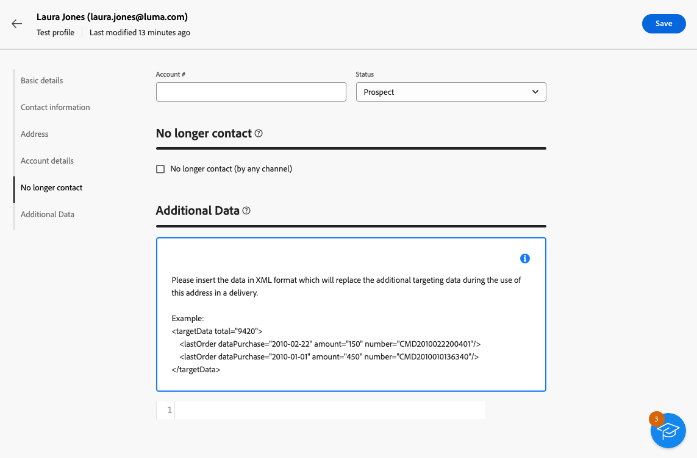

# 테스트 프로필 만들기 및 관리 {#create-test-profiles}

>[!CONTEXTUALHELP]
>id="acw_recipients_testprofiles_menu"
>title="테스트 프로필 만들기"
>abstract="테스트 프로필은 메시지를 보내기 전에 개인화 및 렌더링을 미리 보고 테스트할 수 있는 추가 수신자입니다. 메시지 콘텐츠를 미리 볼 때 테스트 프로필을 선택하고 테스트 프로필에 증명을 전송하여 메시지 콘텐츠와 설정을 제어하고 확인할 수 있습니다."

테스트 프로필은 증명을 보내고 메시지 콘텐츠와 설정을 확인하는 데 사용됩니다. 이러한 프로필은 메시지를 보내기 전에 개인화 및 렌더링을 미리 보고 테스트할 수 있는 추가 수신자입니다. 메시지 콘텐츠를 미리 볼 때 테스트 프로필을 선택하고 테스트 프로필에 증명을 전송하여 메시지 콘텐츠와 설정을 제어하고 확인할 수 있습니다.

<!--Learn more on test profiles in the [Campaign v8 (client console) documentation](https://experienceleague.adobe.com/docs/campaign/campaign-v8/audience/add-profiles/test-profiles.html){target="_blank"}.-->

테스트 프로필에 증명을 보내는 단계는에 자세히 설명되어 있습니다. [이 섹션](../preview-test/test-deliveries.md#test-profiles).

>[!NOTE]
>
>* 테스트 프로필은 클라이언트 콘솔에서 시드 주소로 만들어집니다.
>
>* 테스트 프로필은 다음 게재 통계에 대한 보고서에서 자동으로 제외됩니다. **[!UICONTROL 클릭수]**, **[!UICONTROL 열림]**, **[!UICONTROL 구독 취소]**.

## 테스트 프로필 액세스 및 관리 {#access-test-profiles}

테스트 프로필 목록에 액세스하려면 다음을 선택합니다 **[!UICONTROL 고객 관리]** > **[!UICONTROL 프로필]** 왼쪽 메뉴에서 **[!UICONTROL 테스트 프로필]** 탭.

{zoomable=&quot;yes&quot;}

* 특정 항목을 필터링할 수 있습니다 [폴더](../get-started/permissions.md#folders) 드롭다운 목록 사용 또는 다음을 사용하여 규칙 추가 [쿼리 모델러](../query/query-modeler-overview.md).

  {zoomable=&quot;yes&quot;}

* 테스트 프로필을 복제하고 필요에 따라 업데이트할 수 있습니다. 테스트 프로필을 편집하는 단계는 다음과 같습니다 [테스트 프로필 만들기](#create-test-profile).

* 테스트 프로필을 삭제하려면 **[!UICONTROL 추가 작업]** 메뉴 아래의 제품에서 사용할 수 있습니다.

  {zoomable=&quot;yes&quot;}

* 테스트 프로필을 편집하려면 목록에서 원하는 항목을 클릭합니다. 테스트 프로필을 편집하는 단계는 다음과 같습니다 [테스트 프로필 만들기](#create-test-profile).

다음을 통해 테스트 프로필에 액세스할 수도 있습니다. **[!UICONTROL 탐색기]** 보기, 에서 **[!UICONTROL 리소스]** > **[!UICONTROL Campaign Management]** > **[!UICONTROL 시드 주소]** 노드.

여기에서 폴더 또는 하위 폴더를 탐색, 생성 및 관리하고 관련 권한을 확인할 수 있습니다. [폴더 만들기 방법 알아보기](../get-started/permissions.md#folders)

{zoomable=&quot;yes&quot;}

다음에서 **[!UICONTROL 탐색기]** 보기 필터링, 삭제, 편집 및 [만들기](#create-test-profile) 테스트 프로필.

## 테스트 프로필 만들기 {#create-test-profile}

>[!CONTEXTUALHELP]
>id="acw_recipients_testprofiles_additionaldata"
>title="테스트 프로필 추가 데이터"
>abstract="데이터 관리 워크플로우에서 생성되고 특정 값을 할당하려는 게재에 사용되는 개인화 데이터를 입력합니다."

테스트 프로필을 만들려면 아래 단계를 수행합니다.

1. 다음으로 이동 **[!UICONTROL 고객 관리]** > **[!UICONTROL 프로필]** 및 선택 **[!UICONTROL 테스트 프로필]** 탭.

1. 다음을 클릭합니다. **[!UICONTROL 테스트 프로필 만들기]** 단추를 클릭합니다.

   {zoomable=&quot;yes&quot;}

1. 필요에 따라 테스트 프로필 세부 사항을 입력합니다. <!--Most of the fields are the same as when creating profiles. [Learn more]-->

   {zoomable=&quot;yes&quot;}

   >[!NOTE]
   >
   >다음 **[!UICONTROL 레이블]** 필드는 사용자가 정의한 이름과 성으로 자동으로 채워집니다.

1. 기본적으로 테스트 프로필은 **[!UICONTROL 시드 주소]** 폴더를 삭제합니다. 원하는 위치로 이동하여 변경할 수 있습니다. [폴더 작업 방법 알아보기](../get-started/permissions.md#folders)

   <!--{zoomable="yes"}-->

<!--
You do not need to enter all fields of each tab when creating a seed address. Missing personalization elements are entered randomly during delivery analysis. (Not valid?)
-->

1. 다음에서 **[!UICONTROL 연락처 정보]** 섹션에서 이메일 주소 및 기타 관련 데이터를 입력합니다. 이메일 주소는 테스트 프로필 레이블 뒤에 대괄호 사이에 표시됩니다.

   {zoomable=&quot;yes&quot;}

1. 을(를) 선택하는 경우 **[!UICONTROL 더 이상 연락하지 않음(모든 채널에서)]** 확인란, 테스트 프로필은 차단 목록에 추가하다에 있습니다. 이러한 수신자는 더 이상 채널(이메일, SMS 등)을 타겟팅하지 않습니다.

1. 다음에서 **[!UICONTROL 추가 데이터]** 탭에서 데이터 관리 워크플로우에서 만든 게재에 사용되고 특정 값을 지정할 개인화 데이터를 입력합니다. [워크플로우에 대해 자세히 알아보기](../workflows/gs-workflows.md)

   {zoomable=&quot;yes&quot;}

   추가 대상 데이터가에서 &#39;@&#39;으로 시작하는 별칭으로 정의되었는지 확인하십시오. **[!UICONTROL 데이터 보강]** 워크플로우 활동. 그렇지 않으면 게재 활동의 시드 주소와 함께 이 필드를 제대로 사용할 수 없습니다. [데이터 보강 활동에 대해 자세히 알아보기](../workflows/activities/enrichment.md)

1. 다음을 클릭합니다. **[!UICONTROL 저장]** 단추를 클릭합니다.

방금 만든 테스트 프로필을 이제 증명 전송에 사용할 준비가 되었습니다. [자세히 알아보기](../preview-test/test-deliveries.md#test-profiles)

<!--Use test profiles in Direct mail? cf v7/v8-->
