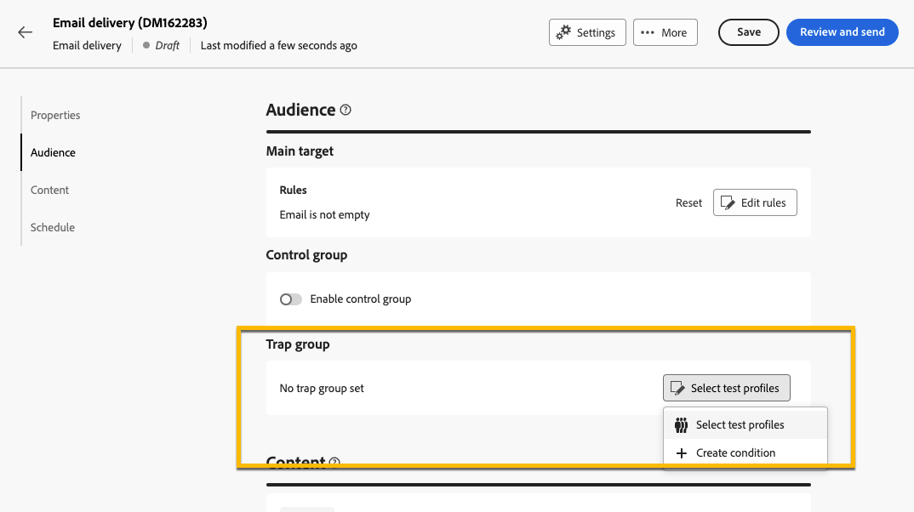

# 트랩 그룹 사용 {#trap-group}

>[!CONTEXTUALHELP]
>id="acw_homepage_welcome_rn3"
>title="트랩 그룹"
>abstract="게재에 특정 주소가 포함된 트랩 그룹을 사용하여 정의된 대상 기준과 일치하지 않는 프로필을 타겟팅하여 배포 프로세스를 모니터링하고 확인할 수 있습니다."
>additional-url="https://experienceleague.adobe.com/docs/campaign-web/v8/release-notes/release-notes.html?lang=ko" text="릴리스 정보 참조"

**[!UICONTROL 트랩 그룹]**(**[!UICONTROL 시드 목록]**&#x200B;이라고도 함)은 정의된 대상 기준과 일치하지 않는 프로필을 대상으로 하여 배포 프로세스를 모니터링하고 확인하는 데 게재에 특정 주소를 포함하는 데 사용됩니다. 이렇게 하면 게재 범위를 벗어난 수신자는 다른 대상 수신자와 마찬가지로 게재를 받을 수 있습니다.

**[!UICONTROL 트랩 그룹]**&#x200B;은(는) Campaign 웹 사용자 인터페이스에 있는 **[!UICONTROL 테스트 프로필]**&#x200B;이라는 **[!UICONTROL 시드 주소]** 그룹입니다.

## 트랩 그룹을 사용하는 이유 {#why-trap-group}

**[!UICONTROL 트랩 그룹]**&#x200B;을 사용할 수 있습니다.

1. **증명**: **[!UICONTROL 트랩 그룹]**&#x200B;의 각 구성원은 대상에 속한 것처럼 게재를 받습니다.

1. **메일링 목록을 보호하기 위해**: 대상자가 받게 될 내용을 수신함으로써 타사에서 해당 메일링 목록을 사용하는 경우 **[!UICONTROL 트랩 그룹]**&#x200B;의 각 **[!UICONTROL 테스트 프로필]**&#x200B;이 표시됩니다.

>[!NOTE]
>
>게재를 만드는 동안 [증명을 보내기](../email/create-email.md#preview-test) 및 [컨트롤 그룹](control-group.md)에서 트랩 그룹을 추가하는 것 외에도 대상자를 테스트하는 좋은 방법이 있습니다.

## 트랩 그룹 기본 정보 {#about-trap-group}

다음 게재 통계에 대한 보고서에서 테스트 프로필이 자동으로 제외됩니다. **클릭 수**, **열기 수**, **구독 취소 수**. 보고서는 실제 대상자에 대해서만 표시됩니다.

전자 메일 게재의 경우 **[!UICONTROL 트랩 그룹]**&#x200B;에 전자 메일 주소만 필요합니다. 다른 필드의 개인화는 Campaign에서 임의로 채워집니다.

## 게재에 트랩 그룹 추가 {#trap-group-in-delivery}

**[!UICONTROL 트랩 그룹]**&#x200B;을 설정하려면 게재의 **[!UICONTROL 대상]** 설정으로 이동하세요. 2가지 옵션이 있습니다.

* [테스트 프로필 선택](#select-test-profile)
* [조건 만들기](#create-condition)

{zoomable="yes"}

### 테스트 프로필 선택 {#select-test-profiles}

**테스트 프로필 선택**&#x200B;을 선택하면 아래와 같이 **테스트 프로필 추가** 단추를 사용할 수 있습니다.

{zoomable="yes"}

단추를 클릭하면 **[!UICONTROL 트랩 그룹]**&#x200B;을 추가할 수 있는 테스트 프로필에 액세스할 수 있습니다. 사용할 항목을 선택합니다.

새 테스트 프로필을 만들 수도 있습니다. [자세히 알아보기](#create-seed)

{zoomable="yes"}

테스트 프로필을 확인하면 **[!UICONTROL 트랩 그룹]**&#x200B;에 올바른 번호가 있는지 확인하십시오.

{zoomable="yes"}

### 조건 만들기 {#create-condition}

**[!UICONTROL 조건 만들기]** 옵션을 사용하여 사용할 테스트 프로필을 정의하는 쿼리를 만들 수 있습니다.

{zoomable="yes"}

쿼리가 **[!UICONTROL 트랩 그룹]** 아래에 표시됩니다.

{zoomable="yes"}

## 새 테스트 프로필 만들기 {#create-seed}

**[!UICONTROL 탐색기]** > **[!UICONTROL 리소스]** > **[!UICONTROL Campaign Management]** > **[!UICONTROL 시드 구성원]** 폴더에서 새 **[!UICONTROL 테스트 프로필]**&#x200B;을 만들 수 있습니다.

{zoomable="yes"}

모든 프로필에 대해 **[!UICONTROL 테스트 프로필]**&#x200B;에 대한 모든 설정을 구성합니다.

{zoomable="yes"}
