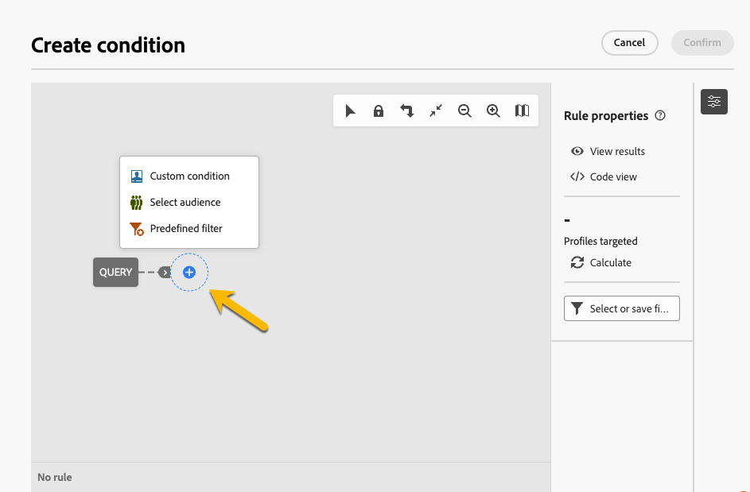

# **[!UICONTROL 트랩 그룹]** 사용 {#trap-group}

**[!UICONTROL 트랩 그룹]**(**[!UICONTROL 시드 목록]**이라고도 함)은 정의된 대상 기준과 일치하지 않는 프로필을 대상으로 하여 배포 프로세스를 모니터링하고 확인하는 데 게재에 특정 주소를 포함하는 데 사용됩니다. 이렇게 하면 게재 범위를 벗어난 수신자는 다른 대상 수신자와 마찬가지로 게재를 받을 수 있습니다.
**[!UICONTROL 트랩 그룹]**&#x200B;은(는) AC Web UI에서 **[!UICONTROL 테스트 프로필]**&#x200B;이라는 **[!UICONTROL 시드 주소]** 그룹입니다.

## **[!UICONTROL 트랩 그룹]**&#x200B;을 사용하는 이유

**[!UICONTROL 트랩 그룹]**&#x200B;을 사용할 수 있습니다.

1. **증명** : **[!UICONTROL 트랩 그룹]**&#x200B;의 각 구성원은 대상에 속한 것처럼 게재를 받습니다.

1. **메일링 목록을 보호하기 위해** : 대상자가 받게 될 내용을 수신함으로써 타사에서 해당 메일링 목록을 사용하는 경우 **[!UICONTROL 트랩 그룹]**&#x200B;의 각 **[!UICONTROL 테스트 프로필]**&#x200B;이 표시됩니다.

>[!NOTE]
>
>트랩 그룹은 [게재를 만드는 동안 증명을 보내는 중](../email/create-email.md#preview-test) 및 [컨트롤 그룹](control-group.md)과(와) 다릅니다.

## **[!UICONTROL 트랩 그룹]** 정보

다음 게재 통계에 대한 보고서에서 테스트 프로필이 자동으로 제외됩니다. **클릭 수**, **열기 수**, **구독 취소 수**. 보고서는 실제 대상자에 대해서만 표시됩니다.

전자 메일 게재의 경우 **[!UICONTROL 트랩 그룹]**&#x200B;에 전자 메일 주소만 필요합니다. 다른 필드의 개인화는 Campaign에서 임의로 채워집니다.

## 게재에서 **[!UICONTROL 트랩 그룹]**&#x200B;을(를) 설정하는 방법

**[!UICONTROL 트랩 그룹]**&#x200B;을 설정하려면 게재의 **[!UICONTROL 대상]** 설정으로 이동하세요. 2가지 옵션이 있습니다.
- [테스트 프로필 선택](#select-test-profile)
- [조건 만들기](#create-condition)

{zoomable="yes"}

### 테스트 프로필 선택 {#select-test-profiles}

&quot;테스트 프로필 선택&quot;을 선택하면 아래와 같이 **[!UICONTROL 테스트 프로필 추가]**&#x200B;에 초대되는 창이 표시됩니다.

{zoomable="yes"}

버튼을 클릭하면 **[!UICONTROL 트랩 그룹]**을 추가할 수 있는 테스트 프로필에 액세스할 수 있습니다. 사용할 항목을 선택합니다.
새 테스트 프로필을 만들 수 있습니다. [자세히 알아보기](#create-seed)

{zoomable="yes"}

테스트 프로필을 확인하면 **[!UICONTROL 트랩 그룹]**&#x200B;에 올바른 번호가 있는지 확인하십시오.

{zoomable="yes"}

### 조건 만들기 {#create-condition}

**[!UICONTROL 조건 만들기]** 옵션을 선택하면 사용할 테스트 프로필을 정의하기 위해 쿼리를 사용자 지정할 수 있는 새 창이 만들어집니다.

{zoomable="yes"}

쿼리가 **[!UICONTROL 트랩 그룹]** 아래에 표시됩니다.

{zoomable="yes"}

## 새 **[!UICONTROL 테스트 프로필]**&#x200B;을 만드는 방법 {#create-seed}

**[!UICONTROL 탐색기]** > **[!UICONTROL 리소스]** > **[!UICONTROL Campaign Management]** > **[!UICONTROL 시드 구성원]**&#x200B;에서 새 **[!UICONTROL 테스트 프로필]**&#x200B;을 만들 수 있습니다.

{zoomable="yes"}

대상 프로필인 것처럼 **[!UICONTROL 테스트 프로필]**&#x200B;에 대한 모든 세부 정보를 완료할 수 있습니다.

{zoomable="yes"}