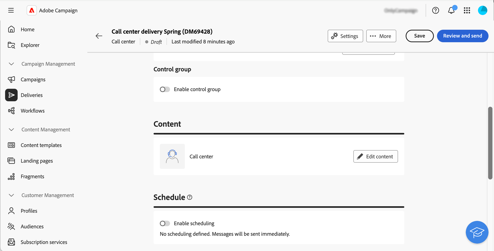

# 콜센터 게재 만들기 및 전송 {#create-call-center}

독립 실행형 콜 센터 게재를 만들거나 캠페인 워크플로우의 컨텍스트에서 콜 센터 게재를 만들 수 있습니다. 아래 단계에서는 독립 실행형(일회성) 게재 절차를 자세히 설명합니다. 캠페인 워크플로우의 컨텍스트에서 작업하는 경우 만들기 단계는 [이 섹션](../workflows/activities/channels.md#create-a-delivery-in-a-campaign-workflow)에 자세히 설명되어 있습니다.

새 독립 실행형 콜 센터 게재를 만들고 전송하려면 다음 기본 단계를 수행합니다.

1. 게재를 만듭니다. [자세한 내용](#create-delivery)
1. 대상자를 정의합니다. [자세히 보기](#select-audience)
1. 콘텐츠 편집, [자세히 보기](#edit-content)
1. 게재를 미리 보고 보냅니다. [자세히 보기](#preview-send)

## 게재 만들기{#create-delivery}

다음 단계에 따라 게재를 만들고 속성을 구성합니다.

1. **[!UICONTROL 게재]** 메뉴를 선택하고 **[!UICONTROL 게재 만들기]** 단추를 클릭합니다.

1. 채널로 **[!UICONTROL 콜 센터]**&#x200B;를 선택하고 **[!UICONTROL 게재 만들기]**&#x200B;를 클릭하여 확인합니다.

   {zoomable="yes"}

   >[!NOTE]
   >
   >다른 템플릿을 선택하려면 이 [페이지](../msg/delivery-template.md)를 참조하세요.

1. **[!UICONTROL 속성]**&#x200B;에서 게재할 **[!UICONTROL 레이블]**&#x200B;을(를) 입력하십시오. 추가 옵션은 이 [섹션](../email/create-email.md#create-email)에 자세히 설명되어 있습니다.

   {zoomable="yes"}

>[!NOTE]
>
>특정 날짜에 게재를 전송하도록 예약할 수 있습니다. 자세한 정보는 이 [섹션](../msg/gs-deliveries.md#gs-schedule)을 참조하십시오.

## 대상자 정의{#select-audience}

이제 추출 파일의 타겟이 될 대상자를 정의해야 합니다.

1. 게재 페이지의 **[!UICONTROL 대상]** 섹션에서 **[!UICONTROL 대상 선택]**&#x200B;을 클릭합니다.

   {zoomable="yes"}

1. 기존 대상자를 선택하거나 직접 대상자를 만듭니다.

   * [기존 대상자를 선택하는 방법 알아보기](../audience/add-audience.md)
   * [새 대상자를 만드는 방법 알아보기](../audience/one-time-audience.md)

   {zoomable="yes"}

>[!NOTE]
>
>콜센터 수신자는 최소한 이름과 전화 번호를 포함해야 합니다. 정보가 불완전한 수신자는 콜센터 게재에서 제외됩니다.
>
>컨트롤 그룹을 구성하는 방법에 대해 알아보려면 이 [페이지](../audience/control-group.md)를 참조하세요.

## 콘텐츠 편집{#edit-content}

이제 콜 센터 게재에서 생성될 추출 파일의 콘텐츠를 편집해 보겠습니다.

1. 게재 페이지에서 **[!UICONTROL 콘텐츠 편집]** 단추를 클릭합니다.

   {zoomable="yes"}

1. **[!UICONTROL 파일 이름]**&#x200B;을(를) 지정하십시오. 파일 이름을 개인화하는 방법을 알아보려면 이 [페이지](../personalization/personalize.md)를 참조하세요.

1. **[!UICONTROL 파일 형식]**: **텍스트**, **고정 너비 열을 사용하는 텍스트**, **CSV(Excel)** 또는 **XML**&#x200B;을 선택합니다.

   {zoomable="yes"}

   >[!NOTE]
   >
   >추출 형식 옵션은 이 [페이지](../direct-mail/content-direct-mail.md#properties)에 자세히 설명되어 있습니다.

1. 게재할 수신자 수를 제한할 수 없는 경우 **[!UICONTROL 요청 수량]** 옵션을 전환합니다.

1. **[!UICONTROL 콘텐츠]** 섹션에서 **[!UICONTROL 특성 추가]** 단추를 클릭하여 추출 파일에 표시할 새 열을 만듭니다.

1. 열에 표시할 속성을 선택한 다음 확인합니다. 특성을 선택하고 즐겨찾기에 추가하는 방법에 대한 자세한 내용은 이 [페이지](../get-started/attributes.md)를 참조하세요.

   

1. 추출 파일에 필요한 수만큼 열을 추가하려면 이 단계를 반복합니다.

   그런 다음 속성을 편집하거나 추출 파일을 정렬하거나 열의 위치를 변경할 수 있습니다. 자세한 정보는 이 [페이지](../direct-mail/content-direct-mail.md#content)를 참조하십시오.

   

## 게재 미리 보기 및 보내기{#preview-send}

게재 콘텐츠가 준비되면 테스트 프로필을 사용하여 미리 보고 증명을 보낼 수 있습니다. 그런 다음 콜 센터 게재를 전송하여 추출 파일을 생성할 수 있습니다.

추출 파일을 미리 보고 전송하는 주요 단계는 다음과 같습니다. 자세한 내용은 [이 페이지](../direct-mail/send-direct-mail.md)를 참조하세요.

1. 게재 콘텐츠 페이지에서 **[!UICONTROL 콘텐츠 시뮬레이션]** 단추를 클릭합니다.

   {zoomable="yes"}

1. 하나 또는 여러 테스트 프로필을 선택하여 개인화된 콘텐츠를 미리 봅니다. 증명을 보낼 수도 있습니다. [자세히 보기](../direct-mail/send-direct-mail.md#preview-dm)

   {zoomable="yes"}

1. 게재 페이지에서 **[!UICONTROL 검토 및 보내기]**&#x200B;를 클릭합니다.

   {zoomable="yes"}

1. **[!UICONTROL 준비]**&#x200B;를 클릭하고 제공된 진행률과 통계를 모니터링한 다음 확인합니다.

   {zoomable="yes"}

1. **[!UICONTROL 보내기]**&#x200B;를 클릭하여 최종 전송 프로세스를 진행한 다음 확인합니다.

게재를 전송하면 추출 파일이 자동으로 생성되고 게재 템플릿의 **[!UICONTROL 고급 설정]**&#x200B;에서 선택한 [라우팅](../advanced-settings/delivery-settings.md) 외부 계정에 지정된 위치로 내보내집니다. 화면의 **콘텐츠** 섹션에서 **파일 미리 보기** 단추를 클릭하여 파일을 미리 볼 수도 있습니다.

게재 페이지의 KPI(주요 성능 지표) 데이터와 **[!UICONTROL 로그]** 메뉴의 데이터를 추적합니다.

기본 제공 보고서를 통해 메시지의 영향을 측정하기 시작합니다. [자세히 알아보기](../reporting/direct-mail.md)
