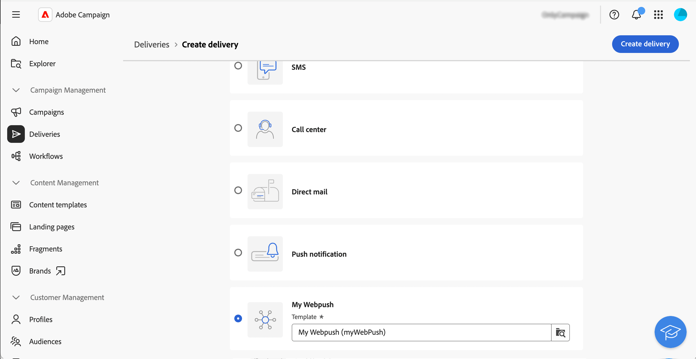

# 사용자 지정 채널 시작 {#gs-custom-channel}

>[!CONTEXTUALHELP]
>id="acw_homepage_welcome_rn1"
>title="API 게재에 대한 사용자 지정 채널"
>abstract="이제 Adobe Campaign Web UI에서 직접 사용자 정의 API 채널을 기반으로 게재를 조율하고 실행할 수 있습니다. 이러한 게재는 독립 실행형이거나 워크플로우의 일부일 수 있습니다."
>additional-url="https://experienceleague.adobe.com/docs/campaign-web/v8/release-notes/release-notes.html?lang=ko" text="릴리스 정보 참조"

Adobe Campaign Web UI에서 직접 서드파티와 통합된 사용자 지정 채널을 기반으로 게재를 통합 및 실행할 수 있습니다. 사용자 지정 채널의 구성은 클라이언트 콘솔에서 수행됩니다.

사용자 지정 채널에는 외부 및 API의 두 가지 유형이 지원됩니다. 외부 채널을 사용하면 Campaign은 필요한 모든 연락처 및 개인화 데이터를 사용하여 사용자 지정 가능한 내보내기 파일을 생성합니다. API 채널을 사용하면 구성된 API를 통해 타겟 프로필로 메시지가 전송됩니다.

워크플로우에서 사용자 지정 채널 게재를 추가하거나 독립 실행형 게재로 사용할 수 있습니다.

아래 단계에서는 독립 실행형(일회성) 게재 절차를 자세히 설명합니다. 대부분의 단계는 콜 센터 게재와 유사합니다. 자세한 내용은 이 [페이지](../call-center/create-call-center.md)를 참조하세요.

새 독립형 사용자 지정 게재를 보내려면 다음 주요 단계를 따르십시오.

1. 사용자 지정 채널 구성, [자세한 내용](#create-channel)
1. 게재를 만듭니다. [자세한 내용](#create-delivery)
1. 대상자를 정의합니다. [자세히 보기](#select-audience)
1. 콘텐츠 편집, [자세히 보기](#edit-content)
1. 게재를 미리 보고 보냅니다. [자세히 보기](#preview-send)

## 사용자 지정 채널 구성{#create-channel}

먼저 사용자 지정 채널을 구성해야 합니다. 다음은 클라이언트 콘솔에서 수행하는 주요 단계입니다. 이러한 단계는 사용자 지정 외부 및 API 채널에 공통됩니다.

1. 사용 가능한 채널 목록에 새 채널을 추가하도록 스키마를 구성합니다. [자세히 보기](https://experienceleague.adobe.com/docs/campaign/campaign-v8/send/other-channels/custom-channel.html?lang=ko#configure-schema){target="_blank"}
1. 새 라우팅 외부 계정을 만듭니다. [자세히 보기](https://experienceleague.adobe.com/docs/campaign/campaign-v8/send/other-channels/custom-channel.html?lang=ko#create-ext-account){target="_blank"}
1. 새 채널과 연결된 새 게재 템플릿을 만듭니다. [자세히 보기](https://experienceleague.adobe.com/docs/campaign/campaign-v8/send/other-channels/custom-channel.html?lang=ko#create-template){target="_blank"}

사용자 지정 API 채널에는 추가 구성이 필요합니다. [자세히 보기](https://experienceleague.adobe.com/docs/campaign/campaign-v8/send/other-channels/custom-channel.html?lang=ko#api-additional){target="_blank"}

## 게재 만들기{#create-delivery}

다음 단계에 따라 게재를 만들고 속성을 구성합니다.

1. **[!UICONTROL 게재]** 메뉴를 선택하고 **[!UICONTROL 게재 만들기]** 단추를 클릭합니다.

1. 원하는 사용자 지정 채널을 선택하고 연결된 템플릿을 선택한 다음 **[!UICONTROL 게재 만들기]**&#x200B;를 클릭하여 확인합니다.

   {zoomable="yes"}

1. **[!UICONTROL 속성]**&#x200B;에서 게재할 **[!UICONTROL 레이블]**&#x200B;을(를) 입력하십시오.

   {zoomable="yes"}

게재 만들기에 대한 자세한 내용은 콜센터 [설명서](../call-center/create-call-center.md#create-delivery)를 참조하세요.

## 대상자 정의{#select-audience}

이제 타겟팅할 대상자를 정의해야 합니다.

1. 게재 대시보드의 **[!UICONTROL 대상]** 섹션에서 **[!UICONTROL 대상 선택]**&#x200B;을 클릭합니다.

1. 기존 대상자를 선택하거나 직접 대상자를 만듭니다.

   {zoomable="yes"}

대상자 정의에 대한 자세한 내용은 콜센터 [설명서](../call-center/create-call-center.md#select-audience)를 참조하세요.

## 콘텐츠 편집{#edit-content}

이제 게재의 콘텐츠를 편집해 보겠습니다.

>[!BEGINTABS]

>[!TAB 사용자 지정 외부 채널]

1. 게재 대시보드에서 **[!UICONTROL 콘텐츠 편집]** 단추를 클릭합니다.

1. **[!UICONTROL 파일 이름]**&#x200B;을 지정하고 **[!UICONTROL 파일 형식]**&#x200B;을 선택한 다음 추출 파일에 필요한 만큼 열을 추가하십시오.

   

>[!TAB 사용자 지정 API 채널]

1. 게재 대시보드에서 **[!UICONTROL 콘텐츠 편집]** 단추를 클릭합니다.

1. 필요에 따라 필드를 채웁니다. 이 화면을 설정하는 방법에 대해 알아보려면 이 [페이지](https://experienceleague.adobe.com/docs/campaign/campaign-v8/send/other-channels/custom-channel.html?lang=ko#api-additional-screen){target="_blank"}를 참조하세요.

   

>[!ENDTABS]

콘텐츠 편집에 대한 자세한 내용은 콜센터 [설명서](../call-center/create-call-center.md#edit-content)를 참조하세요.

## 게재 미리 보기 및 보내기{#preview-send}

게재 콘텐츠가 준비되면 테스트 프로필을 사용하여 미리 볼 수 있습니다. 그런 다음 게재를 전송하여 추출 파일을 생성하거나 API를 통해 메시지를 전송할 수 있습니다.

>[!BEGINTABS]

>[!TAB 사용자 지정 외부 채널]

1. 게재 대시보드에서 **[!UICONTROL 콘텐츠 편집]** 단추를 클릭합니다.

1. 게재 콘텐츠 페이지에서 **[!UICONTROL 콘텐츠 시뮬레이션]** 단추를 클릭하고 테스트 프로필을 선택합니다.

   {zoomable="yes"}

>[!TAB 사용자 지정 API 채널]

1. 게재 대시보드에서 **[!UICONTROL 콘텐츠 편집]** 단추를 클릭합니다.

1. 게재 콘텐츠 페이지에서 **[!UICONTROL 콘텐츠 시뮬레이션]** 단추를 클릭하고 테스트 프로필을 선택합니다.

1. 오른쪽에서 **미리 보기 열기**&#x200B;를 클릭합니다. 이 기능은 JSSP를 사용하여 구성해야 합니다. 이 [페이지](https://experienceleague.adobe.com/docs/campaign/campaign-v8/send/other-channels/custom-channel.html?lang=ko#api-additional-preview){target="_blank"}를 참조하세요.

   {zoomable="yes"}

>[!ENDTABS]

게재 대시보드에서 **[!UICONTROL 검토 및 보내기]**&#x200B;를 클릭하고 **[!UICONTROL 준비]**&#x200B;를 클릭합니다. 그런 다음 확인합니다. **[!UICONTROL 보내기]**&#x200B;를 클릭하여 최종 전송 프로세스를 진행한 다음 확인합니다.

{zoomable="yes"}

미리 보기 및 전송에 대한 자세한 내용은 콜센터 [설명서](../call-center/create-call-center.md#preview-send)를 참조하세요.
