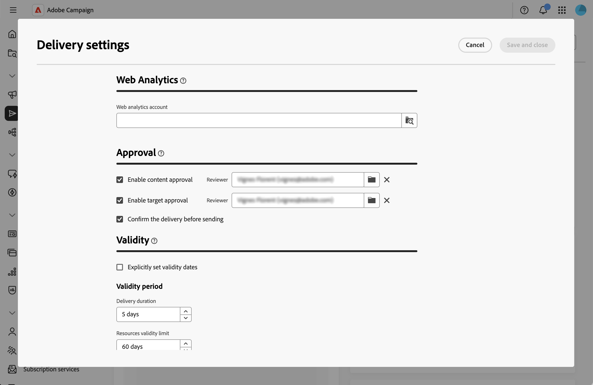
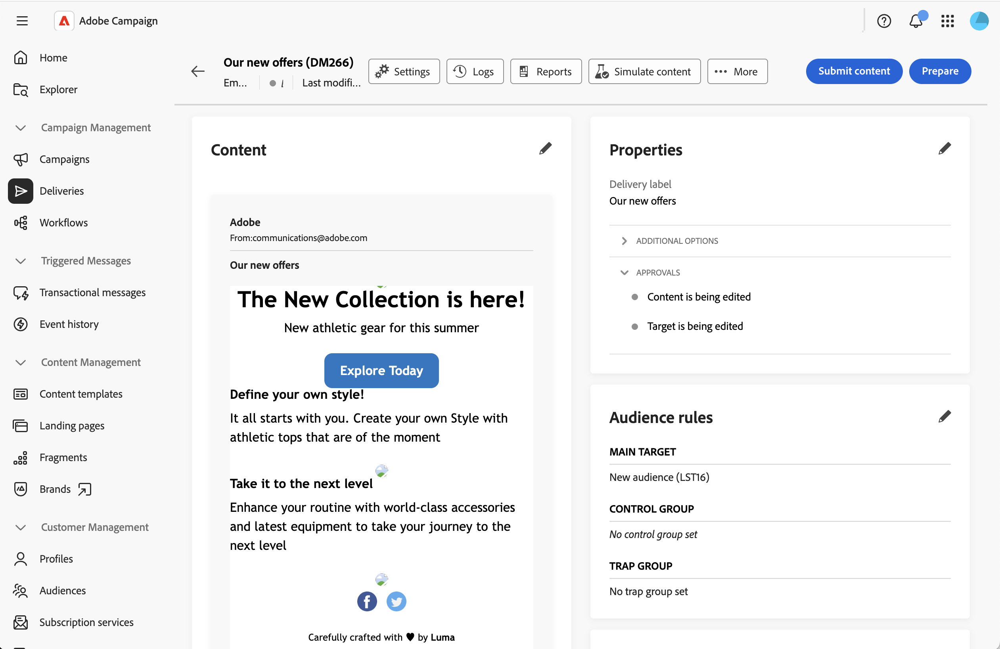
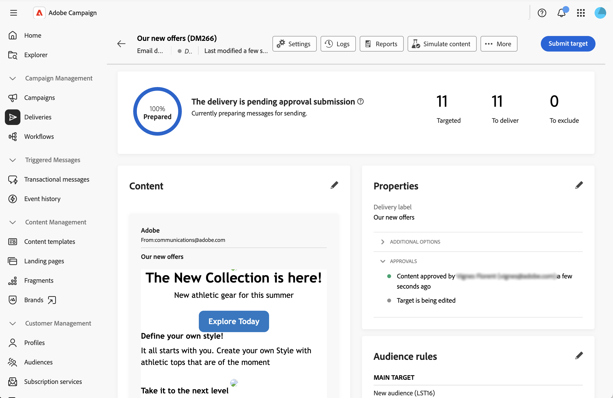
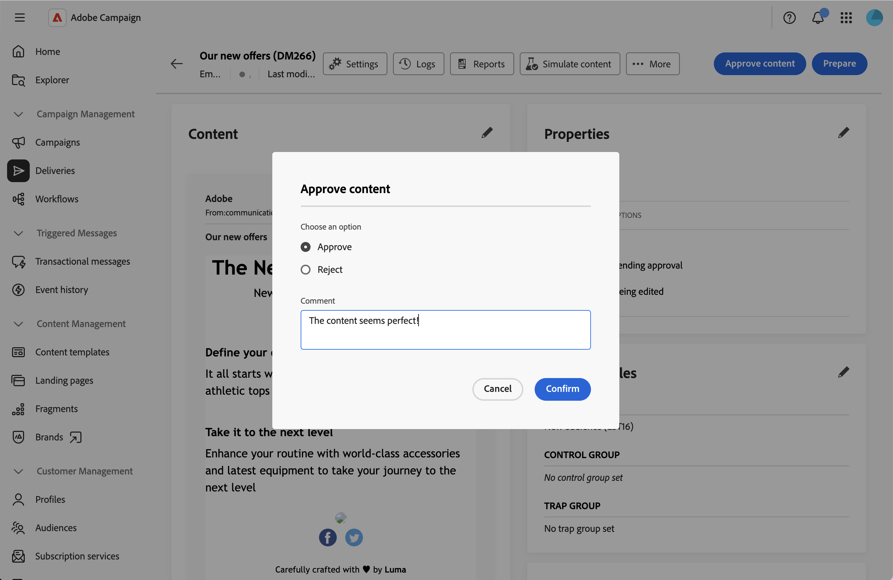

# 승인 프로세스 관리 {#campaign-approvals}

>[!IMPORTANT]
>
>캠페인 내에서 생성된 게재에 대해서만 승인을 사용할 수 있습니다. 독립 실행형 게재 또는 캠페인 컨텍스트 외부의 워크플로우에서 만든 게재에는 적용되지 않습니다.

승인 프로세스를 통해 여러 관련자를 조정하고 게재를 보내기 전에 품질 관리를 할 수 있습니다. 조직에서 콘텐츠 검토 마케팅 관리자나 타겟 대상의 유효성을 검사하는 데이터 분석가와 같이 서로 다른 팀의 유효성 검사가 필요한 경우 승인을 사용하십시오.

승인이 활성화되면 승인을 위해 콘텐츠 또는 타겟을 제출해야 합니다. 지정된 검토자는 유효성 검사를 요청하는 이메일 알림을 받으며 웹 UI 인터페이스에서 직접 승인하거나 거부할 수 있습니다. 모든 필수 승인이 승인될 때까지 게재를 보낼 수 없습니다. 다음을 활성화할 수 있습니다.

* **콘텐츠 승인**: 메시지 콘텐츠, 디자인 및 개인화의 유효성을 검사합니다.
* **대상 승인**: 대상 및 타깃팅 기준의 유효성 검사
* **게재 확인**: 보내기 전에 최종 확인이 필요합니다.

## 승인 설정 구성 {#configure-approvals}

승인 설정은 캠페인 템플릿에서 상속되며 개별 캠페인에 대해 수정할 수 있습니다. 다음 단계에 따라 승인 설정을 구성합니다.

1. **[!UICONTROL 캠페인]** 메뉴에서 캠페인 또는 캠페인 템플릿을 열거나 새 템플릿을 만드십시오.

1. 캠페인 대시보드의 오른쪽 상단에 있는 **[!UICONTROL 설정]** 단추를 클릭합니다.

1. **[!UICONTROL 승인]** 섹션에서 다음 옵션을 구성합니다.

   {zoomable="yes"}

   * **[!UICONTROL 콘텐츠 승인 활성화]**: 활성화되면 전송 전에 게재 콘텐츠를 승인해야 합니다. **[!UICONTROL 검토자]** 필드의 폴더 아이콘을 클릭하여 연산자 또는 연산자 그룹을 선택합니다.

   * **[!UICONTROL 대상 승인 활성화]**: 활성화되면 게재 대상 대상자가 승인되어야 합니다. **[!UICONTROL 검토자]** 필드의 폴더 아이콘을 클릭하여 연산자 또는 연산자 그룹을 선택합니다.

   * **[!UICONTROL 보내기 전에 게재 확인]**: 다른 모든 승인이 완료된 후에도 보내기 전에 최종 수동 확인이 필요합니다.

>[!NOTE]
>
>* 검토자를 지정하지 않으면 캠페인 소유자가 검토자로 할당됩니다.
>* 검토자가 게재를 승인하려면 적절한 권한이 필요합니다. 검토자 목록에 식별된 사용자만 승인할 수 있습니다.

## 승인을 위해 제출 {#submit-approval}

게재를 만든 후 다음 단계에 따라 콘텐츠를 제출하고 승인할 대상을 지정합니다.

>[!NOTE]
>캠페인 워크플로우 게재 및 캠페인 독립형 게재에서 모두 승인을 사용할 수 있습니다.

1. 게재 대시보드에서 **[!UICONTROL 콘텐츠 제출]** 단추를 클릭합니다. 지정된 검토자는 승인하거나 거부할 수 있습니다. 이 [섹션](#approve-reject)을 참조하십시오.

   {zoomable="yes"}

   게재 대시보드의 **[!UICONTROL 속성]** 섹션에서 승인 상태가 보류 중으로 변경됩니다. 이 [섹션](#rack-approvals)을 참조하십시오.

1. 콘텐츠가 승인되면 **[!UICONTROL 준비]** 단추를 클릭하여 게재 대상을 준비합니다. 시스템은 대상자 및 타기팅 기준을 준비합니다.

1. **[!UICONTROL 대상 제출]** 단추를 클릭합니다. 그러면 지정된 검토자가 승인하거나 거부할 수 있습니다. 이 [섹션](#approve-reject)을 참조하십시오.

   {zoomable="yes"}

   승인 상태가 보류 중으로 변경됩니다. 이 [섹션](#rack-approvals)을 참조하십시오.

1. 타겟이 승인되면 준비가 재개되고 게재를 보낼 수 있습니다.

>[!NOTE]
>승인이 거부되면 게재 소유자는 검토자의 피드백을 기반으로 콘텐츠 또는 타겟에 필요한 모든 사항을 변경하고 승인을 위해 다시 제출해야 합니다.

## 승인 또는 거부 {#approve-reject}

지정된 검토자는 콘텐츠 및 대상 제출을 승인하거나 거부할 수 있습니다. 이 [섹션](#submit-approval)을 참조하십시오.

>[!NOTE]
>이메일 알림을 전송하려면 인스턴스에서 검토자의 주소를 구성해야 합니다.

1. 알림 이메일을 수신하면 웹 UI 인터페이스에서 직접 승인이 필요한 게재를 엽니다.

1. 콘텐츠 또는 타겟 정보를 검토합니다.

1. **[!UICONTROL 콘텐츠 승인]** 또는 **[!UICONTROL 대상 승인]** 단추를 클릭합니다.

   {zoomable="yes"}

1. **[!UICONTROL 승인]** 또는 **[!UICONTROL 거부]**&#x200B;를 클릭합니다.

1. 필요한 경우 **[!UICONTROL 댓글]**&#x200B;을 추가하여 결정을 설명하십시오.

   {zoomable="yes"}

1. 결정을 확인합니다. 승인 상태는 게재 대시보드에서 즉시 업데이트됩니다. 이 [섹션](#rack-approvals)을 참조하십시오.

## 승인 상태 추적 {#track-approvals}

승인 상태가 게재 대시보드의 **[!UICONTROL 속성]** 섹션에 표시됩니다. 상태는 대기 중인 승인과 현재 상태를 표시합니다.

{zoomable="yes"}

* **[!UICONTROL 편집 중]**: 콘텐츠 또는 대상이 아직 승인을 위해 제출되지 않았습니다.
* **[!UICONTROL 승인 보류 중]**: 콘텐츠 또는 대상이 검토 대기 중입니다.
* **[!UICONTROL 승인됨]**: 콘텐츠 또는 대상이 검토자에 의해 승인되었습니다.
* **[!UICONTROL 거부됨]**: 콘텐츠 또는 대상이 검토자에 의해 거부되었습니다.

승인 섹션에는 검토자가 각 단계를 검증하거나 거부할 때 활성화된 모든 승인과 업데이트가 실시간으로 표시됩니다.

## 관련 항목 {#related}

* [캠페인 만들기](create-campaigns.md)
* [캠페인 관리](manage-campaigns.md)
