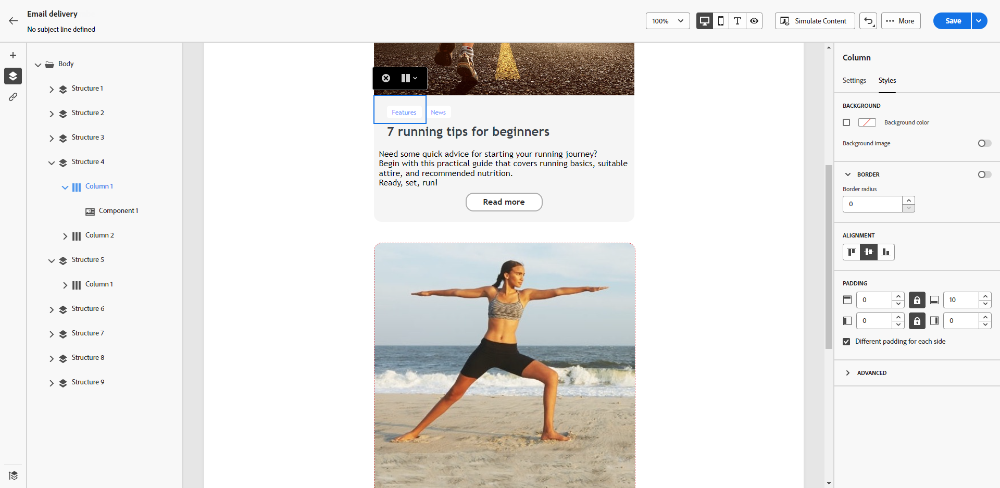

# 세로 정렬 및 패딩 조정 {#adjusting-vertical-alignment-and-padding}

>[!NOTE]
>
>이 설명서는 개발 중이며 자주 업데이트됩니다. 이 컨텐츠의 최종 버전은 2023년 1월에 준비될 예정입니다.

이 예에서는 세 개의 열로 구성된 구조 구성 요소 내에서 패딩 및 세로 정렬을 조정합니다.

1. 이메일에서 직접 또는 **[!UICONTROL 탐색 트리]** 왼쪽 메뉴에서 사용할 수 있습니다.

   

1. 도구 모음에서 **[!UICONTROL 열 선택]** 편집할 항목을 선택합니다. 구조 트리에서 선택할 수도 있습니다.

   해당 열의 편집 가능한 매개 변수는 **[!UICONTROL 열 설정]** 메뉴 아래의 제품에서 사용할 수 있습니다.

   

1. 아래 **[!UICONTROL 세로 정렬]**, 선택 **[!UICONTROL 아래쪽]**.

   컨텐츠 구성 요소가 열 아래로 이동합니다.

   

1. 아래 **[!UICONTROL 패딩]**&#x200B;를 사용하여 열 내의 위쪽 패딩을 정의합니다. 잠금 아이콘을 클릭하여 아래쪽 패딩과의 동기화를 중단합니다.

   해당 열에 대한 왼쪽 및 오른쪽 패딩을 정의합니다.

   

1. 다른 열의 정렬 및 패딩을 조정하려면 유사하게 진행합니다.

1. 변경 내용을 저장합니다.
