# 브랜드 개인화 {#brands-personalize}

모든 콘텐츠와 채널에서 일관성을 보장하는 포괄적인 브랜드 키트를 만들려면 브랜드 정체성의 다른 측면에 초점을 맞춰 다음 4개의 탭을 구성합니다.

* **[!UICONTROL 브랜드 정보]**&#x200B;를 통해 브랜드의 핵심 정체성과 가치를 설정할 수 있습니다.
* **[!UICONTROL 작성 스타일]**&#x200B;은(는) 언어 및 콘텐츠 표준을 정의합니다.
* **[!UICONTROL 시각적 콘텐츠]**&#x200B;는 이미지 및 디자인 지침을 설정합니다.
* **[!UICONTROL 색상]**&#x200B;은(는) 브랜드의 색상 시스템 및 사용을 관리합니다.

구성하고 나면 브랜드 지침을 사용하여 콘텐츠 품질과 브랜드 정렬을 검증할 수 있습니다. [콘텐츠 품질 유효성 검사에 대해 자세히 알아보기](brands-score.md#validate-quality)

## 브랜드 정보 {#about-brand}

**[!UICONTROL 브랜드 정보]** 탭을 사용하여 브랜드의 목적, 성격, 태그 및 기타 정의 특성에 대한 개요를 포함하여 브랜드의 핵심 정체성을 설정하십시오.

1. 먼저 **[!UICONTROL 주요 세부 정보]** 카테고리에 브랜드의 기본 정보를 입력하십시오.

   * **[!UICONTROL 브랜드 키트 이름]**: 브랜드 키트 이름을 입력하십시오.

   * **[!UICONTROL 사용 시기]**: 이 브랜드 키트를 적용해야 하는 시나리오 또는 컨텍스트를 지정합니다.

   * **[!UICONTROL 브랜드 이름]**: 공식 브랜드 이름을 입력하십시오.

   * **[!UICONTROL 브랜드 설명]**: 이 브랜드가 나타내는 내용에 대한 개요를 제공합니다.

   * **[!UICONTROL 기본 태그 지정]**: 브랜드와 연결된 기본 태그 지정을 추가합니다.

     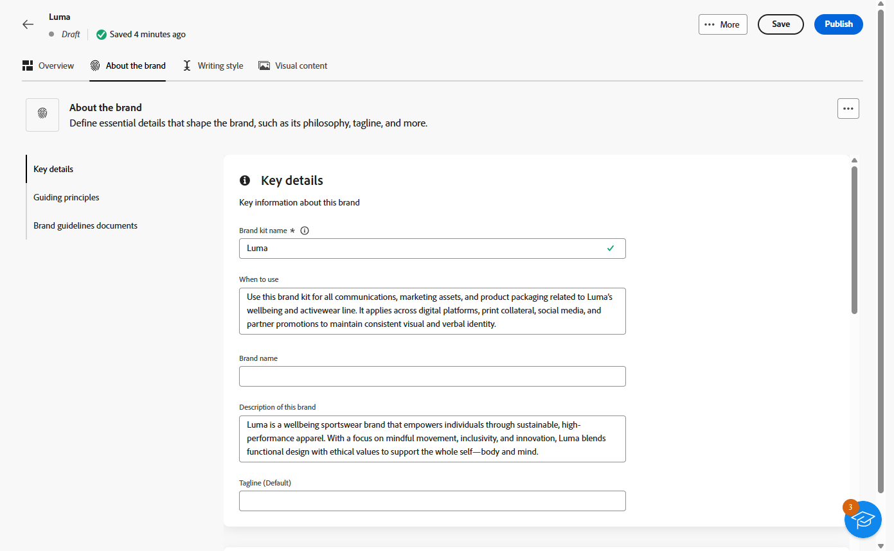

1. **[!UICONTROL 지침 원칙]** 범주에서 브랜드의 핵심 방향과 철학을 명확히 합니다.

   * **[!UICONTROL 작업]**: 브랜드 용도를 자세히 설명합니다.

   * **[!UICONTROL 비전]**: 장기 목표 또는 원하는 미래 상태에 대해 설명합니다.

   * **[!UICONTROL 시장 포지셔닝]**: 브랜드가 시장에서 어떻게 포지셔닝되고 있는지 설명합니다.

   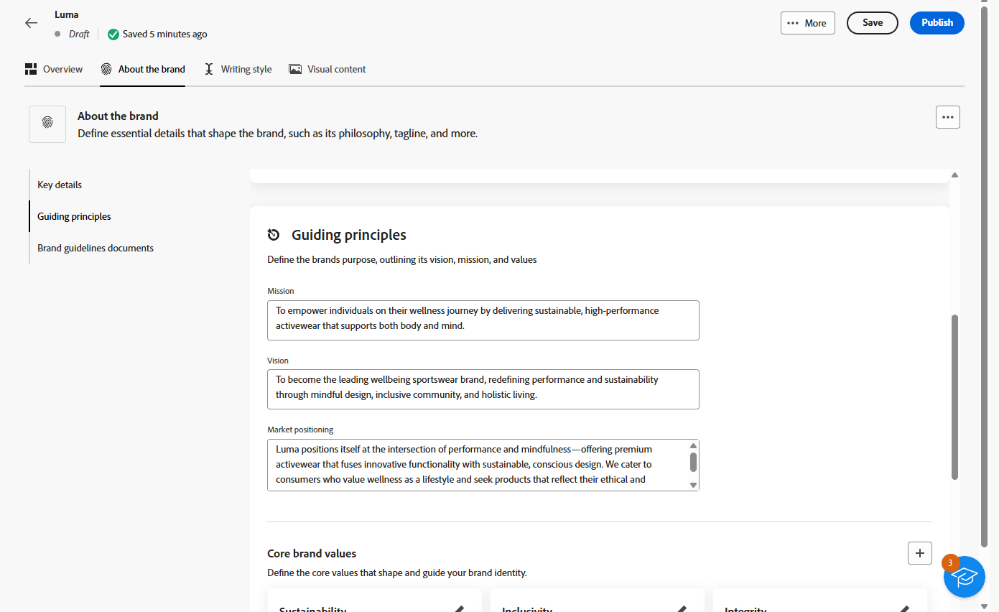

1. **[!UICONTROL 핵심 브랜드 값]** 카테고리에서 를 클릭하여 브랜드의 핵심 값을 추가하고 세부 정보를 입력합니다.

   * **[!UICONTROL 값]**: 핵심 브랜드 값에 이름을 지정합니다.

   * **[!UICONTROL 설명]**: 이 값이 브랜드에 어떤 의미가 있는지 설명합니다.

   * **[!UICONTROL 동작]**: 실제로 이 값을 반영하는 동작 또는 태도에 대해 대략적으로 설명합니다.

   * **[!UICONTROL 매니페스트]**: 이 값이 실제 브랜딩에서 표현되는 방식에 대한 예제를 제공하세요.

     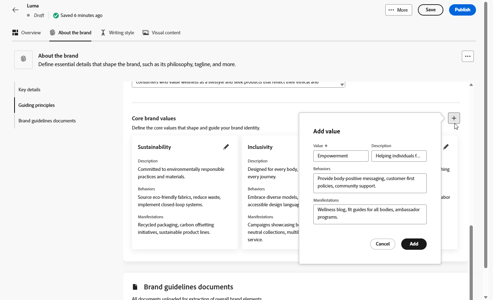

1. 필요한 경우 아이콘을 클릭하여 핵심 브랜드 가치 중 하나를 업데이트하거나 삭제합니다.

   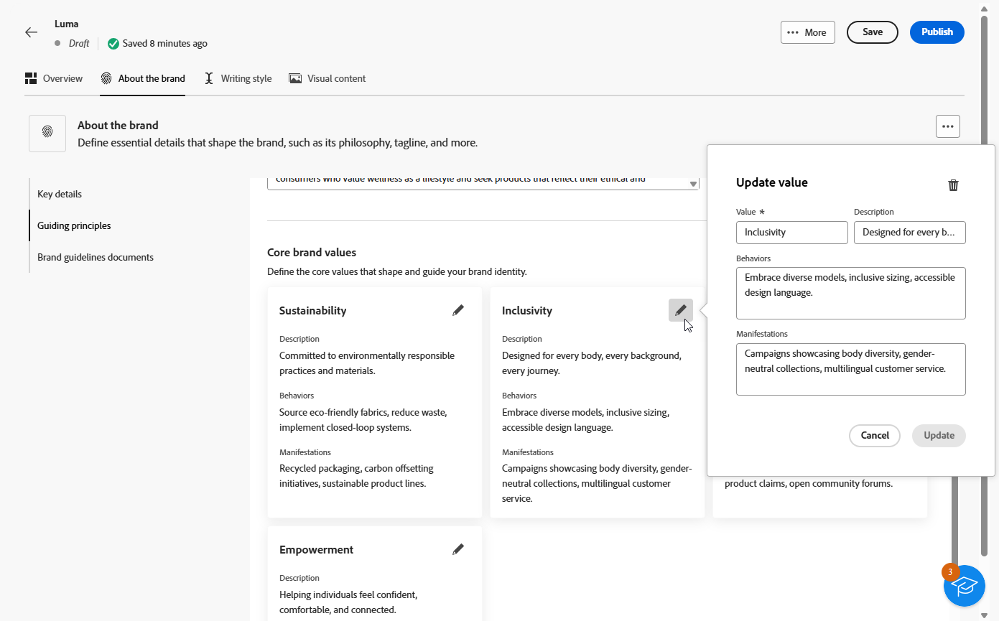

이제 브랜드를 추가로 개인화하거나 [브랜드를 게시](#create-brand-kit)할 수 있습니다.

## 작성 스타일 {#writing-style}

**[!UICONTROL 작성 스타일]** 섹션에서는 모든 자료의 명확성, 일관성 및 일관성을 유지하기 위해 언어, 서식 및 구조를 사용해야 하는 방법에 대해 자세히 설명하는 내용 작성의 표준을 간략하게 설명합니다.

+++ 사용 가능한 범주 및 예

<table>
  <thead>
    <tr>
      <th>카테고리</th>
      <th>하위 범주</th>
      <th>지침 예</th>
      <th>제외 예</th>
    </tr>
  </thead>
  <tbody>
    <tr>
      <td rowspan="4">콘텐츠 제작 표준</td>
      <td>브랜드 메시징 표준</td>
      <td>혁신과 고객 중심의 메시지를 강조하십시오.</td>
      <td>제품 기능을 너무 많이 약속하지 마십시오.</td>
    </tr>
    <tr>
      <td>태그 사용</td>
      <td>모든 디지털 마케팅 에셋의 로고 아래에 타깃을 놓습니다.</td>
      <td>타깃줄을 수정하거나 번역하지 마십시오.</td>
    </tr>
    <tr>
      <td>핵심 메시징</td>
      <td>생산성 향상과 같은 주요 이점 설명 강조</td>
      <td>관련 없는 값 제안을 사용하지 마십시오.</td>
    </tr>
    <tr>
      <td>이름 지정 표준</td>
      <td>"ProScheduler"와 같이 간단한 수사적 이름을 사용합니다.</td>
      <td>복잡한 용어나 특수 문자를 사용하지 마십시오.</td>
    </tr>
    <tr>
      <td rowspan="5">브랜드 커뮤니케이션 스타일</td>
      <td>브랜드 성격 트레이트</td>
      <td>친숙하고 접근하기 쉬워.</td>
      <td>패배주의자가 되지 마라.</td>
    </tr>
    <tr>
      <td>필기학</td>
      <td>문장을 짧고 굵게 유지하세요.</td>
      <td>과도한 전문 용어를 사용하지 마십시오.</td>
    </tr>
    <tr>
      <td>상황적 어조</td>
      <td>위기 커뮤니케이션에서 전문적 태도를 유지하십시오.</td>
      <td>지원 커뮤니케이션을 무시하지 마십시오.</td>
    </tr>
    <tr>
      <td>단어 선택 지침</td>
      <td>"혁신적", "현명한" 등의 단어를 사용하십시오.</td>
      <td>"싸다" 또는 "해킹"과 같은 단어를 피하십시오.</td>
    </tr>
    <tr>
      <td>언어 표준</td>
      <td>미국 영어 규칙을 따르십시오.</td>
      <td>영국 철자와 미국 철자를 혼합하지 마십시오.</td>
    </tr>
    <tr>
      <td rowspan="3">법적 규정 준수 표준</td>
      <td>상표 기준</td>
      <td>항상 ™ 또는 ® 기호를 사용하십시오.</td>
      <td>필요한 경우 법적 기호를 생략하지 마십시오.</td>
    </tr>
    <tr>
      <td>저작권 표준</td>
      <td>마케팅 자료에 대한 저작권 고지를 포함합니다.</td>
      <td>권한 없이 서드파티 콘텐츠를 사용하지 마십시오.</td>
    </tr>
    <tr>
      <td>면책조항 표준</td>
      <td>디지털 에셋에 고지 사항을 눈에 띄게 표시합니다.</td>
      <td>보이지 않는 영역에 면책조항을 숨기지 마십시오.</td>
    </tr>
</table>

+++

 

**[!UICONTROL 작성 스타일]**&#x200B;을 개인화하려면:

1. **[!UICONTROL 작성 스타일]** 탭에서 을(를) 클릭하여 지침, 예외 또는 제외를 추가합니다.

1. 지침, 예외 또는 제외를 입력합니다. 적용 방법을 더 잘 설명하기 위해 **[!UICONTROL 예]**&#x200B;를 포함할 수도 있습니다.

   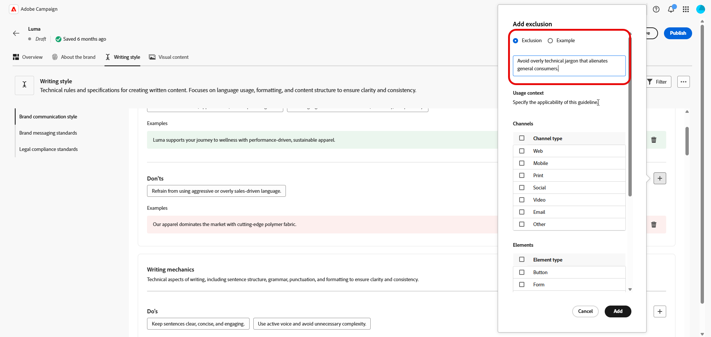

1. 지침, 예외 또는 제외에 대한 **[!UICONTROL 사용 컨텍스트]**&#x200B;를 지정하십시오.

   * **[!UICONTROL 채널 유형]**: 이 지침, 예외 또는 제외를 적용할 위치를 선택하십시오. 예를 들어 특정 쓰기 스타일이 이메일, 모바일, 인쇄 또는 기타 통신 채널에만 표시되도록 할 수 있습니다.

   * **[!UICONTROL 요소 형식]**: 규칙이 적용되는 콘텐츠 요소를 지정합니다. 여기에는 제목, 단추, 링크 또는 콘텐츠 내의 기타 구성 요소와 같은 요소가 포함될 수 있습니다.

   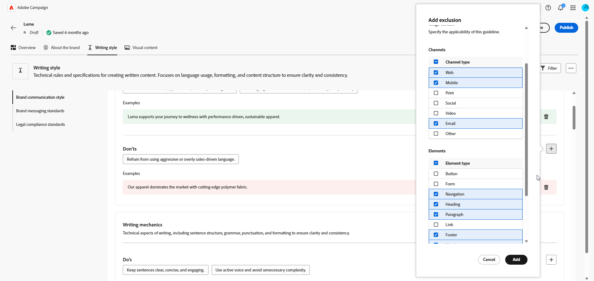

1. 지침, 예외 또는 제외가 설정되면 **[!UICONTROL 추가]**&#x200B;를 클릭합니다.
1. 필요한 경우 가이드라인 또는 제외 중 하나를 선택하여 업데이트하거나 삭제합니다.

1. 예제를 편집하려면 을 클릭하고 삭제하려면 아이콘을 클릭하십시오.

   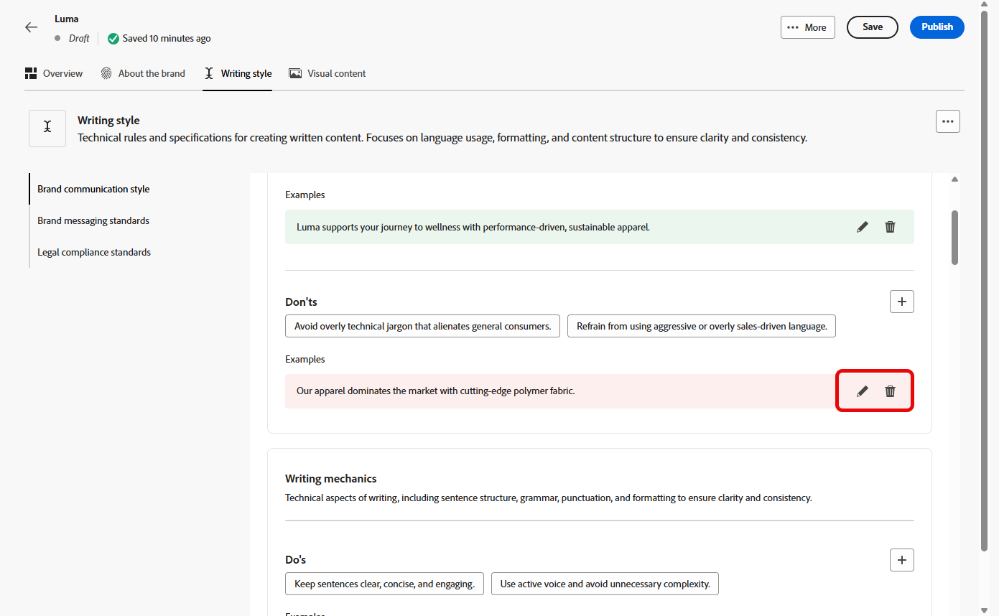

이제 브랜드를 추가로 개인화하거나 [브랜드를 게시](#create-brand-kit)할 수 있습니다.

## 시각적 콘텐츠 {#visual-content}

**[!UICONTROL 시각적 콘텐츠]** 섹션은 이미지 및 디자인에 대한 표준을 정의하며, 통일되고 일관된 브랜드 디자인을 유지하는 데 필요한 사양을 자세히 설명합니다.

+++ 사용 가능한 범주 및 예

<table>
  <thead>
    <tr>
      <th>카테고리</th>
      <th>지침 예</th>
      <th>제외 예</th>
    </tr>
  </thead>
  <tbody>
    <tr>
      <td>사진 표준</td>
      <td>야외 촬영에는 자연 채광을 사용하십시오.</td>
      <td>지나치게 편집되거나 픽셀화된 이미지는 피하십시오.</td>
    </tr>
    <tr>
      <td>일러스트레이션 표준</td>
      <td>깔끔하고 미니멀한 스타일을 사용하세요.</td>
      <td>지나치게 복잡하지 않도록 합니다.</td>
    </tr>
    <tr>
      <td>아이콘 표준</td>
      <td>일관된 24px 격자 시스템을 사용합니다.</td>
      <td>아이콘 차원을 혼합하지 않거나, 일관성이 없는 획 가중치를 사용하거나, 격자 규칙을 벗어나지 않습니다.</td>
    </tr>
    <tr>
      <td>사용 지침</td>
      <td>전문 환경에서 제품을 사용하는 실제 고객을 반영하는 라이프스타일 이미지를 선택하십시오.</td>
      <td>브랜드 톤과 모순되거나 문맥에서 벗어난 이미지를 사용하지 마십시오.</td>
    </tr>
</table>

+++

 

**[!UICONTROL 시각적 컨텐츠]**&#x200B;를 개인화하려면 다음을 수행하십시오.

1. **[!UICONTROL 시각적 콘텐츠]** 탭에서 을(를) 클릭하여 지침, 제외 또는 예제를 추가합니다.

1. 지침, 제외 또는 예를 입력합니다.

   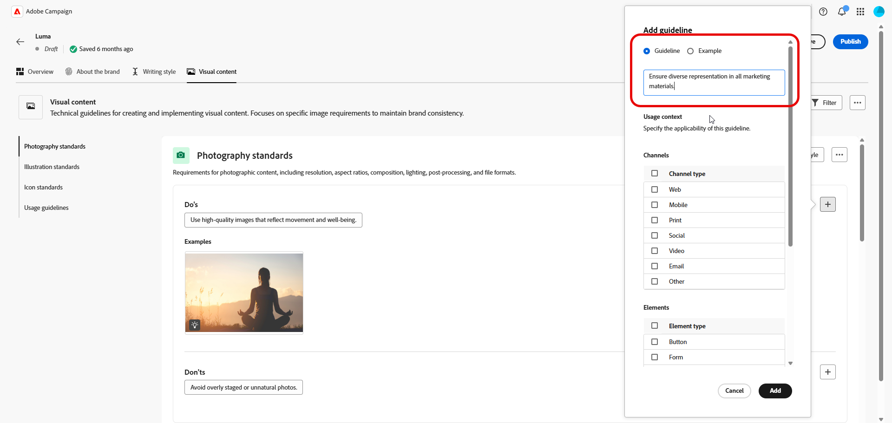

1. 지침 또는 제외에 대한 **[!UICONTROL 사용 컨텍스트]**&#x200B;를 지정하십시오.

   * **[!UICONTROL 채널 유형]**: 이 지침, 예외 또는 제외를 적용할 위치를 선택하십시오. 예를 들어 특정 쓰기 스타일이 이메일, 모바일, 인쇄 또는 기타 통신 채널에만 표시되도록 할 수 있습니다.

   * **[!UICONTROL 요소 형식]**: 규칙이 적용되는 콘텐츠 요소를 지정합니다. 여기에는 제목, 단추, 링크 또는 콘텐츠 내의 기타 구성 요소와 같은 요소가 포함될 수 있습니다.

     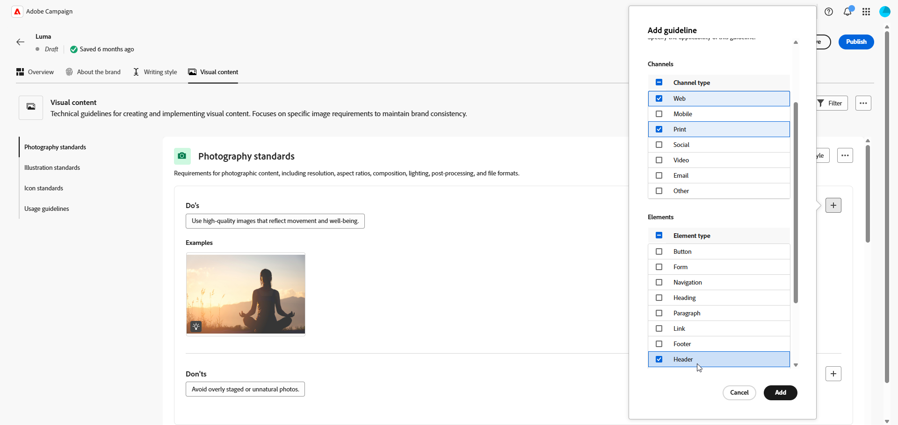

1. 지침, 예외 또는 제외가 설정되면 **[!UICONTROL 추가]**&#x200B;를 클릭합니다.

1. 올바른 사용을 표시하는 이미지를 추가하려면 **[!UICONTROL 예제]**&#x200B;를 선택하고 **[!UICONTROL 이미지 선택]**&#x200B;을 클릭합니다. 제외 예로서 잘못된 사용을 보여주는 이미지를 추가할 수도 있습니다.

   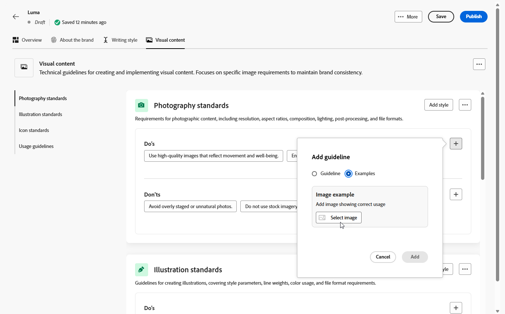

1. 업데이트하거나 삭제할 지침 또는 제외 중 하나를 선택합니다.

1. 지침 또는 제외 중 하나를 선택하여 업데이트합니다. 삭제하려면 아이콘을 클릭하십시오.

   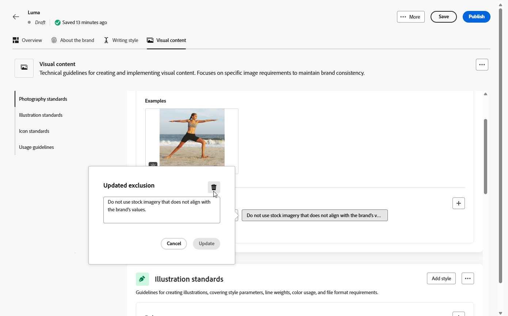

이제 브랜드를 추가로 개인화하거나 [브랜드를 게시](#create-brand-kit)할 수 있습니다.

## 색상 {#colors}

**[!UICONTROL 색상]** 섹션에서는 브랜드 색상 시스템에 대한 표준을 정의하고 색상을 선택, 구성 및 여러 경험에서 적용하는 방법에 대해 대략적으로 설명합니다. 기본, 보조, 악센트 및 중립 색상을 일관되게 사용하여 일관되고 쉽게 액세스할 수 있으며 인식 가능한 브랜드 정체성을 유지합니다.

+++ 사용 가능한 범주 및 예

<table>
  <thead>
    <tr>
      <th>카테고리</th>
      <th>지침 예</th>
      <th>제외 예</th>
    </tr>
  </thead>
  <tbody>
    <tr>
      <td>기본 색상</td>
      <td>로고, 헤더 및 기본 call-to-action 요소에 기본 브랜드 색상을 사용합니다.</td>
      <td>기본 브랜드 색상을 대체하거나 수정하지 마십시오.</td>
    </tr>
    <tr>
      <td>보조 색상</td>
      <td>보조 색상을 사용하여 레이아웃, 일러스트레이션 및 UI 구성 요소를 지원합니다.</td>
      <td>보조 색상이 기본 브랜드 색상을 압도하지 않도록 하십시오.</td>
    </tr>
    <tr>
      <td>강조 색상</td>
      <td>단추, 링크 및 경고에는 강조색을 제한적으로 사용하십시오.</td>
      <td>큰 배경 영역에는 강조색을 사용하지 마십시오.</td>
    </tr>
    <tr>
      <td>중간 색상</td>
      <td>텍스트, 구분자, 테두리 및 미묘한 UI 요소에 중립 색상을 사용합니다.</td>
      <td>대비가 불량하거나 색조가 무거운 중성자는 사용하지 마십시오.</td>
    </tr>
    <tr>
      <td>배경색</td>
      <td>가독성과 시각적 명확성을 보장하기 위해 밝은 배경 또는 중간 배경을 사용하십시오.</td>
      <td>낮은 대비 배경에 텍스트나 로고를 배치하지 마십시오.</td>
    </tr>
    <tr>
      <td>추가 색상</td>
      <td>데이터 시각화 또는 승인된 캠페인에 대해서만 추가 색상을 사용합니다.</td>
      <td>승인되지 않은 색상 또는 브랜드 외 색상은 도입하지 마십시오.</td>
    </tr>
    <tr>
      <td>색상 비율</td>
      <td>마우스로 가리키기, 활성, 비활성화와 같은 UI 상태에 대해 승인된 색조와 음영을 사용하십시오.</td>
      <td>비공식 음영이나 그라디언트를 만들지 마십시오.</td>
    </tr>
    <tr>
      <td>사용 지침</td>
      <td>모든 에셋에서 일관된 색상 사용 및 액세스 가능한 대비를 유지합니다.</td>
      <td>충돌하는 팔레트를 혼합하거나 색상을 일관되지 않게 적용하지 마십시오.</td>
    </tr>
</table>

+++

 

**[!UICONTROL 색상]**&#x200B;을 개인화하려면:

1. **[!UICONTROL 색상]** 탭에서 을(를) 클릭하여 색상, 지침 또는 제외를 추가합니다.

1. 색상 정보를 정확히 정의하려면 색상 정보를 입력합니다.

   * **색상 이름**: 브랜드 시스템에서 색상을 식별할 수 있도록 명확하고 설명적인 이름을 제공합니다.

   * **색상 값**: 색조 선택기를 사용하여 색상을 선택하거나 RGB, HEX 또는 Pantone 이름/코드를 사용하여 정확한 값을 입력하여 디지털 및 인쇄 에셋에서 일관성을 유지합니다.

   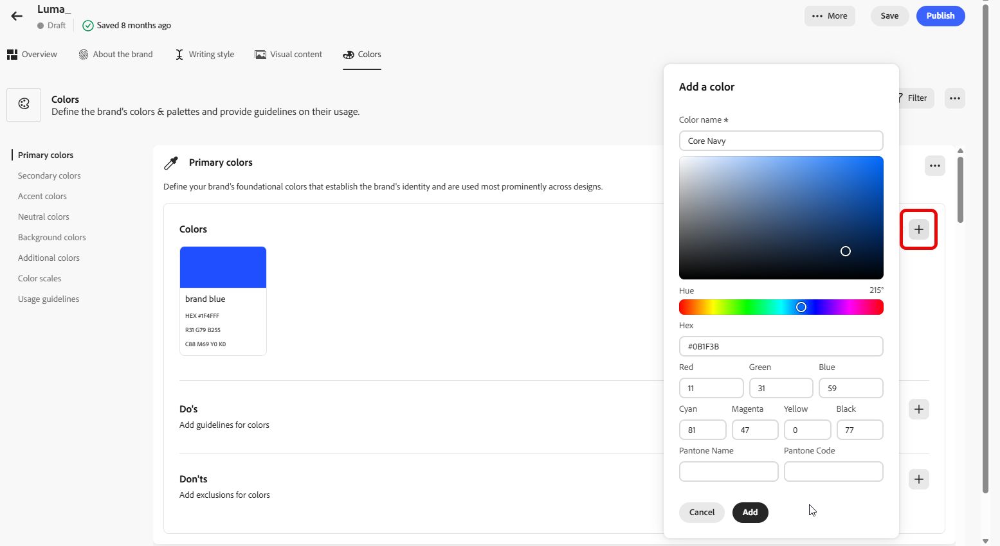

1. 선택 내용을 검토하여 정확성과 시각적 일관성을 확인하고 **[!UICONTROL 추가]**&#x200B;를 클릭하여 색을 저장합니다.

1. 그런 다음 지침 또는 제외를 입력합니다.

1. 지침 또는 제외에 대한 사용 컨텍스트를 지정합니다.

   * **[!UICONTROL 채널 유형]**: 이 지침, 예외 또는 제외를 적용할 위치를 선택하십시오. 예를 들어 특정 쓰기 스타일이 이메일, 모바일, 인쇄 또는 기타 통신 채널에만 표시되도록 할 수 있습니다.

   * **[!UICONTROL 요소 형식]**: 규칙이 적용되는 콘텐츠 요소를 지정합니다. 여기에는 제목, 단추, 링크 또는 콘텐츠 내의 기타 구성 요소와 같은 요소가 포함될 수 있습니다.

     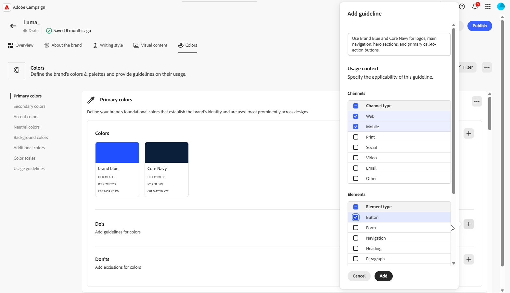

1. 지침, 예외 또는 제외가 설정되면 **[!UICONTROL 추가]**&#x200B;를 클릭합니다.

1. 필요한 경우 가이드라인 또는 제외 중 하나를 선택하여 업데이트하거나 삭제합니다.

1. 지침 또는 제외 중 하나를 선택하여 업데이트합니다. 삭제하려면 아이콘을 클릭하십시오.

   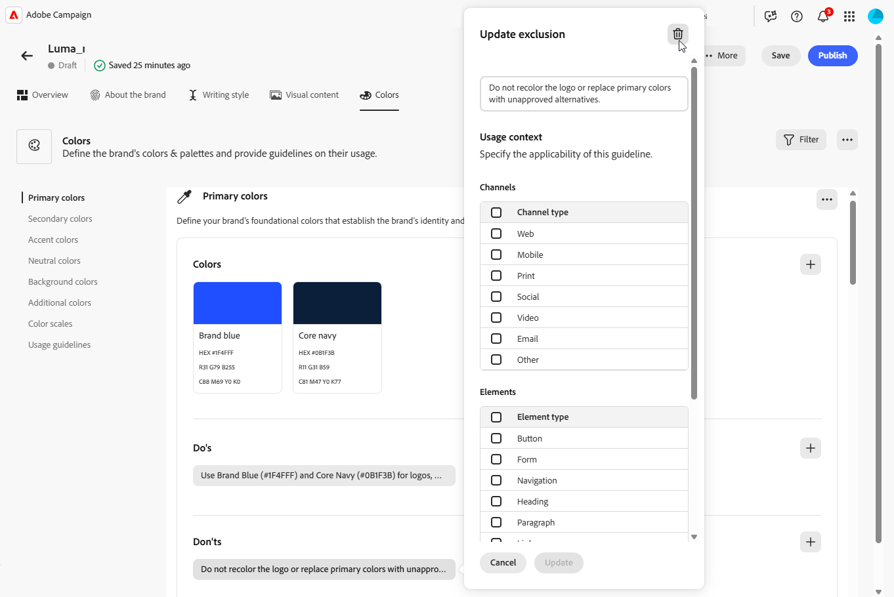

1. **[!UICONTROL 그룹 추가]**&#x200B;를 클릭하여 브랜드를 위한 추가 색상을 정의하거나 색상 배율 그룹을 추가합니다.

이제 브랜드를 추가로 개인화하거나 [브랜드를 게시](brands.md#create-brand-kit)할 수 있습니다.

