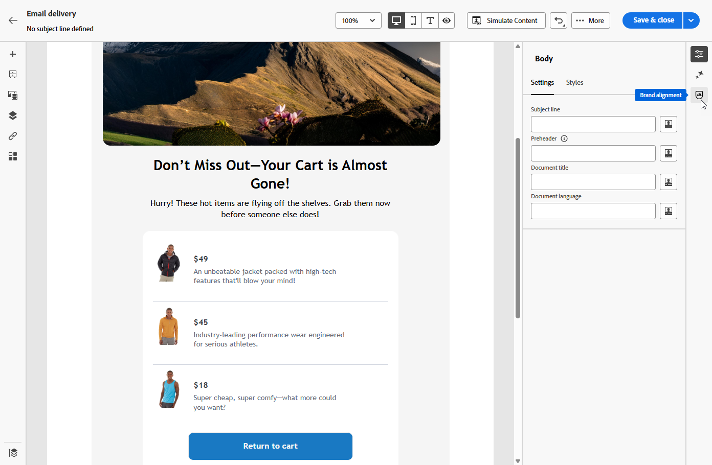
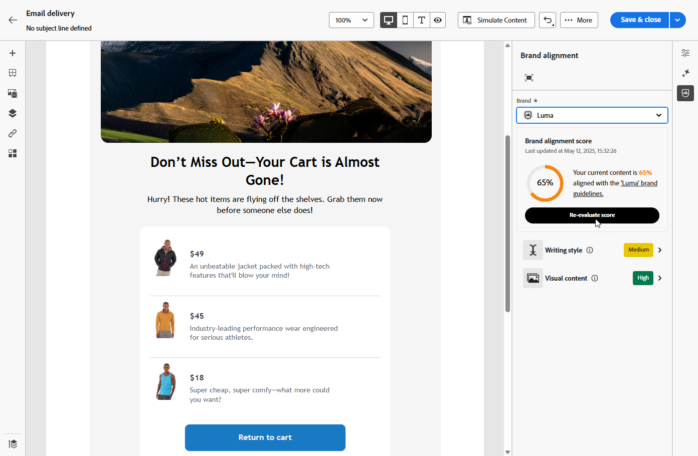
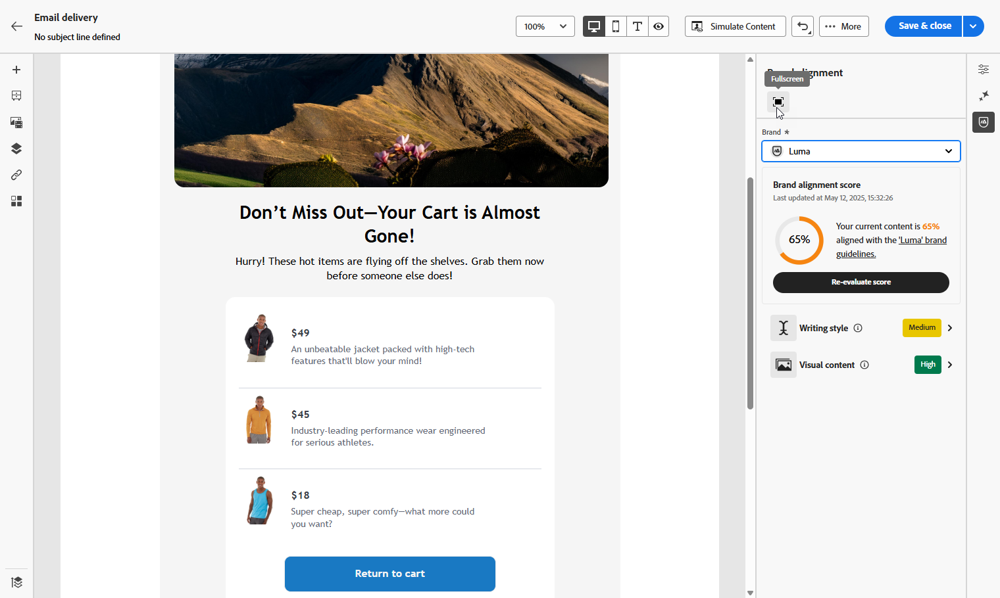
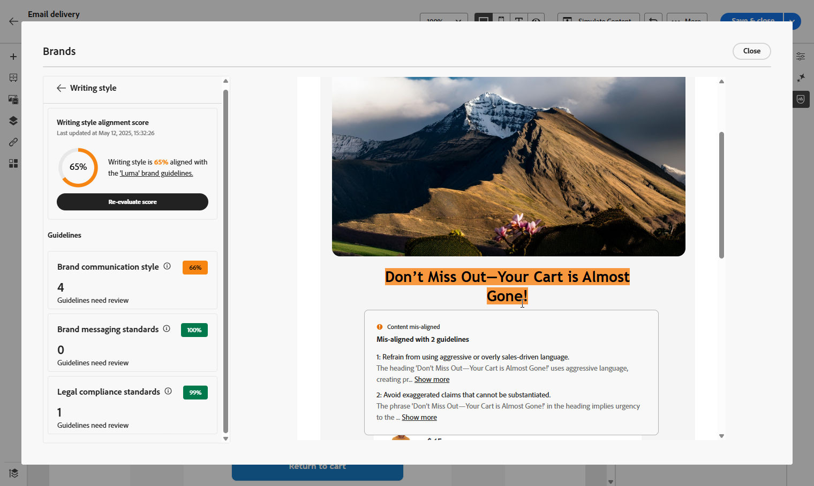
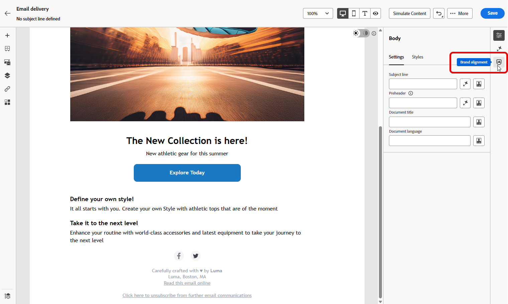
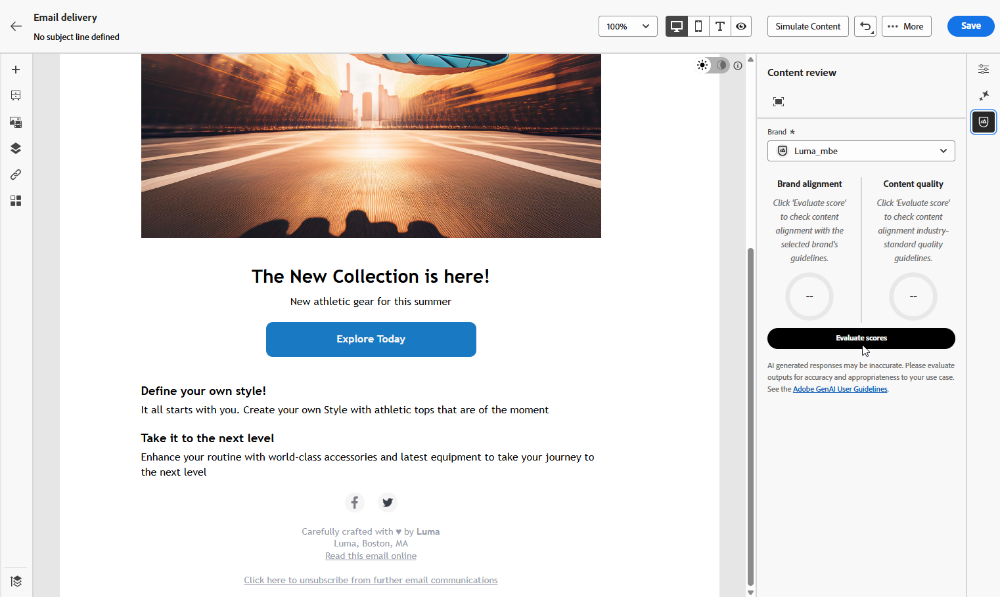
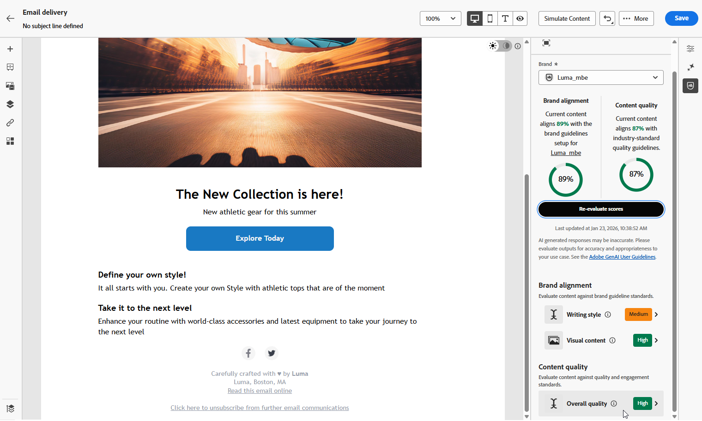
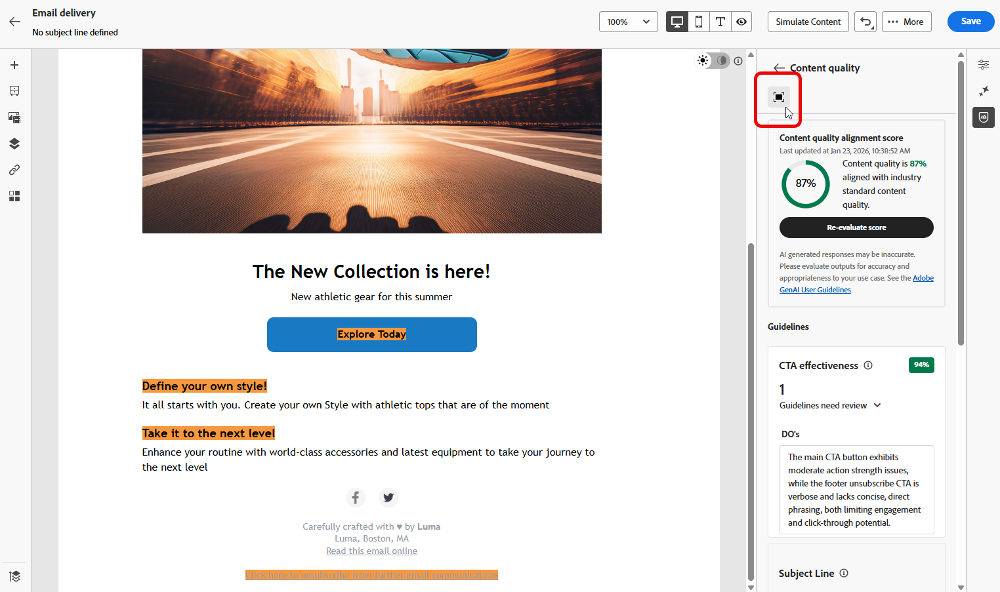
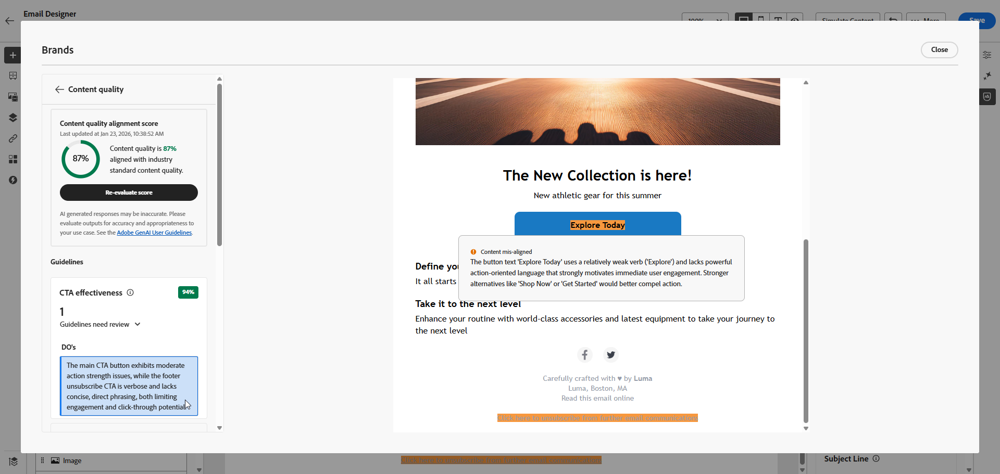

# 콘텐츠 평가 {#brands-score}

>[!AVAILABILITY]
>
>AI Assistant를 사용하려면 [사용자 계약](https://www.adobe.com/kr/legal/licenses-terms/adobe-dx-gen-ai-user-guidelines.html){target="_blank"}에 동의해야 합니다. 자세한 내용은 Adobe 담당자에게 문의하세요.

콘텐츠 검토 기능은 캠페인이 브랜드 가이드라인에 맞게 조정되고 모든 커뮤니케이션에서 콘텐츠 품질 표준을 유지하는 정도를 측정하는 포괄적인 평가 도구를 제공합니다.

* **브랜드 정렬**: 브랜드 지침을 준수하는 콘텐츠를 검토하고 관리합니다. 이를 통해 이메일 캠페인 전반에서 톤, 메시징 및 시각적 ID의 일관성을 보장합니다.
* **품질 검사**: 높은 표준 및 브랜드 무결성을 유지하기 위해 콘텐츠를 활성화하기 전에 유효성을 검사하십시오.

## 브랜드 정렬을 사용하여 콘텐츠 유효성 검사 {#validate-content}

[브랜드를 설정하고 게시하면](brands.md), 이메일 캠페인 내에서 직접 브랜드 정렬 점수를 평가하여 콘텐츠가 브랜드 지침에 맞게 조정되도록 합니다.

1. [전자 메일 캠페인](../email/create-email.md)을 만듭니다.

1. 이메일 디자이너에서 **[!UICONTROL 브랜드 정렬]** 메뉴를 엽니다.

   기본 브랜드에 대해 콘텐츠가 자동으로 평가됩니다. [기본 브랜드를 할당하는 방법을 알아보세요](brands.md).

   

1. 다른 브랜드를 사용하여 평가하려면 **[!UICONTROL 브랜드]** 드롭다운 메뉴에서 브랜드를 선택하고 **[!UICONTROL 점수 다시 평가]**&#x200B;를 클릭하십시오.

   

1. **브랜드 정렬 점수**(높음, Medium, 낮음)를 살펴보고 자세한 피드백을 검토하십시오.

1. 점수에 대한 더 많은 통찰력을 보려면  아이콘을 클릭하십시오.

   

1. 특정 피드백 및 제안을 보려면 플래그가 지정된 지침을 선택하십시오.

   

1. 권장 사항을 기반으로 콘텐츠를 편집하여 브랜드 정렬을 개선합니다.

1. 정렬 점수를 새로 고치기 위해 변경 후 콘텐츠를 수동으로 다시 평가합니다.

## 콘텐츠 품질 유효성 검사 {#validate-quality}

>[!NOTE]
>
>콘텐츠 품질 평가는 브랜드 지침과 독립적입니다. 드롭다운 메뉴에서 브랜드를 선택하더라도 해당 지침은 품질 검사에 적용되지 않습니다. 브랜드 선택은 브랜드 정렬 점수에만 관련이 있습니다.

브랜드 정렬 외에도 브랜드 지침과 관계없이 가독성, 콘텐츠 응집성 및 효과성과 관련된 잠재적 문제를 식별하기 위해 일반적인 콘텐츠 품질을 평가할 수 있습니다.

콘텐츠 품질을 평가하려면 다음을 수행하십시오.

1. [전자 메일 게재](../email/create-email.md)를 만듭니다.

1. 이메일 Designer에서 **[!UICONTROL 브랜드 정렬]** 메뉴를 엽니다.

   

1. 브랜드 맞춤 점수와 콘텐츠 품질 점수를 모두 생성하려면 **[!UICONTROL 점수 평가]**&#x200B;를 클릭하십시오.

   

1. 콘텐츠 품질 인사이트 및 권장 사항을 검토하려면 **[!UICONTROL 전체 품질]** 탭으로 이동하십시오.

   

1. 품질 점수에 대한 자세한 보기를 보려면  아이콘을 클릭하십시오.

   

1. 특정 피드백 및 개선을 위해 실행 가능한 제안을 보려면 플래그가 지정된 항목을 선택하십시오. 점수는 다음 카테고리를 기반으로 합니다.

   * **[!UICONTROL CTA 효율성]**: call-to-action이 독자에게 원하는 행동을 취하도록 동기를 부여하는 정도를 평가합니다.
   * **[!UICONTROL 제목 줄]**: 명확성, 관련성 및 주의를 끄는 품질을 평가하여 이메일 열기를 유도합니다.
   * **[!UICONTROL 가독성]**: 독자가 이해할 수 있는 컨텐츠의 용이성과 참여도를 측정합니다.
   * **[!UICONTROL 스팸 확인]**: 전달성에 영향을 줄 수 있는 일반적인 스팸 트리거를 식별합니다.
   * **[!UICONTROL 컨텐츠 응집력]**: 컨텐츠가 원활하게 흐르고 주제를 벗어나지 않도록 합니다.
   * **[!UICONTROL 교정]**: 맞춤법, 문법 및 명확성 문제가 있는지 확인합니다.

   

1. 권장 사항을 기반으로 콘텐츠를 편집하여 가독성, 콘텐츠 응집성 및 전체 품질을 향상시킵니다.

1. 품질 점수를 새로 고치려면 변경한 후 **[!UICONTROL 점수 다시 평가]**&#x200B;를 클릭하십시오.
