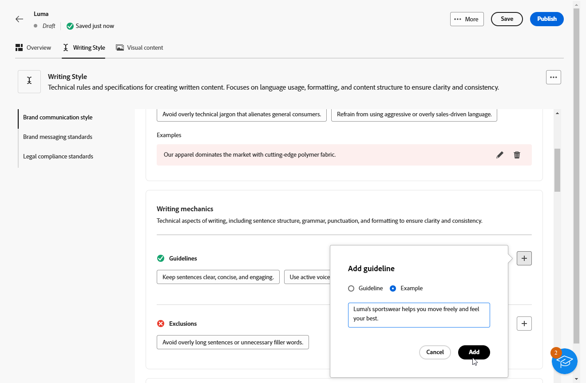
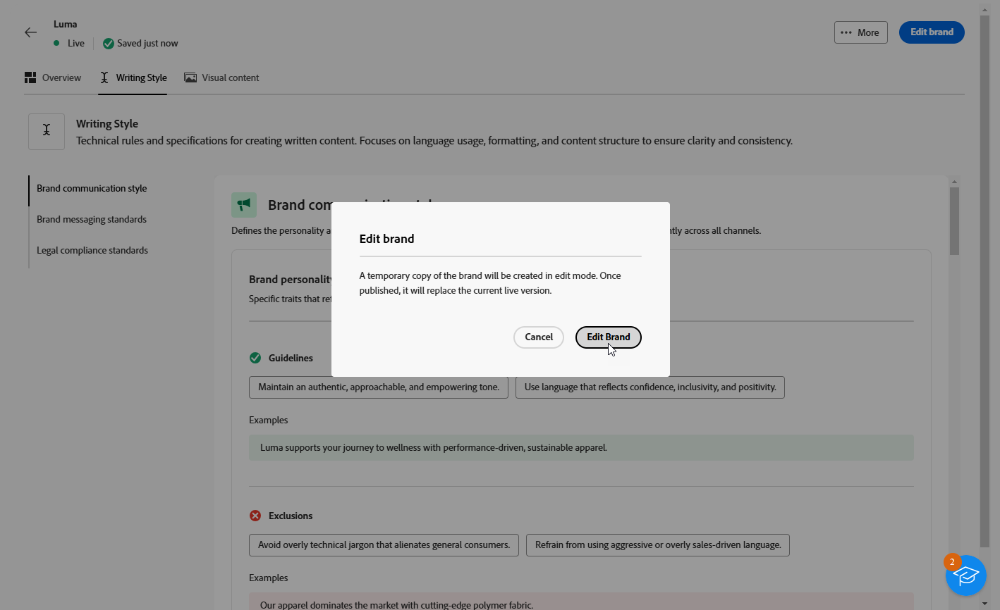

# 브랜드 생성 및 관리 {#brands}

>[!AVAILABILITY]
>
>이 기능은 비공개 베타로 출시됩니다. 향후 릴리스에서 모든 고객에게 점진적으로 제공될 예정입니다.

브랜드 지침은 브랜드의 시각적 및 언어적 정체성을 정의하는 포괄적인 규칙 및 표준 세트입니다. 모든 마케팅 및 커뮤니케이션 채널에서 일관된 브랜드 표현을 보장하기 위한 참조 역할을 합니다.

이제 [!DNL Adobe Campaign Web]에서 브랜드 정보를 수동으로 입력 및 구성하거나 자동 데이터 추출을 위해 브랜드 지침 문서를 업로드할 수 있습니다.

## 브랜드 액세스 {#generative-access}

[!DNL Adobe Campaign Web]에서 **[!UICONTROL 브랜드]** 메뉴에 액세스하려면 사용자에게 **[!UICONTROL 관리자(관리자)]** 및 **[!UICONTROL 브랜드 키트]** 제품 프로필을 할당하여 브랜드를 만들고 관리해야 합니다. 읽기 전용 액세스를 위해 사용자는 [!UICONTROL AI 도우미] 제품 프로필이 필요합니다.

[자세히 알아보기](https://experienceleague.adobe.com/en/docs/campaign/campaign-v8/admin/permissions/manage-permissions)

+++  브랜드 관련 권한을 할당하는 방법을 알아봅니다.

1. [Admin Console](https://adminconsole.adobe.com/enterprise) 홈 페이지에서 Campaign 제품에 액세스하십시오.

   

1. 사용자에게 부여할 권한 수준에 따라 **[!DNL Product profile]**&#x200B;을(를) 선택합니다.

   

1. 선택한 제품 프로필을 할당하려면 **[!DNL Add users]**&#x200B;을(를) 클릭하십시오.

   

1. 사용자 이름, 사용자 그룹 또는 이메일 주소를 입력합니다.

1. 변경 내용을 적용하려면 **저장**&#x200B;을 클릭하세요.

이 역할에 이미 할당된 모든 사용자의 권한은 자동으로 업데이트됩니다.

+++

## 브랜드 만들기 {#create-brand-kit}

브랜드 지침을 만들고 관리하려면 아래 단계를 따르십시오.

Brand Guidelines를 만들고 관리하기 위해 직접 세부 정보를 입력하거나 브랜드 지침 문서를 업로드하여 정보를 자동으로 추출할 수 있습니다.

1. **[!UICONTROL 콘텐츠 관리]** 메뉴에서 **[!UICONTROL 브랜드]**&#x200B;를 선택합니다.

1. **[!UICONTROL 브랜드]** 메뉴에서 **[!UICONTROL 브랜드 만들기]**&#x200B;를 클릭합니다.

   

1. 브랜드의 **[!UICONTROL 이름]**&#x200B;을(를) 입력하십시오.

1. 파일을 드래그 앤 드롭하거나 선택하여 브랜드 지침을 업로드하고 자동으로 관련 브랜드 정보를 추출합니다. **[!UICONTROL 브랜드 만들기]**&#x200B;를 클릭합니다.

   이제 정보 추출 프로세스가 시작됩니다. 완료하는 데 몇 분 정도 걸릴 수 있습니다.

   

1. 이제 콘텐츠 및 시각적 만들기 표준이 자동으로 채워집니다. 다양한 탭을 탐색하여 필요에 따라 정보를 조정합니다.

1. **[!UICONTROL 작성 스타일]** 탭에서 을(를) 클릭하여 예제를 포함한 지침 또는 제외를 추가합니다.

   

1. **[!UICONTROL 시각적 콘텐츠]** 탭에서 을(를) 클릭하여 다른 지침이나 제외를 추가합니다.

1. 올바른 사용을 보여 주는 이미지를 추가하려면 **[!UICONTROL 예]**&#x200B;를 선택하고 **[!UICONTROL 이미지 선택]**&#x200B;을 클릭합니다. 제외 예로서 잘못된 사용을 보여주는 이미지를 추가할 수도 있습니다.

   

1. 구성이 완료되면 **[!UICONTROL 저장]**&#x200B;을 클릭한 다음 **[!UICONTROL 게시]**&#x200B;을 클릭하여 브랜드 지침을 AI 도우미에서 사용할 수 있도록 합니다.

1. 게시된 브랜드를 수정하려면 **[!UICONTROL 브랜드 편집]**&#x200B;을 클릭하세요.

   >[!NOTE]
   >
   >이렇게 하면 편집 모드에 임시 복사본이 만들어지고 게시 후 라이브 버전이 대체됩니다.

   

1. **[!UICONTROL 브랜드]** 대시보드에서  아이콘을 클릭하여 고급 메뉴를 열어 다음 작업을 수행합니다.

   * 브랜드 보기
   * 편집
   * 복제
   * 게시
   * 게시 취소
   * 삭제

   

이제 AI 도우미 메뉴의 **[!UICONTROL Brand]** 드롭다운에서 브랜드 지침에 액세스할 수 있으므로 사양에 맞게 콘텐츠 및 에셋을 생성할 수 있습니다. [AI Assistant에 대해 자세히 알아보기](../email/generative-gs.md)

