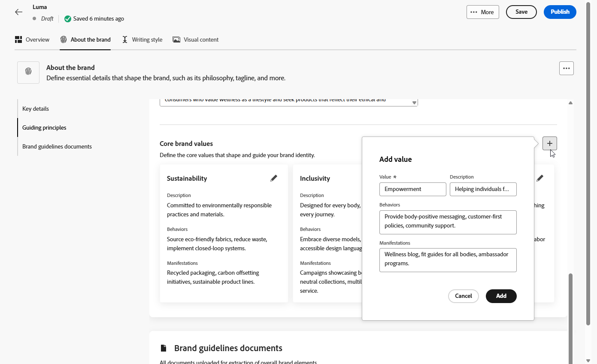
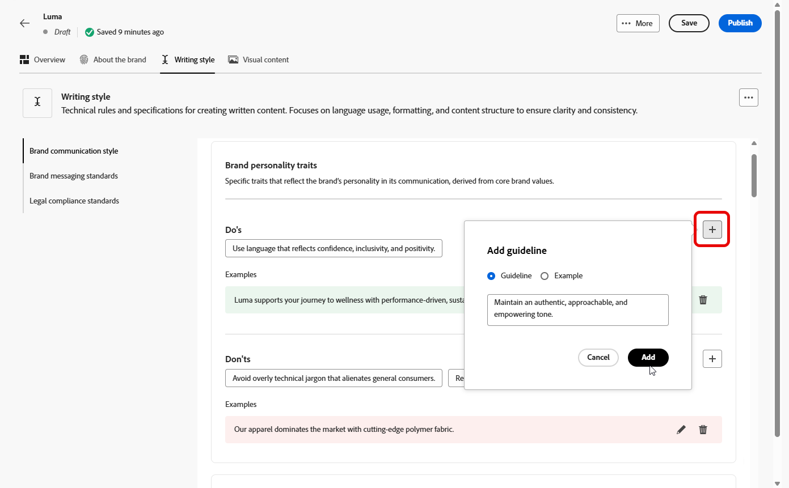
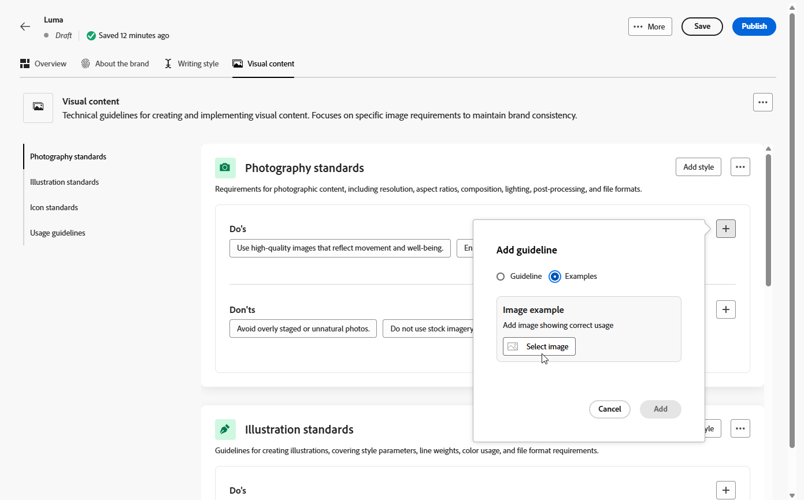

# 브랜드 생성 및 관리 {#brands}

>[!AVAILABILITY]
>
>이 기능은 비공개 베타로 출시됩니다. 향후 릴리스에서 모든 고객에게 점진적으로 제공될 예정입니다.

브랜드 지침은 브랜드의 시각적 및 언어적 정체성을 정의하는 포괄적인 규칙 및 표준 세트입니다. 모든 마케팅 및 커뮤니케이션 채널에서 일관된 브랜드 표현을 보장하기 위한 참조 역할을 합니다.

[!DNL Adobe Campaign Web]에서 사용자는 수동으로 브랜드 정보를 입력 및 구성하거나 자동 데이터 추출을 위해 브랜드 지침 문서를 업로드할 수 있습니다.

## 브랜드 액세스 {#generative-access}

[!DNL Adobe Campaign Web]에서 **[!UICONTROL 브랜드]** 메뉴에 액세스하려면 사용자에게 **[!UICONTROL 관리자(관리자)]** 및 **[!UICONTROL 브랜드 키트]** 제품 프로필을 할당하여 브랜드를 만들고 관리해야 합니다. 읽기 전용 액세스를 위해 사용자는 [!UICONTROL AI Assistant] 제품 프로필이 필요합니다.

[자세히 알아보기](https://experienceleague.adobe.com/ko/docs/campaign/campaign-v8/admin/permissions/manage-permissions)

+++ 브랜드 관련 권한을 할당하는 방법을 알아봅니다.

1. [Admin Console](https://adminconsole.adobe.com/enterprise) 홈 페이지에서 Campaign 제품에 액세스하십시오.

   

1. 사용자에게 부여할 권한 수준에 따라 **[!DNL Product profile]**&#x200B;을(를) 선택합니다.

   

1. 선택한 제품 프로필을 할당하려면 **[!DNL Add users]**&#x200B;을(를) 클릭하십시오.

   

1. 사용자 이름, 사용자 그룹 또는 이메일 주소를 입력합니다.

1. 변경 내용을 적용하려면 **저장**&#x200B;을 클릭하세요.

이 역할에 이미 할당된 사용자의 권한은 자동으로 업데이트됩니다.

+++

## 브랜드 만들기 {#create-brand-kit}

브랜드 지침을 만들고 관리하려면 아래 단계를 따르십시오.

사용자는 세부 정보를 수동으로 입력하거나 브랜드 가이드라인 문서를 업로드하여 정보를 자동으로 추출할 수 있습니다.

1. **[!UICONTROL 브랜드]** 메뉴에서 **[!UICONTROL 브랜드 만들기]**&#x200B;를 클릭합니다.

   

1. 브랜드의 **[!UICONTROL 이름]**&#x200B;을(를) 입력하십시오.

1. 파일을 드래그 앤 드롭하거나 선택하여 브랜드 지침을 업로드하고 자동으로 관련 브랜드 정보를 추출합니다. **[!UICONTROL 브랜드 만들기]**&#x200B;를 클릭합니다.

   이제 정보 추출 프로세스가 시작됩니다. 완료하는 데 몇 분 정도 걸릴 수 있습니다.

   

1. 이제 콘텐츠 및 시각적 만들기 표준이 자동으로 채워집니다. 다양한 탭을 탐색하여 필요에 따라 정보를 조정합니다. [자세히 알아보기](#personalize)

1. 각 섹션 또는 범주의 고급 메뉴에서 참조를 추가하여 관련 브랜드 정보를 자동으로 추출할 수 있습니다.

   기존 콘텐츠를 제거하려면 **[!UICONTROL 섹션 지우기]** 또는 **[!UICONTROL 범주 지우기]** 옵션을 사용하십시오.

   

1. 구성하고 나면 **[!UICONTROL 저장]**&#x200B;을 클릭한 다음 **[!UICONTROL 게시]**&#x200B;을 클릭하여 브랜드 지침을 AI Assistant에서 사용할 수 있도록 만드십시오.

1. 게시된 브랜드를 수정하려면 **[!UICONTROL 브랜드 편집]**&#x200B;을 클릭하세요.

   >[!NOTE]
   >
   >이렇게 하면 편집 모드에 임시 복사본이 만들어지고 게시 후 라이브 버전이 대체됩니다.

   

1. **[!UICONTROL 브랜드]** 대시보드에서  아이콘을 클릭하여 고급 메뉴를 열어 다음 작업을 수행합니다.

   * 브랜드 보기
   * 편집
   * 기본 브랜드로 표시
   * 복제
   * 게시
   * 게시 취소
   * 삭제

   

이제 AI Assistant 메뉴의 **[!UICONTROL 브랜드]** 드롭다운에서 브랜드 지침에 액세스할 수 있습니다. 이를 통해 AI Assistant는 사용자 사양에 맞게 콘텐츠 및 에셋을 생성할 수 있습니다. [AI Assistant에 대해 자세히 알아보기](../email/generative-gs.md)

### 기본 브랜드 설정 {#default-brand}

캠페인 생성 중 콘텐츠를 생성하고 정렬 점수를 계산할 때 자동으로 적용할 기본 브랜드를 지정할 수 있습니다.

기본 브랜드를 설정하려면 **[!UICONTROL 브랜드]** 대시보드로 이동하십시오.  아이콘을 클릭하여 고급 메뉴를 열고 **[!UICONTROL 기본 브랜드로 표시]**&#x200B;를 선택합니다.

## 브랜드 개인화 {#personalize}

### 브랜드 정보 {#about-brand}

**[!UICONTROL 브랜드 정보]** 탭을 사용하여 브랜드의 목적, 성격, 태그 및 기타 정의 특성에 대한 개요를 포함하여 브랜드의 핵심 정체성을 설정하십시오.

1. 먼저 **[!UICONTROL 주요 세부 정보]** 카테고리에 브랜드의 기본 정보를 입력하십시오.

   * **[!UICONTROL 브랜드 키트 이름]**: 브랜드 키트 이름을 입력하십시오.

   * **[!UICONTROL 사용 시기]**: 이 브랜드 키트를 적용해야 하는 시나리오 또는 컨텍스트를 지정합니다.

   * **[!UICONTROL 브랜드 이름]**: 공식 브랜드 이름을 입력하십시오.

   * **[!UICONTROL 브랜드 설명]**: 이 브랜드가 나타내는 내용에 대한 개요를 제공합니다.

   * **[!UICONTROL 기본 태그 지정]**: 브랜드와 연결된 기본 태그 지정을 추가합니다.

     

1. **[!UICONTROL 지침 원칙]** 범주에서 브랜드의 핵심 방향과 철학을 명확히 합니다.

   * **[!UICONTROL 작업]**: 브랜드 용도를 자세히 설명합니다.

   * **[!UICONTROL 비전]**: 장기 목표 또는 원하는 미래 상태에 대해 설명합니다.

   * **[!UICONTROL 시장 포지셔닝]**: 브랜드가 시장에서 어떻게 포지셔닝되고 있는지 설명합니다.

   

1. **[!UICONTROL 핵심 브랜드 값]** 카테고리에서 를 클릭하여 브랜드의 핵심 값을 추가하고 세부 정보를 입력합니다.

   * **[!UICONTROL 값]**: 핵심 브랜드 값에 이름을 지정합니다.

   * **[!UICONTROL 설명]**: 이 값이 브랜드에 어떤 의미가 있는지 설명합니다.

   * **[!UICONTROL 동작]**: 실제로 이 값을 반영하는 동작 또는 태도에 대해 대략적으로 설명합니다.

   * **[!UICONTROL 매니페스트]**: 이 값이 실제 브랜딩에서 표현되는 방식에 대한 예제를 제공하세요.

     

1. 필요한 경우 아이콘을 클릭하여 핵심 브랜드 가치 중 하나를 업데이트하거나 삭제합니다.

   

이제 브랜드를 추가로 개인화하거나 [브랜드를 게시](#create-brand-kit)할 수 있습니다.

### 작성 스타일 {#writing-style}

**[!UICONTROL 작성 스타일]** 섹션에서는 모든 자료의 명확성, 일관성 및 일관성을 유지하기 위해 언어, 서식 및 구조를 사용해야 하는 방법에 대해 자세히 설명하는 내용 작성의 표준을 간략하게 설명합니다.

+++ 사용 가능한 범주 및 예

<table>
  <thead>
    <tr>
      <th>범주</th>
      <th>하위 범주</th>
      <th>지침 예</th>
      <th>제외 예</th>
    </tr>
  </thead>
  <tbody>
    <tr>
      <td rowspan="4">콘텐츠 제작 표준</td>
      <td>브랜드 메시징 표준</td>
      <td>혁신과 고객 중심의 메시지를 강조하십시오.</td>
      <td>제품 기능을 너무 많이 약속하지 마십시오.</td>
    </tr>
    <tr>
      <td>태그 사용</td>
      <td>모든 디지털 마케팅 에셋의 로고 아래에 타깃을 놓습니다.</td>
      <td>타깃줄을 수정하거나 번역하지 마십시오.</td>
    </tr>
    <tr>
      <td>핵심 메시징</td>
      <td>생산성 향상과 같은 주요 이점 설명 강조</td>
      <td>관련 없는 값 제안을 사용하지 마십시오.</td>
    </tr>
    <tr>
      <td>이름 지정 표준</td>
      <td>"ProScheduler"와 같이 간단한 수사적 이름을 사용합니다.</td>
      <td>복잡한 용어나 특수 문자를 사용하지 마십시오.</td>
    </tr>
    <tr>
      <td rowspan="5">브랜드 커뮤니케이션 스타일</td>
      <td>브랜드 성격 트레이트</td>
      <td>친숙하고 접근하기 쉬워.</td>
      <td>패배주의자가 되지 마라.</td>
    </tr>
    <tr>
      <td>필기학</td>
      <td>문장을 짧고 굵게 유지하세요.</td>
      <td>과도한 전문 용어를 사용하지 마십시오.</td>
    </tr>
    <tr>
      <td>상황적 어조</td>
      <td>위기 커뮤니케이션에서 전문적 태도를 유지하십시오.</td>
      <td>지원 커뮤니케이션을 무시하지 마십시오.</td>
    </tr>
    <tr>
      <td>단어 선택 지침</td>
      <td>"혁신적", "현명한" 등의 단어를 사용하십시오.</td>
      <td>"싸다" 또는 "해킹"과 같은 단어를 피하십시오.</td>
    </tr>
    <tr>
      <td>언어 표준</td>
      <td>미국 영어 규칙을 따르십시오.</td>
      <td>영국 철자와 미국 철자를 혼합하지 마십시오.</td>
    </tr>
    <tr>
      <td rowspan="3">법적 규정 준수 표준</td>
      <td>상표 기준</td>
      <td>항상 ™ 또는 ® 기호를 사용하십시오.</td>
      <td>필요한 경우 법적 기호를 생략하지 마십시오.</td>
    </tr>
    <tr>
      <td>저작권 표준</td>
      <td>마케팅 자료에 대한 저작권 고지를 포함합니다.</td>
      <td>권한 없이 서드파티 콘텐츠를 사용하지 마십시오.</td>
    </tr>
    <tr>
      <td>면책조항 표준</td>
      <td>디지털 에셋에 고지 사항을 눈에 띄게 표시합니다.</td>
      <td>보이지 않는 영역에 면책조항을 숨기지 마십시오.</td>
    </tr>
</table>

+++

 

**[!UICONTROL 작성 스타일]**&#x200B;을 개인화하려면:

1. **[!UICONTROL 작성 스타일]** 탭에서 을(를) 클릭하여 지침, 예외 또는 제외를 추가합니다.

1. 지침, 예외 또는 제외를 입력하고 **[!UICONTROL 추가]**&#x200B;를 클릭합니다.

   

1. 업데이트하거나 삭제할 지침 또는 제외 중 하나를 선택합니다.

1. 예제를 편집하려면 을 클릭하고 삭제하려면 아이콘을 클릭하십시오.

   

이제 브랜드를 추가로 개인화하거나 [브랜드를 게시](#create-brand-kit)할 수 있습니다.

### 시각적 콘텐츠 {#visual-content}

**[!UICONTROL 시각적 콘텐츠]** 섹션은 이미지 및 디자인에 대한 표준을 정의하며, 통일되고 일관된 브랜드 디자인을 유지하는 데 필요한 사양을 자세히 설명합니다.

+++ 사용 가능한 범주 및 예

<table>
  <thead>
    <tr>
      <th>범주</th>
      <th>지침 예</th>
      <th>제외 예</th>
    </tr>
  </thead>
  <tbody>
    <tr>
      <td>사진 표준</td>
      <td>야외 촬영에는 자연 채광을 사용하십시오.</td>
      <td>지나치게 편집되거나 픽셀화된 이미지는 피하십시오.</td>
    </tr>
    <tr>
      <td>일러스트레이션 표준</td>
      <td>깔끔하고 미니멀한 스타일을 사용하세요.</td>
      <td>지나치게 복잡하지 않도록 합니다.</td>
    </tr>
    <tr>
      <td>아이콘 표준</td>
      <td>일관된 24px 격자 시스템을 사용합니다.</td>
      <td>아이콘 차원을 혼합하지 않거나, 일관성이 없는 획 가중치를 사용하거나, 격자 규칙을 벗어나지 않습니다.</td>
    </tr>
    <tr>
      <td>사용 지침</td>
      <td>전문 환경에서 제품을 사용하는 실제 고객을 반영하는 라이프스타일 이미지를 선택하십시오.</td>
      <td>브랜드 톤과 모순되거나 문맥에서 벗어난 이미지를 사용하지 마십시오.</td>
    </tr>
</table>

+++

 

**[!UICONTROL 시각적 컨텐츠]**&#x200B;를 개인화하려면 다음을 수행하십시오.

1. **[!UICONTROL 시각적 콘텐츠]** 탭에서 을(를) 클릭하여 지침, 제외 또는 예제를 추가합니다.

1. 지침, 제외 또는 예를 입력하고 **[!UICONTROL 추가]**&#x200B;를 클릭합니다.

   

1. 올바른 사용을 표시하는 이미지를 추가하려면 **[!UICONTROL 예제]**&#x200B;를 선택하고 **[!UICONTROL 이미지 선택]**&#x200B;을 클릭합니다. 제외 예로서 잘못된 사용을 보여주는 이미지를 추가할 수도 있습니다.

   

1. 업데이트하거나 삭제할 지침 또는 제외 중 하나를 선택합니다.

1. 지침 또는 제외 중 하나를 선택하여 업데이트합니다. 삭제하려면 아이콘을 클릭하십시오.

   

이제 브랜드를 추가로 개인화하거나 [브랜드를 게시](#create-brand-kit)할 수 있습니다.
