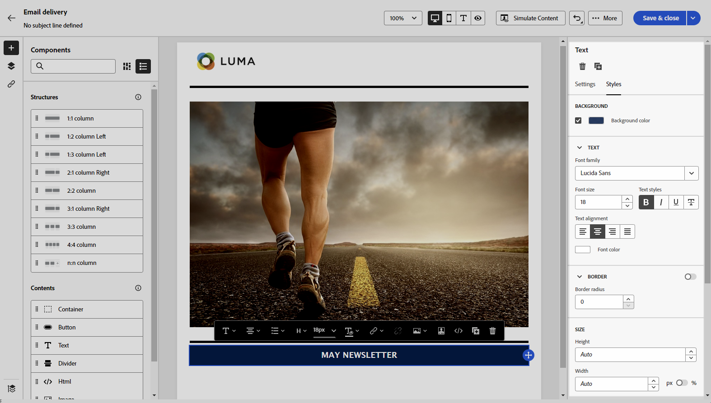

# 이메일 콘텐츠를 처음부터 시작 {#create-email-content}

>[!CONTEXTUALHELP]
>id="ac_structure_components_email"
>title="구조 구성 요소 정보"
>abstract="구조 구성 요소는 이메일 레이아웃을 정의합니다."

>[!CONTEXTUALHELP]
>id="ac_structure_components_landing_page"
>title="구조 구성 요소 정보"
>abstract="구조 구성 요소는 랜딩 페이지 레이아웃을 정의합니다."

>[!CONTEXTUALHELP]
>id="ac_structure_components_fragment"
>title="구조 구성 요소 정보"
>abstract="구조 구성 요소는 조각 레이아웃을 정의합니다."

>[!CONTEXTUALHELP]
>id="ac_structure_components_template"
>title="구조 구성 요소 정보"
>abstract="구조 구성 요소는 템플릿 레이아웃을 정의합니다."

>[!CONTEXTUALHELP]
>id="ac_edition_columns_email"
>title="이메일 열 정의"
>abstract="이메일 디자이너를 통해 열 구조를 정의하여 이메일 레이아웃을 쉽게 정의할 수 있습니다."

>[!CONTEXTUALHELP]
>id="ac_edition_columns_landing_page"
>title="랜딩 페이지 열 정의"
>abstract="이메일 디자이너를 통해 열 구조를 정의하여 랜딩 페이지 레이아웃을 쉽게 정의할 수 있습니다."

>[!CONTEXTUALHELP]
>id="ac_edition_columns_fragment"
>title="조각 열 정의"
>abstract="이메일 디자이너를 통해 열 구조를 정의하여 조각 레이아웃을 쉽게 정의할 수 있습니다."

>[!CONTEXTUALHELP]
>id="ac_edition_columns_template"
>title="템플릿 열 정의"
>abstract="이메일 디자이너를 통해 열 구조를 정의하여 템플릿 레이아웃을 쉽게 정의할 수 있습니다."

이메일 디자이너를 통해 이메일 구조를 쉽게 정의할 수 있습니다. 간단한 드래그 앤 드롭 작업으로 구조적 요소를 추가하고 이동하면 몇 초 만에 이메일 본문을 디자인할 수 있습니다.

이메일 콘텐츠를 작성하려면 다음 단계를 따르십시오.

1. 이메일 디자이너 홈 페이지에서 **[!UICONTROL 처음부터 디자인]** 옵션을 선택합니다.

   

1. **[!UICONTROL 구조 구성 요소]**&#x200B;를 캔버스에 끌어다 놓고 이메일 레이아웃을 정의하여 이메일 콘텐츠 작성을 시작합니다.

   >[!NOTE]
   >
   >일부 이메일 프로그램은 열 누적 기능과 호환되지 않습니다. 지원되지 않는 경우 열이 누적되지 않습니다.

   <!--Once placed in the email, you cannot move nor remove your components unless there is already a content component or a fragment placed inside. This is not true in AJO - TBC?-->

   

1. 필요한 만큼 **[!UICONTROL 구조 구성 요소]**&#x200B;를 추가하고 오른쪽의 전용 창에서 해당 설정을 편집합니다.

   **[!UICONTROL n:n 열]** 구성 요소를 선택하여 선택한 열 수를 정의합니다(3~10). 각 열의 아래쪽에 있는 화살표를 이동하여 각 열의 폭을 정의할 수도 있습니다.

   >[!NOTE]
   >
   >각 열 크기는 구조 구성 요소 전체 폭의 10% 이상이어야 합니다. 비어 있는 열만 제거할 수 있습니다.

1. **[!UICONTROL 콘텐츠 구성 요소]** 섹션을 확장하여 하나 이상의 구조 구성 요소에 필요한 만큼 요소를 추가합니다. [콘텐츠 구성 요소에 대해 자세히 알아보기](content-components.md)

1. 오른쪽의 **[!UICONTROL 구성 요소 설정]** 창을 사용하여 각 구성 요소를 추가로 사용자 정의할 수 있습니다. 예를 들어 각 구성 요소의 텍스트 스타일, 패딩 또는 여백을 변경할 수 있습니다. [정렬 및 패딩에 대해 자세히 알아보기](alignment-and-padding.md)

   

1. 프로필 데이터로 이메일 콘텐츠를 사용자 정의하려면 개인화 필드를 삽입합니다. [콘텐츠 개인화에 대해 자세히 알아보기](../personalization/personalize.md)

1. 추적해야 하는 콘텐츠의 모든 URL을 표시하려면 왼쪽 창의 **[!UICONTROL 링크]** 탭을 클릭합니다. 필요한 경우 **[!UICONTROL 추적 유형]** 또는 **[!UICONTROL 레이블]**&#x200B;을 수정하고 **[!UICONTROL 범주]**&#x200B;를 추가할 수 있습니다. [링크 및 메시지 추적에 대해 자세히 알아보기](message-tracking.md)

   

1. 필요한 경우 고급 메뉴에서 **[!UICONTROL 코드 편집기로 전환]**&#x200B;을 클릭하여 이메일을 추가로 개인화할 수 있습니다. 이를 통해 이메일 소스 코드를 편집할 수 있습니다(예: 추적 또는 사용자 정의 HTML 태그 추가). [코드 편집기에 대해 자세히 알아보기](code-content.md)

   >[!CAUTION]
   >
   >코드 편집기로 전환한 후에는 이 이메일의 비주얼 디자이너로 되돌릴 수 없습니다.

1. 콘텐츠가 준비되면 **[!UICONTROL 콘텐츠 시뮬레이션]**&#x200B;을 클릭하여 이메일 렌더링을 확인합니다. 데스크탑 또는 모바일 보기 중 선택할 수 있습니다. [이메일 미리보기에 대해 자세히 알아보기](../preview-test/preview-test.md)

   

1. 이메일이 준비되면 **[!UICONTROL 저장]**&#x200B;을 클릭합니다.

