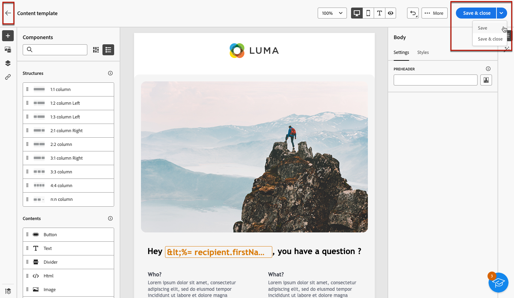

# 콘텐츠 템플릿 작업 {#content-templates}

>[!CONTEXTUALHELP]
>id="acw_contenttemplate_menu"
>title="나만의 콘텐츠 정의"
>abstract="독립 실행형 사용자 지정 템플릿을 처음부터 만들어 여러 이메일에서 콘텐츠를 재사용할 수 있도록 만듭니다."

디자인 프로세스를 가속화하고 개선하기 위해 독립 실행형 템플릿을 만들어 사용자 지정 콘텐츠를 여러 곳에서 쉽게 재사용할 수 있습니다 [!DNL Adobe Campaign].

이 기능을 통해 콘텐츠 중심 사용자는 독립 실행형 템플릿에서 작업할 수 있으므로 마케팅 사용자는 이메일 캠페인 내에서 이를 재사용하고 조정할 수 있습니다.

>[!NOTE]
>
>현재는 **이메일** 콘텐츠 템플릿이 지원됩니다.

## 템플릿 액세스 및 관리 {#access-manage-templates}

>[!CONTEXTUALHELP]
>id="acw_contenttemplate_edition"
>title="템플릿 콘텐츠 편집"
>abstract="다음을 클릭합니다. **콘텐츠 편집** 단추를 클릭하여 이메일 디자이너로 콘텐츠를 업데이트합니다."

콘텐츠 템플릿 목록에 액세스하려면 다음을 선택합니다. **[!UICONTROL 콘텐츠 관리]** > **[!UICONTROL 콘텐츠 템플릿]** 왼쪽 메뉴에서

만든 모든 템플릿 - 을(를) 사용하여 이메일에서 [템플릿으로 저장](#save-as-template) 다음 중 하나의 선택 사항: **[!UICONTROL 콘텐츠 템플릿]** 메뉴 - 가 표시됩니다.

<!--You can sort content templates by creation or modification date. You can also choose to display only the items that you created or modified.-->

특정 항목을 필터링할 수 있습니다 [폴더](../get-started/permissions.md#folders) 드롭다운 목록 사용 또는 다음을 사용하여 규칙 추가 [쿼리 모델러](../query/query-modeler-overview.md).

템플릿 콘텐츠를 편집하려면 목록에서 원하는 항목을 클릭합니다. 다음을 수행할 수 있습니다.

* 속성을 편집합니다.

* 다음을 클릭합니다. **[!UICONTROL 콘텐츠 편집]** 단추를 클릭하여 콘텐츠를 [이메일 디자이너](get-started-email-designer.md).

템플릿을 삭제하려면 다음 목록에서 해당 옵션을 선택합니다 **[!UICONTROL 추가 작업]** 메뉴 아래의 제품에서 사용할 수 있습니다.

>[!NOTE]
>
>템플릿이 삭제되면 이 템플릿을 사용하여 만든 게재는 영향을 받지 않습니다.

## 콘텐츠 템플릿 만들기 {#create-content-templates}

>[!CONTEXTUALHELP]
>id="acw_contenttemplate_design"
>title="콘텐츠 템플릿 디자인"
>abstract="콘텐츠 템플릿 디자인"

>[!CONTEXTUALHELP]
>id="acw_contenttemplate_selection"
>title="콘텐츠 템플릿 선택"
>abstract="콘텐츠 템플릿 선택"

다음 두 가지 방법으로 콘텐츠 템플릿을 만들 수 있습니다.

* 왼쪽 레일을 사용하여 처음부터 콘텐츠 템플릿 만들기 **[!UICONTROL 콘텐츠 템플릿]** 메뉴 아래의 제품에서 사용할 수 있습니다. [방법 알아보기](#create-template-from-scratch)

* 이메일을 디자인할 때 이메일 콘텐츠를 템플릿으로 저장합니다. [방법 알아보기](#save-as-template)

저장되면 처음부터 또는 이전 이메일에서 이제 다음 템플릿을 작성할 때 사용할 수 있습니다 [이메일](../email/create-email.md) 다음 범위 내 [!DNL Adobe Campaign]. [방법 알아보기](use-email-templates.md)

>[!NOTE]
>
>* 콘텐츠 템플릿에 대한 변경 사항은 이메일에 전파되지 않습니다.
>
>* 마찬가지로 전자 메일에서 템플릿을 사용하는 경우 전자 메일 콘텐츠를 편집해도 이전에 사용한 콘텐츠 템플릿에는 영향을 주지 않습니다.

### 처음부터 템플릿 만들기 {#create-template-from-scratch}

>[!CONTEXTUALHELP]
>id="acw_contenttemplate_properties"
>title="템플릿 속성 정의"
>abstract="템플릿을 처음부터 새로 만들 때는 필요할 때 검색할 속성을 쉽게 정의할 수 있습니다."

처음부터 콘텐츠 템플릿을 만들려면 아래 단계를 수행하십시오.

1. 다음을 통해 콘텐츠 템플릿 목록에 액세스 **[!UICONTROL 콘텐츠 관리]** > **[!UICONTROL 콘텐츠 템플릿]** 왼쪽 메뉴.

1. 선택 **[!UICONTROL 템플릿 만들기]**.

   

1. 템플릿 세부 정보를 입력합니다. 템플릿을 저장할 폴더를 선택할 수 있습니다. 기본적으로 콘텐츠 템플릿은 Adobe Campaign 계층의 전용 노드에 저장됩니다. **[!UICONTROL 탐색기]** > **[!UICONTROL 리소스]** > **[!UICONTROL 템플릿]** > **[!UICONTROL 콘텐츠 템플릿]**. [폴더 만들기 방법 알아보기](../get-started/permissions.md#folders)

   

   >[!NOTE]
   >
   >현재는 **이메일** 채널 및 **HTML** 유형이 지원됩니다.

1. 클릭 **[!UICONTROL 만들기]** 다양한 옵션에서 템플릿 디자인 방법을 선택합니다.

   * [이메일을 처음부터 디자인](create-email-content.md) 이메일 디자이너의 인터페이스를 통해

   * [코드 또는 복사하여 붙여넣기 원시 HTML](code-content.md) 이메일 디자이너에 바로 로그인합니다.

   * [기존 HTML 콘텐츠 가져오기](existing-content.md) .zip 폴더 또는 파일로 내보낼 때 시간별 세부기간이 작동하지 않는 문제를 해결했습니다.

   * 기본 제공 또는 사용자 지정 템플릿 목록의 기존 콘텐츠를 사용합니다. 이메일에서 콘텐츠 템플릿을 사용하는 단계는에 설명되어 있습니다 [이 섹션](use-email-templates.md).

   

1. 다음 [이메일 디자이너](get-started-email-designer.md) 표시됩니다. 선택한 옵션에 따라 이메일에 대해 수행하는 것과 동일한 방식으로 콘텐츠를 필요에 따라 편집합니다.

   <!--You can test your content if needed. [Learn how](#test-template)-->

1. 템플릿이 준비되면 **[!UICONTROL 저장]**.

   필요한 경우 템플릿 이름 옆에 있는 화살표를 클릭하여 로 돌아갑니다. **[!UICONTROL 세부 사항]** 템플릿을 스크린하고 편집합니다.

   

이제 이 템플릿을 사용하여 내에서 이메일을 작성할 수 있습니다. [!DNL Adobe Campaign]. [방법 알아보기](use-email-templates.md)

### 이메일 콘텐츠를 템플릿으로 저장 {#save-as-template}

한 번 [이메일 디자인](create-email-content.md), 나중에 다시 사용할 수 있도록 이 콘텐츠를 템플릿으로 저장할 수 있습니다. Adobe Campaign 환경의 모든 사용자는 저장된 템플릿을 사용할 수 있습니다.

이메일 내용을 템플릿으로 저장하려면 다음 단계를 따르십시오.

1. 이메일 디자이너에서 **[!UICONTROL 자세히]** 화면 오른쪽 상단의 단추.

1. 선택 **[!UICONTROL 콘텐츠 템플릿으로 저장]** 드롭다운 메뉴에서 을(를) 선택합니다.

   

1. 이 템플릿의 이름을 입력하고 저장합니다.

   

이제 이 템플릿을 사용하여 새 콘텐츠를 작성할 수 있습니다. 템플릿은에서 사용할 수 있습니다. **[!UICONTROL 저장된 템플릿]** 이메일 디자이너의 탭. [방법 알아보기](use-email-templates.md)

템플릿이 **[!UICONTROL 콘텐츠 템플릿]** 목록, 액세스 가능 [!DNL Adobe Campaign] 전용 메뉴. 이 템플릿은 목록에 있는 다른 항목으로 액세스, 편집 및 삭제할 수 있는 독립 실행형 콘텐츠 템플릿이 됩니다. [자세히 알아보기](#access-manage-templates)

>[!NOTE]
>
>새 템플릿에 대한 변경 사항은 원래 이메일에 전파되지 않습니다. 마찬가지로 원본 콘텐츠가 해당 이메일 내에서 편집되는 경우 새 템플릿은 수정되지 않습니다.

<!--
Test your content template {#test-template}

You can test the rendering of any email content template, whether created from scratch or from an email. To do so, follow the steps below.

1. Access the content template list through the **[!UICONTROL Content Management]** > **[!UICONTROL Content Templates]** menu and select any template.

1. Click **[!UICONTROL Edit content]** from the **[!UICONTROL Template properties]**.

1. Click **[!UICONTROL Simulate Content]** and select a test profile to check your email rendering. You can choose the desktop or mobile view. [Learn more](../content-management/preview-test.md)

    

1. You can send a proof to test your content and have it approved by some internal users before using it in a journey or a campaign.

    * To do so, click the **[!UICONTROL Send proof]** button and follow the steps described in [this section](../content-management/proofs.md).
    
    * Before sending the proof, you must select the [email surface](../configuration/channel-surfaces.md) that will be used to test your content.

        

>[!CAUTION]
>
>Currently tracking is not supported when testing email content templates, meaning that tracking events, UTM parameters and landing page links will not be effective in the proofs that are being sent from a template. To test tracking, [use the content template](
use-email-templates.md) in an email and [send a proof](../content-management/preview-test.md#send-proofs).-->

