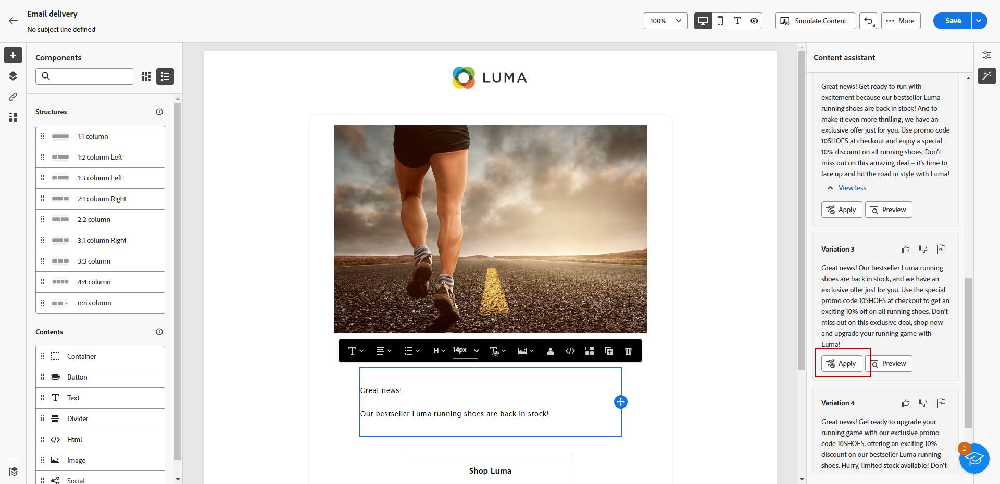

# 콘텐츠 도우미를 사용하여 텍스트 생성 {#generative-content}

이메일을 만들고 개인화한 후에는 생성 AI에서 제공하는 콘텐츠 도우미를 사용하여 콘텐츠를 한 단계 더 발전시킵니다.

콘텐츠 도우미는 대상자에게 반향을 일으킬 가능성이 높은 다양한 콘텐츠를 제안하여 게재의 영향을 최적화하는 데 도움이 될 수 있습니다.

>[!NOTE]
>
>이 기능의 사용을 시작하기 전에 관련 항목을 읽어 보십시오. [보호 및 제한 사항](generative-gs.md#guardrails-and-limitations).

콘텐츠 도우미를 사용하여 이메일 콘텐츠를 생성하고 개선하려면 아래 단계를 따르십시오. 에 설명된 대로 컨텐츠 도우미를 사용하여 전체 HTML 컨텐츠를 만들 수도 있습니다. [이 페이지](generative-email.md).

1. 이메일 게재를 만들고 구성한 후 **[!UICONTROL 콘텐츠 편집]**.

   이메일 게재를 구성하는 방법에 대한 자세한 내용은 을(를) 참조하십시오. [이 페이지](../content/create-email-content.md).

1. 다음을 입력합니다. **[!UICONTROL 기본 세부 정보]** 게재를 위해. 완료되면 다음을 클릭합니다. **[!UICONTROL 이메일 콘텐츠 편집]**.

1. 필요에 따라 이메일을 개인화합니다.

1. 다음 항목 선택 **[!UICONTROL 텍스트 구성 요소]** 경험 생성 메뉴를 업데이트하고 액세스하려고 합니다.

   

1. 생성하려는 내용을 설명하여 콘텐츠를 미세 조정합니다.

   활성화 **[!UICONTROL 현재 컨텍스트로 개선]** 콘텐츠 도우미가 게재, 게재명 및 선택한 대상을 기반으로 새 콘텐츠를 개인화할 수 있는 옵션입니다.

   

1. 선택 **[!UICONTROL 파일 업로드]** 추가 컨텍스트를 제공할 수 있는 컨텐츠가 포함된 브랜드 자산을 컨텐츠 도우미에 추가합니다.

   다음을 클릭할 수도 있습니다. **[!UICONTROL 업로드된 콘텐츠]** 를 클릭하여 이전에 업데이트한 파일을 찾습니다. 업로드된 콘텐츠는 현재 사용자만 재사용할 수 있습니다.

1. 다음 항목 선택 **[!UICONTROL 커뮤니케이션 전략]** 그것은 너의 요구에 가장 잘 맞는다. 생성된 텍스트의 색조와 스타일에 영향을 줍니다.

1. 다음을 선택합니다. **[!UICONTROL 언어]** 및 **[!UICONTROL 톤]** 생성된 텍스트에 포함할 텍스트입니다. 이렇게 하면 텍스트가 대상자와 목적에 맞게 조정됩니다.

   

1. 생성된 텍스트의 길이를 설정하려면 슬라이더 컨트롤을 사용합니다.

1. 프롬프트가 준비되면 다음을 클릭합니다. **[!UICONTROL 생성]**.

1. 생성된 를 통해 찾아보기 **[!UICONTROL 변형]** 및 클릭 **[!UICONTROL 적용]** 적절한 콘텐츠를 찾았으면

   

1. 개인화 필드를 삽입하여 프로필 데이터를 기반으로 이메일 콘텐츠를 사용자 정의합니다. [콘텐츠 개인화에 대해 자세히 알아보기](../personalization/personalize.md)

   

1. 메시지 콘텐츠를 정의한 후 **[!UICONTROL 콘텐츠 시뮬레이션]** 단추를 클릭하여 렌더링을 제어하고 테스트 프로필로 개인화 설정을 확인합니다. [자세히 알아보기](../preview-test/preview-content.md)

   

1. 콘텐츠, 대상자 및 일정을 정의했으면 이메일 게재를 준비할 준비가 되었습니다. [자세히 알아보기](../monitor/prepare-send.md)

