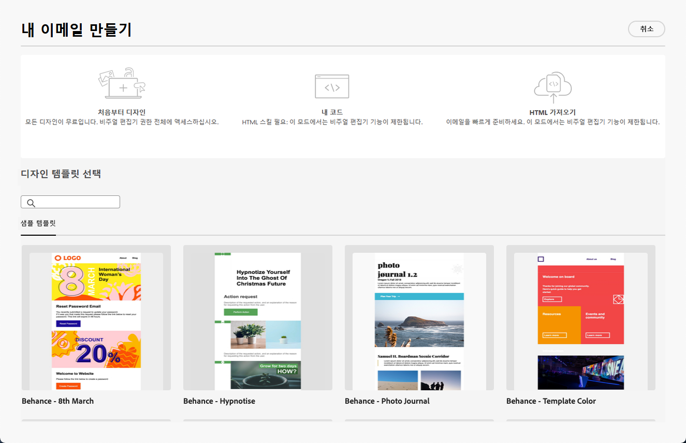

# 이메일 디자이너 시작 {#get-started-email-designer}

Adobe Campaign에서 이메일을 만든 후에는 해당 콘텐츠를 정의해야 합니다.

이메일 디자이너를 사용하면 직관적인 드래그 앤 드롭 인터페이스를 통해 개인화된 매력적인 이메일을 만들 수 있습니다. 처음부터 빈 화면으로 시작하거나 기존 콘텐츠를 가져오거나 기존 템플릿을 활용하는 경우 프로모션 또는 트랜잭션 방식으로 모든 이메일 콘텐츠를 디자인하고 세부적으로 조정할 수 있습니다.

<!--Built to deliver HTML optimized for responsive design, the Email Designer allows you to easily define and apply visibility conditions and dynamic content to an email, template, or fragment directly through the user interface. You can seamlessly switch between the drag and drop interface and HTML code at the click of a button.

The Email Designer allows you to create email content and email content templates. It is compatible with simple emails, transactional emails, A/B test emails, multilingual emails, and recurring emails.-->

* 사용 [!DNL Campaign] 응답형 이메일을 쉽게 작성할 수 있는 이메일 디자인 기능. [자세히 알아보기](create-email-content.md)

* 프로필 속성에 따라 개인화된 프로필을 만들어 고객 경험을 향상시킵니다. [자세히 알아보기](../personalization/personalize.md)

* 수신자의 프로필을 기반으로 동적 개인화를 만들도록 조건부 콘텐츠 필드를 구성합니다. [자세히 알아보기](../personalization/conditions.md)

## 이메일 디자인 모범 사례 {#best-practices}

이메일을 보낼 때 수신자가 메시지를 전달할 수 있으며, 이로 인해 이메일 렌더링에 문제가 발생할 수 있습니다. 특히, 전달에 사용되는 이메일 공급자가 지원하지 않을 수 있는 CSS 클래스를 사용할 때 그러합니다. 예를 들어 &quot;is-desktop-hidden&quot; CSS 클래스를 사용하여 모바일 장치에서 이미지를 숨기는 경우 그러합니다.

이러한 렌더링 문제를 최소화하려면 이메일 디자인 구조를 가능한 한 단순하게 유지하는 것이 좋습니다. 데스크톱 및 모바일 장치 모두에 잘 작동하는 단일 디자인을 사용하고, 복잡한 CSS 클래스 또는 모든 이메일 클라이언트가 완전히 지원하지 않을 수 있는 기타 디자인 요소를 사용하지 마십시오. 이러한 모범 사례를 따르면 수신자가 이메일을 보거나 전달하는 방식에 관계없이 이메일이 일관되게 올바르게 렌더링되도록 할 수 있습니다.

## 콘텐츠 작성 시작 {#start-authoring}

이메일 게재 대시보드에서 다음을 수행합니다 [콘텐츠 편집](edit-content.md) 이메일 디자이너 홈 페이지를 여는 화면입니다. 여기에서 다음 옵션 중 이메일 디자인 방법을 선택합니다.

* **이메일을 처음부터 디자인** 이메일 디자이너의 인터페이스를 통해 에서 이메일 콘텐츠를 디자인하는 방법을 알아봅니다 [이 섹션](create-email-content.md).

* **원시 HTML 코드 또는 붙여넣기** 이메일 디자이너에서 바로 사용할 수 있습니다. 에서 나만의 콘텐츠를 코딩하는 방법에 대해 알아봅니다. [이 섹션](code-content.md).

* **기존 HTML 콘텐츠 가져오기** .zip 폴더 또는 파일로 내보낼 때 시간별 세부기간이 작동하지 않는 문제를 해결했습니다. 에서 이메일 콘텐츠를 가져오는 방법 알아보기 [이 섹션](existing-content.md).

* **기존 콘텐츠 선택** 기본 제공 또는 사용자 지정 템플릿 목록에서. 이메일 템플릿 작업 방법 알아보기 [이 섹션](email-sample-templates.md).

  

