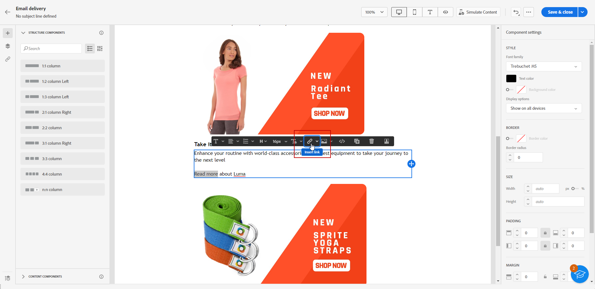

# 링크 추가 및 메시지 추적 {#tracking}

이메일 디자이너를 사용하여 콘텐츠에 링크를 추가하고 전송된 메시지를 추적하여 수신자의 동작을 모니터링합니다.

## 링크 삽입 {#insert-links}

메시지를 디자인할 때 콘텐츠에 링크를 추가할 수 있습니다.

>[!NOTE]
>
>추적이 활성화되면 메시지 콘텐츠에 포함된 모든 링크가 추적됩니다.

이메일 콘텐츠에 링크를 삽입하려면 다음 단계를 따르십시오.

1. 요소를 선택하고 상황별 도구 모음에서 **[!UICONTROL 링크 삽입]**&#x200B;을 클릭합니다.

   

1. **[!UICONTROL 레이블]**&#x200B;과 **[!UICONTROL 링크]**&#x200B;를 추가합니다.

1. 변경 내용을 저장합니다.

1. 링크가 생성된 후에도 **[!UICONTROL 설정]** 탭에서 링크를 수정할 수 있습니다.

   * 링크를 편집하고 **[!UICONTROL 대상]**&#x200B;을 변경할 수 있습니다.
   * 해당 옵션을 선택하여 링크에 밑줄을 표시할지 여부를 선택할 수 있습니다.

   

>[!NOTE]
>
>마케팅 유형 이메일 메시지에는 트랜잭션 메시지에 필요하지 않은 옵트아웃 링크를 포함해야 합니다. 메시지 범주(**[!UICONTROL 마케팅]** 또는 **[!UICONTROL 트랜잭션]**)는 메시지 생성 시 채널 표면(즉, 메시지 사전 설정) 수준에서 정의됩니다.

모든 이메일 메시지에는 미러 페이지에 대한 특정 링크를 추가해야 합니다. [이 섹션](mirror-page.md)에서 미러 페이지에 대해 자세히 알아보십시오.

## 추적 관리 {#manage-tracking}

[이메일 디자이너](create-email-content.md)를 통해 각 링크에 대한 추적 유형을 편집하는 등 추적된 URL을 관리할 수 있습니다.

1. 추적할 콘텐츠의 모든 URL 목록을 표시하려면 왼쪽 창의 **[!UICONTROL 링크]** 아이콘을 클릭합니다.

   이 목록을 통해 URL을 중앙 집중식으로 볼 수 있으며 이메일 콘텐츠에서 각 URL을 찾을 수 있습니다.

1. 링크를 편집하려면 해당 연필 아이콘을 클릭합니다.

   

1. 필요한 경우 **[!UICONTROL 추적 유형]**&#x200B;을 수정할 수 있습니다.

   

   추적된 각 URL에 대해 추적 모드를 다음 중 원하는 값으로 설정할 수 있습니다.

   * **[!UICONTROL 추적됨]**: 이 URL에 대한 추적을 활성화합니다.
   * **[!UICONTROL 옵트아웃]**: 이 URL을 옵트아웃 또는 구독 취소 URL로 간주합니다.
   * **[!UICONTROL 미러 페이지]**: 이 URL을 미러 페이지 URL로 간주합니다.
   * **[!UICONTROL 활성화 안 함]**: 이 URL의 추적을 활성화하지 않습니다. <!--This information is saved: if the URL appears again in a future message, its tracking is automatically deactivated.-->

1. 추적된 링크를 그룹화하려면 링크에 **[!UICONTROL 범주]**&#x200B;를 추가하고 **[!UICONTROL 저장]**&#x200B;을 클릭합니다.

   

1. 게재를 전송한 후 게재 보고서에 액세스합니다. **[!UICONTROL 추적]** 메뉴의 **[!UICONTROL URL 및 클릭스트림]** 보고서에는 게재에서 가장 많이 방문한 URL이 표시됩니다. [자세히 알아보기](../reporting/gs-reports.md)
